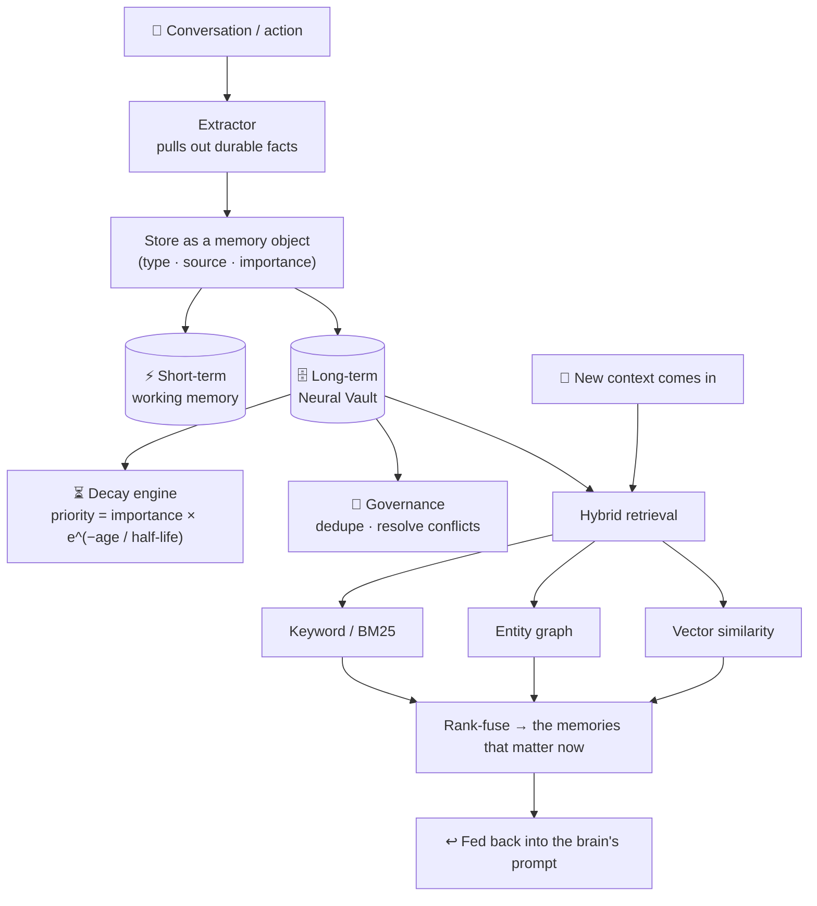
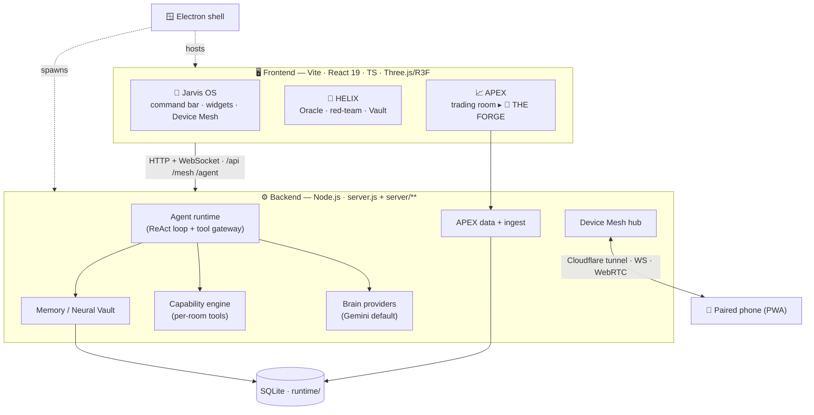
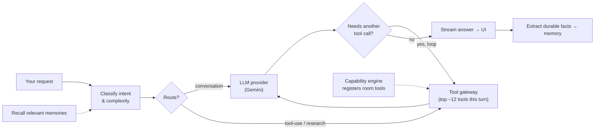

<div align="center">


<br/>

### A local-first, AI-native operating system for an assistant.

**Not a chat box — a set of immersive 3D "rooms" that share one reasoning brain, one memory that grows over time, and one set of real-world tools.** It runs on your machine, learns what matters to you, and can act: drive a browser, read your screen, search the web, pull live market data, pair with your phone, and reason through hard problems out loud.

<br/>


<br/>


</div>

---

## What is this?

Most "AI assistants" are a single text box with no memory and no hands. **Jarvis Command OS** is the opposite: a full-screen, mostly-3D command center where you talk to one assistant from a persistent command bar, and it works across purpose-built **rooms** — each a real workspace for a different kind of thinking.

Three things make it different:

- **🧠 One brain, real hands.** A tool-calling agent that doesn't just answer — it *acts*. It can open a browser and click through a site, read what's on your screen, search the web and YouTube, hit live market APIs, run saved skills, and drive the desktop.
- **🌱 A memory that compounds.** Every session teaches it something. A two-tier "Neural Vault" captures durable facts, ages the stale ones with a decay engine, and resurfaces the right memory at the right moment — so Jarvis is a little smarter each time you use it.
- **🔒 Local-first, yours.** It runs on your machine. Data lives under `runtime/` on disk. Market data comes from **free public APIs**; the AI brain is pluggable (Gemini by default). Nothing leaves your computer unless you wire up a cloud key.

It ships as a **desktop app** (Electron) and a **web app** (Vite + React 19 + Three.js), backed by a **Node.js brain server**.

---

## 🏛️ The three rooms

Jarvis is organized into three rooms today — one general-purpose command center, and two specialized chambers — all sharing the same brain, memory, and tools.

| Room | What it's for | Centerpiece |
|:--|:--|:--|
| 🧠 **Jarvis OS** | The main command center — talk to Jarvis, run tools, watch live widgets, pair devices | Command bar · widget HUD · Device Mesh |
| 🧬 **HELIX** | An *intelligence chamber* for hard reasoning, research, and decisions | The Oracle · red-team agents · decision Vault |
| 📈 **APEX** | A trading command center on free public data | **THE FORGE** — an AI-native quant lab |

<br/>

<div align="center">

### 🧠 Jarvis OS — the command center


</div>

The home HUD and the hub for everything. A holographic, context-aware **command bar** ("Ask Jarvis anything…") sits over a living dashboard of **widgets** that arrange around a central **Jarvis Core** orb. This is where you *drive* Jarvis and watch it work in real time.

- **🎛️ Widget HUD** — draggable, self-updating panels: a **Module Matrix** (registered capabilities), an **Agent Rail** (what each agent is doing *right now*), a **Vision Feed** (screen / camera / OCR), a **Kalshi Pulse**, a **Memory** panel, and more. Panels cover Modules, Projects, Agents, Connections, Kalshi, Vision, Memory, Devices, Co-Op, and Receipts.
- **📱 Device Mesh** *(a standout feature of Jarvis OS)* — pair your phone by QR over a Cloudflare tunnel with **256-bit pairing**, then push text, links, files, and photos between phone and laptop, mirror screens over a WebSocket hub with **WebRTC screen-share**, and fire heartbeats/self-tests. Your phone becomes an extension of Jarvis.
- **🗣️ Voice & vision** — talk to it; let it see your screen or camera and read the pixels.

> Jarvis OS is also the launcher: type a room name in the command bar (e.g. `apex`, `helix`) and you're there.

<br/>

<div align="center">

### 🧬 HELIX — the Intelligence Chamber


</div>

Where Jarvis **reasons, cross-examines itself, and decides.** HELIX is built for the hard, high-stakes thinking that a single chat reply can't do justice — research, analysis, and conclusions you can trust.

- **🧵 Six knowledge strands** — everything you feed HELIX is sorted into six strands: **Evidence, Strategy, Construction, Memory, Signal, Synthesis** — each with its own freshness/decay rate, so fast-moving signals fade while durable strategy stays.
- **📚 Knowledge Reservoir** — drop in documents (PDFs, notes, links); HELIX ingests them into evidence it can reason over.
- **🔮 The Oracle** — ask a question and get an answer **grounded in your sources**, with citations and any **contradictions flagged**, not a confident guess.
- **⚔️ Red-team agents** — a panel of adversarial reviewers (Skeptic, Steelman, Historian, Quant, Devil's Advocate) triangulates a claim before you commit to it.
- **🔒 Decision Vault** — lock a validated conclusion into the Vault; it becomes durable, citable memory. HELIX can hand a finished thesis **straight to THE FORGE**.
- **🧩 Live widgets** — Helix Score, Contradictions counter, Agent HUD, Strand Radar, The Wire, Vault Preview, Focus Timer.

<br/>

<div align="center">

### 📈 APEX — Trading Command Center


</div>

A full trading room built **only on free public data** (Finnhub, Tiingo, FRED, Marketaux, CoinGecko, SEC EDGAR, and more) — no proprietary or vendor feeds, so it's safe to share and demo. A live market ticker runs over a tabbed workspace: **Home** (dossiers with candlesticks, a briefing system, a news river, correlation / RRG / volatility, watchlists, and a real alert engine), plus **Live Markets, Portfolio, Paper Trading, Backtesting, Trading Bots,** and **Live Testing**. A persistent **Jarvis Assistant** bar — with **Analyst / Trader / Quant / Research** modes — can answer questions about anything on screen.

And APEX's centerpiece is a room within the room:

<div align="center">

#### 🔨 THE FORGE — an AI-native quant lab *(inside APEX)*


</div>

Compose a trading strategy as a **colour-coded node graph** (Universe → Signals → Entry → Exit / Sizing / Risk / Execution), backtest it on real market data with a **deterministic, no-look-ahead engine**, and let Jarvis stress-test and improve it. An always-on **Strategy Health** rail turns every run into a report card.

<details>
<summary><b>Open the full Forge feature list</b></summary>

<br/>

**Three-panel command center**
- **Left — Library:** searchable blocks (Universe, Signals, Filters, Risk, Sizing, Entries, Exits, Execution, Portfolio Constraints, Analytics), Quick-Start templates, and your saved projects.
- **Center — Builder canvas:** a self-rendered node graph with a tool rail, minimap, and pan/zoom, plus a **Forms** mode to edit every field directly. Side tabs generate a **Python** code scaffold from the spec, a **Transcript** provenance log of every change, and a per-strategy **Research** pad.
- **Right — Strategy Health rail:** a health-score gauge + checklist (data integrity, logic, backtest quality, sample size, robustness), an out-of-sample performance grid, equity/drawdown sparklines, a rule-based **Jarvis Analysis** (strengths / considerations / warnings / readiness-to-deploy), and the deep tools.

**Docked analysis (7 tabs):** Backtest Results (metrics + equity curve + per-symbol contribution) · Monte-Carlo (block-bootstrap) · Parameter Heatmap (Terraform sweep) · Walk-Forward Matrix · Trade Distribution · Path Analysis · History (version timeline + A/B diff).

**The engines — all real, client-side, no look-ahead:**
| Engine | What it does |
|:--|:--|
| **Backtest** | Deterministic next-bar-open fills, modeled slippage + commission; single-symbol **and** a multi-symbol **portfolio** engine (shared cash, up to *N* concurrent positions, per-symbol contribution). |
| **The Improver** | Recursive diagnosis tree — builds a per-trade ledger, runs testers, grows a tree of confirmed weaknesses, emits staged **action cards** you can apply and re-backtest. |
| **Overfitting Sentinel** | Deflated Sharpe (trial-count-aware), walk-forward with embargo, parameter-jitter robustness, Monte-Carlo → a trust score. |
| **Darwin** | Genetic algorithm that evolves the spec toward better risk-adjusted fitness. |
| **Terraform** | 2-parameter sweep rendered as a fitness landscape / heatmap. |
| **Meta-Labeler** | Out-of-sample (k-fold CV) logistic model that filters low-confidence trades. |
| **Genesis** | Goal → strategy generator ("a low-drawdown momentum bot for NVDA"). |
| **Signal Upload Studio** | Drop a `.py`/`.ipynb`, watch a staged analysis, get a derived signal with its runnable code + retrieval method stored and labeled. |
| **Portfolio (HRP)** | Blend several strategies with hierarchical risk parity. |

> **Universe:** by default a strategy backtests a ~30-name liquid large-cap basket (not a single ticker). Trim it, pick a preset (Mega-cap Tech, Index ETFs, Sectors, Semis, Dow 10, Crypto, or **All Large-cap**), or type your own.

</details>

> **A note on the visuals above:** these are hand-built vector diagrams of each room's real layout. Live screenshots of the WebGL UI are best captured from the running desktop app — see [Screenshots](#-screenshots).

<br/>

<details>
<summary><b>Experimental surfaces — Globe Room · Phone · Widget Lab</b></summary>

<br/>

- **Globe Room** — a cyberpunk 3D globe workspace (Three.js / R3F). Relies on heavy 3D/texture assets that are **git-ignored** (see [Heavy assets](#-heavy-assets)); the three main rooms need none of them.
- **Phone** — the companion PWA surface for the Device Mesh.
- **Widget Lab** — a sandbox for building and previewing widgets.

</details>

---

## 🛠️ What Jarvis can do — capabilities & access

Jarvis isn't sandboxed to text. Through a **tool gateway**, its brain can reach out and act. Each turn, an intent classifier hands the model only the most relevant tools (so it stays fast and focused), then it can chain them in a **ReAct** loop.

| Capability | What it can access / do | Example tools |
|:--|:--|:--|
| 🌐 **Web & research** | Live web search, Google, YouTube, page reading | `browser_search` · `google_search` · `youtube_search` |
| 🖱️ **Browser control** | Open pages, navigate, click, extract — driven by Playwright | `invoke_control` · `browser_file_search` |
| 🖥️ **Screen & vision** | See your screen/camera, OCR the pixels, describe what's there | screen capture · vision feed |
| 💻 **Desktop control** | Act on the machine (guarded, dry-run by default) | `desktop_control` |
| 📁 **Files** | Read/search local files you point it at | file access · `codebase_search` |
| 📈 **Market data** | Live quotes, history, news, macro, crypto — all public APIs | `apex_catalog_search` · APEX data layer |
| 🧠 **Memory** | Recall and store durable facts across sessions | `memory_search` · `pc_graph_search` |
| ⚙️ **Skills** | Run saved, reusable procedures (procedural memory) | `skill_run` |
| 📱 **Device Mesh** | Relay to/from your paired phone | mesh hub · inbox |

**Access is guarded, not blind.** Desktop control ships in **dry-run** mode by default, the browser runs headless unless you say otherwise, and every credential is read from `process.env` — never hardcoded. You decide what Jarvis can touch.

---

## 🌱 How Jarvis gets smarter over time

This is the part most assistants skip. Jarvis has a **two-tier, persistent memory** ("Neural Vault / MemoryOS") that turns every conversation into durable knowledge — so it genuinely improves with use instead of forgetting you between sessions.



1. **It captures what matters.** After each turn, an extractor pulls durable facts out of the conversation and stores them as typed memory objects: **user** (who you are), **feedback** (how you want Jarvis to work), **project** (ongoing work), **reference** (links/resources), and **procedural** skills.
2. **It forgets the right things.** A **decay engine** ages each memory on a half-life tuned to its kind — a fast-moving signal fades in hours, a core preference persists for months, and learned **skills never expire**. Governance dedupes and resolves conflicts so the store stays honest.
3. **It recalls the right things.** When new context arrives, three retrieval signals — **keyword (BM25), an entity graph, and vector similarity** — are rank-fused so the most relevant memories resurface and get folded back into the brain's prompt.

The result: the tenth time you use Jarvis, it already knows your projects, your preferences, and the skills it's learned — without you repeating yourself.

> Because memory is personal, the entire `runtime/` directory is **never committed.**

---

## 🏗️ Architecture



- **Ports:** frontend dev server `5173`, backend `8799` (Vite proxies `/api` → `8799`).
- **Data model:** each room persists to its own SQLite tables under `runtime/` (never committed).

<details>
<summary><b>How the brain routes a request (the agent loop)</b></summary>

<br/>



</details>

---

## 🧰 Tech stack

**Frontend:** React 19 · TypeScript · Vite 7 · Three.js + @react-three/fiber/drei · Framer Motion · Zustand · cmdk · custom SVG charts · lucide-react.
**Backend:** Node.js (ESM + CommonJS) · `better-sqlite3` · `ws` (WebSocket) · Playwright (browser tools) · provider SDKs (Google Generative AI, OpenAI).
**Desktop:** Electron + electron-builder. **Tooling:** Playwright tests · Wrangler (optional Cloudflare) · TypeScript · ESLint.

> Full lists are in `package.json`.

---

## 🚀 Quick start

```bash
# 1. install
npm install

# 2. configure keys (optional — the app boots with none)
cp .env.example .env        # then fill in whichever keys you have

# 3a. run the web app (two terminals)
npm start                   # backend  → http://127.0.0.1:8799
npm run dev                 # frontend → http://127.0.0.1:5173

# 3b. …OR run the desktop app
npm run app:dev
```

Then open **http://127.0.0.1:5173** and type a room name (e.g. `apex`) in the command bar.

<details>
<summary><b>Build, desktop packaging, Cloudflare & NPM scripts</b></summary>

<br/>

```bash
npm run build               # production web build (dist/)
npm run app:build:win       # Windows portable desktop app
npm run app:build:mac       # macOS dmg/zip (on macOS)
npm run cf:build && npm run cf:deploy   # optional Cloudflare deploy
```

| Script | What it does |
|:--|:--|
| `npm start` | run the backend (`node server.js`, port 8799) |
| `npm run dev` | run the frontend dev server (Vite, port 5173) |
| `npm run build` | production web build |
| `npm run check` | typecheck + `node --check server.js` + build |
| `npm run app:dev` | run the Electron desktop app |
| `npm run test` | full suite (check + backend + feature tests) |

**Prerequisites:** Node.js 20+ and npm · Windows / macOS / Linux · (optional) a Gemini key for the brain and any APEX data keys you want. **Nothing is required to boot** — the app degrades gracefully and many data sources need no key.

</details>

<details>
<summary><b>⚙️ Environment variables</b></summary>

<br/>

Copy `.env.example` → `.env`. Highlights:

| Variable | Purpose |
|:--|:--|
| `GEMINI_API_KEY` | Jarvis reasoning brain (primary) |
| `OPENAI_API_KEY` | optional alternate model |
| `APEX_FINNHUB_KEY`, `APEX_TIINGO_KEY`, `APEX_FRED_KEY`, `APEX_MARKETAUX_KEY`, `APEX_ALPHAVANTAGE_KEY`, `APEX_COINGECKO_KEY` | APEX market data (all free tiers) |
| `BRAVE_SEARCH_API_KEY`, `EXA_API_KEY`, `NEWS_API_KEY` | web/news research tools |
| `GITHUB_TOKEN`, `GOOGLE_*`, `INSTAGRAM_*`, `HIGGSFIELD_API_KEY` | optional integrations |
| `KALSHI_API_KEY_ID`, `KALSHI_PRIVATE_KEY` | Kalshi event-contract data (optional) |

See `.env.example` for the full annotated list and [`docs/JARVIS_CREDENTIALS_SETUP.md`](docs/JARVIS_CREDENTIALS_SETUP.md) for provider setup.

</details>

---

## 📸 Screenshots

The room images above are hand-built vector diagrams of each real layout. Because the UI renders through a heavy WebGL canvas, the crispest **live screenshots** come from the running desktop app — drop your own PNGs into [`docs/media/`](docs/media/) (as `jarvis-os.png`, `helix.png`, `apex.png`, `forge.png`) and they'll slot straight into this section.

---

## 📁 Project structure

```
jarvis-ui/
├─ index.html · phone.html · widget-lab.html · globe.html · globe-room.html   # Vite entry points
├─ vite.config.mjs · tsconfig*.json · package.json
├─ server.js                      # backend entry (agent brain, APIs, mesh)
├─ server/                        # backend modules
│  ├─ agent-runtime.js · capability-engine.js · providers/   # brain + tools
│  ├─ neural-vault.js · memory-*.js · procedural-memory.js   # memory / learning
│  ├─ apex-db.js · apex-ingest.js                            # APEX market data
│  └─ mesh-hub.js · mission-engine.js · …
├─ electron/                      # main.cjs + preload.cjs (desktop shell)
├─ public/                        # static assets (icons, manifests, room bg)
├─ src/
│  ├─ SimpleApp.tsx               # 🧠 Jarvis OS — home HUD + widget system
│  ├─ rooms/
│  │  ├─ HelixRoom.tsx · helix/   # 🧬 HELIX chamber + widgets
│  │  └─ apex/                    # 📈 APEX room + 🔨 THE FORGE (forge/**)
│  ├─ features/                   # memory-os · task-to-skill · local-file-access
│  ├─ globe-room/ · phone/ · components/
│  └─ api.ts · …
├─ scripts/                       # build / test / analysis scripts
├─ docs/                          # deep-dive guides + media/ (README visuals)
└─ .env.example · .gitignore
```

The Forge lives under `src/rooms/apex/forge/` — `ForgeView.tsx` (UI), `forge-engine.ts` (backtest engine), `ForgeDock.tsx` / `ForgeStudio.tsx`, `forge-versions.ts`, and the `improver/` engines (sentinel, darwin, terraform, meta, genesis, analyze…).

---

## 🖼️ Heavy assets

To keep the repo lean, large binary media are **git-ignored** and not shipped: `*.mp4`, `*.glb`/`*.gltf`, `*.blend`, high-res textures under `public/globe-room/**`, big geojson, and everything in `design/**`. The **three main rooms need none of these.** The **Globe** room will look bare without its 3D models/textures — drop them back into `public/` locally if you want it.

---

## 🔒 Security & privacy

- **No secrets are committed.** `.env`, `runtime/` (memory, DBs, screen captures), `*.dpapi`, and credential JSON are all git-ignored. Every API key is read from `process.env` — none are hardcoded.
- **Local-first.** Data lives on your machine under `runtime/`. Market data is fetched from public APIs; nothing is sent to a third party unless you configure a cloud key.
- **Guarded access.** Desktop control defaults to dry-run; the browser runs headless by default. If you fork/deploy, **rotate any keys** and keep them in `.env` or your platform's secret store.

See [`SECURITY.md`](SECURITY.md) to report a vulnerability, and [`CONTRIBUTING.md`](CONTRIBUTING.md) to get involved.

---

## 📄 Status & disclaimer

An ambitious personal project, actively developed — the brain, memory, HELIX, APEX data, and THE FORGE's engines are real and working; a few surfaces (live paper-trading, some bots) are **honestly demo-badged** in the UI while their engines are built out. **THE FORGE and APEX are not financial advice.** Backtests use public data and modeled costs; past performance says nothing about the future. Do your own research before risking real money.
