<div align="center">


<h3>A local-first, AI-native operating system for a personal assistant.</h3>

<p><b>Immersive 3D environments sharing one reasoning brain, one encrypted memory, and 129 real-world tools — running entirely on your machine.</b></p>

<p>


</p>

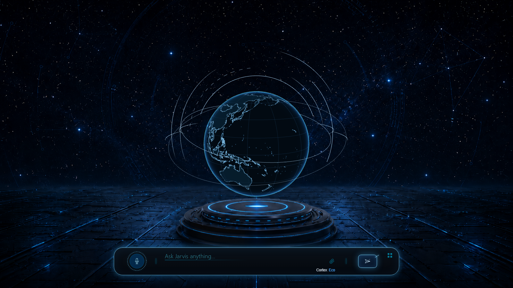

</div>

---

## Table of contents

- [What is JARVIS](#what-is-jarvis)
- [Screenshots](#screenshots)
- [Key features](#key-features)
- [System architecture](#system-architecture)
- [Prerequisites](#prerequisites)
- [Installation](#installation)
- [Configuration](#configuration)
- [The environments](#the-environments)
- [Memory architecture](#memory-architecture)
- [Model and reasoning layer](#model-and-reasoning-layer)
- [Tool system](#tool-system)
- [Automation engine](#automation-engine)
- [Security model](#security-model)
- [Design system](#design-system)
- [Development](#development)
- [Roadmap and status](#roadmap-and-status)
- [License](#license)

---

## What is JARVIS

JARVIS is a self-hosted assistant platform built on a different premise from most AI applications: the interface, the memory, and the tool layer are the product, and the language model is a replaceable component behind them.

Rather than a single scrolling conversation, the system presents **environments** — full-screen, purpose-built workspaces called rooms. A trading terminal, a research chamber, a prediction-market analyser, and a cross-machine collaboration surface each have their own layout, palette, data bindings, and interaction model. All of them share one reasoning core, one memory substrate, and one capability engine, so context established in one environment is available in the others.

Everything runs locally. The backend is a Node HTTP server exposing 363 routes; storage is SQLite; secrets are sealed with Windows DPAPI; and the assistant's memory is a 214-table encrypted store with its own migration system, retrieval planner, and cryptographic audit chain. A Cloudflare tunnel is started automatically so a paired phone can reach the system from any network, but no data leaves the machine unless a tool explicitly sends it.

The engineering theme running through the codebase is **verifiability**. The assistant is architecturally prevented from claiming work it did not perform: outward-facing claims must be substantiated by a tool that actually produced a side effect, completion claims are re-observed rather than trusted, and a 51-finding internal audit was conducted whose central conclusion was that a check which cannot fail is itself a defect.

---

## Screenshots

<div align="center">

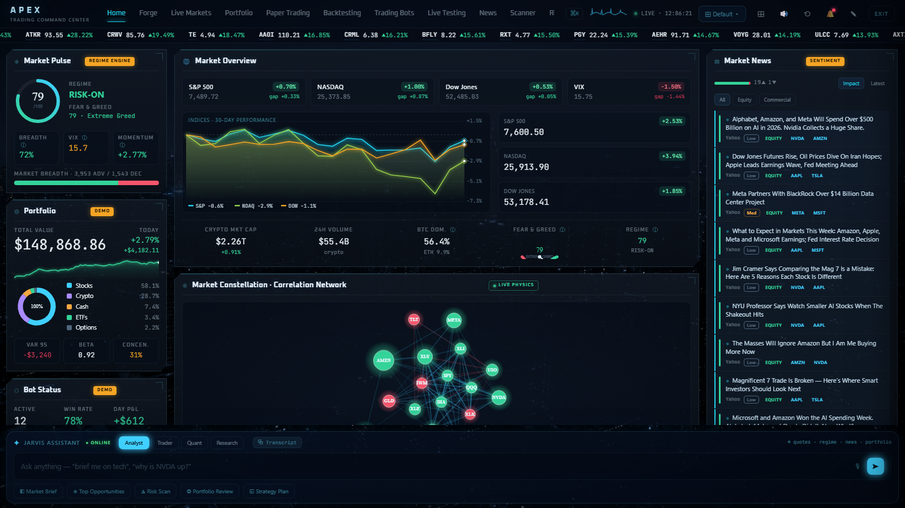

<sub><b>APEX</b> — the Command Deck. Regime engine, live correlation physics graph, order-book heatmap, sentiment-scored news river.</sub>

<br/><br/>

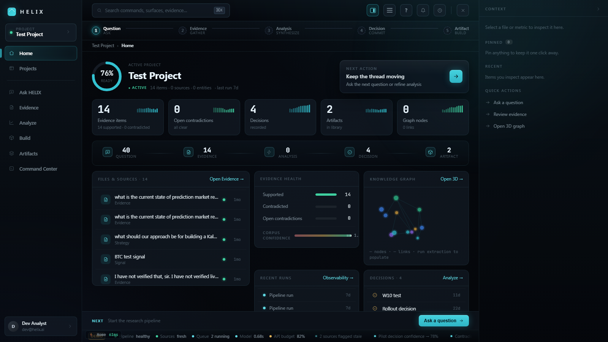
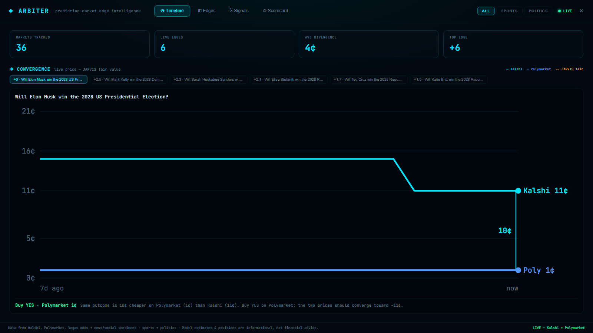

<sub><b>HELIX</b> — evidence pipeline with contradiction tracking &nbsp;·&nbsp; <b>Arbiter</b> — cross-venue prediction-market divergence</sub>

<br/><br/>

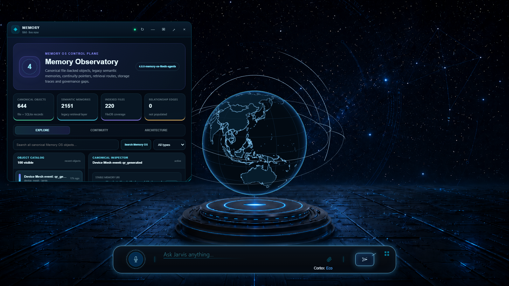

<sub>A spatial widget — the Memory Observatory — floating over the shell. Draggable, resizable, three display modes.</sub>

</div>

---

## Key features

**Room-based workspaces.** Four full-screen environments (APEX, HELIX, Arbiter, Synapse) replace the single-transcript model. Each room mounts over the shell at full viewport, re-themes the entire interface by swapping CSS custom properties on `:root`, and persists as the active workspace across reloads. Rooms are entered by name from the command bar or from the widget launcher.

**Encrypted bitemporal memory.** A 214-table SQLite store, every table declared `STRICT`, built across 30 migrations. Every payload is AES-256-GCM encrypted inside an `encrypted_objects` table; the master key is sealed with Windows DPAPI and never used directly — per-purpose subkeys are derived through HKDF-SHA256 for content encryption, content MAC, and ledger signing independently. The event ledger is HMAC-chained so history tampering is detectable.

**Non-destructive memory migration.** The new memory system runs live against every turn while the legacy store remains authoritative. It operates in shadow mode (observing and comparing), then guarded-canary mode (a narrow allowlist of low-risk facts may reach the prompt), and only becomes authoritative per-domain after an owner-approved cutover recorded in a signed ledger. Every failure path resolves back to legacy.

**129 risk-classified tools.** Each capability carries a risk tier — `observe` (77), `prepare` (25), `execute` (17), `commit` (10) — and an orthogonal autonomy level gates what may run unattended. Tools that cause irreversible external effects require a cryptographic owner challenge: a random 32-byte token bound to the specific tool and a hash of its exact arguments, expiring in ten minutes and compared in constant time.

**Four-lane automation engine.** A router selects between visible-desktop control (Windows UI-Automation with a Set-of-Marks vision overlay), headless browser automation (a DOM-driven planner over Playwright), an authenticated private-browser session, and direct API connectors. Lane selection is deterministic and explicit: taking over the physical screen requires the request to say so.

**Relevance-ranked DOM snapshots.** Page snapshots rank elements in-page before truncating, so interactive controls survive the element budget regardless of their position in the document, and decorative icons that duplicate their parent's label are discarded. Truncation is reported rather than silent.

**Model registry with failover ladders.** Nine roles map to distinct Gemini models, each with an ordered fallback chain tried on 503/429/500/404 and a self-healing `*-latest` alias as final recourse. A three-tier effort dial governs premium escalation; cheap models and free search grounding are always available.

**Two-layer intent classification.** A deterministic classifier establishes turn intent; an optional model-based semantic router may refine it, but the deterministic baseline wins on conflict — the language model cannot reclassify its way past a safety-relevant decision.

**Three-tier request trust.** Requests resolve to local owner, signed relay, or paired device. Owner authority requires direct loopback *with no proxy-forwarded headers present*, because a tunnel without host-header rewriting makes every public request appear to originate from loopback.

**Desktop takeover overlay.** When the assistant is driving the machine, an Electron overlay window — frameless, transparent, click-through, always-on-top, content-protected, multi-display aware — makes it visually unmistakable. `Ctrl+Alt+Escape` is a hard emergency stop wired to the Action Fabric kill switch.

**Phone pairing over automatic tunnel.** A Cloudflare Quick Tunnel starts with the server so a phone can pair from any network with no configuration. Pairing is a six-character code plus a server-rendered QR, with permission tiers chosen at approval time.

**Verified test suite.** 503 tests across 69 files on Node's built-in runner, written under a mutation-testing discipline: a fix is not accepted until the original defect is reinstated and the new test is confirmed to fail.

---

## System architecture

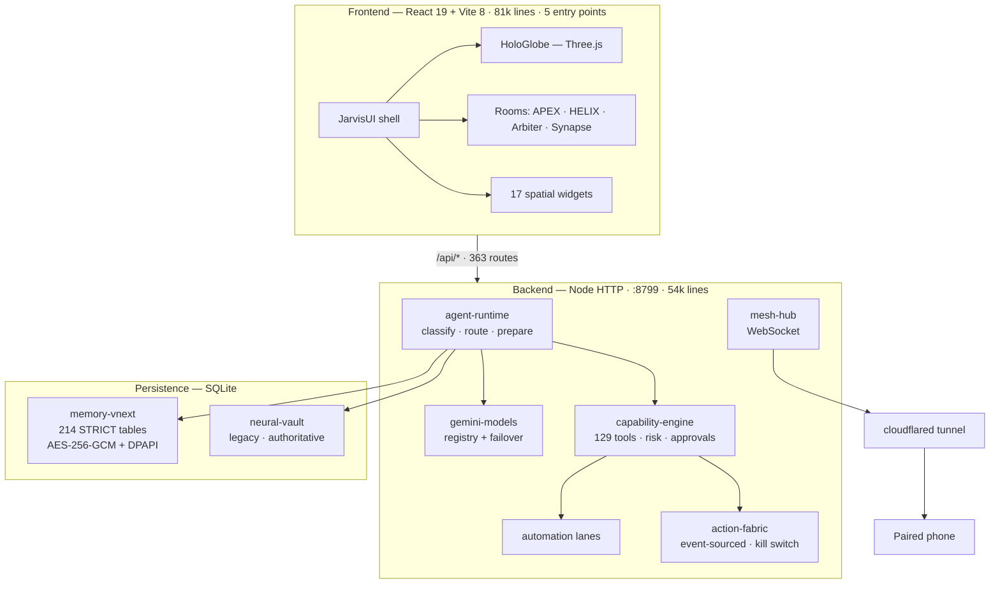

### Request lifecycle

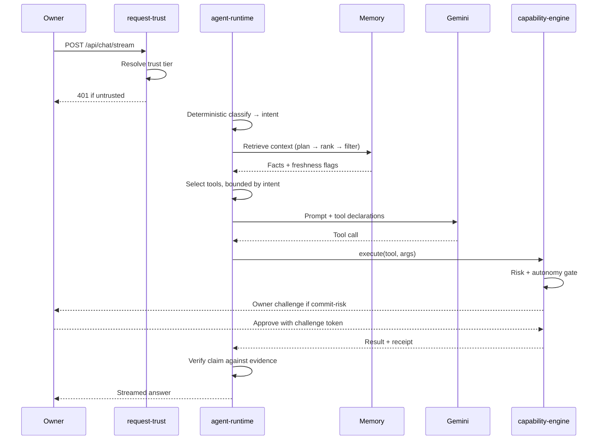

---

## Prerequisites

| Requirement | Minimum | Notes |
|---|---|---|
| Node.js | 20 or later | Uses the built-in test runner and modern ESM |
| RAM | 8 GB | 16 GB recommended with rooms and Playwright running |
| Disk | 3 GB | `node_modules` plus SQLite stores and browser profiles |
| OS | Windows 10/11 | Required for the DPAPI secret store and UI-Automation desktop control |
| Browser | Chromium | Installed automatically by Playwright |

The web interface and the majority of the backend are cross-platform. Two subsystems are Windows-only by construction: the encrypted secret store (`ProtectedData` / DPAPI) and visible-desktop control (Windows UI-Automation). On macOS or Linux the server starts and the rooms work; those two capabilities are unavailable.

---

## Installation

### 1. Clone and install

```bash
git clone https://github.com/devanshagrawal0/Jarvis_.git
cd Jarvis_
npm install
```

Playwright downloads a Chromium build on first install. Expect this step to take a few minutes.

### 2. Configure

```bash
cp .env.example .env
```

Open `.env` and set `GEMINI_API_KEY`. Every other variable is optional — see [Configuration](#configuration). The application starts with no keys at all; features requiring a missing key are disabled rather than failing.

Obtain a Gemini key from [Google AI Studio](https://aistudio.google.com/apikey).

### 3. Run

Two processes, two terminals:

```bash
npm start          # backend  → http://127.0.0.1:8799
```

```bash
npm run dev        # frontend → http://127.0.0.1:5173
```

Open `http://127.0.0.1:5173`.

### 4. Or run the desktop application

```bash
npm run app:dev
```

Electron forks the backend itself, so this is a single command. It adds the system tray, global emergency-stop shortcuts, and the desktop takeover overlay.

### Building a distributable

```bash
npm run build            # production web bundle
npm run app:build:win    # portable Windows executable via electron-builder
```

### Verifying the install

```bash
npm run test:backend     # 503 tests
npm run check            # syntax check + typecheck + production build
```

---

## Configuration

All configuration is environment variables in `.env`. Only `GEMINI_API_KEY` is required.

### Core

| Variable | Required | Purpose |
|---|---|---|
| `GEMINI_API_KEY` | **Yes** | The reasoning core. Without it the assistant cannot respond. |
| `JARVIS_HOST` | No | Bind address. Defaults to loopback. |
| `PORT` | No | Backend port. Defaults to `8799`. |
| `JARVIS_RUNTIME_DIR` | No | Where SQLite stores, vaults and browser profiles are written. |
| `JARVIS_BROWSER_HEADLESS` | No | Force headless browser automation. |
| `JARVIS_DESKTOP_CONTROL_DRY_RUN` | No | Plan desktop actions without executing them. Useful for evaluation. |

### Market data

Every provider below has a free tier. Several APEX sources need no key at all: GDELT, SEC EDGAR, NWS, Binance, Coinbase, Yahoo, US Treasury, and Stooq.

| Variable | Enables |
|---|---|
| `APEX_FINNHUB_KEY` | Equity quotes, fundamentals, filings |
| `APEX_TIINGO_KEY` | Historical daily bars |
| `APEX_FRED_KEY` | Macroeconomic series |
| `APEX_MARKETAUX_KEY` | News with sentiment scoring |
| `APEX_ALPHAVANTAGE_KEY` | Supplementary time series |
| `APEX_COINGECKO_KEY` | Crypto market data |

### Research and integrations

| Variable | Enables |
|---|---|
| `BRAVE_SEARCH_API_KEY`, `EXA_API_KEY`, `NEWS_API_KEY` | Web research tools |
| `OPENAI_API_KEY`, `ANTHROPIC_API_KEY` | Optional alternate models |
| `GOOGLE_CLIENT_ID`, `GOOGLE_CLIENT_SECRET`, `GOOGLE_REFRESH_TOKEN` | Gmail, Calendar, Drive |
| `INSTAGRAM_ACCESS_TOKEN`, `INSTAGRAM_ACCOUNT_ID` | Instagram messaging tools |
| `GITHUB_TOKEN`, `FIGMA_ACCESS_TOKEN` | Repository and design integrations |
| `HIGGSFIELD_API_KEY` | Image generation |
| `KALSHI_API_KEY_ID`, `KALSHI_PRIVATE_KEY` | Prediction-market data (read-only) |

Secrets are written to `runtime/`, which is gitignored and never committed. That directory holds the encrypted vault, the SQLite stores, and a browser profile containing live session cookies.

---

## The environments

Rooms are entered by typing their name into the command bar, or from the launcher in the lower-right. The active room persists in `localStorage` across reloads.

### APEX — trading command center

A market terminal built entirely on free public data. Eleven tabs across 68 source files.

<div align="center">
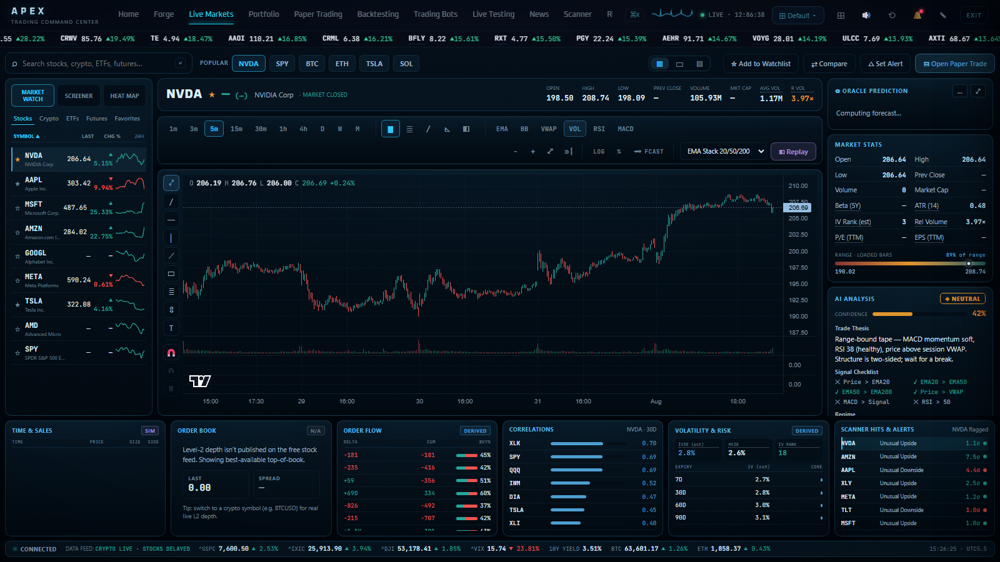
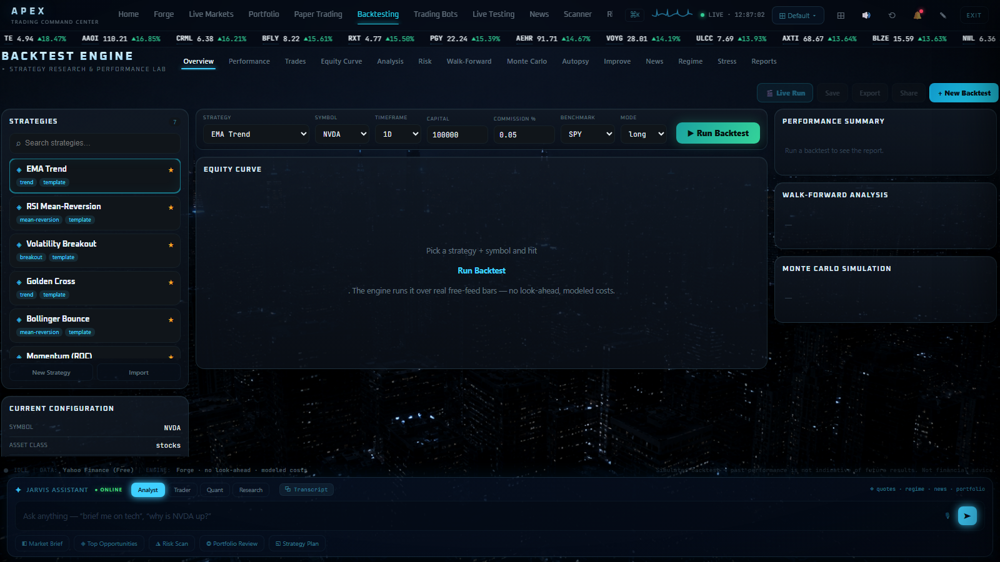
</div>

| Tab | Capability |
|---|---|
| **Home** | ~24-panel bento dashboard: regime engine, correlation physics graph, order-book heatmap, breadth, sentiment news river |
| **Forge** | Visual strategy builder — see below |
| **Live Markets** | Candlestick terminal with EMA, VWAP, Bollinger, RSI, MACD, strategy replay, and an Oracle multi-horizon prediction panel |
| **Portfolio** | Correlation heatmap, regime attribution, RRG sector rotation, anomaly scan |
| **Paper Trading** | Simulated fills against live quotes with slippage and commission modelling |
| **Backtesting** | Equity and drawdown curves, trade distribution, monthly heatmap, walk-forward, Monte Carlo, per-trade autopsy |
| **Trading Bots** | Rule-based bots evaluating live bars on a schedule, routed through the paper desk |
| **Live Testing** | Forward-test monitor for deployed strategies |
| **News** | Sentiment-scored feed with impact classification |
| **Scanner** | Factor catalogue (requires an external engine, see [status](#roadmap-and-status)) |
| **Risk** | VaR, CVaR, Sharpe, beta and Monte Carlo from public daily bars |

**THE FORGE** is the densest subsystem in the project — a visual quant laboratory where strategies are assembled from signal blocks and then attacked by a family of specialised agents:

<div align="center">
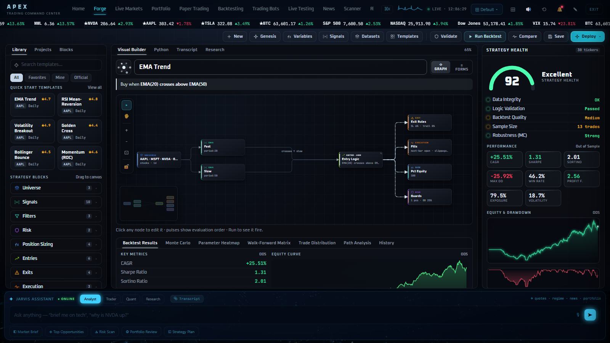
</div>

| Agent | Function |
|---|---|
| **Darwin** | Evolutionary search over strategy populations with genetic crossover and mutation |
| **Prospector** | Signal mining across the indicator space |
| **Sentinel** | Overfitting detection — deflated Sharpe ratio, parameter sensitivity, Monte Carlo trials |
| **Genesis** | Generates candidate strategies from a stated objective |
| **Terraform** | Regime-conditional restructuring |
| **Improver** | Diagnoses *why* a strategy underperforms rather than only scoring it |

APEX ships three themes (Cold Steel `#3fd0ff`, Midnight `#a98bff`, High Contrast `#00e5ff`), three density modes, and a staged cinematic boot sequence.

### HELIX — intelligence chamber

A research environment organised around an explicit five-stage pipeline, across eleven surfaces.

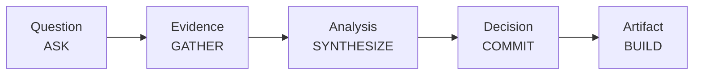

What distinguishes it from document-chat is that **contradiction is first-class state**. Evidence is recorded as supported or contradicted; open contradictions are counted and surfaced on the dashboard; and corpus confidence is deliberately ordinal rather than a fabricated percentage. Surfaces render honest empty states — a zero and a call to action — instead of sample rows.

| Surface | Purpose |
|---|---|
| Home | Project readiness, evidence health, next action |
| Projects | Project switching and lifecycle |
| Ask | Question entry against the live pipeline |
| Evidence | Source and claim management with support/contradiction state |
| Analyze | Synthesis across the evidence corpus |
| Build | Workspace of folders, segments and operations |
| Artifacts | Output library |
| Command Center | DNA double-helix visualisation of the pipeline with live counts |
| Explore | Search, lineage, 3D knowledge graph, flows |
| Observability | Run history and pipeline telemetry |
| Team | Collaborator records |

The **knowledge graph** is a WebGL force-directed 3D layout built on `@react-three/fiber` with `d3-force-3d` physics and bloom postprocessing, arranging sources, claims, analyses, decisions and artifacts into colour-coded depth layers.

### Arbiter — prediction-market divergence

Identifies price divergence for the same real-world outcome across Kalshi and Polymarket, computes a fair value, and proposes the convergence trade. Four views: Timeline, Edges, Signals, Scorecard.

### Synapse — cross-machine collaboration

Two JARVIS instances on separate machines operating in one session: presence rail, shared workspace, live cursors, shared canvas, dual chat, and a session timeline. Transport is WebRTC with Noise-protocol identity and a session choreographer coordinating turn-taking.

---

## Memory architecture

The memory subsystem is the largest single body of work in the project: **30 migrations producing 214 tables**, every one declared `STRICT`, developed across 32 waves, with 35 repository modules.

### What is stored

| Domain | Contents |
|---|---|
| Conversation | Turns and stream chunks with full branching |
| State kernel | Open loops, focus state, unresolved referents |
| Tasks | Checkpoints, approvals, tool-invocation ledger |
| Evidence | Sources → evidence units → assertions → entities, with reliability and trust zones |
| Personal context | Discrete owner facts under `identity.*`, `preference.*`, `goal.*`, `health.*`, `location.*` |
| Ledger | Append-only bitemporal event log with HMAC chaining |

### Cryptographic design

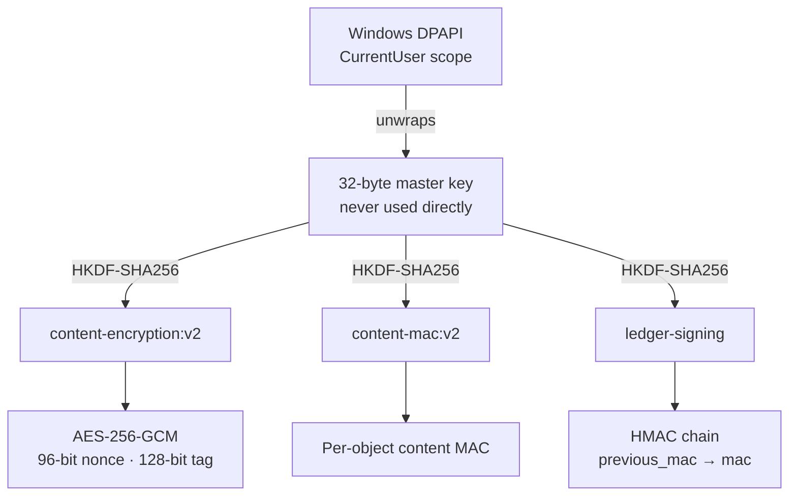

Key separation is the point: compromise of one derived key does not yield the others, and the master key itself is only ever an HKDF input.

### Retrieval pipeline

A query passes through topic expansion, a planner decision (skip / shallow / deep), exact and lexical retrieval, optional one-hop temporal graph expansion, contextual re-ranking, and a sensitivity filter, before being compiled into prompt blocks with a per-fact freshness flag. Staleness thresholds are domain-specific: 90 days for health facts, 365 for identity, 730 by default.

### The cutover state machine

Replacing a working memory system carries real risk, so the new store runs live but non-authoritative until explicitly promoted, per domain.

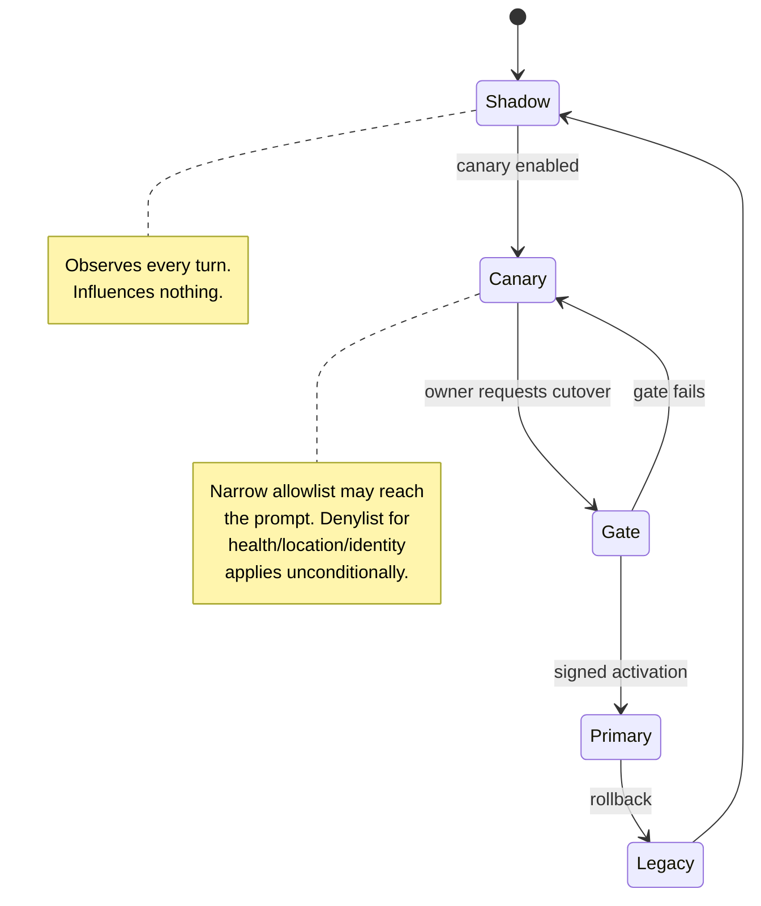

Four domains promote independently, in order: `explicit_commands` → `conversation_runtime` → `retrieval_context` → `room_integrations`. Every failure mode resolves to legacy; authority is granted only by positive signed activation.

The gate that authorises promotion does not accept a caller-supplied assertion. It **earns** its evidence: 24 probe prompts through the live retrieval path, plus a contained rollback rehearsal that provisions a throwaway store, runs the real coordinator, activates all four domains forward, rolls them back, and asserts the runtime observed each transition.

---

## Model and reasoning layer

A single registry maps roles to models, each with an ordered failover chain.

| Role | Responsibility |
|---|---|
| `router` | Routing, classification, extraction, background work |
| `main` | Chat, tool use, vision, search grounding |
| `reasoning` | Escalation for hard problems |
| `live` | Realtime voice |
| `embedding` | Memory vectors |
| `image` / `imagePro` | Generation |
| `deepResearch` | Long-horizon hosted research |
| `computerUse` | Screen control |

Each role carries fallbacks tried on 503, 429, 500 and 404, ending in a self-healing `*-latest` alias. The design exists because provider outages repeatedly took specific model versions offline mid-session.

**Classification is two-layered.** A deterministic classifier assigns intent, complexity and thinking level. An optional model-based semantic router may then refine that assignment — but where the two disagree, the deterministic result stands. The consequence is that the language model cannot argue itself into a different safety posture.

**Effort is a three-tier dial.** `cost-guarded`, `balanced` and `full` govern only premium escalation — Pro-tier reasoning, Computer Use, hosted deep research, premium image generation. Inexpensive models and free search grounding remain available at every tier. Spend is metered per turn from provider usage metadata, and the stable system preamble is served from the provider's prompt cache to reduce repeat input cost.

---

## Tool system

| Risk tier | Count | Semantics |
|---|---|---|
| `observe` | 77 | Read-only. No state change. |
| `prepare` | 25 | Stages an action for review without committing it. |
| `execute` | 17 | Acts locally. |
| `commit` | 10 | Causes an external, irreversible effect. |

Families span browser control, Windows UI-Automation, filesystem access, web research, market data, device mesh, agent deployment, skill compilation, screen vision, and communications.

### Approval protocol

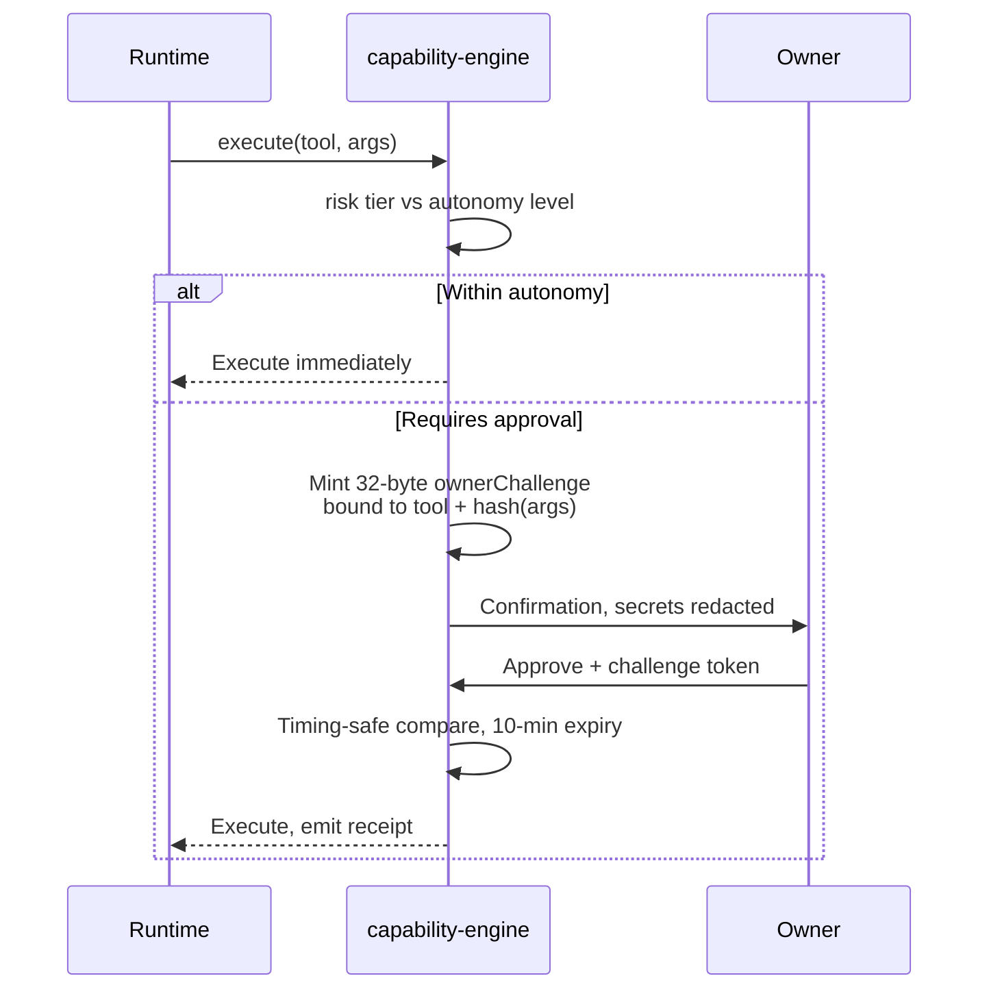

The challenge is bound to a hash of the exact arguments, so an approval cannot be replayed against different parameters. Argument summaries are redacted against `token|secret|password|authorization|api.?key|cookie` before display.

Autonomy operates as an orthogonal axis (`observe`, `prepare`, `act`, `autopilot`). `run_command` is confirmed at every level including autopilot, on the reasoning that a command blocklist is not a security boundary. Voice-originated turns may never commit external effects.

---

## Automation engine

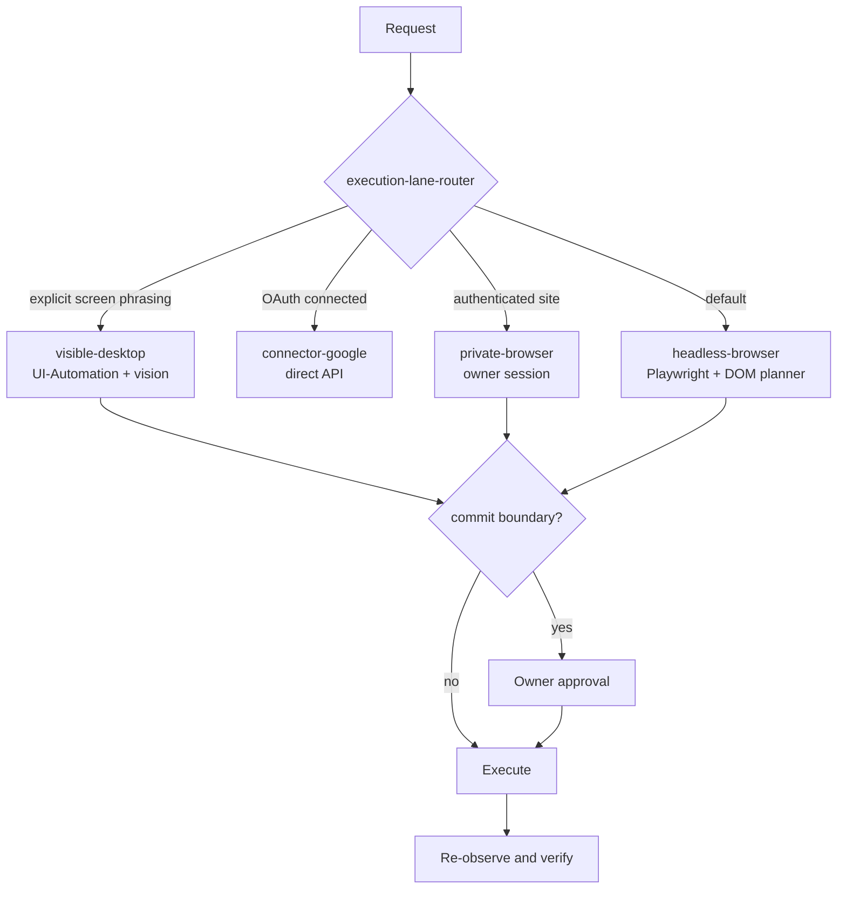

Taking control of the physical screen requires the request to say so explicitly — phrases such as "on my screen" or "control my cursor". Everything else defaults to headless automation, which is faster and does not seize the machine.

**Snapshot ranking.** DOM snapshots are bounded by an element budget. Ranking happens in-page before truncation, so controls the assistant can type into survive regardless of their document position, buttons adjacent to a text field are promoted so a compose control is never separated from its send control, and icons whose accessible name merely repeats their parent link are discarded. Truncation is reported to the planner rather than silently applied.

**Outcome memory.** Both automation lanes record per-surface action outcomes — success, failure, whether the page actually changed — and feed prior results back into subsequent planning, so a route that has repeatedly failed is marked to avoid. The store refuses to learn commit-verb actions or person-identifying labels.

---

## Security model

| Trust tier | Established by |
|---|---|
| `local-owner` | Direct loopback **and** no proxy-forwarded headers present |
| `relay` | HMAC-SHA256 signature, 60-second freshness window, nonce replay cache, timing-safe comparison |
| `paired-device` | Bearer token issued at pairing, with a permission tier chosen on approval |

The forwarded-header condition is load-bearing. A Cloudflare tunnel started without host-header rewriting causes every public request to arrive from `127.0.0.1`, which means loopback alone cannot establish owner identity.

Additional controls:

- **Secret storage.** Seventeen allowlisted credential fields encrypted as a single blob under DPAPI, written atomically at mode `0600`.
- **Prompt-injection provenance.** A turn is flagged as externally influenced only after a tool that genuinely retrieves outside content has executed, rather than by turn counting.
- **Filesystem guards.** Writes are refused to Windows system directories, Program Files, ProgramData, Startup, System32 and UNC paths.
- **Emergency stop.** An Action Fabric kill switch that every in-flight consequential action must clear, bound to `Ctrl+Alt+Escape` in the desktop application.
- **Read-only market access.** All prediction-market tools exposed to the model are read-only by design.

---

## Design system

The interface is tokenised rather than styled per-room, so a room change re-tints the entire shell.

| Token group | Values |
|---|---|
| Backgrounds | `#020408` room · `#060809` void · layered translucent surfaces |
| Accents | JARVIS `rgb(0,180,255)` · HELIX `#4a9eff` · APEX `#22d3ee` · signal `#f5a524` |
| Strands | evidence `#4a9eff` · strategy `#4aff9e` · construction `#ff9e4a` · memory `#9e4aff` · signal `#ffe14a` · synthesis `#4afff0` |
| Typography | Orbitron and Oxanium (display) · Inter (body) · JetBrains Mono (data) |
| Motion | 120–450 ms, tokenised easing curves |

The visual language is consistent throughout: near-black glass panels with 12–32 px backdrop blur, thin translucent accent borders, additive glow, scanline decoration, and uppercase micro-labels with wide letter-spacing.

Widgets share one frame implementation — draggable, resizable, with minimized, normal and expanded modes. Each widget is authored as a compact card paired with an expanded command center.

---

## Development

```bash
npm run dev              # frontend with HMR
npm start                # backend
npm run app:dev          # Electron desktop shell
npm run test:backend     # 503 tests, single-threaded
npm run check            # node --check + tsc --noEmit + vite build
npm run test:feature     # Playwright feature specs
```

### Test methodology

The suite is written under a mutation-testing rule: **a fix is not accepted until the original defect has been reinstated and the corresponding test confirmed to fail.** A test that passes both before and after a change has demonstrated nothing.

This discipline came out of [`docs/JARVIS_DEEP_AUDIT.md`](./docs/JARVIS_DEEP_AUDIT.md), a 51-finding internal audit whose central conclusion was that a check which cannot fail is itself a defect. Findings included guards whose condition was always true, counters that reported zero because nothing incremented them, a canary allowlist that matched no facts for two days while reporting healthy, a deletion path that had never deleted, and a promotion gate satisfied by a boolean the caller supplied about itself.

### Repository layout

```
server/                 63 modules across 9 subsystems · 54k lines
  memory-vnext/           214-table encrypted store · 35 repositories
  automation/             lane router · navigation memory · entity resolver
  action-fabric/          event-sourced tasks · emergency stop
  apex/  arbiter/         room backends
  providers/              market data and integration clients
src/
  JarvisUI.tsx            application shell
  globe-room/             globe · command bar · 17 widgets
  rooms/
    apex/                   11 tabs · 68 files · THE FORGE
    helix/v2/               11 surfaces · 3D knowledge graph
    synapse/                cross-machine collaboration
  phone/                  paired phone interface
electron/               desktop shell · takeover overlay
tests/backend/          69 files · 503 tests
scripts/                capture, checks, benchmarks
docs/                   audit, specifications, screenshots
```

---

## Roadmap and status

The project is under active development. This table reflects the state of each surface as of the current commit, and matches the badges the interface displays on itself.

### Shipped

| Area | Notes |
|---|---|
| Shell, globe, 17 widgets | Live backend bindings |
| APEX — Live Markets, Portfolio, Risk, News, Backtesting, Forge | Live public market data. Equity microstructure is labelled in-app as simulated. |
| APEX — Paper Trading, Trading Bots, Live Testing | Fully functional against a virtual desk. No broker path exists in the codebase. |
| HELIX — Ask, Evidence, Analyze, Build, Explore, Artifacts, Team, Projects | Bound to live pipeline routes |
| Memory vNext | Live in shadow and guarded-canary mode |
| Tool system, approvals, trust tiers, automation lanes | Complete |
| Desktop shell, takeover overlay, phone pairing | Complete |

### In progress

| Area | Current state |
|---|---|
| Memory cutover | Runs live; legacy remains authoritative. Promotion is gated per domain and not yet executed. |
| Synapse | Collaboration implemented; the call and video panel is a placeholder. |
| APEX Home — Portfolio and Bot Status tiles | Carry a `DEMO` badge. The standalone Portfolio tab is fully live. |
| HELIX Notifications | Carries a sample badge; not yet wired to live events. |
| HELIX Observability | Per-run internals pending a data-honesty pass. |

### Planned

| Area | Notes |
|---|---|
| Arbiter backend | The room is complete as an interface and currently renders from fixtures. |
| Scheduled autonomous tasks | Not implemented. |
| APEX Scanner | Depends on an external factor engine not included in this repository. |
| Cross-platform secret store | Currently DPAPI, and therefore Windows-only. |

---

## License

Released under the [MIT License](./LICENSE).

> [!WARNING]
> This software can control your computer, drive a browser with your authenticated sessions, read your screen, and send messages on your behalf. Review the [security model](#security-model) before enabling autonomous operation, keep `Ctrl+Alt+Escape` in mind as the emergency stop, and do not grant it access to anything you cannot afford to have acted upon.

Nothing in this project constitutes financial advice. APEX and Arbiter are research and visualisation tools. All trading surfaces route through a simulated desk with no broker connectivity. Market data originates from free public sources and may be delayed, incomplete, or inaccurate.
