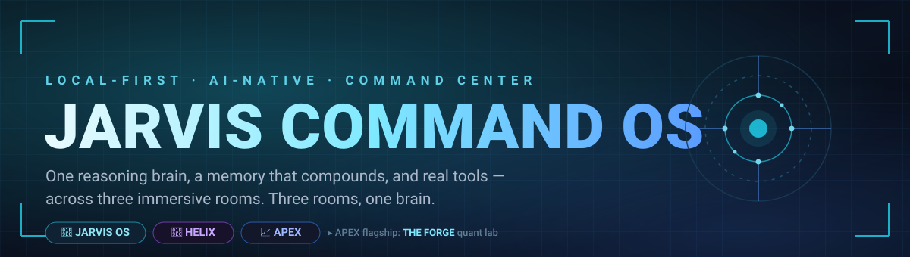
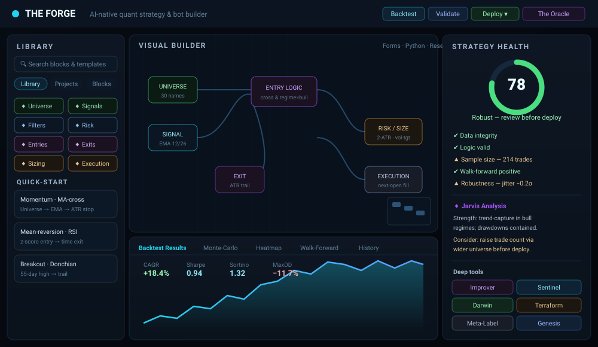
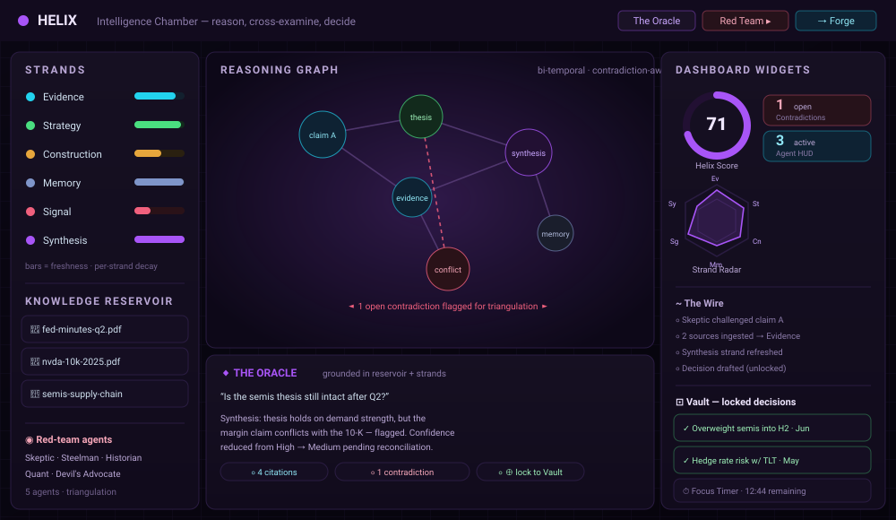
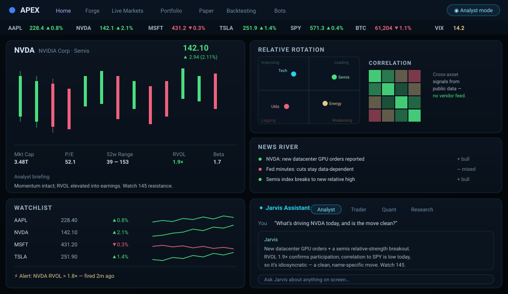
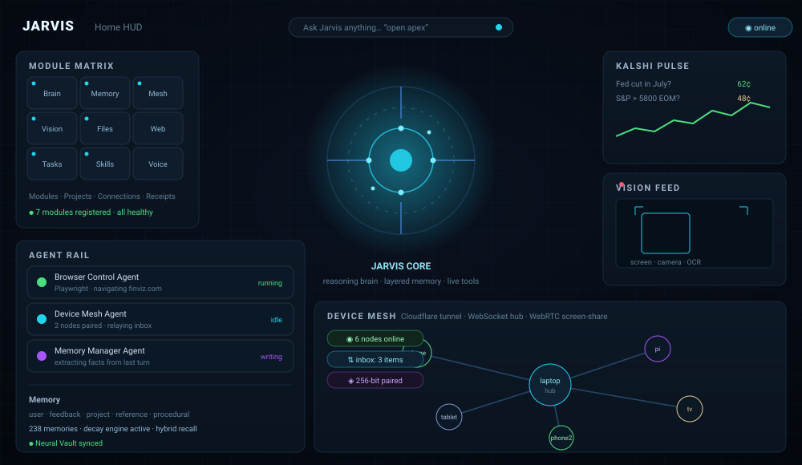
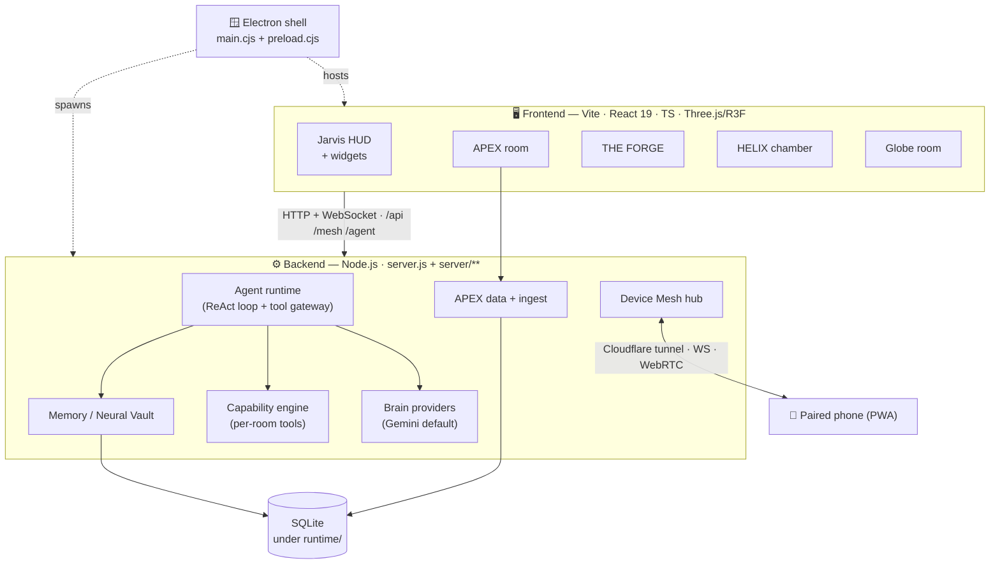
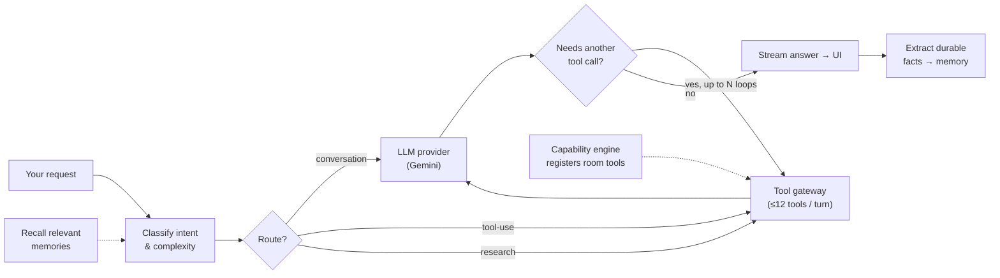
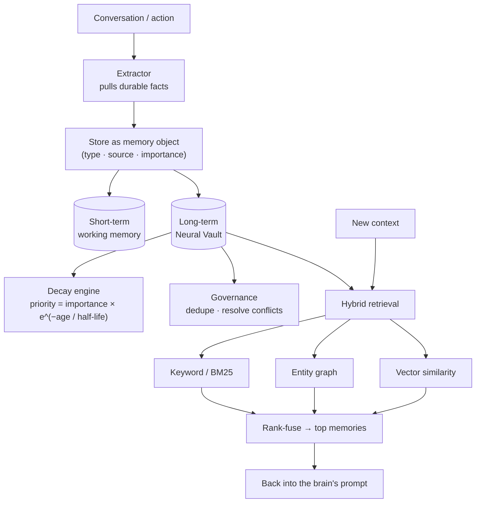

<div align="center">



<br/>

**A local-first, AI-native command center for your desktop — a reasoning brain, layered memory, live tools, a phone-to-laptop device mesh, and immersive 3D "rooms."**

<br/>


<br/>


</div>

---

## ✨ Highlights

- 🧠 **Tool-calling AI brain** — a ReAct agent runtime that classifies intent, filters its own toolset per turn, and can drive a browser, read your screen, search the web, hit market data, and act inside every room.
- 🗄️ **Two-tier persistent memory** — a "Neural Vault" that survives across sessions: short-term working memory + a long-term store with a **time-decay engine**, hybrid retrieval (keyword + entity graph + vector), procedural skills, and a bi-temporal knowledge graph.
- 🔨 **THE FORGE** — an AI-native quant lab: build a strategy as a **node graph**, backtest it on real public market data with a **no-look-ahead engine** (single-symbol *and* multi-symbol portfolio), then stress it with overfitting checks, walk-forward, Monte-Carlo, and evolutionary search.
- 🧬 **HELIX** — an "Intelligence Chamber" that reasons across a **6-strand** knowledge model, ingests documents into a Knowledge Reservoir, cross-examines itself with a panel of **red-team agents**, and locks conclusions into a decision Vault.
- 📈 **APEX** — a trading command center running entirely on **free public data** (so it's safe to share): live ticker, dossiers with candlesticks, news river, correlation/RRG, watchlists, and a real alert engine.
- 🧩 **Live widget systems** — draggable, self-updating dashboard widgets in the Jarvis HUD and in HELIX (score meters, agent HUDs, strand radars, activity wires, and more).
- 📱 **Device Mesh** — pair your phone by QR over a Cloudflare tunnel; send text/links/files and mirror screens over a WebSocket hub with WebRTC screen-share.
- 🖥️ **Ships as a desktop app** — Electron shell, packageable for Windows & macOS. **Local-first**: nothing leaves your machine unless you wire up a cloud key.

> **Status —** an ambitious solo project, actively developed. The brain, memory, Forge engine, APEX data, HELIX, and device mesh are real and working. A few surfaces (live paper-trading, some bots) are **honestly demo-badged** in the UI while their engines are built out. Backtests use public data and modeled costs — **not financial advice.**

---

<div align="center">

### 🔨 THE FORGE — the flagship



</div>

Compose a trading strategy as a **colour-coded node graph** (Universe → Signals → Entry → Exit / Sizing / Risk / Execution), then run it through a deterministic backtest engine with next-bar-open fills and modeled slippage + commission. A docked analysis area and an always-on **Strategy Health** rail turn every run into a report card.

<details>
<summary><b>Open the full Forge feature list</b></summary>

<br/>

**Three-panel command center**
- **Left — Library:** searchable blocks (Universe, Signals, Filters, Risk, Sizing, Entries, Exits, Execution, Portfolio Constraints, Analytics), Quick-Start templates, and your saved projects.
- **Center — Builder canvas:** a self-rendered node graph with a tool rail, minimap, and pan/zoom, plus a **Forms** mode to edit every field directly. Side tabs generate a **Python** code scaffold from the spec, a **Transcript** provenance log of every change, and a per-strategy **Research** pad.
- **Right — Strategy Health rail:** a health-score gauge + checklist (data integrity, logic, backtest quality, sample size, robustness), an out-of-sample performance grid, equity/drawdown sparklines, a rule-based **Jarvis Analysis** (strengths / considerations / warnings / readiness-to-deploy), and the deep tools.

**Docked analysis (7 tabs):** Backtest Results (metrics + equity curve + per-symbol contribution) · Monte-Carlo (block-bootstrap) · Parameter Heatmap (Terraform sweep) · Walk-Forward Matrix · Trade Distribution · Path Analysis · History (version timeline + A/B diff).

**The engines — all real, client-side, no look-ahead:**
| Engine | What it does |
|---|---|
| **Backtest** | Deterministic next-bar-open fills, modeled costs; single-symbol **and** a multi-symbol **portfolio** engine (shared cash, up to *N* concurrent positions, per-symbol contribution). |
| **The Improver** | Recursive diagnosis tree — builds a per-trade ledger, runs testers, grows a tree of confirmed weaknesses, emits staged **action cards** you can apply and re-backtest. |
| **Overfitting Sentinel** | Deflated Sharpe (trial-count-aware), walk-forward with embargo, parameter-jitter robustness, Monte-Carlo → a trust score. |
| **Darwin** | Genetic algorithm that evolves the spec toward better risk-adjusted fitness. |
| **Terraform** | 2-parameter sweep rendered as a fitness landscape / heatmap. |
| **Meta-Labeler** | Out-of-sample (k-fold CV) logistic model that filters low-confidence trades. |
| **Genesis** | Goal → strategy generator ("a low-drawdown momentum bot for NVDA"). |
| **Signal Upload Studio** | Drop a `.py`/`.ipynb`, watch a staged analysis, get a derived signal with its runnable code + retrieval method stored and labeled. |
| **Portfolio (HRP)** | Blend several strategies with hierarchical risk parity. |

> **Universe:** by default a strategy backtests a ~30-name liquid large-cap basket (not a single ticker). Trim it, pick a preset (Mega-cap Tech, Index ETFs, Sectors, Semis, Dow 10, Crypto, or **All Large-cap**), or type your own.

</details>

---

<div align="center">

### 🧬 HELIX — the Intelligence Chamber



</div>

Where Jarvis **reasons, cross-examines itself, and decides.** Knowledge is organised into **six strands** — *Evidence, Strategy, Construction, Memory, Signal, Synthesis* — each with its own freshness/decay rate. Feed documents into the **Knowledge Reservoir**, ask **The Oracle** a question and get an answer grounded in your sources (with citations and any contradictions flagged), let a panel of **red-team agents** (Skeptic, Steelman, Historian, Quant, Devil's Advocate) triangulate it, then **lock the conclusion into the Vault**. A **Workflow Studio** chains these steps, and a set of dashboard widgets (Helix Score, Contradictions, Agent HUD, Strand Radar, The Wire, Vault Preview…) keeps the chamber's state visible. HELIX can hand a thesis straight to THE FORGE.

---

<div align="center">

### 📈 APEX — Trading Command Center



</div>

A shareable trading room built **only on free public data** (Finnhub, Tiingo, FRED, Marketaux, CoinGecko, SEC EDGAR, and more) — no proprietary or vendor feeds, so it's safe to demo. A live market ticker sits over a tabbed workspace: **Home** (dossiers with candlesticks, a briefing system, news river, correlation / RRG / volatility, watchlists, a real alert engine), plus **Forge, Live Markets, Portfolio, Paper Trading, Backtesting, Trading Bots, Live Testing.** A persistent **Jarvis Assistant** bar (Analyst / Trader / Quant / Research modes) can answer questions about anything on screen. APEX is also the room that hosts THE FORGE.

---

<div align="center">

### 🧠 Jarvis Home — the HUD



</div>

The landing HUD and the hub for everything. A holographic command bar ("Ask Jarvis anything…") is context-aware — type a room name to enter it, or give Jarvis a task. Around the central **Jarvis Core** orb sit live **widgets**: a Module Matrix (registered capabilities), an Agent Rail (what the agents are doing right now), a Vision Feed (screen / camera / OCR), a Kalshi Pulse, a Memory panel, and the **Device Mesh** graph. Panels cover Modules, Projects, Agents, Connections, Kalshi, Vision, Memory, Devices, Co-Op, and Receipts.

<details>
<summary><b>Other surfaces — Globe Room · Phone · Widget Lab</b></summary>

<br/>

- **Globe Room** — a cyberpunk 3D globe workspace (Three.js / R3F). Relies on heavy 3D/texture assets that are **git-ignored** (see [Heavy assets](#-heavy-assets)); the core app needs none of them.
- **Phone** — a companion PWA surface for the device mesh.
- **Widget Lab** — a sandbox for building and previewing widgets.

</details>

---

## 🏗️ Architecture



- **Ports:** frontend dev server `5173`, backend `8799` (Vite proxies `/api` → `8799`).
- **Data model:** each room persists to its own SQLite tables under `runtime/` (never committed).

---

## 🧠 How the AI brain works

Jarvis routes every request through an **agent runtime** (`server/agent-runtime.js`):



1. **Prepare** — classify intent/complexity and pick a route (conversation vs. tool-use vs. research). Some surfaces (e.g. the Forge) force a direct conversation route for composing.
2. **Provider** — call the configured LLM (Google **Gemini** by default via `GEMINI_API_KEY`; OpenAI optional). A latency budget keeps turns bounded.
3. **Tools** — a **tool gateway** exposes capabilities (web search, browser control, screen/computer use, files, market data, memory); the model gets the ~12 most relevant tools for the turn.
4. **Capability engine** — registers each room's tools so Jarvis can act on what you're looking at (e.g. `apex_forge`, `apex_report`).
5. **Loop & recall** — a ReAct-style multi-turn loop lets Jarvis chain tool calls; relevant memories are pulled into the prompt and new facts are extracted after the turn.

---

## 🗄️ How memory works

Jarvis has a two-tier, persistent memory ("Neural Vault / MemoryOS") stored as SQLite under `runtime/` (git-ignored):



- **Types** — *user* (who you are), *feedback* (how Jarvis should work), *project* (ongoing work), *reference* (links), plus **procedural memory** for learned skills (never expires).
- **Decay** — each memory kind ages on its own half-life, so stale facts fade while important ones persist.
- **Recall** — three retrieval signals (keyword, entity graph, vector) are rank-fused so the most relevant memories resurface across sessions.

> Because memory is personal, the entire `runtime/` directory is **never committed.**

---

## 📱 Device Mesh (phone pairing)

1. Start Jarvis on the laptop, open the **Devices** panel, click **Generate QR**.
2. Scan on your phone and pair (256-bit pairing). Use `/mesh` on the phone to send text, links, files/photos, heartbeats, and screen-preview requests.
3. Phone QR links must use LAN / Tailscale / Cloudflare — **not** `localhost`.

Health/repair routes: `GET /mesh/health`, `GET /mesh/pair?code=…`, `POST /mesh/api/inbox/{text,link,upload}`, `POST /mesh/api/self-test`.

---

## 🚀 Quick start

```bash
# 1. install
npm install

# 2. configure keys (optional — the app boots with none)
cp .env.example .env        # then fill in whichever keys you have

# 3a. run the web app (two terminals)
npm start                   # backend  → http://127.0.0.1:8799
npm run dev                 # frontend → http://127.0.0.1:5173

# 3b. …OR run the desktop app
npm run app:dev
```

Then open **http://127.0.0.1:5173** and type a room name (e.g. `apex`) in the command bar.

<details>
<summary><b>⚙️ Build, desktop packaging & Cloudflare</b></summary>

<br/>

```bash
npm run build               # production web build (dist/)
npm run app:build:win       # Windows portable desktop app
npm run app:build:mac       # macOS dmg/zip (on macOS)
npm run cf:build && npm run cf:deploy   # optional Cloudflare deploy
```

</details>

<details>
<summary><b>📋 Prerequisites & NPM scripts</b></summary>

<br/>

**Prerequisites:** Node.js 20+ and npm · Windows / macOS / Linux · (optional) a Gemini key for the brain and any APEX data keys you want.

| Script | What it does |
|---|---|
| `npm start` | run the backend (`node server.js`, port 8799) |
| `npm run dev` | run the frontend dev server (Vite, port 5173) |
| `npm run build` | production web build |
| `npm run check` | typecheck + `node --check server.js` + build |
| `npm run app:dev` | run the Electron desktop app |
| `npm run app:build:win` / `:mac` | package the desktop app |
| `npm run test` | full suite (check + backend + feature tests) |
| `npm run cf:deploy` | build + deploy to Cloudflare |

(See `package.json` for the complete list, including memory-OS and device-mesh test/repair scripts.)

</details>

---

## ⚙️ Configuration (environment variables)

Copy `.env.example` → `.env`. **Nothing is required to boot** — the app degrades gracefully and many data sources need no key.

<details>
<summary><b>Show the environment-variable table</b></summary>

<br/>

| Variable | Purpose |
|---|---|
| `GEMINI_API_KEY` | Jarvis reasoning brain (primary) |
| `OPENAI_API_KEY` | optional alternate model |
| `APEX_FINNHUB_KEY`, `APEX_TIINGO_KEY`, `APEX_FRED_KEY`, `APEX_MARKETAUX_KEY`, `APEX_ALPHAVANTAGE_KEY`, `APEX_COINGECKO_KEY` | APEX market data (all free tiers) |
| `BRAVE_SEARCH_API_KEY`, `EXA_API_KEY`, `NEWS_API_KEY` | web/news research tools |
| `GITHUB_TOKEN`, `FIGMA_ACCESS_TOKEN`, `GOOGLE_*`, `INSTAGRAM_*`, `HIGGSFIELD_API_KEY` | optional integrations |
| `KALSHI_API_KEY_ID`, `KALSHI_PRIVATE_KEY` | Kalshi event-contract data (optional) |

See `.env.example` for the full annotated list and [`docs/JARVIS_CREDENTIALS_SETUP.md`](docs/JARVIS_CREDENTIALS_SETUP.md) for provider setup.

</details>

---

## 🧰 Tech stack

**Frontend:** React 19 · TypeScript · Vite 7 · Three.js + @react-three/fiber/drei · Framer Motion · Zustand · cmdk · custom SVG charts · lucide-react.
**Backend:** Node.js (ESM + CommonJS) · `better-sqlite3` · `ws` (WebSocket) · Playwright (browser tools) · provider SDKs (Google Generative AI, OpenAI).
**Desktop:** Electron + electron-builder. **Tooling:** Playwright tests · Wrangler (optional Cloudflare) · TypeScript · ESLint.

> Full lists are in `package.json`.

---

## 📁 Project structure

```
jarvis-ui/
├─ index.html · phone.html · widget-lab.html · globe.html · globe-room.html   # Vite entry points
├─ vite.config.mjs · tsconfig*.json · package.json
├─ server.js                      # backend entry (agent brain, APIs, mesh)
├─ server/                        # backend modules
│  ├─ agent-runtime.js · capability-engine.js · providers/   # brain + tools
│  ├─ neural-vault.js · memory-*.js · procedural-memory.js   # memory
│  ├─ apex-db.js · apex-ingest.js                            # APEX market data
│  └─ mesh-hub.js · mission-engine.js · …
├─ electron/                      # main.cjs + preload.cjs (desktop shell)
├─ public/                        # static assets (icons, manifests, room bg)
├─ src/
│  ├─ SimpleApp.tsx               # Jarvis HUD + widget system
│  ├─ rooms/
│  │  ├─ apex/                    # APEX room + THE FORGE (forge/**)
│  │  ├─ HelixRoom.tsx · helix/   # HELIX chamber + widgets
│  │  └─ ApexRoom.tsx
│  ├─ features/                   # memory-os, task-to-skill, local-file-access
│  ├─ globe-room/ · phone/ · components/
│  └─ api.ts · …
├─ scripts/                       # build / test / analysis scripts
├─ docs/                          # deep-dive guides + media/ (README visuals)
└─ .env.example · .gitignore
```

The Forge lives under `src/rooms/apex/forge/` — `ForgeView.tsx` (UI), `forge-engine.ts` (backtest engine), `ForgeDock.tsx` / `ForgeStudio.tsx`, `forge-versions.ts`, and the `improver/` engines (sentinel, darwin, terraform, meta, genesis, analyze…).

---

## 🖼️ Heavy assets

To keep the repo lean, large binary media are **git-ignored** and not shipped: `*.mp4`, `*.glb`/`*.gltf`, `*.blend`, high-res textures under `public/globe-room/**`, big geojson, and everything in `design/**`. The **core app (Jarvis + APEX + Forge + HELIX)** needs none of these. The **Globe** room will look bare without its 3D models/textures — drop them back into `public/` locally if you want it.

---

## 🔒 Security & privacy

- **No secrets are committed.** `.env`, `runtime/` (memory, DBs, screen captures), `*.dpapi`, and credential JSON are all git-ignored. Every API key is read from `process.env` — none are hardcoded.
- **Local-first.** Data lives on your machine under `runtime/`. Market data is fetched from public APIs; nothing is sent to a third party unless you configure a cloud key.
- If you fork/deploy this, **rotate any keys** and keep them in `.env` or your platform's secret store.

---

## 📄 Status & disclaimer

An ambitious personal project — some rooms are polished, others experimental (and demo-badged in the UI where an engine is still being built). **THE FORGE and APEX are not financial advice.** Backtests use public data and modeled costs; past performance says nothing about the future. Do your own research before risking real money.
