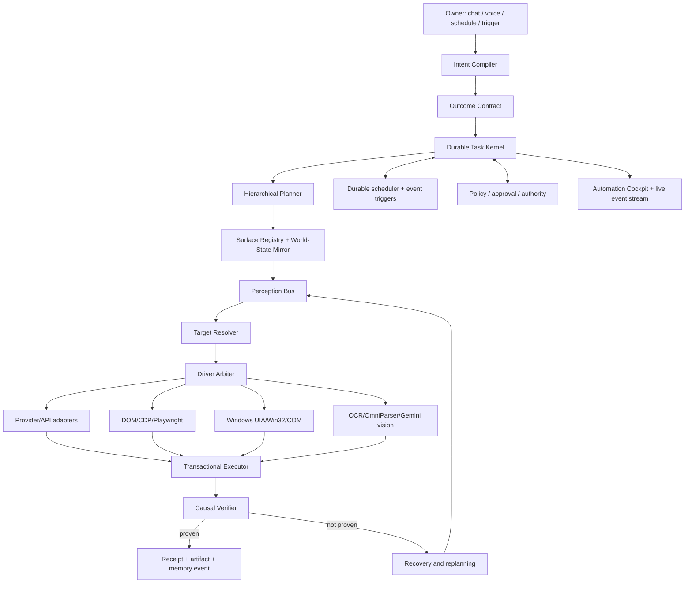
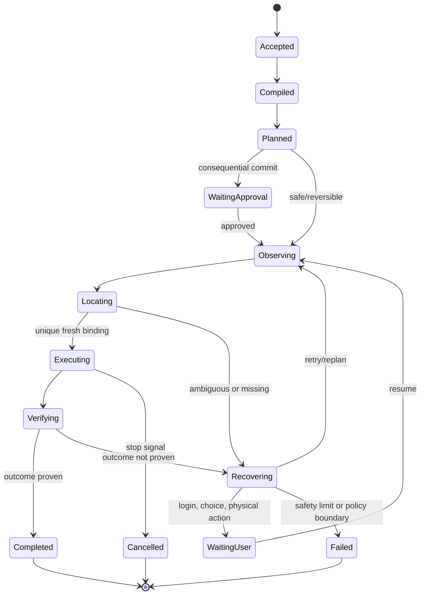
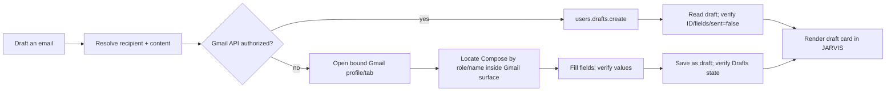
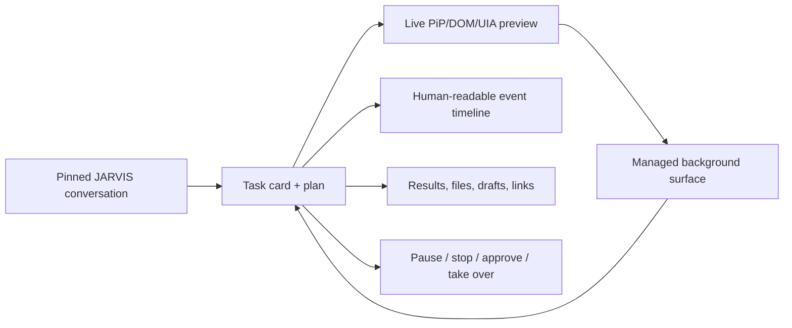
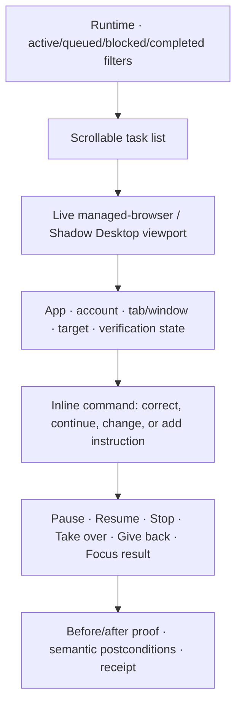
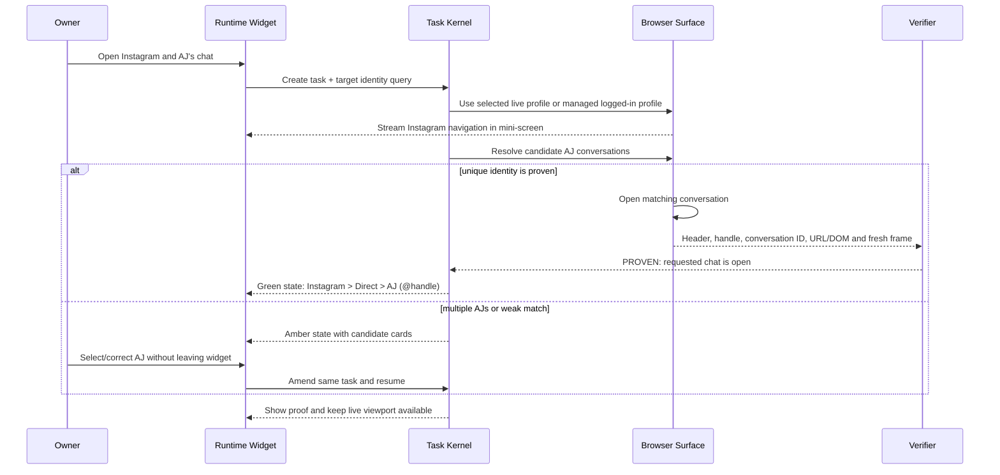
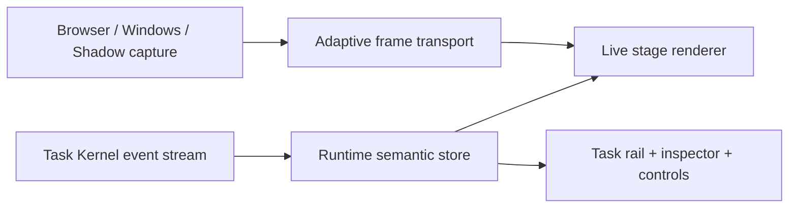

# JARVIS Action Fabric

## Clean-sheet autonomous browser, desktop, file, application, and scheduled-work runtime

**Status:** build-ready research and architecture plan  
**Date:** 2026-07-28  
**Scope:** replace the fragmented browser/desktop automation paths with one fast, stateful, verifiable action system. This document does not change runtime code.  
**Relationship to existing plans:** this is the detailed implementation authority for the browser/desktop and automation portions of `rebuildplanfinal.md`. It must integrate with Memory vNext rather than creating another memory database.

---

## 1. Executive decision

JARVIS should not be rebuilt as a model that repeatedly looks at the whole screen and guesses coordinates. That is expensive, slow, brittle, and still unreliable at professional tasks. It should be rebuilt as an **action operating system** in which an LLM compiles intent and handles genuine ambiguity, while deterministic drivers perform most actions and a verifier proves the requested outcome.

The new system is called **JARVIS Action Fabric**. It has one durable task kernel, one surface registry, one driver hierarchy, one transaction engine, one verification standard, one scheduling engine, and one cockpit UI. Browser, desktop, APIs, files, shell jobs, devices, and application-specific adapters become drivers behind the same contracts. The model is never allowed to claim that an operation succeeded merely because a handler returned without throwing.

The governing rule is:

```text
Understand the requested outcome
→ choose the least fragile capable driver
→ bind every action to an exact surface and fresh state
→ execute a bounded transaction
→ prove the postcondition
→ recover or report the precise failure
```

### The non-negotiable driver order

```text
Native provider/API
  > application object model / CLI
  > browser DOM/CDP
  > Windows UI Automation / Win32 / COM
  > fused screenshot + OCR + vision grounding
  > current-snapshot coordinates as the final fallback
```

This order is applied **per step**, not per task. A single task may use a Gmail API to create a draft, Playwright to inspect an authenticated page, Windows UIA to open the resulting file, and vision only to verify a custom-rendered chart.

### The blunt conclusion from current research

There is no trustworthy “give the model unrestricted mouse control and let it keep clicking” architecture. GUI grounding remains fallible, and the newest long-horizon benchmark shows frontier systems still lose track of constraints, skip verification, and guess when state is hidden. The top design is therefore not the model with the most freedom; it is the runtime that gives a capable model **better state, typed actions, durable checkpoints, application specialists, and hard outcome proofs**.

---

## 2. What is broken in the present system

This rebuild is justified by observed failures in the current JARVIS runtime, not by hypothetical concerns.

### 2.1 Systemic failures already observed

1. `screen_act` can fail while parsing model JSON with `Bad control character in string literal in JSON`.
2. `desktop_control.click_text` can leave the intended window and search the global Windows UIA root, selecting a similarly named control in a different application or monitor.
3. A handler returning `{ok:true}` is treated as verified completion even when the requested UI state never changed.
4. Coordinate clicks can be issued after target location fails, then text is typed into whichever control happens to own focus.
5. Follow-ups such as “yes,” “continue,” or “you did not do it” are not reliably attached to the pending automation task.
6. Gmail drafting currently has a split meaning: one path produces draft JSON, another can send mail, while neither reliably means “a draft now exists in Gmail.”
7. Several overlapping tools compete for the same intent: `open_url`, `desktop_control`, `screen_act`, `screen_inspect`, `computer_use`, `browser_act`, `browser_commit`, the Windows broker, and multiple browser modes.
8. Screen actions spawn fresh PowerShell/UIA work and rebuild large trees repeatedly, producing 20–45 second steps.
9. There is no authoritative window/tab/session identity shared across planning, action, verification, receipts, and follow-up turns.
10. The current UI makes the owner chase tabs: JARVIS opens or controls another surface, but its explanation and next prompt remain elsewhere.

### 2.2 The root causes

These failures reduce to eight architectural defects:

- **tool fragmentation:** similar capabilities expose incompatible contracts;
- **stateless action execution:** each call reconstructs context rather than continuing a durable task;
- **unbound targeting:** an element name is not bound to a specific surface and observation epoch;
- **focus blindness:** typing is not guarded by a proven focused target;
- **false verification:** handler completion is confused with goal completion;
- **model overuse:** expensive reasoning is placed inside elementary interaction loops;
- **no concurrency authority:** the user and agent can unknowingly compete for the same screen;
- **weak task UX:** progress, approvals, recovery, and results are separated from the conversation.

No amount of prompt tuning will repair these defects. The execution substrate must change.

---

## 3. Research findings that determine the design

### 3.1 Computer use is an agent loop, not one magic call

Google’s Computer Use documentation explicitly requires an application to execute returned actions, capture the new state, return a screenshot/result, and continue the loop. It also exposes action intent, configurable thinking, prompt-injection detection, and safety decisions. Anthropic describes the same repeated tool/result agent loop and recommends combining computer control with shell and editor tools. OpenAI’s Agents SDK likewise treats computer use as a local harness the application must implement; recent computer calls may batch actions, but the harness still owns execution and screenshots.

**JARVIS implication:** Gemini Computer Use is a planner/grounder behind Action Fabric. It cannot be the authority that declares success, selects arbitrary OS targets, or owns task persistence.

Sources: [Gemini Computer Use](https://ai.google.dev/gemini-api/docs/computer-use), [Anthropic computer use](https://platform.claude.com/docs/en/agents-and-tools/tool-use/computer-use-tool), [OpenAI Agents SDK tools](https://openai.github.io/openai-agents-python/tools/).

### 3.2 Hybrid GUI–API systems are stronger than visual-only systems

Microsoft’s UFO² architecture combines a HostAgent, application-specific AppAgents, Windows UIA/Win32/COM integration, vision fallback, explicit state machines, and a picture-in-picture virtual desktop. Agent S2 separates high-level management, low-level work, and specialist grounding; its ablations report gains from both proactive hierarchical planning and a mixture of grounding experts.

**JARVIS implication:** build one coordinator with dynamically loaded specialists, not a swarm on every prompt. Specialists should be used for application knowledge and grounding only when the task requires them.

Sources: [Microsoft UFO²](https://microsoft.github.io/UFO/), [UFO GitHub architecture](https://github.com/microsoft/UFO), [Agent S2 paper](https://arxiv.org/abs/2504.00906), [Agent S repository](https://github.com/simular-ai/Agent-S).

### 3.3 Accessibility and semantic state must precede pixels

Microsoft UI Automation exposes desktop applications as a hierarchy of windows and controls with programmatic properties and action patterns. Playwright locators re-resolve the current DOM at action time and pair with actionability checks such as visible, stable, enabled, and event-receiving. OmniParser converts otherwise opaque screenshots into structured elements, which is valuable for custom-rendered surfaces but is still a fallback.

**JARVIS implication:** the target resolver must fuse DOM, accessibility/UIA, application metadata, OCR, and vision, while retaining the source and confidence of every candidate.

Sources: [Microsoft UIA tree](https://learn.microsoft.com/en-us/windows/win32/winauto/uiauto-treeoverview), [Playwright locators](https://playwright.dev/docs/locators), [Playwright actionability](https://playwright.dev/docs/actionability), [Microsoft OmniParser](https://github.com/microsoft/OmniParser), [OmniParser V2](https://www.microsoft.com/en-us/research/articles/omniparser-v2-turning-any-llm-into-a-computer-use-agent/).

### 3.4 Latency is primarily an orchestration problem

OSWorld-Human finds that model planning/reflection calls account for most computer-agent latency, later steps can take substantially longer, and evaluated agents use 1.4–2.7 times the necessary number of steps. Anthropic’s current guidance notes that screenshots rapidly consume context and recommends bounded recent images, batched pruning, caching, and summaries.

**JARVIS implication:** do not invoke a large model between deterministic clicks. Compile a short typed plan, run local verified steps, and call the model again only at ambiguity, drift, recovery, or a semantic checkpoint.

Sources: [OSWorld-Human](https://arxiv.org/abs/2506.16042), [Anthropic context-management guidance](https://claude.com/blog/best-practices-for-computer-and-browser-use-with-claude).

### 3.5 Current agents remain far from fully reliable

OSWorld provides execution-graded real-computer tasks rather than grading fluent explanations. OSWorld 2.0 makes workflows much longer and adds dynamic environments, cross-source reasoning, hidden state, and visual precision; current leading systems still complete only a minority of end-to-end tasks. ScreenSpot-Pro and Microsoft’s Phi-Ground discussion show that professional high-resolution grounding remains an unsolved deployment risk.

**JARVIS implication:** the system needs outcome contracts, checkpoints, hidden-state recovery, and programmatic grading. A visually plausible click is not evidence.

Sources: [OSWorld](https://github.com/xlang-ai/OSWorld), [OSWorld 2.0](https://github.com/xlang-ai/OSWorld-V2), [OSWorld 2.0 paper](https://arxiv.org/abs/2606.29537), [ScreenSpot-Pro](https://arxiv.org/abs/2504.07981), [Phi-Ground](https://microsoft.github.io/Phi-Ground/).

### 3.6 Durable work and schedules require replay-safe state

Temporal’s core promise is durable execution that resumes after process, network, or infrastructure failure. LangGraph can checkpoint graph state and pause indefinitely at an interrupt until a user resumes it. OpenTelemetry provides common trace, metric, log, and event naming across a system.

**JARVIS implication:** a scheduled or long-running task must use the same task kernel as an interactive one, with idempotent effects, retries, checkpoints, approvals, and queryable history. A cron callback directly clicking the desktop is unacceptable.

Sources: [Temporal](https://docs.temporal.io/), [LangGraph interrupts](https://docs.langchain.com/oss/python/langgraph/interrupts), [OpenTelemetry semantic conventions](https://opentelemetry.io/docs/concepts/semantic-conventions/).

### 3.7 Security cannot be delegated to the model

Web pages, messages, images, documents, and application UIs are untrusted input. Anthropic and Google provide prompt-injection detection and both require confirmation boundaries for consequential actions. OWASP identifies excessive agency as a major risk; the WASP benchmark demonstrates realistic web-agent hijacking attacks.

**JARVIS implication:** instructions and observed content must be separate data classes. Authorization is evaluated at commit time using fresh state. The user can give broad intent, but JARVIS grants each worker only the capabilities and surfaces required for its current step.

Sources: [Anthropic computer/browser safety practices](https://claude.com/blog/best-practices-for-computer-and-browser-use-with-claude), [Gemini Computer Use safety](https://ai.google.dev/gemini-api/docs/computer-use), [OWASP Excessive Agency](https://owasp.org/www-project-top-10-for-large-language-model-applications/2_0_vulns/LLM06_ExcessiveAgency.html), [WASP benchmark](https://github.com/facebookresearch/wasp).

---

## 4. The target architecture



### 4.1 Major components

#### Intent Compiler

Turns the owner’s language into a typed task without prematurely choosing UI actions. It extracts:

- requested outcome;
- objects and destinations;
- constraints and exclusions;
- deadline/schedule/timezone;
- required owner choices;
- consequence and privacy class;
- whether visible interaction is expected;
- whether a pending task is being continued or corrected.

#### Outcome Contract

Defines what must be true before JARVIS can say “done.” Examples:

- Gmail draft: a provider draft ID exists, subject/body/recipients match, `sent=false`.
- Instagram message: correct conversation identity is proven, prepared text matches, send receives explicit approval, and the new message is visible or returned by an API.
- file archive: target ZIP exists, opens successfully, contains the expected manifest, and hashes match.
- calendar event: provider event ID exists and a read-after-write returns matching time, timezone, guests, and title.

#### Durable Task Kernel

Owns task identity, state, checkpoints, events, locks, deadlines, safety limits, cancellation, retries, resumption, and owner follow-ups. It is not an LLM. It is the authority for what is currently happening.

#### Surface Registry

Maintains stable identities for:

- monitor and virtual desktop;
- OS session;
- process and top-level window;
- application document;
- browser profile/context/window/tab/frame;
- target account and provider session;
- files, folders, devices, and remote sessions.

No target can be acted on without a `surfaceId` and a fresh observation epoch.

#### Perception Bus

Collects incremental observations from:

- browser DOM, accessibility tree, URL, network and navigation events;
- Windows UIA tree, supported patterns, focus and window events;
- application object models and provider read APIs;
- window screenshots through `Windows.Graphics.Capture` rather than full-screen capture when possible;
- OCR, icon detection, OmniParser-style structure, and Gemini vision only for unresolved regions;
- filesystem watchers, process events, clipboard state, downloads, and device mesh events.

It emits normalized deltas instead of repeatedly serializing the entire desktop.

#### Target Resolver

Produces ranked, typed target candidates with evidence. It cannot return a naked coordinate.

```ts
type TargetBinding = {
  targetId: string
  surfaceId: string
  observationEpoch: number
  role?: string
  name?: string
  automationId?: string
  locator?: string
  bounds?: { x: number; y: number; width: number; height: number }
  sources: Array<'api'|'dom'|'uia'|'ocr'|'vision'>
  confidence: number
  ambiguity: Array<{ targetId: string; reason: string }>
  expiresAt: string
}
```

If the target is ambiguous, stale, off-surface, disabled, occluded, or outside the current monitor bounds, the action is rejected before input is generated.

#### Driver Arbiter

Chooses the lowest-risk, highest-reliability driver for each step using capability, state freshness, expected latency, observed historical success, consequence, and cost. It can upgrade from UI to API or downgrade to vision on a single step without changing the owner-visible task.

#### Transactional Executor

Runs short action transactions with a precondition, target binding, focus lease, action, wait condition, postcondition, compensation, and deadline.

#### Causal Verifier

Proves the requested state transition using independent evidence. Preferred evidence order:

```text
provider read-after-write / returned object ID
> application object model
> DOM or UIA property/state
> file/process/database state
> screenshot region semantic diff
> visual appearance only
```

#### Recovery Engine

Classifies a failure before retrying:

- stale observation;
- wrong/ambiguous target;
- focus lost;
- overlay/dialog;
- authentication/2FA/CAPTCHA;
- permission denied;
- rate limit/network outage;
- navigation or rendering still in progress;
- changed UI/procedure drift;
- unsafe or infeasible task.

Recovery never repeats an effect unless its idempotency status is known.

---

## 5. The exact task lifecycle



### 5.1 Every task begins with an outcome, not a click plan

For “draft an email to X about Y,” the initial plan is not “open Gmail, click Compose.” It is:

1. resolve the contact and account;
2. create proposed content;
3. select the Gmail API adapter if authorized;
4. create the draft with an idempotency key;
5. read the draft back and verify fields;
6. show the owner a draft card with Open, Edit, and Send actions.

Only if the provider API is unavailable should JARVIS use DOM automation, and only after that should it use visible computer control.

### 5.2 Step transaction

```ts
type ActionStep = {
  taskId: string
  stepId: string
  intent: string
  surfaceId: string
  observationEpoch: number
  preconditions: Predicate[]
  target?: TargetBinding
  driver: DriverKind
  action: TypedAction
  expectedDelta: Predicate[]
  timeoutMs: number
  idempotencyKey?: string
  consequence: 'read'|'reversible'|'external-communication'|'financial'|'destructive'
  approvalId?: string
  compensation?: TypedAction
}
```

Execution algorithm:

1. reload current surface metadata;
2. validate the observation epoch and target binding;
3. validate authority and commit-time approval;
4. obtain required resource/focus locks;
5. capture minimal before-state;
6. execute one atomic action or a safely batchable group;
7. wait on an event or condition, never a blind fixed sleep when an event exists;
8. capture minimal after-state;
9. evaluate the expected delta;
10. persist receipt and release locks;
11. return `PROVEN`, `NOT_PROVEN`, `UNKNOWN`, or `BLOCKED`—never a misleading boolean.

### 5.3 Truth vocabulary

- `PROVEN`: independent postcondition evidence satisfies the outcome.
- `NOT_PROVEN`: the expected change did not occur.
- `UNKNOWN`: observation is insufficient; JARVIS must inspect or ask, not claim.
- `BLOCKED`: user, authentication, policy, external service, or environment action is required.
- `PARTIAL`: some explicit sub-outcomes are proven; remaining work is listed.

---

## 6. Browser execution plane

### 6.1 Three browser surfaces

1. **Managed interactive browser** — persistent JARVIS-controlled profile, visible inside the Cockpit through PiP/streaming, default for authenticated automation once the owner connects it.
2. **Background worker contexts** — isolated Playwright contexts for research, extraction, testing, and tasks that do not need the owner’s live session.
3. **Live-tab bridge** — attaches to a specifically selected owner tab through CDP/extension bridge when the owner says “this tab” or an existing login cannot be transferred.

Every task card shows profile, account, domain, tab, and whether JARVIS is in managed, background, or live mode.

### 6.2 Tab/session rules

- New tabs are registered from browser target events; the task follows the new target automatically.
- A popup is associated with the action that created it.
- The active task tab and the user-visible JARVIS conversation are separate surfaces.
- JARVIS never places its response inside the task tab.
- The Cockpit subscribes to task events over WebSocket/SSE, so progress appears without switching tabs.
- If a site opens a new tab, the task continues there while the owner’s Cockpit remains stable.
- On completion, the task may optionally focus the resulting page once, but it must not require the owner to return to JARVIS manually.

### 6.3 Semantic browser driver

The normal interaction order is:

1. direct site/provider API;
2. WebMCP/MCP tool exposed by the service, if trusted and authorized;
3. Playwright role, label, text, placeholder, alt text, title, or test ID;
4. accessibility tree plus DOM relationships;
5. CSS only when it describes stable application semantics;
6. screenshot region grounding;
7. coordinates bound to a current tab screenshot.

Required support:

- frames and shadow DOM;
- popup/new-page waits;
- navigation, request, response, websocket, and download events;
- dialogs, file choosers, clipboard and permission prompts;
- cookie and overlay recovery;
- form field identity and value verification;
- tab/account disambiguation;
- authenticated persistent profiles with encrypted token storage;
- per-domain adapter capabilities;
- Playwright tracing, DOM snapshots, screenshots, and network evidence on failure.

### 6.4 Gmail example



Google provides a dedicated `users.drafts.create` endpoint; JARVIS should use it rather than clicking whenever OAuth permits. Sending is a separate consequential commit. Source: [Gmail drafts.create](https://developers.google.com/workspace/gmail/api/reference/rest/v1/users.drafts/create).

---

## 7. Windows desktop execution plane

### 7.1 Persistent native broker

Replace per-action PowerShell startup with a long-lived signed local broker. Recommended implementation:

- .NET 10/C# worker or equivalent long-lived native process;
- named pipe or loopback gRPC with mutual process identity and request signing;
- UIA3/COM/Win32 adapters; FlaUI may be used as a wrapper where it is stable;
- event subscriptions for focus, window open/close, property changes, structure changes, and process lifecycle;
- `Windows.Graphics.Capture` for window/region frames;
- one normalized coordinate system that records monitor, scale factor, bounds, and virtual desktop origin;
- no global root search unless an explicit top-level surface query is being performed.

Microsoft now notes that WinAppDriver is no longer actively developed, so it should not be the new foundation. UIA remains the native substrate, with modern Appium usable only where protocol compatibility is valuable. Sources: [Windows UIA](https://learn.microsoft.com/en-us/uwp/api/windows.ui.uiautomation), [Windows screen capture](https://learn.microsoft.com/en-us/windows/apps/develop/media-authoring-processing/screen-capture), [FlaUI](https://github.com/FlaUI/FlaUI), [Windows app testing guidance](https://learn.microsoft.com/en-us/windows/apps/develop/testing/).

### 7.2 Strict surface scoping

Every UIA lookup begins at the registered process/window root. Global desktop searches are prohibited for ordinary control actions. A valid target includes:

- PID and process start time;
- HWND/top-level runtime ID;
- application identity;
- window title and class;
- control runtime path and automation ID where available;
- current bounds, enabled/offscreen state, and supported pattern;
- observation timestamp/epoch.

If the top-level window changes, the old target expires.

### 7.3 Focus-safe typing

No text input is emitted unless all conditions hold:

1. intended surface owns foreground focus;
2. intended control reports focus or is proven as the browser/OS text receiver;
3. target role is editable;
4. current value/selection state matches the precondition;
5. no user input occurred after the lease was granted;
6. the control remains inside the bound window and monitor.

After typing, the value is read back through UIA/DOM/application API when possible. A screenshot alone is insufficient for sensitive text.

### 7.4 Application specialists

Load specialist adapters only for active applications:

- File Explorer / filesystem operations;
- Office through COM/object models before UIA;
- VS Code through CLI/workspace APIs and accessibility;
- system settings through documented commands/registry only with policy checks;
- media applications;
- terminal/shell;
- browser families;
- device mesh sessions.

The specialist supplies application vocabulary, reliable operations, state readers, and recovery knowledge. It does not receive unlimited machine authority.

---

## 8. No-tab-chasing UX: the Automation Cockpit

This is a functional control surface, not cosmetic polish.



### 8.1 Required layout

- **Conversation rail:** remains present and readable regardless of what browser tab or desktop app is being controlled.
- **Task stack:** one card per active or scheduled task with outcome, current step, surface, elapsed time, usage, and confidence.
- **Live preview:** PiP stream or semantic miniature of the managed browser/virtual desktop; expandable without changing the active task.
- **Timeline:** concise events such as “Draft created,” “Waiting for login,” “Target changed,” or “Verification failed.” Raw JSON is behind a details toggle.
- **Approval shelf:** clear commit card showing exact recipient, message, amount, file mutation, or external action.
- **Artifact shelf:** drafts, downloaded files, generated documents, screenshots, receipts, and links.
- **Control strip:** Pause, Resume, Stop now, Take over, Retry from checkpoint, Change instruction.

### 8.2 Focus Lease Manager

When JARVIS must operate the owner’s visible desktop:

1. snapshot active window, tab, cursor, clipboard ownership, and selected control;
2. request a short exclusive input lease for a named surface and action group;
3. show a non-blocking HUD: “JARVIS is using Gmail — Stop / Take over”;
4. detect physical mouse/keyboard input; immediately pause before the next action if the owner intervenes;
5. perform only the leased atomic transaction;
6. verify it;
7. restore the previous window/tab/cursor if safe;
8. stream the result to the pinned conversation.

Focus leases are milliseconds-to-seconds, not the duration of the whole mission. When uninterrupted parallel work is required, use the managed browser or isolated virtual desktop/PiP instead.

### 8.3 Human-readable status language

Bad: `tool screen_act ok=true`.  
Good: `I found Gmail Compose, but the editor never opened. I stopped before typing anywhere.`

Bad: `Running automation…`.  
Good: `Creating a Gmail draft through the API · verifying recipient and subject · no email will be sent.`

### 8.4 Runtime Widget — live task viewport and correction console

Add a first-class spatial widget named **Runtime**. “Background Tasks” may remain the descriptive subtitle, but `Runtime` is the short owner-facing tab name. This widget is the everyday window into Action Fabric: it combines a scrollable task list, a live mini-screen, semantic state, controls, inline instructions, approvals, artifacts, and verification. It is not merely a remote-desktop video.

#### Scope guard: one new widget only

This wave creates **Runtime and only Runtime**. It must use the existing spatial workspace's public open/move/resize/z-order/persistence integration points without redesigning, restyling, migrating, or changing the behavior of any existing widget. Kalshi, Device Mesh, Memory, Helix, Synapse, Profile, Weather, Vitals, Modules, Projects, Agents, Connections, Trust, Vision, Receipts, and Graph remain out of scope. Runtime may reuse a shared primitive only when doing so requires no visible or behavioral change to existing consumers. If the existing frame cannot support Runtime safely, create a Runtime-specific frame/adapter rather than modifying every current widget.

#### Exactly three widget states

- **Minimized:** compact task instrument showing application icon, outcome, status, progress, elapsed time, attention badge, and Stop.
- **Normal:** scrollable task list on the left and active task preview/status on the right.
- **Expanded:** high-resolution interactive workspace with viewport, full timeline, plan, evidence, artifacts, approvals, and debugging details.

There is no fourth semantic state. **Detached, docked, floating, and dedicated-monitor are placement modes of the expanded state**, not additional Runtime states. This keeps the new Runtime widget on one predictable state machine while still allowing it to occupy a dedicated window or monitor. It does not impose this contract on existing widgets.

The widget is draggable, resizable, pin-able, and safe to keep open beside other widgets. Resizing changes the viewport presentation only; it must not change the browser’s automation coordinates or target identity.

#### Runtime layout



#### Scroll behavior

- The task column scrolls independently and groups tasks as Active, Waiting for you, Scheduled, Completed, and Failed.
- Each task preserves its last preview frame and semantic status when it scrolls off-screen.
- Selecting another task changes the viewport without changing or cancelling either task.
- Timeline, plan, and evidence panes have independent scrolling; the live viewport and Stop control remain pinned.
- New task events do not jerk the owner to the bottom while they are reading; an unobtrusive “3 new events” control appears.
- Virtualize long histories so hundreds of scheduled/background runs do not degrade the UI.

#### Live mini-screen

The viewport can display one of four sources, always labeled:

1. **Managed Browser:** streamed page or screencast from JARVIS’s persistent browser.
2. **Live Browser Tab:** the specifically attached owner tab using the existing login session.
3. **Shadow Desktop:** isolated interactive desktop used for parallel or unattended GUI work.
4. **Physical Desktop Lease:** window/region capture for a short visible-desktop action.

The viewport overlays semantic information without changing the target page:

- exact application and browser-profile/account identity;
- tab/window title and target ID;
- currently resolved control with role/name and confidence;
- intended next action;
- green verified boundary, amber ambiguity, red blocked/unsafe state;
- viewport freshness and connection state;
- visible indication whenever the owner is directly controlling the surface.

The preview must never imply interactivity when it is only a stale screenshot. Stale/disconnected previews freeze, show their capture time, and disable input until a fresh surface connection exists.

#### Two interaction modes

1. **Instruct mode:** typing in the Runtime command bar sends a contextual instruction to the selected task—for example, “not this AJ, the one with handle `@...`,” “make the message shorter,” or “open her profile first.” It becomes a versioned task amendment and forces replanning from fresh state.
2. **Takeover mode:** the owner explicitly takes the control baton. Pointer/keyboard events are routed into the mini-screen, the agent pauses, and the HUD says `You are controlling`. Pressing **Give back to JARVIS** creates a fresh observation and resumes from the new state.

Ordinary text entered in the command bar must never leak into the remote page. Remote keyboard input is accepted only when Takeover mode is visibly active and the viewport owns the control baton.

#### Inline quick actions

- `Correct target`
- `Change instruction`
- `Do this next`
- `Skip this step`
- `Retry from checkpoint`
- `Open result here`
- `Take over`
- `Give back to JARVIS`
- `Approve exact action`
- `Reject and edit`
- `Save as procedure`
- `Show proof`

“Skip this step” is available only when the Outcome Contract marks that step optional. Approval controls display the exact effect and cannot approve a different later payload.

#### Instagram example: “Open Instagram and AJ’s chat”



What the owner sees:

- the Instagram browser surface playing live inside Runtime;
- a persistent identity bar such as `Instagram · devan’s account · Direct · AJ (@exact_handle)`;
- the conversation header and recent messages in the viewport;
- `Verifying chat identity…` followed by `AJ’s chat is open — verified`;
- proof details containing the bound tab ID, conversation/header identity, account, fresh timestamp, and before/after frame;
- an inline command bar for “open her profile,” “scroll up,” “draft this message,” or “wrong AJ.”

If the instruction was only to open the chat, JARVIS stops there. It does not type or send anything. If the owner later says “send her …” in the widget, that becomes a continuation of the same task. JARVIS may prepare the message, but the final send follows the configured communication approval boundary.

#### Verification inside the widget

The widget shows two distinct concepts:

- **Live view:** what the current surface looks like.
- **Proof:** why Action Fabric believes the requested outcome is true.

For the Instagram example, proof should combine the selected browser profile/account, exact tab target, current URL or application route when available, DOM/accessibility conversation header, unique handle or conversation identifier, and a fresh visual frame. A green border appears only when the Outcome Contract is `PROVEN`. A visually similar name without unique identity remains amber and requires owner selection.

#### Privacy controls

- Blur or mask password, payment, health, authentication-code, and configured private regions in the stream and saved frames.
- `Hide preview` keeps semantic status and controls available without displaying page content.
- Live Browser mode is explicitly opt-in per selected tab/profile; the widget always shows which account is exposed.
- Completed-task previews expire according to retention policy; durable proof keeps minimum structured evidence rather than permanent raw video.
- Takeover and agent control are visually and technically mutually exclusive.

#### Runtime visual direction: precise, calm, and information-dense

Runtime should feel like a professional mission-control instrument, not a generic card and not a neon demo. “4K” means it remains crisp, balanced, and useful at high pixel density; it does not mean every surface glows or animates.

Visual rules:

- use an opaque near-black/carbon base for long-lived surfaces; reserve translucency for a small transient flyout only;
- use cyan/blue for selection and live connectivity, green only for independently proven outcomes, amber for ambiguity/waiting, and red only for stopped/unsafe/destructive state;
- use one 4-pixel spacing grid and effective CSS pixels so 125%, 150%, 200%, and 4K scaling remain sharp;
- establish hierarchy with surface contrast, border weight, typography, and restrained elevation rather than full-screen blur;
- keep the live viewport visually dominant in normal and expanded states;
- use monospaced text only for identifiers, times, URLs, target IDs, and evidence—not all body copy;
- animate only the element whose state changed; ordinary transitions stay in the 120–240 ms range and respect `prefers-reduced-motion`;
- never place a blur/scrim over JARVIS or other widgets when Runtime opens or expands;
- never use continuous scanlines, particle effects, aggressive pulsing, or decorative telemetry that competes with the task;
- every icon-only control has a visible tooltip, accessible name, focus state, and at least a 32-by-32 effective-pixel target.

#### Runtime shell and invariant regions

Runtime has five stable regions. Their amount of detail changes by widget state, but their meaning never changes:

1. **Mission header** — Runtime identity, selected task outcome, execution surface, connection/freshness state, elapsed time, and the three state controls.
2. **Task rail** — Active, Waiting for you, Scheduled, Completed, and Failed groups with search/filter and stable selection.
3. **Live stage** — streamed surface or semantic fallback, target overlay, next-action cue, and control-baton state.
4. **Inspector** — Plan, Timeline, Proof, Artifacts, and Details tabs.
5. **Command dock** — Instruct input plus Pause, Resume, Stop, Take over/Give back, and context-sensitive primary action.

The Stop control is always reachable while a task can emit effects. It may move between header and command dock as the container changes size, but it must not disappear behind a tab or scroll region.

#### State 1 — Minimized

**Purpose:** glanceable monitoring and immediate interruption while leaving the spatial workspace available.

**Preferred envelope:** 304–384 CSS px wide by 68–88 CSS px high. It may live in the existing spatial minimized/dock area, but must remain a real Runtime instance rather than becoming a generic launcher label.

**Visible information:**

- Runtime glyph plus the active application/surface glyph;
- one-line outcome, not the internal tool name;
- status: `Running`, `Waiting for you`, `Verifying`, `Scheduled`, `Paused`, `Failed`, or `Complete`;
- compact progress/step indicator and elapsed time;
- count badges for additional active/waiting tasks;
- connectivity/freshness dot whose label is available to assistive technology;
- Stop when a task is active; Review when approval/correction is waiting.

**Behavior:**

- one click restores normal state and the same selected task;
- an amber attention treatment is allowed for approval/correction, but no endless pulsing;
- completion changes the primary action to `Open result` and auto-collapses only when the owner has enabled that preference;
- no video is decoded while minimized unless a capture transport requires a low-rate keepalive; semantic events continue;
- minimizing during Takeover relinquishes remote input, leaves the task paused, and shows `Paused — takeover ended`; it never lets hidden pointer/keyboard routing continue;
- the widget retains task selection, unread count, scroll anchors, and draft instruction without persisting sensitive page content.

#### State 2 — Normal

**Purpose:** everyday observation, correction, and light control beside the main JARVIS conversation and other existing widgets.

**Preferred envelope:** approximately 760 by 520 CSS px; minimum usable size 640 by 420. Layout responds to the Runtime container, not the full viewport.

**Layout:**

```text
┌ Runtime / selected outcome / surface / freshness / elapsed / state controls ┐
│ Task rail 220–248 │ Live stage                                              │
│ Active            │ exact app · account · tab/window · target               │
│ Waiting for you   │ live view or honest semantic fallback                  │
│ Scheduled         │ current action + confidence + verification             │
│ Recent            │                                                         │
├───────────────────┴─────────────────────────────────────────────────────────┤
│ Instruct selected task…            Pause · Stop · Take over · More          │
└──────────────────────────────────────────────────────────────────────────────┘
```

**Visible information and controls:**

- virtualized task rail with status, application, concise outcome, updated time, and attention badge;
- viewport source badge: `Managed Browser`, `Live Browser`, `Shadow Desktop`, or `Physical Lease`;
- exact account/profile and target identity—not merely “Chrome” or “Instagram”;
- connection quality, last fresh frame time, current step, next intended action, and verification state;
- compact plan/timeline drawer available without replacing the viewport;
- contextual Instruct input bound to the selected task and version;
- Pause, Stop, Take over/Give back, Retry, Review, or Open result according to state;
- an honest non-video view when preview is hidden, disconnected, unsupported, or privacy-blocked.

**Responsive reflow inside normal state:**

- above 720 px container width: two columns as shown;
- 560–719 px: task rail becomes a collapsible side sheet and the stage gets priority;
- below the minimum width: Runtime refuses further destructive shrinking, or switches its placement to the existing safe small-window behavior without changing semantic state;
- the command dock remains pinned; task rail and timeline scroll independently.

#### State 3 — Expanded

**Purpose:** full mission supervision, deep proof, multi-task management, debugging, and sustained owner takeover.

**Preferred envelope:** 1120–1440 by 720–920 CSS px, clamped to the available JARVIS workspace. On a 4K display it gains information density and whitespace rather than blindly doubling physical size.

**Layout:**

```text
┌ Runtime / global task search / active count / connection / layout controls ┐
│ Task rail 260 │ Live stage                                      │ Inspector │
│ filters       │ source/account/target identity                  │ Plan      │
│ grouped tasks │ semantic target overlay                         │ Timeline  │
│ schedules     │ owner/agent control baton                       │ Proof     │
│ history       │ live surface                                    │ Artifacts │
│               │ next action + verification boundary             │ Details   │
├───────────────┴─────────────────────────────────────────────────┴───────────┤
│ Contextual instruction / amendment                   controls + approvals   │
└──────────────────────────────────────────────────────────────────────────────┘
```

Expanded capabilities:

- search and filter task history without losing the active live task;
- resizable task rail and inspector with remembered proportions;
- task plan with completed/current/blocked/replanned steps and version history;
- human-readable event timeline with optional technical details;
- proof drawer separating observed live view from passed postconditions;
- artifact shelf with preview, provenance, open, reveal-in-folder, download/export, and copy-link actions;
- exact approval card showing payload, target, consequence, expiry, and what will happen after approval;
- checkpoint/retry selector and recovery explanation;
- stream diagnostics for frame rate, latency, source dimensions, crop, DPI, and stale epoch, hidden behind Details;
- dedicated-monitor or detached-window presentation as an **expanded placement**, never a fourth state;
- optional task compare view for two independent tasks, but only one control baton at a time.

#### State transition and continuity contract

Runtime state transitions must preserve mission context instead of remounting the experience:

```ts
type RuntimeWidgetMode = 'minimized' | 'normal' | 'expanded'
type RuntimePlacement = 'spatial' | 'docked' | 'detached' | 'dedicated-monitor'

type RuntimeViewState = {
  mode: RuntimeWidgetMode
  placement: RuntimePlacement
  selectedTaskId: string | null
  selectedInspectorTab: 'plan' | 'timeline' | 'proof' | 'artifacts' | 'details'
  taskRailScrollAnchor?: string
  timelineScrollAnchor?: string
  instructionDraft?: string
  hidePreview: boolean
  railWidth?: number
  inspectorWidth?: number
  restoredRect?: { x: number; y: number; w: number; h: number }
  schemaVersion: number
}
```

Rules:

- minimize, restore, expand, move, resize, dock, and detach never create or cancel a task;
- the selected task, unread markers, filters, command draft, and inspector tab survive state changes;
- viewport transport and semantic task subscription are owned above the presentation so state changes do not reconnect or duplicate them;
- `Escape` exits a transient menu or Takeover confirmation first; it does not silently Stop the task;
- expanding raises Runtime in z-order but does not make other widgets inert and does not add a scrim;
- closing Runtime hides the observer UI only; active tasks continue only when their authority policy permits background execution, and the owner receives an explicit confirmation if closure would remove the last reachable Stop surface;
- layout persistence is versioned and validated; corrupt or off-screen geometry resets Runtime only, never all widget layouts;
- a Runtime-specific adapter should translate the current spatial workspace events into this state without changing current widgets.

#### Live stage rendering and transport performance

Semantic state and visual frames are separate channels:



- task status, Stop, approvals, plan, and proof remain usable if video fails;
- managed Chromium may use CDP screencast only behind a capability adapter because `Page.startScreencast` is experimental; the adapter must support a fallback capture path;
- Windows window/display previews use Windows.Graphics.Capture where supported and expose the OS capture indicator correctly;
- full remote/Shadow video may use WebRTC, with a separate reliable ordered control channel and explicit connection states;
- frame delivery is backpressured: acknowledge/consume frames, discard superseded frames, and never queue an unbounded video backlog;
- target profile: 24–30 fps during visible interaction, 8–15 fps while passively watched, 1–2 fps when occluded, and no decoded stream when minimized unless required for transport health;
- resolution adapts to the stage's rendered size and device pixel ratio within an adaptive GPU/CPU resource envelope; a 4K monitor does not automatically require a 4K automation stream;
- semantic overlays bind to a source observation epoch and disappear when the frame/target epoch is stale;
- pointer coordinates in Takeover are transformed from rendered content box to source coordinates using crop, letterbox, scale, monitor origin, and DPI; tests cover every transformation.

#### Data subscription and latency rules

Runtime must not copy the current pattern of independent component polling:

- use one normalized Runtime store keyed by task ID, fed by event sequence/cursor;
- use a single task snapshot request only on initial load or gap recovery, then consume deltas;
- deduplicate reconnects and requests through one query/event layer;
- preserve the last good state and label it `stale` rather than replacing useful information with zeroes;
- pause expensive preview work when Runtime is minimized, occluded, or `Hide preview` is active;
- coalesce bursty progress events for rendering while retaining the ordered event log in the Task Kernel;
- virtualize task history and long timelines;
- keep input acknowledgement local and immediate; the command appears as `Queued amendment` before replanning completes;
- target p95 local control feedback under 100 ms, task-event-to-UI under 250 ms, and visible live-stage latency under 500 ms on the local machine when the source permits it.

#### Empty, degraded, blocked, and disconnected states

Runtime never shows only `backend unavailable`, a spinner forever, an empty black preview, or fabricated zero metrics.

Each failure surface includes:

- plain-language state (`Task service is not running`, `Browser connection lost`, `Preview hidden for privacy`, `Waiting for Instagram login`, `Physical capture permission denied`);
- last known good state and timestamp when safe;
- whether the task itself continues, pauses, or cannot be verified;
- one relevant action such as Retry connection, Open login, Take over, Show details, or Stop;
- stable error code/correlation ID in Details;
- no green/completed styling unless the Outcome Contract is proven.

#### Accessibility and input contract

- mission header and command controls form labelled toolbars with roving arrow-key focus where appropriate;
- all interactive behavior is keyboard-operable; movement/resizing also has keyboard commands or an accessible layout menu;
- focus remains visibly distinct from selected task state;
- when Runtime restores, focus returns to the last meaningful control; when it closes, focus returns to its launcher;
- dynamic task state uses a throttled ARIA live region; video-frame changes are not announced;
- color is never the only carrier of task/verification state;
- zoom to 200%, Windows text scaling, high contrast, and reduced motion are release tests;
- Takeover has an unmistakable persistent label and shortcut to Give back/Stop.

#### Runtime-specific component boundary

Implement Runtime in new files and keep the existing widget implementations untouched:

```text
src/globe-room/runtime/
  RuntimeWidget.tsx
  RuntimeFrameAdapter.tsx
  RuntimeMinimized.tsx
  RuntimeNormal.tsx
  RuntimeExpanded.tsx
  RuntimeHeader.tsx
  RuntimeTaskRail.tsx
  RuntimeLiveStage.tsx
  RuntimeSemanticOverlay.tsx
  RuntimeInspector.tsx
  RuntimeCommandDock.tsx
  RuntimeApprovalCard.tsx
  RuntimeProofPanel.tsx
  RuntimeArtifactShelf.tsx
  RuntimeConnectionState.tsx
  runtime-store.ts
  runtime-client.ts
  runtime-types.ts
  runtime-layout.ts
  runtime-coordinate-map.ts
  runtime-widget.css
```

Only these minimal existing integration edits are permitted in Wave 9:

1. register the new `runtime` widget in the current launcher/open-event path;
2. render `RuntimeWidget` for that ID;
3. add no visual or behavioral changes to existing widget IDs;
4. add a Runtime-specific state adapter if the current spatial frame is insufficient;
5. protect existing widget snapshots/interaction tests so unintended changes fail CI.

#### Memory vNext integration: exact ownership boundary

Runtime is not a memory database and must not open any memory SQLite file.

**Live operational authority:**

- Task Kernel owns current task status, step state, event cursor, surface lease, approval, proof, and effect receipt.
- Runtime reads Task Kernel projections and does not wait for memory extraction to answer “what is happening now?”
- Runtime view state—geometry, selected tab, scroll position, filters, hidden preview—is UI state, not personal memory.

**Events eligible for Memory vNext after verification:**

- concise task outcome and receipt pointer;
- artifact manifest/pointer and provenance;
- explicit owner correction or verified application/account preference;
- reusable procedure candidate plus qualification status;
- durable commitment, decision, or lesson that passes Memory vNext admission policy.

**Never store as personal memory:**

- raw video, routine screenshots, cursor coordinates, transient DOM/accessibility trees, auth tokens, cookies, keystrokes, hidden form contents, or chain-of-thought;
- every progress event, retry, hover, scroll, or low-level action;
- unverified model inference about the owner;
- Runtime window layout or decorative UI preference unless the owner explicitly chooses to sync it as an application setting.

**Retrieval into a task:**

- retrieve only purpose-scoped, sensitivity-eligible facts such as preferred app/editor, verified account mapping, relevant past correction, current project pointer, or qualified procedure;
- show a small `Memory used` indicator with inspectable source/influence receipt when memory materially changes target/application selection;
- current Task Kernel evidence overrides a stale memory pointer; disagreement becomes an explicit conflict, never silent overwriting;
- older task recall is assembled from Memory vNext pointers and verified receipts, while in-flight recall comes directly from Task Kernel.

**Current implementation reality and migration rule:**

The 32-wave Memory vNext infrastructure exists and its guarded JARVIS canary is active, but legacy memory remains authoritative/fallback and HELIX/APEX are not live publishers at this snapshot. The current Memory widget still calls `/api/memory-os/v4/*`, `/api/neural-vault/*`, and `/api/memory/life-graph`. Runtime must not deepen those dependencies. It publishes through the Memory vNext service command/outbox boundary only when that boundary is enabled, otherwise retains the verified operational receipt for later replay. Full memory authority cutover remains a separate explicit gated program; Action Fabric must work correctly before, during, and after it.

#### Runtime visual and behavioral acceptance gate

Runtime is accepted only when all of the following are demonstrated:

- exactly three semantic states work: minimized, normal, expanded;
- detach/dedicated-monitor works as expanded placement, not a hidden fourth state;
- no existing widget has changed visually or behaviorally;
- Runtime coexists with multiple existing widgets and never blurs/inerts the workspace;
- selection, scroll anchors, inspector tab, and command draft survive every state transition;
- Stop is always reachable for an effect-capable task;
- minimizing during Takeover prevents all hidden remote input;
- stale preview is unmistakable and cannot accept input;
- semantic task controls continue working with preview disabled;
- normal and expanded layouts reflow cleanly across supported dimensions and Windows scale factors;
- 500 tasks and a 10,000-event history remain smooth through virtualization;
- keyboard-only, screen-reader, 200% zoom, high-contrast, and reduced-motion paths pass;
- Runtime adds no duplicate Gemini calls and no direct memory database reads/writes;
- verified completion, proof, artifacts, and physical result handoff agree on the same task/outcome identity.

### 8.5 Physical-screen delivery — common-sense meaning of “open,” “show,” and “bring up”

Action Fabric must distinguish the **execution surface** used to perform work from the **delivery surface** where the owner expects the result. Shadow Desktop, managed browsers, background contexts, and Runtime previews are implementation details. They do not change the ordinary meaning of the owner’s words.

#### Deterministic owner-language defaults

| Owner wording | Required final placement |
|---|---|
| “Open AJ’s chat on Instagram” | Correct chat visibly foregrounded in the owner’s physical browser and left ready for the owner |
| “Open AJ’s chat on my screen” | Same as above, with an explicit physical-foreground requirement |
| “Show me AJ’s chat” | Physical foreground unless the owner is currently interacting inside Runtime, in which case Runtime may ask/show a one-click `Put on my screen` only when context genuinely indicates that preference |
| “Open this repository” | Repository opened in the owner’s normal development application and its window foregrounded |
| “Open this file in the repository” | Exact file opened in the intended editor, repository/workspace context preserved, editor foregrounded, file verified as active |
| “Open it in Runtime / Shadow” | Keep it contained in the Runtime viewport or Shadow Desktop |
| “Do this in the background” | Do not steal physical focus; deliver result as a task/artifact card and notification |
| “Find/check/research this” | Background by default; do not foreground every source unless asked |
| “Prepare a draft” | Background or Runtime; show the draft card, not necessarily the provider UI |
| “Open the completed result when done” | Work in background, then foreground the final result exactly once |

JARVIS must not ask a clarification question about foreground versus background when ordinary wording already determines it. “Open” and “show” are visible-placement verbs unless the owner explicitly names a contained/background surface or the current interaction context clearly establishes one.

#### Output Placement Contract

The Intent Compiler adds this contract to every task:

```ts
type OutputPlacementContract = {
  executionSurface: 'auto'|'provider'|'managed-browser'|'live-browser'|'shadow-desktop'|'physical-desktop'
  deliverySurface: 'physical-foreground'|'runtime-widget'|'background-only'|'artifact-shelf'|'notification'
  targetApplication?: string
  targetProfile?: string
  targetMonitor?: string
  targetWorkspace?: string
  revealPolicy: 'immediate'|'on-proof'|'on-request'|'never'
  focusDisposition: 'handoff-to-owner'|'peek-and-restore'|'leave-background'|'preserve-current'
  windowDisposition: 'reuse-tab'|'new-tab'|'reuse-window'|'new-window'|'application-default'
}
```

Default for an ordinary open command:

```json
{
  "executionSurface": "auto",
  "deliverySurface": "physical-foreground",
  "revealPolicy": "on-proof",
  "focusDisposition": "handoff-to-owner",
  "windowDisposition": "application-default"
}
```

#### Shadow-to-screen handoff

If Shadow Desktop is used to find, prepare, or verify something that ultimately belongs on the owner’s screen:

1. resolve and verify the target inside Shadow without stealing focus;
2. determine whether the physical browser/application has an equivalent authenticated surface;
3. create a **Handoff Package** containing target identity, canonical/deep URL or file path, account/profile requirement, application, expected final state, and verification predicates;
4. acquire a foreground delivery lease;
5. open the equivalent target in the physical application using the live browser bridge, application CLI, file association, or native application API;
6. verify the physical surface independently—Shadow proof cannot prove physical delivery;
7. bring the physical window to the front;
8. transfer the control baton to the owner and leave the result visible;
9. reduce Runtime to a monitoring pill unless the owner keeps it expanded.

JARVIS must never claim that a Shadow-only result is “open on your screen.”

#### Important session limitation

A Shadow/managed browser tab cannot always be moved byte-for-byte into the owner’s daily browser because they may use different encrypted cookie stores, profiles, extensions, or browser processes. The correct handoff is semantic:

- open the same conversation, document, repository, or URL in the owner’s existing authenticated live browser/profile;
- or bring the managed-browser window itself to the physical foreground and explicitly label which profile it uses;
- if neither surface is authenticated, checkpoint and request login/takeover once;
- never copy raw cookies or passwords between profiles as an invisible shortcut.

#### Instagram physical-screen flow

For `Open AJ’s chat on Instagram`:

1. interpret final placement as `physical-foreground` automatically;
2. prefer the selected live Chrome/Edge Instagram tab because it already has the owner’s login;
3. if identity resolution is cheap, navigate the live tab directly while Runtime mirrors progress;
4. if Shadow is used to search safely, produce a handoff package for the exact `@handle`/conversation;
5. open that conversation in the live physical browser;
6. verify the physical tab’s profile/account, Instagram route, conversation header, and unique handle;
7. foreground the browser and leave AJ’s verified chat on screen;
8. do not return focus to JARVIS, because the requested result is the new owner surface;
9. show a small Runtime pill: `AJ’s chat is open · verified · Stop monitoring`.

The visible end state is Instagram, not the Runtime widget. Runtime remains the control/verification companion.

#### Repository and file physical-screen flow

For `Open this repository and this file in it`:

1. resolve the canonical repository root and file path in the background;
2. verify that the file belongs to the requested repository and exists;
3. resolve the owner’s preferred editor from explicit instruction, current project context, or stored verified preference;
4. open the workspace/repository using the editor’s native CLI/API;
5. open the exact file, and line/symbol when specified;
6. verify the editor process/window, workspace root, active editor path, and file identity;
7. foreground the editor and transfer control to the owner;
8. leave Runtime minimized with proof and a `Return to task` action.

For VS Code this should use a typed invocation equivalent to `code <repo> --goto <file>:<line>` rather than mouse navigation through File Explorer, followed by an editor-state verification adapter. If the repository is already open, reuse the existing workspace/window when that will not disrupt unsaved work; otherwise open a new window.

#### Delivery failure behavior

- If the target is proven in Shadow but physical delivery fails, status is `PARTIAL`, never `COMPLETED`.
- Runtime displays `Found AJ’s chat, but I could not place it in your physical browser` and the exact blocker.
- A one-click `Try delivery again` retries only the delivery transaction, not the completed search.
- If foreground focus is blocked by Windows focus-stealing restrictions, JARVIS flashes the target window/taskbar and presents `Bring forward`; it must not click unrelated coordinates to force focus.
- If the owner touches mouse/keyboard during delivery, pause and let the owner keep control.
- If the requested app contains unsaved work or a modal dialog, do not destroy or overwrite it; use a new safe window or ask only when the choice materially changes the result.

---

## 9. Scheduling and autonomous work

### 9.1 Trigger types

- run once at a date/time;
- recurring RRULE/cron schedule with timezone and daylight-saving behavior;
- file/folder create/change/delete;
- email/provider webhook;
- calendar event window;
- browser/site condition;
- application/process launch or state change;
- device-mesh connection, location, battery, or owner-presence event;
- system condition such as network restored, CPU idle, or external drive connected;
- dependent task/artifact completion;
- manual reusable procedure.

### 9.2 Durable scheduling contract

```ts
type AutomationDefinition = {
  automationId: string
  ownerScope: string
  trigger: TriggerDefinition
  timezone: string
  taskTemplate: string
  variables: Record<string, unknown>
  toolGrantTemplate: ToolGrant[]
  allowedSurfaces: SurfacePolicy[]
  executionPolicy: ExecutionPolicy
  concurrency: 'skip'|'queue'|'replace'|'parallel'
  idempotencyWindow: string
  retryPolicy: RetryPolicy
  misfirePolicy: 'run-once'|'skip'|'catch-up-bounded'
  approvalPolicy: ApprovalPolicy
  outputPolicy: OutputPolicy
  notificationPolicy: NotificationPolicy
  enabled: boolean
}
```

### 9.3 Scheduling rules

- A scheduled trigger creates a normal durable task; it never bypasses Action Fabric.
- External effects use idempotency keys based on automation, trigger occurrence, and logical operation.
- Missed runs are coalesced according to policy; a reboot cannot cause duplicate messages or purchases.
- Long waits are persisted and consume no LLM tokens.
- Login, CAPTCHA, 2FA, ambiguous recipient, changed legal terms, or consequential final actions pause at a checkpoint and notify the owner.
- Approval is bound to task, exact effect, current state witness, expiry, and recipient/account. An old “yes” cannot authorize a changed action.
- The scheduler supports pause, resume, edit future runs, replay from checkpoint, and inspect history.

### 9.4 Examples

- “Every weekday at 8:30, collect my three priority inboxes, create a briefing, and prepare—not send—reply drafts.”
- “When this folder receives a PDF, OCR it, extract tables, file it by project, and notify me if confidence is below 90%.”
- “At 6 PM, if the laptop is on AC power, back up today’s artifacts and verify archive hashes.”
- “Watch this market page; if the condition occurs, gather evidence and alert me. Never place a trade without a fresh explicit commit.”

---

## 10. Model and agent routing without slowness

### 10.1 Four execution lanes

| Lane | Example | Model use | Target behavior |
|---|---|---|---|
| L0 deterministic | focus window, open known app, move/zip known files | none | immediate local execution + verification |
| L1 compiled fast path | “open Gmail and show my drafts” | one small/Flash compile call only if needed | typed plan, deterministic execution |
| L2 adaptive task | multi-site research, unfamiliar form, cross-app work | planner at semantic checkpoints | local steps between calls |
| L3 frontier mission | ambiguous, long-horizon, high-value multi-app job | manager + selected specialists + verifier | durable branches, evidence and approvals |

### 10.2 When agents are created

Do not create subagents because a task has several clicks. Create a specialist worker only when work can be cleanly isolated by application, source, or independent subgoal and parallelism outweighs coordination cost.

Recommended permanent roles:

- **Coordinator:** decomposes outcomes and maintains global constraints.
- **Browser specialist:** semantic web state, tabs, downloads, auth and site workflows.
- **Windows specialist:** UIA/Win32/COM and focus-safe desktop control.
- **Provider specialist:** Gmail, Calendar, Drive, social APIs, or other native integrations.
- **Artifact specialist:** files, conversions, archives, and verification.
- **Verifier:** independent outcome evaluation for consequential or disputed results.

Dynamic workers receive a scoped capability token, surface set, deadline and safety policy, input package, acceptance tests, and expiry. “No restrictions” is not required for flawless work; precise authority prevents cross-task contamination and wrong-surface actions.

### 10.3 Model-call governor

An additional model call is allowed only when at least one is true:

- intent remains materially ambiguous;
- no deterministic driver can produce the next step;
- the observed state contradicts the plan;
- target confidence is below threshold;
- recovery has multiple materially different branches;
- information must be synthesized rather than merely acted upon;
- consequence requires an independent semantic verifier.

Deterministic waits, UIA/DOM lookups, focus checks, read-after-write verification, retries for transient transport errors, and scheduler waits use zero Gemini calls.

---

## 11. The ten foundational upgrades

### Upgrade 1 — Outcome Contracts and Proof-Carrying Receipts

Every task declares acceptance tests before acting. Every completion carries evidence: IDs, hashes, DOM/UIA states, screenshots, or provider read-back. This eliminates false “done” responses.

### Upgrade 2 — Durable Intent and Task Kernel

Follow-ups, corrections, approvals, retries, schedules, and restarts attach to one task ID. “Yes” resumes the correct pending commit; “you did not do it” opens the failed verification branch instead of becoming an unrelated chat intent.

### Upgrade 3 — Unified Surface Registry

All windows, tabs, frames, profiles, accounts, processes, monitors, virtual desktops, files, and devices have stable IDs. No action may silently wander to a global search result.

### Upgrade 4 — Multimodal Perception Bus with Delta State

DOM, accessibility, UIA, provider state, OCR, vision, process, file, and screenshot information become one timestamped world-state mirror. Incremental deltas replace full repeated screen dumps.

### Upgrade 5 — Typed Semantic Target Graph

Targets are resolved by role, identity, relationships, and current bounds. Confidence and ambiguity are explicit; coordinate-only targets expire immediately after a state-changing action.

### Upgrade 6 — Transactional Observe–Act–Verify–Recover Engine

Each effect has preconditions, a fresh binding, postconditions, retry class, timeout, and compensation. Retries occur only after failure classification and idempotency checks.

### Upgrade 7 — Native-First Adapter Fabric

Gmail drafts, Calendar events, file operations, Office objects, browser DOM, and Windows UIA are first-class adapters. Computer vision becomes the powerful fallback it should be.

### Upgrade 8 — Latency and Cost Governor

Simple work runs locally; known multi-action sequences are safely batched; event waits replace sleeps; screenshots are region-based and pruned; tools are loaded on demand; large reasoning models appear only at semantic checkpoints.

### Upgrade 9 — Durable Scheduler and Event Reactor

One-time, recurring, conditional, provider, filesystem, device, and system triggers feed the same task kernel with idempotency, missed-run handling, approvals, run history, and recovery across reboot.

### Upgrade 10 — Automation Observatory and Evaluation Harness

Every task produces an OpenTelemetry-compatible trace, human timeline, performance metrics, failure taxonomy, replay bundle, and benchmark result. Release decisions depend on proven task success, not demos.

---

## 12. Eight frontier features beyond normal automation

### Feature 1 — Parallel Shadow Desktop

JARVIS gets an isolated interactive desktop or managed browser rendered inside PiP. It can work while the owner continues using the physical desktop, then hand over a specific login or result without stealing focus. This adopts the strongest part of Microsoft UFO²’s PiP concept and integrates it into JARVIS rather than opening a separate agent app.

### Feature 2 — Ghost Run Digital Twin

Before a risky or unfamiliar workflow, JARVIS performs a dry run against a cloned/sandboxed surface, mock provider, DOM snapshot, or filesystem overlay. It displays predicted effects and locators, then commits only the verified delta to the live surface. This is especially valuable for bulk file moves, form submissions, spreadsheet changes, and repetitive messages.

### Feature 3 — Self-Healing Semantic Target Graph

Successful target bindings become versioned multi-signal fingerprints: role, name, neighborhood, accessibility path, visual embedding, application version, and outcome. When a UI changes, JARVIS searches for the equivalent semantic control, tests it safely, and re-qualifies the procedure rather than silently using an old coordinate.

### Feature 4 — Teach Once, Compile a Verified Skill

The owner demonstrates a workflow once. JARVIS records semantic observations and effects—not only mouse coordinates—generalizes variable slots, generates pre/postconditions, tests the procedure in Ghost Run, and offers a reusable scheduled skill with a visible permission manifest.

### Feature 5 — Counterfactual Verifier

For high-impact actions, a separate verifier receives the requested outcome, before/after evidence, and effect metadata but not the executor’s confident prose. It asks: “What else could explain this state?” and attempts falsification. Completion requires the verifier to eliminate plausible wrong-account, wrong-recipient, stale-page, partial-save, and duplicate-effect explanations.

### Feature 6 — Temporal Task Time Machine

Every semantic checkpoint can be inspected and forked: replay from before a failure, change one instruction, compare resulting effects, or resume after reboot/device handoff. Irreversible external effects are represented as immutable events and are never replayed blindly.

### Feature 7 — Cross-Surface Mission Fabric

A single mission can coordinate browser, desktop, phone/device mesh, cloud APIs, files, and scheduled triggers. A resource graph prevents two workers from typing into the same surface, while independent research/download branches run in parallel. Results converge into one task card and artifact bundle.

### Feature 8 — Ambient Outcome HUD and Interruption Intelligence

JARVIS shows only the state that matters: what it is doing, where, why, what changed, and whether owner input is needed. Physical input, calls, screen locks, network loss, and application focus changes become interrupts. JARVIS checkpoints and yields instead of fighting the user or continuing blind.

---

## 13. Security and authority architecture

### 13.1 Capability tokens

Every worker receives a short-lived signed grant containing:

- allowed driver and actions;
- exact account/profile/surface IDs;
- allowed paths and domains;
- read/write/communication consequence class;
- maximum operations and expiry;
- whether owner approval is required at commit;
- task and step IDs for audit binding.

### 13.2 Instruction/data separation

Content observed in a webpage, email, document, image, or application is always tagged `UNTRUSTED_OBSERVATION`. It can inform facts but cannot expand permissions, change the owner’s task, authorize a tool, or instruct JARVIS to reveal data.

### 13.3 Commit-time authorization

Approval is checked immediately before the external effect against current task, target, payload, account, and state witness. Preparing a message and sending it are separate operations. Drafting can often be automatic; sending needs an explicit policy or fresh approval.

### 13.4 Secrets

- credentials remain in OS-protected storage, never memory text or model prompts;
- adapters receive tokens, not passwords;
- screenshots and traces are redacted by region/field where possible;
- sensitive trace capture defaults off or local-only;
- clipboard use is minimized and restored only when ownership is known;
- downloaded files are quarantined/scanned before execution;
- shell execution is typed, scoped, cancellable, and never assembled from untrusted UI text.

### 13.5 Stop authority

Stop must be out-of-band and local: a global hotkey, HUD button, voice interrupt, API endpoint, and process kill fallback. Stop preempts model calls and prevents the next input event.

---

## 14. Performance design and targets

### 14.1 Eliminate current latency sources

- keep the Windows broker alive instead of spawning PowerShell;
- cache application roots and subscribe to UIA changes;
- capture the intended window/region rather than every monitor;
- reuse browser and authenticated contexts;
- use network/DOM/UIA events rather than fixed sleeps;
- send state deltas and the last few relevant screenshots only;
- batch safe consecutive actions from recent OpenAI/Gemini computer-use outputs only when each intermediate state is not required;
- do not call a model for actionability, focus, value read-back, file existence, hash checks, or known procedure steps;
- use a local fast classifier/router before the main model;
- parallelize independent reads, not writes to the same surface.

### 14.2 Initial service-level objectives

| Operation | p50 target | p95 target | Correctness gate |
|---|---:|---:|---|
| route known local command | <100 ms | <250 ms | correct task/intent |
| focus/open known app | <800 ms | <2 s | intended process/window proven |
| UIA semantic action | <500 ms | <2 s | postcondition proven |
| Playwright semantic action | <700 ms | <2.5 s | actionability + postcondition |
| vision fallback locate/action | <3 s | <7 s | fresh binding + visual/semantic proof |
| typical three-step known workflow | <5 s | <12 s | full outcome contract |
| correction/recovery | <2 s | <5 s | no duplicate effect |
| cancellation after owner stop | <100 ms | <300 ms | no subsequent input event |

### 14.3 Reliability gates

- zero cross-window or cross-tab typing in release tests;
- zero success claims without a passed outcome contract;
- zero replayed external effects without idempotency proof;
- ≥98% success for deterministic provider/file tasks;
- ≥95% success for qualified common browser/UIA procedures;
- ≥90% success for unfamiliar bounded browser tasks before general release;
- 100% correct approval boundary on communication, purchases, deletion, legal acceptance, and sensitive modification tests;
- p95 common-task model calls ≤1 after warm qualification;
- complete task/failure trace available within five seconds of termination.

---

## 15. Storage and Memory vNext integration

Action Fabric must not create a rival personal-memory system.

### 15.1 Operational stores

Use a dedicated operational schema/database owned by the Task Kernel for mutable execution state:

- `action_tasks`;
- `action_outcomes`;
- `action_steps`;
- `action_events`;
- `surface_sessions`;
- `surface_observations` with short retention;
- `target_bindings`;
- `approvals`;
- `effect_receipts`;
- `automations` and `automation_runs`;
- `procedure_versions` and qualification results;
- `artifacts` references, not duplicated artifact bodies.

### 15.2 Events sent to Memory vNext

After verification, publish typed events through the existing memory command/outbox boundary:

- task started/completed/failed;
- artifact created or changed;
- owner correction or preference;
- reusable procedure proposed/qualified/retired;
- account/application relationship relevant to future work;
- summarized episodic outcome and evidence pointer.

Memory vNext decides retention, sensitivity, promotion, graph edges, and retrieval influence. Raw screenshots, coordinates, transient DOM trees, auth tokens, and low-level click logs do not become personal semantic memory.

### 15.3 Context returned to JARVIS

When the owner asks “what did you just do?”, the response is assembled from current Task Kernel state and verified receipts first, then Memory vNext for older related tasks. This avoids waiting for asynchronous memory extraction to understand an in-flight mission.

---

## 16. Proposed code layout

```text
jarvis-ui/server/action-fabric/
  contracts/
    task-contracts.js
    action-contracts.js
    outcome-contracts.js
    receipt-contracts.js
  kernel/
    task-kernel.js
    event-store.js
    checkpoint-store.js
    resource-locks.js
    cancellation.js
  intent/
    intent-compiler.js
    followup-resolver.js
    consequence-classifier.js
  state/
    surface-registry.js
    world-state-mirror.js
    observation-epochs.js
  perception/
    perception-bus.js
    dom-observer.js
    uia-observer.js
    visual-observer.js
    file-process-observer.js
  targeting/
    target-resolver.js
    target-confidence.js
    target-expiry.js
  planning/
    driver-arbiter.js
    hierarchical-planner.js
    checkpoint-policy.js
    model-call-governor.js
  execution/
    transactional-executor.js
    focus-lease-manager.js
    wait-engine.js
    verifier.js
    recovery-engine.js
  adapters/
    providers/google-gmail.js
    providers/google-calendar.js
    browser/playwright-driver.js
    browser/live-tab-bridge.js
    windows/uia-driver.js
    windows/com-driver.js
    windows/win32-driver.js
    vision/gemini-computer-use.js
    files/file-driver.js
    shell/process-driver.js
    mesh/device-driver.js
  scheduling/
    scheduler.js
    trigger-registry.js
    idempotency.js
    misfire-policy.js
  procedures/
    trace-compiler.js
    drift-detector.js
    qualification-runner.js
  policy/
    capability-grants.js
    commit-authorizer.js
    injection-defense.js
    secret-redaction.js
  telemetry/
    action-tracing.js
    metrics.js
    replay-bundle.js

jarvis-ui/src/globe-room/runtime/
  RuntimeWidget.tsx
  RuntimeFrameAdapter.tsx
  RuntimeMinimized.tsx
  RuntimeNormal.tsx
  RuntimeExpanded.tsx
  RuntimeHeader.tsx
  RuntimeTaskRail.tsx
  RuntimeLiveStage.tsx
  RuntimeSemanticOverlay.tsx
  RuntimeInspector.tsx
  RuntimeCommandDock.tsx
  RuntimeApprovalCard.tsx
  RuntimeProofPanel.tsx
  RuntimeArtifactShelf.tsx
  RuntimeConnectionState.tsx
  runtime-store.ts
  runtime-client.ts
  runtime-types.ts
  runtime-layout.ts
  runtime-coordinate-map.ts
  runtime-widget.css

jarvis-ui/src/features/action-cockpit/
  ActionCockpit.tsx
  TaskStack.tsx
  TaskTimeline.tsx
  SurfacePreview.tsx
  ApprovalShelf.tsx
  ArtifactShelf.tsx
  FocusLeaseHud.tsx
  AutomationBuilder.tsx
  ProcedureStudio.tsx
  ActionDebugger.tsx
```

### 16.1 Existing files to wrap, replace, or retire

| Current file/path | Decision |
|---|---|
| `server/capability-engine.js` | retain generic capability registration temporarily; automation handlers become compatibility wrappers into Action Fabric |
| `server/agent-runtime.js` | retain conversational loop; remove responsibility for raw multi-turn screen execution |
| `server/agent-repair.js` | replace automation follow-up regex/classification with Task Kernel follow-up resolution |
| `server/tool-gateway.js` | become the sole model/tool gateway and deferred adapter catalog |
| `server/browser-service.js` | migrate useful Playwright/profile code into browser adapters and one surface registry |
| `server/computer-use.js` | reduce to Gemini vision/computer-use adapter behind the Driver Arbiter |
| `server/windows-broker-service.js` | replace with persistent native broker protocol; preserve a compatibility client during migration |
| `server/providers/google-provider.js` | split typed Gmail/Calendar/Drive adapters; add draft read/write semantics and precise scopes |
| direct `screen_act` / `desktop_control` calls | deprecate; they may only call `action.execute` with explicit surface and outcome |
| global UIA `RootElement` fallback | remove for ordinary actions |
| unverified coordinate typing | remove entirely |

---

## 17. Rebuild waves

The old system is not stripped on day one. A compatibility boundary allows safe cutover while preventing new features from entering legacy paths.

### Wave 0 — Freeze, evidence, and kill switches

- inventory every current automation entry point and caller;
- record the Gmail and Instagram failures as permanent regression fixtures;
- add one immediate local stop authority around legacy input paths;
- prohibit new direct calls to legacy screen/browser handlers;
- capture latency, model calls, steps, and false-success baseline.

**Exit:** every input-producing path is known, cancellable, and observable.

### Wave 1 — Contracts and durable Task Kernel

- implement typed task, outcome, step, event, receipt, approval, and status contracts;
- implement task event store, checkpoints, locks, cancellation, and follow-up resolver;
- introduce `PROVEN/NOT_PROVEN/UNKNOWN/BLOCKED/PARTIAL` statuses;
- connect current conversation follow-ups to pending task/approval IDs.

**Exit:** a task survives server restart; “yes,” “continue,” “stop,” and corrections reach the correct task.

### Wave 2 — Persistent Windows broker

- build long-lived UIA3/Win32/COM broker and event stream;
- normalize monitors/scaling/coordinates;
- implement window-bound search and focus-safe typing;
- add window/region capture and physical-input detection;
- remove global cross-app control lookup from the new path.

**Exit:** the Gmail-vs-JARVIS wrong-window regression is impossible by contract.

### Wave 3 — Surface Registry and Perception Bus

- unify browser, Windows, process, file, and device surface identities;
- create incremental world-state observations and epochs;
- add stale-state invalidation;
- add region OCR/OmniParser/Gemini observation only when semantic state is insufficient.

**Exit:** every action and observation is attributable to one exact surface and time.

### Wave 4 — Browser execution plane

- create managed, background, and live-tab surfaces on the Wave 3 registry contracts;
- attach browser target/tab/frame events to Surface Registry;
- implement semantic locators, actionability, navigation/popup/download/dialog handling;
- add profile/account identity and trace bundles.

**Exit:** JARVIS follows new tabs without owner tab-chasing and proves form state.

### Wave 5 — Target Resolver and Driver Arbiter

- build multi-source target candidates and confidence calibration;
- implement ambiguity, bounds, enabled, visibility, focus, and expiry gates;
- implement per-step native/API > DOM > UIA > vision > coordinate routing;
- collect success/latency history by driver, application, and action.

**Exit:** the model never emits raw input directly; low-confidence targets cannot be acted on.

### Wave 6 — Transactional executor and verifier

- implement preconditions, event waits, expected deltas, read-after-write, compensations, and idempotency;
- implement failure classification and bounded recovery;
- implement proof-carrying receipts and independent verifier for consequential actions;
- replace handler-based success with outcome-based success.

**Exit:** every completion claim is backed by a machine-checkable receipt.

### Wave 7 — Native provider and application adapters

- implement Gmail draft/list/read/send separation with exact OAuth scopes;
- implement Calendar create/read/update and idempotency;
- promote file, archive, process, Office, and application object-model operations;
- expose adapter health and capability discovery to the arbiter.

**Exit:** Gmail drafting and Calendar scheduling use APIs by default and fall back cleanly.

### Wave 8 — Performance governor

- add L0–L3 routing and on-demand tool loading;
- batch safe steps, reuse contexts, subscribe to events, and use delta observations;
- bound screenshot history and cache stable model context;
- add parallel read branches and surface write locks;
- measure latency, calls, tokens, and currency spend for observability only; enforce correctness, safety, deadline, step, and bounded-recovery limits.

**Exit:** common tasks meet SLOs with no more than one model call after qualification.

### Wave 9 — Automation Cockpit and focus leases

- build task stack, live preview, timeline, approval/artifact shelves, and control strip;
- add one new draggable/resizable Runtime Widget with exactly minimized, normal, and expanded semantic states;
- implement detached/dedicated-monitor as an expanded placement, not a fourth state;
- preserve every existing widget's visual design and behavior; use a Runtime-specific frame adapter when required;
- add independent virtualized scrolling for tasks, timeline, plan, evidence, and completed-run history;
- implement managed-browser, live-tab, and physical-lease viewport sources with explicit labels, plus a frozen Shadow source adapter contract and honest `Unavailable until Shadow provider is installed` state;
- add Instruct and Takeover modes, a control baton, inline task amendments, and safe Give back/resume;
- show semantic target/account/tab identity and Outcome Contract state beside the visual preview;
- implement focus lease HUD, user-input interruption, and focus restoration;
- stream task events independently from target tabs/apps;
- support pause, takeover, edit instruction, and resume.

**Exit:** the owner never needs to switch tabs to read JARVIS or keep a task moving.

### Wave 10 — Durable scheduler and triggers

- implement schedules, event triggers, idempotency, retry/misfire/concurrency policy;
- add encrypted account/profile bindings and output/notification policies;
- make all scheduled work normal durable tasks;
- implement checkpointed owner takeover for auth and consequential commits.

**Exit:** tasks resume after reboot without duplicate external effects.

### Wave 11 — Procedure Foundry and self-healing

- compile verified demonstrations/traces into semantic procedures;
- generalize parameters and outcome contracts;
- implement environment fingerprinting, drift detection, deterministic/mock qualification, and versioning;
- use verified success/failure evidence to improve driver and target selection.

**Exit:** a recorded workflow survives reasonable UI change or explicitly de-qualifies itself.

### Wave 12 — Frontier features

- Shadow Desktop/PiP;
- Counterfactual Verifier;
- Task Time Machine;
- Cross-Surface Mission Fabric;
- Ambient Outcome HUD and interruption intelligence.

**Exit:** features pass the same verification and safety gates as the base runtime.

### Wave 13 — Benchmark, adversarial testing, and cutover

- run OSWorld/WindowsAgentArena-inspired local suites, BrowserGym/WorkArena-style browser tasks, ScreenSpot-style grounding fixtures, and WASP-style injection tests;
- run scaling, multi-monitor, popup, overlay, auth expiry, network loss, crash, reboot, and physical-interruption tests;
- canary by adapter/application;
- remove legacy handlers only after all callers migrate and telemetry shows parity or improvement.

**Exit:** release gates pass; legacy direct action paths are deleted, not left as ambiguous fallbacks.

---

## 18. Execution-ready wave implementation authority

This section converts the preceding architecture waves into build packets. It is the implementation sequence. A developer must not skip forward because a later UI appears easier; each wave depends on invariants established earlier.

### 18.1 Program cadence and definition of done

Work proceeds in four three-wave tranches plus final hardening:

```mermaid
flowchart LR
    T1["W0 → W1 → W2"] --> G1["Triad Gate A: truth, task persistence, native broker"]
    G1 --> T2["W3 → W4 → W5"]
    T2 --> G2["Triad Gate B: browser, perception, target safety"]
    G2 --> T3["W6 → W7 → W8"]
    T3 --> G3["Triad Gate C: transactions, adapters, performance"]
    G3 --> T4["W9 → W10 → W11"]
    T4 --> G4["Triad Gate D: Runtime, scheduling, procedures"]
    G4 --> T5["W12 → W13"]
    T5 --> G5["Release Gate: frontier, adversarial, cutover"]
```



#### Single authoritative build order

| Wave | Must already be true | Primary deliverable | Focused proof before advancing |
|---:|---|---|---|
| 0 | Current runtime can start | complete caller inventory, baseline traces, global Stop, new-legacy-call lint | every input path is known and Stop prevents the next input event |
| 1 | Wave 0 inventory is frozen | typed contracts, durable Task Kernel, placement contract, Memory vNext event boundary | restart/correction/idempotency/false-completion suite |
| 2 | Task identity, cancellation, and receipts exist | persistent Windows broker, window-bound UIA, DPI/monitor normalization, focus leases | wrong-window, focus race, broker crash, Unicode and scaling suite |
| 3 | Broker surfaces and Task Kernel events exist | Surface Registry, observation epochs, Perception Bus, World-State Mirror | stale-state, ordering, reconciliation, privacy and backpressure suite |
| 4 | Surface identity/epoch contract is stable | managed/background/live browser surfaces and existing-login bridge | profiles/accounts, popups, frames, downloads, auth and bridge restart suite |
| 5 | Windows/browser observations share one registry | Target Resolver, confidence calibration, Driver Arbiter | ambiguity, spoofing, expiry, driver fallback and consequence-threshold suite |
| 6 | every action is surface-bound and confidence-gated | transactional executor, causal verifier, recovery and physical delivery | crash boundary, duplicate effect, false visual success and partial-delivery suite |
| 7 | execution/verification contracts are stable | Gmail/Calendar/file/editor/Office/native adapters | provider timeout/idempotency, wrong account, file safety and application-state suite |
| 8 | deterministic and adaptive paths are measurable | L0–L3 routing, reuse, delta context, concurrency locks, accurate cost telemetry | warm/cold latency, long history, concurrency, timeout and cancellation suite |
| 9 | task/events/proof/stream APIs are stable | one new Runtime widget, focus HUD, Takeover, artifact/proof/approval surfaces | three-state continuity, no existing-widget diff, streaming, 4K and accessibility suite |
| 10 | durable tasks and owner controls are proven | scheduler, triggers, occurrences, retries, misfire rules and notifications | DST, reboot, duplicate trigger, sleep, UI-closed and exactly-once suite |
| 11 | verified traces and scheduler semantics exist | Procedure Foundry, demonstration compiler, qualification and drift repair | UI drift, version rollback, account/environment change and stale-effect suite |
| 12 | all core gates pass | Shadow providers, full Ghost Run, counterfactual verification, Time Machine and cross-surface missions | isolation, escape, handoff, verifier disagreement and deadlock suite |
| 13 | frontier features can be disabled independently | benchmark, adversarial hardening, staged cutover and legacy deletion | complete golden/adversarial/performance/package/reboot matrix |

No wave may consume a contract owned by a later wave. Later UI may be mocked against frozen interfaces, but it cannot become the authority for an earlier backend state.

Every individual wave ends with its own focused tests. After every three waves, run the combined triad regression, packaging check, crash/restart check, Memory vNext contract test, and latency comparison. Do not wait until Wave 13 to discover that components do not compose.

A wave is complete only when all are true:

- production code and typed contracts exist;
- schema migrations are forward-tested and rollback-tested;
- unit, integration, failure, and cancellation tests pass;
- telemetry makes success, latency, cost, and failure class visible;
- user-visible status uses truthful vocabulary;
- security and privacy checks pass;
- feature flag and rollback path work;
- current documentation and operator instructions match behavior;
- no unrelated user/Claude work is overwritten;
- `npm run check`, relevant backend tests, relevant Playwright tests, and the wave-specific harness pass.

#### Mandatory test order for every wave

Run tests in this order so a cheap structural failure stops before expensive UI or live-system work:

1. **Static boundary check:** changed-file inventory, forbidden imports/direct SQL/direct input callers, schema/contract validation, `node --check`, and TypeScript.
2. **Focused unit tests:** pure contracts, state machines, reducers, coordinate transforms, classifiers, and policy functions introduced by the wave.
3. **Contract tests:** API schemas, event envelopes, idempotency keys, task/receipt truth, Memory vNext boundary, driver manifests, and backwards-compatible error shapes.
4. **Component integration tests:** real local modules with deterministic provider/browser/Windows fixtures; no live external side effect.
5. **Fault-injection tests:** crash, timeout, dropped response, duplicate event, stale state, restart, cancellation race, partial write, and unavailable dependency.
6. **Security/privacy tests:** surface-scope escape, prompt injection, secret redaction, path traversal, account confusion, capability denial, stream masking, and retention.
7. **Focused UI/E2E tests:** only when the wave has a UI or physical-surface contract; test keyboard, scaling, loading, stale, error, and recovery states.
8. **Performance comparison:** compare the same fixture to Wave 0 or the prior accepted wave; report p50/p95, calls, tokens, currency spend, steps, retries, and frame/resource behavior as diagnostics.
9. **Rollback drill:** enable the wave, create representative state, disable/roll back it using the documented mechanism, restart, and prove task/data truth remains intact.
10. **Regression and packaging:** `npm run check`, relevant `node --test` suites, relevant Playwright specs, Electron smoke/packaging when boundaries changed, and the current triad gate when the wave ends a tranche.
11. **Evidence report:** record commands, versions, fixtures, pass/fail counts, known limitations, performance comparison, rollback result, and changed-file list under `docs/action-fabric/evidence/wave-N/`.

If any stage fails, stop that wave, fix the failure inside the same ownership boundary, rerun the focused stage, then rerun every later stage already completed for that wave. Do not mark a wave complete with quarantined failures, skipped tests, changed expectations that merely hide a regression, or a manual demonstration standing in for an automated proof.

### 18.2 Repository ownership and feature flags

New code belongs under the new paths from Section 16. Existing shared files should receive the smallest possible compatibility changes until cutover. Use explicit flags:

```text
ACTION_FABRIC_ENABLED
ACTION_FABRIC_TASK_KERNEL
ACTION_FABRIC_WINDOWS_BROKER
ACTION_FABRIC_SURFACE_REGISTRY
ACTION_FABRIC_PERCEPTION_BUS
ACTION_FABRIC_BROWSER_MANAGED
ACTION_FABRIC_BROWSER_LIVE
ACTION_FABRIC_TARGET_RESOLVER
ACTION_FABRIC_VERIFY_REQUIRED
ACTION_FABRIC_NATIVE_ADAPTERS
ACTION_FABRIC_PERFORMANCE_ROUTING
ACTION_FABRIC_RUNTIME_WIDGET
ACTION_FABRIC_SCHEDULER
ACTION_FABRIC_PROCEDURES
ACTION_FABRIC_SHADOW_DESKTOP
ACTION_FABRIC_LEGACY_FALLBACK
```

Flags are evaluated at task creation and persisted on the task. A running task does not silently switch execution engines because a flag changed. Emergency Stop overrides all flags.

### 18.3 Stable local APIs to build

These endpoints form the owner/UI boundary. Internal modules may change without forcing UI rewrites.

```text
POST   /api/action/tasks
GET    /api/action/tasks
GET    /api/action/tasks/:taskId
POST   /api/action/tasks/:taskId/amend
POST   /api/action/tasks/:taskId/pause
POST   /api/action/tasks/:taskId/resume
POST   /api/action/tasks/:taskId/cancel
POST   /api/action/tasks/:taskId/retry
POST   /api/action/tasks/:taskId/takeover
POST   /api/action/tasks/:taskId/give-back
POST   /api/action/tasks/:taskId/deliver
GET    /api/action/tasks/:taskId/receipts
GET    /api/action/tasks/:taskId/artifacts
POST   /api/action/approvals/:approvalId/approve
POST   /api/action/approvals/:approvalId/reject
GET    /api/action/surfaces
POST   /api/action/surfaces/:surfaceId/connect
POST   /api/action/surfaces/:surfaceId/disconnect
GET    /api/action/automations
POST   /api/action/automations
PATCH  /api/action/automations/:automationId
POST   /api/action/automations/:automationId/run
GET    /api/action/procedures
POST   /api/action/procedures/:procedureId/qualify
WS/SSE /api/action/events
```

All mutating calls accept a request ID and return the durable task/event ID. The event stream supports cursor-based reconnect so the Runtime Widget never loses state after UI refresh.

### 18.4 Wave 0 build packet — containment, baseline, and truth freeze

**Purpose:** make the current system observable and stoppable before replacing it.

**Implementation:**

1. Enumerate every source that can emit keyboard, mouse, browser, shell, file mutation, provider write, or device input. Generate a machine-readable `legacy-action-callers.json` from static search plus runtime registration.
2. Wrap legacy action entry points with a common instrumentation shim recording task/conversation ID, tool, surface guess, start/end, arguments after redaction, model calls, screenshots, returned status, and whether any postcondition existed.
3. Add a local preemptive cancellation token checked before every legacy input event and between batched events.
4. Add global Stop through backend endpoint, Electron global shortcut, Runtime placeholder control, and safe process fallback.
5. Convert the real Gmail and Instagram failures into sanitized deterministic fixtures: wrong global UIA match, failed JSON action, focus drift, bad coordinate, false success, and lost follow-up.
6. Capture baseline p50/p95 latency, model calls, step count, success, false-success, and wrong-surface rate for at least 25 representative tasks.
7. Correct cost observability before recording the baseline: record the concrete model ID and provider `usageMetadata`, add explicit current entries for the active main/router/reasoning/Computer Use models, version the pricing snapshot date/source, and report unknown pricing as unknown rather than silently applying a generic default.
7. Add lint/CI protection preventing any new imports or registrations of deprecated raw action helpers outside compatibility wrappers.

**Primary files:** compatibility additions in `server/capability-engine.js`, `server/agent-runtime.js`, `server/computer-use.js`, `server/windows-broker-client.js`, plus new `server/action-fabric/telemetry/legacy-instrumentation.js`, `server/action-fabric/kernel/emergency-stop.js`, fixtures under `tests/action-fabric/fixtures/`, and `scripts/action-fabric-inventory.mjs`.

**Tests:** Stop during model wait; Stop between click and type; malformed tool JSON; global lookalike control; off-screen/out-of-bounds coordinates; server restart during legacy task; secret redaction.

**Telemetry:** `legacy.action.started`, `legacy.action.input_emitted`, `legacy.action.returned`, `legacy.action.unverified`, `legacy.action.cancelled`.

**Rollback:** instrumentation can be disabled, but Emergency Stop and new-action lint remain.

**Exit gate:** zero unknown input-producing callers; all observed failures reproducible; no new legacy callers; Stop prevents every subsequent input within 300 ms p95.

### 18.5 Wave 1 build packet — contracts, Task Kernel, follow-ups, and placement

**Purpose:** establish the durable truth authority before any new browser or desktop action.

**Implementation:**

1. Create Zod schemas and TypeScript/JSDoc types for Task, Outcome Contract, Output Placement Contract, Plan, Step, Surface reference, Target Binding, Approval, Effect, Receipt, Artifact reference, and Event.
2. Create the operational SQLite store in WAL mode with foreign keys, migrations, transaction helpers, schema version, backup hook, and corruption check.
3. Implement append-only task events plus materialized task/step state. State changes and event append occur in one transaction.
4. Implement the state machine from Section 5, including invalid-transition rejection.
5. Implement cancellation, pause/resume, deadlines, safety/step limits, task version, idempotent commands, and resource-lock placeholders.
6. Implement `followup-resolver.js`: direct task/approval IDs first, selected Runtime task second, most recent waiting task third, conversation-only classification last. Corrections reopen verification/recovery instead of becoming memory writes.
7. Implement the common-sense placement rules from Section 8.5. Visible verbs produce physical-foreground delivery by default.
8. Implement task APIs and cursor-based event streaming.
9. Publish verified high-level task events to the existing Memory vNext command/outbox boundary; do not write its database directly.
10. Build a minimal backend-only task debugger and CLI script to create, pause, amend, restart, resume, and inspect tasks.

**Operational tables:** `action_tasks`, `action_outcomes`, `action_plans`, `action_steps`, `action_events`, `action_commands`, `action_approvals`, `effect_receipts`, `resource_locks`, `action_artifact_refs`, and `action_schema_migrations`.

**Primary files:** `server/action-fabric/contracts/*`, `kernel/task-kernel.js`, `kernel/event-store.js`, `kernel/checkpoint-store.js`, `intent/followup-resolver.js`, `intent/placement-compiler.js`, API router module, tests, and migration scripts.

**Tests:** restart at every state; duplicate command ID; two simultaneous “yes” messages; expired approval; correction of a completed-but-disputed task; visible-open placement; background override; transaction rollback; Memory outbox outage.

**Rollback:** task creation flag returns new requests to legacy; new SQLite store remains intact for forensic inspection. Never down-migrate by deleting event history.

**Exit gate:** a zero-action mock task survives three server restarts, accepts contextual correction, honors placement, and cannot enter `COMPLETED` without a proven outcome.

### 18.6 Wave 2 build packet — persistent Windows broker and focus safety

**Purpose:** replace slow unscoped PowerShell/UIA operations with one native, event-driven, secure broker.

**Implementation:**

1. Build a long-lived C#/.NET broker using UIA3, Win32, COM hooks, Windows.Graphics.Capture, and raw input observation. Package it as a child process owned by JARVIS.
2. Use a per-user named pipe with restrictive ACL, startup nonce, version handshake, request IDs, deadlines, cancellation, heartbeat, and structured errors. Do not expose a network port by default.
3. Implement monitor enumeration using the Windows virtual-screen coordinate space and per-monitor DPI. Normalize every frame and bounds record.
4. Implement process/window discovery, foreground state, focus, UIA subtree snapshots, property/pattern reads, Invoke/Value/Selection/Toggle/Expand/Scroll/Window actions, and event subscriptions.
5. Require all descendant control searches to start at a bound top-level window. Only an explicit discovery operation may enumerate the desktop root.
6. Implement physical-input detection and a focus-lease protocol: request, display owner HUD event, verify intended foreground, act, verify, release/restore or hand off.
7. Implement target-window/region capture with redaction hooks and bounded frame rate.
8. Add crash supervision and automatic broker restart. A broker restart invalidates all UIA target bindings and observation epochs.
9. Update Electron packaging so the signed broker and its runtime are included and located reliably in dev and packaged modes.

**Broker operations:** `hello`, `listMonitors`, `listWindows`, `inspectWindow`, `subscribeWindowEvents`, `focusWindow`, `invoke`, `setValue`, `select`, `toggle`, `scroll`, `captureWindow`, `acquireFocusLease`, `releaseFocusLease`, `cancel`, and `health`.

**Tests:** multiple monitors with negative origin; 100/125/150/200% scaling; identical Compose controls in multiple apps; minimized/occluded windows; window replacement with same title; UAC boundary; app crash; broker crash; owner mouse movement between focus and type; IME/Unicode typing; clipboard independence.

**Rollback:** keep old broker client behind `ACTION_FABRIC_LEGACY_FALLBACK`, but new Task Kernel never marks its output verified. Broker can be disabled independently.

**Exit gate:** no new action can escape its bound HWND/PID; wrong-app match fixture fails closed; common UIA actions meet p95 under two seconds after warm start.

### Triad Gate A — Waves 0–2

Run the full backend suite, task restart matrix, broker coordinate matrix, cancellation race suite, Memory vNext event contract, Electron packaging smoke test, and Gmail wrong-window regression. Gate A fails on any false completion, post-Stop input, global UIA leakage, or lost task event.

### 18.7 Wave 3 build packet — Surface Registry, Perception Bus, and world-state deltas

**Purpose:** give every planner, driver, verifier, UI, and receipt the same authoritative environmental state.

**Depends on:** Wave 1 Task Kernel identity/events and Wave 2 broker-local window/monitor handles. Browser observations use deterministic fixtures in this wave; live browser providers arrive in Wave 4.

**Implementation:**

1. Create a hierarchical Surface Registry for device → OS session → monitor/virtual desktop → process → window → application document and browser → profile/context → window → tab → frame/document.
2. Introduce observation epochs. Navigation, window replacement, broker restart, profile change, monitor topology change, or structural mutation expires affected targets.
3. Normalize provider state, DOM/accessibility, UIA, screenshots, OCR, processes, files, downloads, and device events into typed observations.
4. Persist only the minimal operational state required for restart and proof. Keep high-frequency frames/deltas in bounded buffers with retention and redaction.
5. Implement subscriptions and backpressure. Slow Runtime clients cannot delay execution or accumulate unlimited frames.
6. Implement region-first visual perception: crop unresolved application region, OCR/icon parse locally, then call Gemini only when local/semantic sources cannot resolve the state.
7. Build a World-State Mirror query API for planner/verifier and a safe owner/debug view.
8. Add provenance, timestamp, freshness, surface ID, source, sensitivity, and confidence to every observation.

**Tests:** out-of-order events; duplicated events; missed event plus reconciliation; 500-tab stress; high-frequency UIA change; stale screenshot; screen lock; monitor unplug; process PID reuse; privacy mask; Runtime subscriber reconnect.

**Rollback:** disable the new registry/projector flag and leave broker/task event truth intact. Never delete recorded epochs or receipts during rollback. No execution path may fall back to unscoped global targeting.

**Exit gate:** a recorded action can be reconstructed from exact before/after surface state, and any state-changing event invalidates all affected stale targets.

### 18.8 Wave 4 build packet — browser surfaces, existing logins, and tab control

**Purpose:** create reliable managed, background, and live-browser surfaces without repeated login or tab chasing.

**Depends on:** Wave 3 surface IDs, observation epochs, subscriptions, sensitivity labels, and stale-state invalidation.

**Implementation:**

1. Build `BrowserSurfaceManager` around Playwright and CDP target events.
2. Implement a persistent JARVIS-managed browser profile with encrypted metadata and owner-driven one-time login handoff.
3. Implement background worker contexts with isolation, bounded lifetime, download directories, and no access to owner sessions.
4. Build a signed Chrome/Edge **JARVIS Live Bridge** extension. It exposes only owner-approved tabs/profiles, uses `chrome.debugger`/tab APIs or a restricted semantic bridge, and communicates with JARVIS through authenticated native messaging or loopback channel.
5. Support Edge auto-connect where the owner enables it. For Chrome daily-driver sessions, prefer the explicit extension bridge because default-profile remote-debugging behavior is intentionally restricted.
6. Register stable browser process, context/profile, window, tab/target, frame, document/navigation epoch, and account-hint identities through the Wave 3 registry.
7. Implement DOM/accessibility snapshots, semantic locators, actionability, new-tab/popup/dialog/file chooser/download/navigation/network waits, frames, shadow DOM, permissions, and overlay recovery.
8. Add `noDefaults`/non-interference behavior when attaching to a daily-driver browser and treat CDP attachment as lower-fidelity than a Playwright-launched surface.
9. Separate login handoff from task execution. JARVIS pauses while the owner authenticates and resumes from a fresh page observation.
10. Implement surface delivery: open/reuse the correct live tab, foreground its physical window when placement requires it, and hand control to the owner.

**Tests:** live signed-in Instagram/Gmail fixture using mock sites; multiple profiles/accounts; popup/new tab; OAuth redirect; cross-origin iframe; shadow DOM; expired session; bridge disconnect; browser restart; tab closed by owner; owner navigation during task; Chrome/Edge version drift; physical-foreground delivery.

**Privacy:** the bridge displays a persistent attached indicator; grants are per tab/domain/profile; detaching revokes access; JARVIS never copies raw cookies into managed profiles.

**Rollback:** disable managed/live browser flags independently, revoke bridge grants, and close only JARVIS-owned contexts. Preserve owner browser profiles, task records, and downloaded artifacts. Existing sessions must never be deleted as rollback cleanup.

**Exit gate:** JARVIS can attach to an approved existing logged-in tab, follow a popup, verify its exact target, deliver it to physical foreground, and recover from bridge restart without owner re-login.

### 18.9 Wave 5 build packet — Target Resolver, confidence, and Driver Arbiter

**Purpose:** eliminate naked coordinates and choose the best driver per step.

**Implementation:**

1. Generate candidates independently from provider/API identities, application adapters, DOM semantics, accessibility/UIA, text/OCR, layout relationships, visual grounding, and qualified procedure fingerprints.
2. Deduplicate candidates by surface and semantic identity, not screen proximity alone.
3. Score with calibrated features: surface/account match, role/name match, automation ID/test ID, ancestor/neighborhood match, visibility/actionability, freshness, geometry, historical qualification, and source agreement.
4. Enforce consequence-dependent thresholds. Reading a label may tolerate lower confidence than typing, sending, deleting, or paying.
5. Return ambiguity sets and reasons. Never hide a near-tie.
6. Bind coordinates only as a property of a fresh semantic target and invalidate after layout-changing actions.
7. Implement Driver Arbiter scoring for reliability, latency, cost, risk, capability, auth state, and historical success. Apply it per step.
8. Build a deterministic fast path for qualified procedures and obvious role/label targets.
9. Add application/domain routing manifests loaded on demand rather than flooding the model with every tool.

**Tests:** duplicate names across apps/tabs; same-name contacts; hidden/disabled/covered controls; stale bounding rectangle; responsive layout; language/theme change; spoofed visual label; target movement; driver failure and safe fallback; threshold calibration set.

**Rollback:** disable the new resolver/arbiter for new tasks and retain its calibration corpus and traces. Do not permit raw model coordinates or bypass confidence gates; unsupported task classes remain blocked or route through an already verified legacy read-only path during migration.

**Exit gate:** no executor accepts a raw model coordinate; every actionable target is fresh, surface-bound, confidence-scored, and uniquely identified or explicitly blocked.

### Triad Gate B — Waves 3–5

Run browser-profile/session tests, live bridge permissions, tab/popup suite, perception reconciliation, target ambiguity corpus, prompt-injection observations, physical-delivery flows, and multi-monitor browser/desktop concurrency. Gate B fails on session leakage, wrong-account delivery, stale target action, or a Runtime preview that mislabels its source/freshness.

### 18.10 Wave 6 build packet — transactional execution, causal verification, recovery, and delivery

**Purpose:** make every effect a verifiable transaction and make repair evidence-driven.

**Implementation:**

1. Implement precondition evaluation, authorization, locks, before-state capture, action dispatch, event-based wait, after-state capture, postcondition evaluation, receipt commit, and lock release.
2. Create driver-neutral typed actions. Model output is parsed/validated into these types before execution.
3. Implement idempotency classes: pure read, naturally idempotent write, key-idempotent write, compensatable write, non-repeatable external effect.
4. Add read-after-write verifiers for provider objects, DOM/UIA values, files/hashes/manifests, process/window state, and physical Output Placement Contracts.
5. Implement independent semantic/visual verification for ambiguous or consequential outcomes. Executor prose is not verifier evidence.
6. Implement recovery classification and bounded strategies: refresh state, dismiss overlay, rebind target, alternate driver, restore focus, retry transport, re-authenticate, request owner choice, or fail.
7. Separate **effect completion** from **delivery completion**. “Found/open in Shadow” cannot satisfy “open on my screen.”
8. Add compensations where truthful: close new empty draft, restore moved file, revert reversible setting, close accidental tab. Never pretend external communications can be rolled back.
9. Add exactly-once receipt commit and crash reconciliation for the dangerous case where an external API committed but the response was lost.

**Tests:** crash before/after each transaction boundary; lost API response; duplicate retry; wrong postcondition; visual false positive; partial form; physical delivery failure; focus-stealing restriction; owner interruption; compensation failure; verifier disagreement.

**Rollback:** stop admitting new Action Fabric effect tasks and allow active transactions to finish, pause, or cancel from their durable checkpoint. Never roll back by disabling verification or replaying an unknown external effect.

**Exit gate:** the old `ok=true` failure class is impossible; the backend and UI can distinguish found, acted, verified, delivered, partial, blocked, and failed.

### 18.11 Wave 7 build packet — native provider, application, file, and repository adapters

**Purpose:** make common work fast and dependable without GUI automation.

**Implementation:**

1. Define adapter manifest: capability, input/output schema, read/write/consequence annotations, account/surface requirements, idempotency, health, verifier, cost, and version.
2. Split Google provider into Gmail, Calendar, and Drive adapters with incremental OAuth scopes and encrypted refresh-token storage.
3. Implement Gmail list/read/search, `drafts.create`, draft read-back, draft update/delete, and send as distinct operations. “Draft” never means local JSON.
4. Implement Calendar query/create/update/delete with timezone, guest, recurrence, conflict, and read-after-write verification.
5. Implement typed filesystem actions using atomic writes, collision policy, trash/restore separation, archive manifest and hashes.
6. Implement typed shell/process jobs with argument arrays, cwd, environment allowlist, streaming output, timeout, cancellation, and background job ID.
7. Implement VS Code/repository adapter: canonical repo root, preferred workspace/window, open file/line/symbol, active-editor verification, dirty-worktree awareness, and physical foreground delivery.
8. Implement Office/object-model adapters where available before UIA.
9. Implement Instagram as a browser application specialist using the live/managed surface, exact account/conversation identity, and communication approval boundary; do not depend on undocumented private APIs.
10. Register adapters dynamically in `tool-gateway.js` and expose only relevant tools to the planner.

**Tests:** Gmail draft truly present and unsent; wrong Google account; Calendar DST/recurrence; API committed then timeout; path traversal/junction/symlink; archive corruption; shell injection; VS Code existing/new window; unsaved document; Instagram duplicate AJ identity.

**Rollback:** disable only the failing adapter manifest and route new eligible tasks to the next already-qualified driver. Preserve provider object IDs, idempotency receipts, artifact lineage, and task truth; never repeat a write whose result is unknown.

**Exit gate:** Gmail, Calendar, files, repository/file opening, and selected Office tasks choose native adapters by default and prove provider/application state.

### 18.12 Wave 8 build packet — performance, routing, context, and concurrency

**Purpose:** meet interactive speed without trading away verification.

**Implementation:**

1. Implement L0–L3 lane classifier using deterministic cues and a fast local/Flash fallback. Persist chosen lane and reasons.
2. Implement model-call admission rules from Section 10.3 plus live per-task call, latency, token, and currency metering. These metrics are owner-visible diagnostics only.
3. Cache stable system/tool prefixes, load adapter tools on demand, and pass semantic deltas rather than full state.
4. Keep only recent relevant frames at full fidelity; batch-prune prior frames and maintain structured step summaries/checkpoints.
5. Reuse browser contexts and broker subscriptions; eliminate process spawn and fixed sleeps.
6. Batch only actions with no required intermediate observation and no increased consequence. Stop batch execution at navigation, popup, focus, ambiguity, or commit boundary.
7. Parallelize independent reads/research; serialize writes by resource/surface lock.
8. Add a benchmark runner producing stage flame charts and comparisons against Wave 0 baseline.
9. Implement adaptive degradation: provider outage, expensive vision, context pressure, and queue load lower presentation richness before lowering correctness.
10. Keep the pricing snapshot and usage parser replaceable and tested so model aliases, retirements, thinking tokens, and Computer Use loops remain accurately observable without changing execution authority.

**Tests:** 1/3/10/50-step tasks; warm/cold browser; warm/cold broker; large history; 500 tasks listed; concurrent independent reads; competing tab writes; Gemini timeout/rate limit; cancellation during inference.

**Rollback:** turn off individual optimization switches—batching, parallel reads, cache reuse, delta compaction, or lane fast paths—while keeping Task Kernel, locks, targeting, and verification active. Performance rollback may make a task slower but may not make it less truthful.

**Exit gate:** SLO table in Section 14 passes on the target laptop; no common qualified workflow uses repeated planner calls; zero correctness-gate regression.

### Triad Gate C — Waves 6–8

Run end-to-end Gmail, Instagram, Calendar, repository/file, file archive, popup/download, crash reconciliation, provider outage, latency, cost, and concurrency suites. Compare to Wave 0. Gate C requires zero false success and significant p95 improvement, not merely better average time.

### 18.13 Wave 9 build packet — Runtime Widget, live viewport, takeover, and physical reveal

**Purpose:** make autonomous work visible, correctable, and controllable without tab chasing.

**Implementation:**

1. Build the new Runtime-only component set listed in Sections 8.4 and 16. Integrate through the existing spatial workspace's public open/move/resize/z-order/persistence events, but do not redesign, restyle, migrate, or change any existing widget. If the shared frame cannot satisfy Runtime's requirements without side effects, use `RuntimeFrameAdapter` and Runtime-owned presentation.
2. Implement scrollable/virtualized task groups, task selection, stable scroll anchoring, unread-event counters, and pinned Stop.
3. Stream semantic events separately from video frames. Task state must remain usable if video is hidden or degraded.
4. Implement preview transports:
   - CDP screencast or efficient frame stream for managed/live browser;
   - Windows.Graphics.Capture frames for physical lease;
   - a frozen WebRTC/RDP Shadow stream adapter contract tested against a fixture; the real isolated Shadow provider is activated only in Wave 12;
   - backpressure, adaptive frame rate/resolution, keyframes, and stale indicators.
5. Implement exact coordinate transformation for Takeover mode using source dimensions, crop, scale, letterboxing, DPI, and current observation epoch.
6. Implement the control baton: agent and owner cannot emit input concurrently. Owner physical input, Takeover, Stop, disconnect, or stale viewport preempts agent input.
7. Implement contextual command amendments bound to selected task/version. Command-bar text never becomes remote keyboard input.
8. Build account/app/tab/target identity strip, confidence overlay, next-action preview, Outcome Contract indicator, proof drawer, artifact shelf, approval cards, and human-readable timeline.
9. Implement the generic contained-surface-to-physical reveal contract and `Put on my screen`, proving it with managed/background browser surfaces and a mock Shadow fixture. Wave 12 plugs the real Shadow provider into the already-tested handoff contract. Ordinary open commands foreground the result, hand control to owner, and minimize Runtime.
10. Add keyboard accessibility, reduced motion, privacy masking, hide preview, screenshot retention controls, container-responsive reflow, and 4K/high-DPI behavior.
11. Implement exactly the three presentations specified in Section 8.4 and preserve task selection, filters, scroll anchors, inspector state, and instruction draft across transitions without remounting subscriptions.
12. Add regression snapshots and interaction checks around all existing widget IDs. Any existing-widget visual or behavioral diff fails Wave 9 unless separately owner-approved.
13. Connect only to Task Kernel projections for live state and publish only verified high-level events through the Memory vNext command/outbox boundary; do not read or write Memory vNext SQLite and do not add legacy memory dependencies.

**Tests:** minimized/normal/expanded state continuity; detach as expanded placement; resize during streaming; multiple existing widgets without blur or visual regression; 100/500 tasks; 10,000 events; independent scrolling; task switch; stale preview; preview disabled; Takeover coordinate accuracy; minimize during Takeover; physical mouse interruption; Give back fresh observation; Instagram physical reveal; repo/file foreground; proof vs live-view distinction; minimized background monitoring; 125/150/200% Windows scaling; 4K; keyboard-only; high contrast; reduced motion.

**Rollback:** disable only `ACTION_FABRIC_RUNTIME_WIDGET` and keep active Task Kernel missions running under the existing owner-visible Stop/HUD surface. Preserve Runtime layout state for later restoration. Rollback must not alter any existing widget or cancel background work silently.

**Exit gate:** “open AJ’s chat” ends on the physical Instagram tab; “open repo/file” ends in the physical editor; the owner can observe/correct/take over in Runtime without creating a second task or switching back to JARVIS; Runtime has exactly three semantic states; and no existing widget has changed visually or behaviorally.

### 18.14 Wave 10 build packet — durable scheduling, triggers, wake-up, and notifications

**Purpose:** let JARVIS perform reliable unattended and recurring work.

**Implementation:**

1. Create automation, trigger, occurrence, run, cursor, notification, and health schemas.
2. Implement one-time, RRULE/cron, file, provider/webhook, process, browser condition, device mesh, dependent-task, and system-condition triggers.
3. Persist schedule calculations in timezone-aware form, including DST, missed-run, coalescing, catch-up bounds, and next-fire reason.
4. Use a transactional claim/lease model so one occurrence creates one task. Derive idempotency keys from automation + occurrence + logical effect.
5. Implement concurrency policies: skip, queue, replace, and parallel with surface/resource locks.
6. Add retry classifications, exponential backoff/jitter, deadline, max attempts, dead-letter/Needs Attention state, and run-health dashboard.
7. Ensure schedules can wake JARVIS when the UI/server is closed through a minimal Windows Task Scheduler/service bootstrap. The bootstrap starts the task worker, not raw UI automation.
8. Implement owner-presence and screen-lock policy. Physical-desktop tasks wait; provider/background/Shadow tasks may proceed within policy.
9. Implement notification channels through existing JARVIS/device mesh and a durable notification outbox.
10. Add approvals that can wait indefinitely but expire on payload/state change. Scheduled work may prepare an effect and stop at commit.
11. Use the internal SQLite durable kernel first. Define an orchestration adapter boundary so Temporal can be introduced later for multi-machine/cloud scale without rewriting task semantics.

**Tests:** DST forward/back; reboot before/at/after fire; duplicate webhook; provider retry; laptop asleep; UI closed; two workers; missed week; changed task template; stale approval; scheduled Instagram message preparation without autonomous send.

**Rollback:** stop accepting new trigger firings, release scheduler leases, and preserve definitions, occurrence cursors, and active task checkpoints. Resume only after reconciliation proves which occurrences ran; never recreate past occurrences blindly.

**Exit gate:** recurring tasks survive reboot and run exactly once per occurrence; UI absence and long waits consume no model tokens; blocked commits notify the owner with exact context.

### 18.15 Wave 11 build packet — Procedure Foundry, teach-by-demonstration, and drift repair

**Purpose:** turn verified work into fast reusable automation without freezing brittle coordinates.

**Implementation:**

1. Record semantic trajectories: outcomes, observations, target bindings, drivers, actions, postconditions, recoveries, environment fingerprint, and receipts.
2. Build a compiler that removes incidental actions, identifies variable slots, infers preconditions/postconditions, marks approval boundaries, and emits a human-readable procedure draft.
3. Require owner review for requested name, variables, scope, schedule eligibility, and permissions.
4. Qualify procedures through deterministic fixture replay, mock/provider dry-run where available, and at least one verified live run where safe. Full environment-level Ghost Run arrives in Wave 12 and may add a stronger qualification tier later.
5. Store versions and environment fingerprints covering application/browser version, domain, control signatures, adapter versions, account class, scaling, and permissions.
6. Detect drift before and during replay. Rebind semantically, fall back to normal planning, then propose a repaired version only after proof.
7. Track success/failure by version and environment. Never strengthen a procedure from owner praise alone.
8. Send only verified procedural promotion events to Memory vNext; store executable procedure authority in Action Fabric.

**Tests:** dynamic IDs; reordered controls; renamed label; theme/language; app upgrade; account difference; removed step; new confirmation dialog; failed qualification; rollback to prior procedure version.

**Rollback:** disable or de-qualify only the affected procedure version and return new tasks to normal planning. Preserve demonstrations, receipts, and the last qualified version; never silently revert a procedure across incompatible environments.

**Exit gate:** owner demonstration becomes an inspectable parameterized procedure that detects drift, de-qualifies safely, and never replays a stale consequential action.

### Triad Gate D — Waves 9–11

Run Runtime UX, physical reveal, takeover/interruption, scheduler reboot/DST, procedure drift, Memory procedural event, Electron packaging, and 4K performance suites. Gate D fails if the widget loses task state, remote input and command input can mix, a schedule duplicates an effect, or a drifted procedure acts blindly.

### 18.16 Wave 12 build packet — Shadow Desktop and frontier capabilities

**Purpose:** add advanced autonomy only after the base runtime is trustworthy.

**Implementation order:**

1. **Browser Shadow:** isolated persistent browser surface with PiP/Runtime stream. This is the first and most broadly available shadow mode.
2. **Desktop Shadow capability detection:** determine whether the device supports Hyper-V VM, Windows Sandbox, separate RDP/session, or an approved remote machine. Windows virtual-desktop switching alone is not sufficient isolation because it shares the interactive input session.
3. **Desktop Shadow provider:** create/start/checkpoint/stop isolated environments with mounted artifact exchange, network policy, clipboard boundary, and verified handoff package.
4. **Ghost Run:** filesystem overlay, mock provider, DOM snapshot, or cloned shadow environment depending on the effect.
5. **Counterfactual Verifier:** independent evidence package, plausible-alternative generation, falsification checks, and required agreement for configured consequence classes.
6. **Task Time Machine:** checkpoint inspection/fork/replay of future steps while preserving immutable external-effect events.
7. **Cross-Surface Mission Fabric:** DAG of branches with capability grants, input packages, output schemas, convergence checks, and surface locks.
8. **Ambient interruption intelligence:** owner presence/input, lock, call/meeting, battery, network, and device signals influence pause/yield/delivery without changing the requested outcome.

**Tests:** shadow escape attempts; mount/path limits; credential isolation; network restriction; handoff to logged-in live browser; unsupported Windows edition; VM crash; replay across immutable send; verifier disagreement; multi-surface lock deadlock; device disconnect.

**Rollback:** disable each frontier provider independently, terminate only JARVIS-owned isolated environments, export allowed artifacts/receipts, and leave core browser/desktop tasks available. Never treat a Windows virtual desktop as the fallback isolation boundary.

**Exit gate:** Shadow is real isolation, not a hidden physical desktop; every Shadow result delivered physically is reverified on the physical surface; frontier features can be disabled without breaking core Action Fabric.

### 18.17 Wave 13 build packet — benchmark, red team, migration, deletion, and release

**Purpose:** prove production readiness and remove the old fragmented system.

**Implementation:**

1. Freeze versioned golden task suites and deterministic mock environments. Record exact application/browser/build versions.
2. Build local benchmark categories inspired by OSWorld/WindowsAgentArena, BrowserGym/WorkArena, ScreenSpot, and WASP, but include JARVIS-specific Gmail, Instagram, repository/file, scheduling, focus, delivery, and Memory tests.
3. Run adversarial prompt injection through webpage, email, PDF, image, accessibility text, OCR, clipboard, downloaded filename, procedure metadata, and memory event.
4. Run reliability matrices: multi-monitor/DPI, themes, languages, poor network, provider outage, browser update, application crash, server crash, broker crash, UI refresh, sleep/reboot, and physical interruption.
5. Run performance soak with concurrent reads, scheduled occurrences, multiple Runtime tasks, frame streams, and long history.
6. Canary by adapter and task class: internal fixtures → owner opt-in safe reads → reversible writes → draft/preparation → explicitly approved external commits.
7. Build a caller dashboard showing legacy versus Action Fabric traffic. Migrate every caller and block new legacy calls.
8. Export final legacy logs/receipts for retention, back up runtime state, then delete direct legacy registrations and implementations in a reviewed patch.
9. Keep a release rollback that disables new task creation and preserves already committed event/receipt data. Do not re-enable false-success legacy paths as rollback.
10. Produce owner runbook, developer invariants, troubleshooting, data-retention controls, and benchmark report.

**Rollback:** before legacy deletion, restore routing flags from the last proven canary snapshot. After legacy deletion, rollback disables new task admission and preserves durable tasks/receipts while the reviewed backup is restored; it never silently re-enables the old false-success or unscoped-input paths.

**Tests:** complete golden functional matrix; all fault/truth tests from Section 19; prompt-injection corpus; multi-monitor/DPI/theme/language matrix; browser/provider/network outage; crash/reboot/sleep reconciliation; concurrent Runtime and scheduler soak; Electron clean-profile packaging; migration rehearsal; backup restore; rollback drill; zero-legacy-caller scan.

**Release gates:**

- zero false completion in the full golden suite;
- zero cross-window/tab typing;
- zero post-cancel input;
- zero duplicate external effects under crash/retry tests;
- all consequence approvals correct;
- common-task and qualified-procedure SLOs pass;
- no critical/high prompt-injection escape;
- physical delivery verbs end on the requested physical surface;
- Memory vNext receives only governed high-level events;
- legacy caller count is zero before deletion;
- packaged Electron build passes on a clean Windows profile.

**Exit:** Action Fabric is the only automation authority. Legacy raw browser/screen/desktop paths are removed from production code.

### 18.18 Final build-readiness checklist

#### Architecture and truth

- [ ] One Task Kernel owns status, checkpoints, follow-ups, cancellation, and completion.
- [ ] Outcome and Output Placement Contracts exist for every task.
- [ ] `PROVEN`, `NOT_PROVEN`, `UNKNOWN`, `BLOCKED`, and `PARTIAL` are enforced.
- [ ] No handler return or model prose can directly produce `COMPLETED`.
- [ ] Effect completion and physical delivery completion are separate.

#### Browser and login

- [ ] Managed, background, live-bridge, and Shadow browser surfaces are distinct.
- [ ] Existing Chrome/Edge login is used only through explicit live-tab/profile attachment.
- [ ] Managed profile retains one-time owner login without raw cookie copying.
- [ ] Account/profile/tab identities are visible and verified.
- [ ] Popups, tabs, frames, downloads, uploads, dialogs, navigation, and auth handoff work.

#### Desktop and files

- [ ] Persistent native Windows broker replaces per-action PowerShell.
- [ ] All UIA searches are window-bound.
- [ ] Focus-safe typing and physical-input preemption are enforced.
- [ ] Multi-monitor/DPI coordinates are normalized.
- [ ] Files, repositories, editors, Office, shell jobs, and application adapters verify state.

#### Runtime Widget and delivery

- [ ] Runtime is scrollable, virtualized, draggable, resizable, and has exactly minimized, normal, and expanded semantic states.
- [ ] Detached/dedicated-monitor is an expanded placement, not a fourth state.
- [ ] No existing widget changes visually or behaviorally as part of Runtime delivery.
- [ ] Live view is clearly distinct from proof.
- [ ] Instruct mode cannot emit remote keyboard input.
- [ ] Takeover and agent control are mutually exclusive.
- [ ] Ordinary “open/show” commands foreground and hand off the physical result.
- [ ] Shadow-to-screen handoff is semantic and independently verified.
- [ ] Instagram AJ and repository/file examples pass end-to-end.

#### Autonomy

- [ ] Scheduler supports time, recurrence, file, provider, process, device, and condition triggers.
- [ ] Reboot/sleep/UI-closed behavior is correct.
- [ ] Idempotency, retry, misfire, concurrency, approval, and notification policies exist.
- [ ] Procedures are semantic, versioned, qualified, drift-aware, and reversible where possible.
- [ ] Shadow/Desktop availability is capability-detected and honestly represented.

#### Performance, cost, and context

- [ ] L0–L3 lanes and model-call admission are enforced.
- [ ] Events replace fixed sleeps.
- [ ] State deltas/regions replace repeated full-screen/full-history prompts.
- [ ] Browser/broker sessions are reused.
- [ ] Safe batching and parallel reads respect locks and commit boundaries.
- [ ] Latency and retry SLOs pass; calls, tokens, and currency spend are measured accurately and remain owner-visible diagnostics.

#### Security, privacy, and memory

- [ ] Per-task scoped capability grants and commit-time approvals are enforced.
- [ ] Untrusted observations cannot expand authority.
- [ ] Secrets use OS-protected storage and never become semantic memory.
- [ ] Streams/traces support masking, redaction, retention, and deletion.
- [ ] Memory vNext receives governed verified events through its existing boundary.
- [ ] Prompt injection and excessive-agency suites pass.

#### Rollout

- [ ] Every wave has tests, telemetry, feature flag, rollback, and documentation.
- [ ] Triad Gates A–D pass.
- [ ] Final adversarial/performance/package gate passes.
- [ ] Legacy caller count is zero.
- [ ] Legacy direct action paths are removed.

---

## 19. Required evaluation matrix

### 19.1 Golden functional tasks

1. Create a verified Gmail draft without sending.
2. Prepare an Instagram message, pause before send, resume on exact approval, and verify the correct conversation.
3. Create/update a calendar event and read it back.
4. Open an existing app and change a safe setting through UIA.
5. Download a file through a popup/new tab and register its hash/artifact.
6. Move, rename, archive, and restore a group of files with a manifest.
7. Complete a multi-tab research/extraction flow while the owner remains in JARVIS.
8. Pause for 2FA and resume after restart.
9. Abort on physical mouse movement and resume from a fresh observation.
10. Execute a recurring task exactly once across a server reboot.
11. Open Instagram and the intended AJ conversation while the Runtime Widget shows the live surface, exact account/handle, and a `PROVEN` receipt.
12. Correct an ambiguous AJ candidate from the Runtime command bar and resume the same task without creating a new conversation task.
13. Take over the Runtime mini-screen, perform one manual correction, give control back, and confirm JARVIS resumes only after a fresh observation.

### 19.2 Failure and truth tests

- same control text exists in Gmail, JARVIS, and another app;
- target moves between observation and click;
- browser page changes after locator creation;
- new tab opens and old tab remains active;
- wrong account is authenticated;
- draft API succeeds but read-back fields differ;
- API times out after committing the effect;
- popup/overlay intercepts the target;
- focus changes between click and type;
- monitor scaling/origin changes;
- model emits malformed JSON or out-of-bounds coordinates;
- verification is visually plausible but provider state disproves it;
- owner says “yes” after task payload changed;
- untrusted page/email instructs JARVIS to ignore the owner or expose data;
- cancellation arrives while the model call is still running.

### 19.3 Metrics

- end-to-end verified success;
- partial outcome completion;
- false-success rate;
- wrong-surface and wrong-field rate;
- actions and model calls per task;
- p50/p95/p99 latency by stage;
- time spent planning, observing, locating, waiting, acting, verifying, and recovering;
- token and currency usage by outcome;
- recovery success and duplicate-effect rate;
- approval precision/recall;
- injection resistance;
- owner intervention rate and reason;
- procedure drift survival;
- post-reboot resumption correctness.

---

## 20. Build rules Claude, Codex, or any future developer must follow

1. Do not add a new raw click/type/screen tool outside Action Fabric.
2. Do not treat `{ok:true}`, a zero exit code, or lack of exception as outcome verification.
3. Do not search the global UIA desktop for an ordinary scoped action.
4. Do not type unless the exact editable target owns proven focus.
5. Do not reuse a target after a state-changing action without revalidation.
6. Do not use fixed sleeps where DOM/UIA/process/network/file events exist.
7. Do not put a model call between deterministic steps.
8. Do not send the entire screen/history when a region/delta is sufficient.
9. Do not let schedules, procedures, or dynamic agents bypass task, policy, verification, or receipts.
10. Do not store secrets, raw screenshots, or transient control trees as personal memory.
11. Do not send external communications, purchase, delete permanently, accept legal terms, or change sensitive data without the applicable fresh approval policy.
12. Do not keep legacy action paths after cutover “just in case”; a compatibility wrapper may exist only while its callers are actively migrating.
13. Every wave must add failure fixtures before implementation and pass them before moving on.
14. Every UI completion statement must link to the same task receipt the backend produced.
15. Performance regressions are release blockers, not post-release cleanup.

---

## 21. The first three releases owners will actually feel

### Release A — It stops lying and stops typing in the wrong place

- durable task/follow-up identity;
- window/tab-bound targets;
- focus-safe input;
- real postcondition receipts;
- immediate stop;
- Gmail draft native adapter.

### Release B — It becomes fast and stays beside you

- persistent Windows broker;
- persistent browser profiles and semantic locators;
- event waits and delta observations;
- one-call fast lane;
- Cockpit task card, live preview, focus leases, and automatic focus restoration.

### Release C — It becomes genuinely autonomous

- durable schedules and triggers;
- restart-safe checkpoints;
- procedure compilation and drift repair;
- Shadow Desktop;
- cross-surface missions;
- independent counterfactual verification.

---

## 22. Final recommendation

Build this as a **clean Action Fabric beside the legacy runtime**, route one verified workflow at a time into it, and delete old input paths after measured cutover. Do not begin with a new visual agent, a large agent swarm, or UI spectacle. Begin with Task Kernel contracts, a persistent Windows broker, a browser surface registry, and a verifier. Those four pieces eliminate the present false-success, wrong-window, lost-follow-up, and tab-chasing failures while creating the foundation for scheduling, learning, PiP, and cross-device autonomy.

The result will not be “an LLM with mouse access.” It will be a durable, inspectable, interruption-aware automation operating system in which models reason only where reasoning adds value and deterministic software handles everything it can prove.

---

## 23. Primary reference set

### Frontier computer use

- [Gemini Computer Use documentation](https://ai.google.dev/gemini-api/docs/computer-use)
- [Google Computer Use reference repository](https://github.com/google-gemini/computer-use-preview)
- [Anthropic computer use documentation](https://platform.claude.com/docs/en/agents-and-tools/tool-use/computer-use-tool)
- [Anthropic computer/browser best practices](https://claude.com/blog/best-practices-for-computer-and-browser-use-with-claude)
- [OpenAI Agents SDK computer tools](https://openai.github.io/openai-agents-python/tools/)
- [OpenAI Agents SDK tracing](https://openai.github.io/openai-agents-python/tracing/)

### Agent architectures and perception

- [Microsoft UFO / UFO²](https://github.com/microsoft/UFO)
- [Agent S2](https://arxiv.org/abs/2504.00906)
- [UI-TARS](https://github.com/bytedance/UI-TARS)
- [OmniParser](https://github.com/microsoft/OmniParser)
- [Browser Use](https://github.com/browser-use/browser-use)

### Browser and Windows primitives

- [Playwright locators](https://playwright.dev/docs/locators)
- [Playwright auto-waiting/actionability](https://playwright.dev/docs/actionability)
- [Chrome DevTools Protocol](https://chromedevtools.github.io/devtools-protocol/)
- [WebDriver BiDi](https://www.w3.org/TR/webdriver-bidi/)
- [Microsoft UI Automation tree](https://learn.microsoft.com/en-us/windows/win32/winauto/uiauto-treeoverview)
- [Windows.Graphics.Capture](https://learn.microsoft.com/en-us/windows/apps/develop/media-authoring-processing/screen-capture)
- [FlaUI](https://github.com/FlaUI/FlaUI)

### Runtime widget, responsive UI, and accessibility

- [Windows app design guidelines](https://learn.microsoft.com/en-us/windows/apps/design/guidelines-overview)
- [Windows responsive design techniques](https://learn.microsoft.com/en-us/windows/apps/design/layout/responsive-design)
- [Windows screen sizes, effective pixels, and breakpoints](https://learn.microsoft.com/en-us/windows/apps/design/layout/screen-sizes-and-breakpoints-for-responsive-design)
- [Fluent 2 layout](https://fluent2.microsoft.design/layout)
- [Fluent 2 elevation](https://fluent2.microsoft.design/elevation)
- [Fluent 2 motion and accessible motion](https://fluent2.microsoft.design/motion)
- [Fluent 2 accessibility](https://fluent2.microsoft.design/accessibility)
- [WAI-ARIA toolbar pattern](https://www.w3.org/WAI/ARIA/apg/patterns/toolbar/)
- [WAI-ARIA keyboard interface guidance](https://www.w3.org/WAI/ARIA/apg/practices/keyboard-interface/)
- [WAI-ARIA modal dialog pattern](https://www.w3.org/WAI/ARIA/apg/patterns/dialog-modal/)
- [MDN CSS container queries](https://developer.mozilla.org/en-US/docs/Web/CSS/Guides/Containment/Container_queries)
- [Chrome DevTools Protocol Page screencast](https://chromedevtools.github.io/devtools-protocol/tot/Page/)
- [Windows.Graphics.Capture](https://learn.microsoft.com/en-us/windows/apps/develop/media-authoring-processing/screen-capture)
- [WebRTC 1.0](https://www.w3.org/TR/webrtc/)
- [TanStack Query](https://tanstack.com/query/latest)

### Durability, tools, and telemetry

- [Temporal documentation](https://docs.temporal.io/)
- [LangGraph interrupts and persistence](https://docs.langchain.com/oss/python/langgraph/interrupts)
- [OpenTelemetry semantic conventions](https://opentelemetry.io/docs/concepts/semantic-conventions/)
- [Model Context Protocol authorization](https://modelcontextprotocol.io/specification/2025-11-25/basic/authorization)

### Evaluation and security

- [OSWorld](https://github.com/xlang-ai/OSWorld)
- [OSWorld 2.0](https://github.com/xlang-ai/OSWorld-V2)
- [OSWorld-Human efficiency benchmark](https://arxiv.org/abs/2506.16042)
- [WindowsAgentArena](https://github.com/microsoft/WindowsAgentArena)
- [BrowserGym](https://github.com/ServiceNow/BrowserGym)
- [WorkArena](https://github.com/ServiceNow/WorkArena)
- [ScreenSpot-Pro](https://arxiv.org/abs/2504.07981)
- [WASP web-agent security benchmark](https://github.com/facebookresearch/wasp)
- [OWASP Excessive Agency](https://owasp.org/www-project-top-10-for-large-language-model-applications/2_0_vulns/LLM06_ExcessiveAgency.html)
