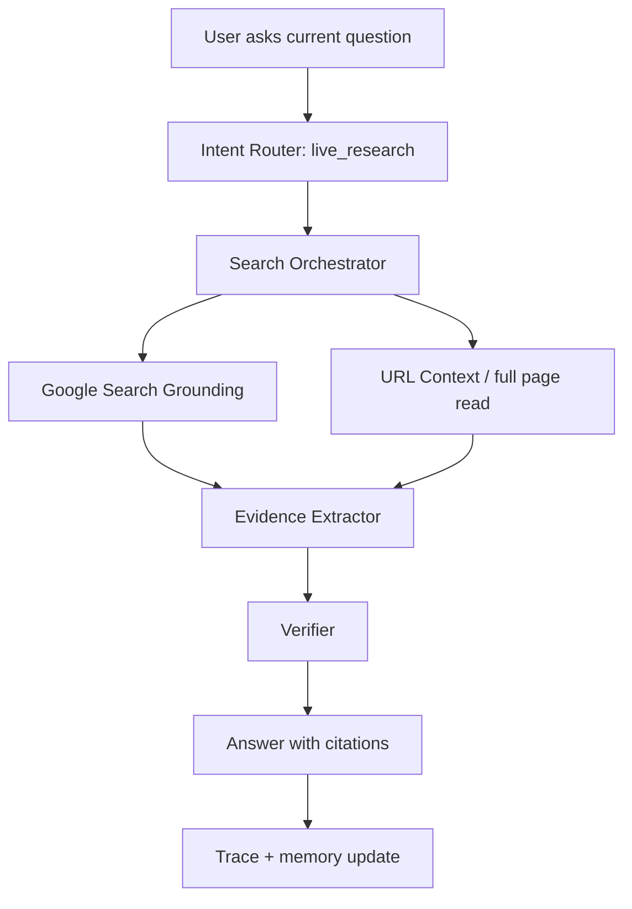
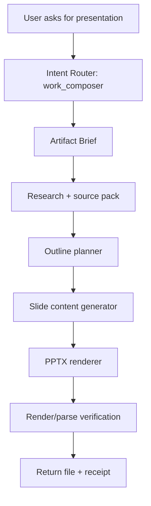

# JARVIS Cortex v2 + Work Composer Architecture

Status: architecture draft for implementation.
Scope: improve the brain/search layer and add a finished-work generation engine.

## Research Basis

Public systems and docs point toward the same pattern:

- OpenAI Agents/Responses split simple tool calls from owned orchestration, state, approvals, and tool execution.
- Claude exposes web search as a tool with citations and explicit error blocks, and its advanced tool-use docs describe deferred tool loading so the model does not carry every tool definition at once.
- Gemini provides Google Search grounding, URL Context, and context caching, which together support discover -> read -> synthesize workflows.
- Perplexity Sonar is a good model for search-native responses with citations and streaming.
- Work artifact generation is best treated as structured planning plus deterministic renderers: PptxGenJS or python-pptx for decks, docx for Word, Playwright/HTML for PDFs.

Important inference: ChatGPT and Claude internals are closed. We cannot copy their private architecture. We can reproduce the public behavior pattern: plan searches, retrieve sources, read full pages, cite evidence, verify claims, then answer.

## Goals

1. Make Jarvis faster for easy chat.
2. Make live research more reliable than one grounded web call.
3. Make Jarvis able to read full pages and documents, not just snippets.
4. Give Jarvis a working-memory pack containing user profile, tools, modules, current failures, and project context.
5. Generate real deliverables: PPTX, DOCX, PDF, study sheets, trading briefs, reports, and emails.
6. Every answer and artifact must carry evidence, sources, and a verification receipt.

## Cortex v2 Architecture

### Layer 1: Intent Router

Input: user message, recent turns, mode, device, active screen metadata.

Routes:

- `instant`: greetings, thanks, local date/time, simple capability answers.
- `chat`: normal conversation without tools.
- `live_research`: current facts, news, scores, prices, online claims.
- `deep_research`: multi-source investigation, comparisons, reports.
- `private_account`: Kalshi, Canvas, Google, local files, browser sessions.
- `computer_control`: screen/browser/app actions.
- `work_composer`: create an artifact.
- `self_knowledge`: Jarvis code/features/modules.

Rule: the router chooses a workflow. The model may help, but deterministic rules override obvious cases.

### Layer 2: Model Cascade

Purpose: reduce latency and confusion.

- Local instant responder: greetings, time/date, known module list.
- Fast Gemini: normal chat, extraction, short synthesis.
- Grounded Gemini/web research: live/current public information.
- Reasoning Gemini: architecture, coding, deep analysis, artifact planning.
- Vision model path: screen, uploaded images, camera frames.

Policy:

- Never use Pro for trivial questions.
- Never answer current info without a live source.
- Never use a private-account tool unless the prompt clearly needs user data.

### Layer 3: Context Packs

Every turn receives a compact context pack:

- Verified date/time/timezone.
- User profile: Devansh, preferences, current projects.
- Available providers and missing providers.
- Tool catalog subset relevant to the route.
- Memory hits.
- Recent failures/corrections.
- Active device/session.
- Active code/module state when relevant.

Use context caching for stable packs:

- Jarvis constitution.
- Tool schemas.
- Module registry.
- User profile.
- Codebase map.
- School/project metadata.

### Layer 4: Search Orchestrator

This replaces one-shot browsing.

Workflow:

1. Understand the question.
2. Generate search plan:
   - exact query
   - expanded query
   - entity aliases
   - date/time constraints
   - trusted source targets
3. Select source:
   - Gemini Google Search grounding for quick live answers
   - URL Context for full-page reading
   - local file search for user docs
   - provider APIs for private data
   - browser/Playwright for pages requiring login
4. Retrieve top sources.
5. Read full source text when needed.
6. Extract claims as structured facts.
7. Cross-check important claims.
8. Synthesize answer with citations.
9. Store trace.

Source tiers:

- Tier A: official docs, provider APIs, user private API data.
- Tier B: reputable news/sports/finance/public databases.
- Tier C: forums, Reddit, YouTube, blogs. Use for ideas, not final truth unless user asks.

### Layer 5: Evidence Objects

Every research result becomes:

```json
{
  "claim": "string",
  "answer": "string",
  "sources": [
    {
      "title": "string",
      "url": "string",
      "publishedAt": "string",
      "retrievedAt": "string",
      "quoteOrSnippet": "string"
    }
  ],
  "confidence": 0.0,
  "freshness": "live|recent|static|stale",
  "verification": ["source read", "date checked", "cross checked"],
  "limits": ["what is not verified"]
}
```

Rule: `web_research` is only valid evidence if it returns sources.

### Layer 6: Learning Loop

Jarvis stores:

- successful workflows
- failed workflows
- user corrections
- missing provider blockers
- latency and tool failure metrics
- prompt/query expansions that worked

Example:

```json
{
  "trigger": "user asks for game or market",
  "lesson": "Use sports/web identity first if Kalshi exact search returns zero. Then retry Kalshi with opponent/date/league.",
  "createdFrom": "Mexico game failure",
  "confidence": 0.9
}
```

## Work Composer Architecture

### Artifact Types

Supported outputs:

- PPTX deck
- DOCX report
- PDF report
- HTML briefing
- Markdown study sheet
- Email draft
- Chart/table pack
- Source bundle with citations

### Work Composer Pipeline

1. Classify artifact request.
2. Ask one clarification only if required:
   - audience
   - length
   - format
   - due date
3. Build artifact brief:
   - goal
   - audience
   - tone
   - required sections
   - sources needed
   - output format
4. Research/gather evidence.
5. Create structured outline.
6. Generate content blocks.
7. Render artifact.
8. Verify artifact:
   - file exists
   - opens/parses
   - page/slide count
   - citations included
   - no placeholder text
   - images/charts render
9. Return file path and summary.

### Composer Modules

#### Presentation Composer

Renderer options:

- Primary Node path: PptxGenJS.
- Python fallback: python-pptx.

Inputs:

```json
{
  "title": "string",
  "audience": "string",
  "slideCount": 8,
  "style": "academic|investor|technical|briefing",
  "sections": [],
  "sources": [],
  "charts": [],
  "images": []
}
```

Verification:

- unzip PPTX and inspect OOXML files
- confirm slide count
- extract text to ensure no placeholders
- optionally render slides to PNG for visual QA

#### Document Composer

Renderer options:

- Node `docx` package for DOCX.
- Existing local document tooling for richer layout when needed.

Verification:

- parse generated DOCX
- confirm headings/body/citations
- check word count
- render to PDF/PNG when layout matters

#### PDF Composer

Renderer:

- HTML/CSS template -> Playwright `page.pdf()`.

Verification:

- render PDF pages
- inspect text layer
- check citations and images

#### Briefing Composer

For fast outputs:

- Markdown + citations
- optional charts
- optional export to PDF/DOCX

### Artifact Store

Artifacts live in:

```text
runtime/artifacts/
  work-composer/
    YYYY-MM-DD/
      artifact-id/
        brief.json
        sources.json
        outline.json
        final.pptx|docx|pdf|md
        verification.json
```

Every artifact has a receipt.

## Data Flow: Live Research Answer



## Data Flow: Create Presentation



## New Backend Components

```text
server/
  cortex/
    cortex-router.js
    model-cascade.js
    context-pack-builder.js
    research-orchestrator.js
    source-ranker.js
    url-reader.js
    evidence-extractor.js
    evidence-verifier.js
    learning-loop.js
  work-composer/
    composer-router.js
    artifact-brief.js
    outline-planner.js
    render-pptx.js
    render-docx.js
    render-pdf.js
    artifact-verifier.js
    artifact-store.js
```

## New Capabilities

- `research_plan`
- `web_research_deep`
- `url_read`
- `source_extract`
- `evidence_verify`
- `compose_artifact`
- `compose_presentation`
- `compose_document`
- `compose_pdf`
- `artifact_status`
- `artifact_open`

## Implementation Phases

### Phase 1: Cortex v2 Search Upgrade

- Add research orchestrator.
- Add URL reader.
- Add evidence objects.
- Add deterministic preflight for live/current info.
- Add source propagation everywhere.
- Add regression tests:
  - top tech news
  - weather
  - most recent sports winner
  - “read this URL”
  - no-source answer must be blocked

### Phase 2: Context Cache + Brain Index

- Build stable context packs.
- Cache user profile/tool catalog/code map.
- Add Jarvis self-index cron/manual refresh.
- Add “what do you know / what can you do” from actual registry.

### Phase 3: Work Composer MVP

- Markdown briefing.
- PDF report through HTML + Playwright.
- PPTX through PptxGenJS.
- DOCX through docx.
- Artifact verification receipts.

### Phase 4: Rich Composer

- charts
- tables
- citations section
- template library
- rendered screenshot/slide QA
- email attachment workflow

### Phase 5: Skill Integration

- Save repeated artifact workflows:
  - “make study guide”
  - “make Kalshi brief”
  - “make project status deck”
  - “make Canvas assignment plan”

## Acceptance Criteria

Cortex v2 is done when:

- Live answers consistently use sources.
- Current-info answers never invent data.
- It can read a URL and extract facts.
- It can explain what sources it used.
- It is faster for instant/simple chat.
- It can recover when the first source path fails.

Work Composer is done when:

- It creates real files.
- Files open and parse.
- No placeholder text remains.
- Citations/sources are included.
- Verification receipts are stored.
- User gets a usable path and concise summary.

