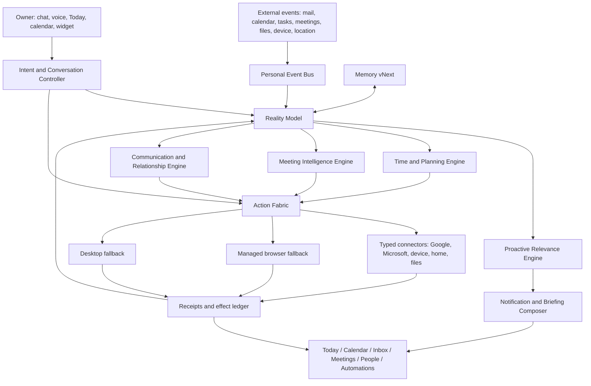
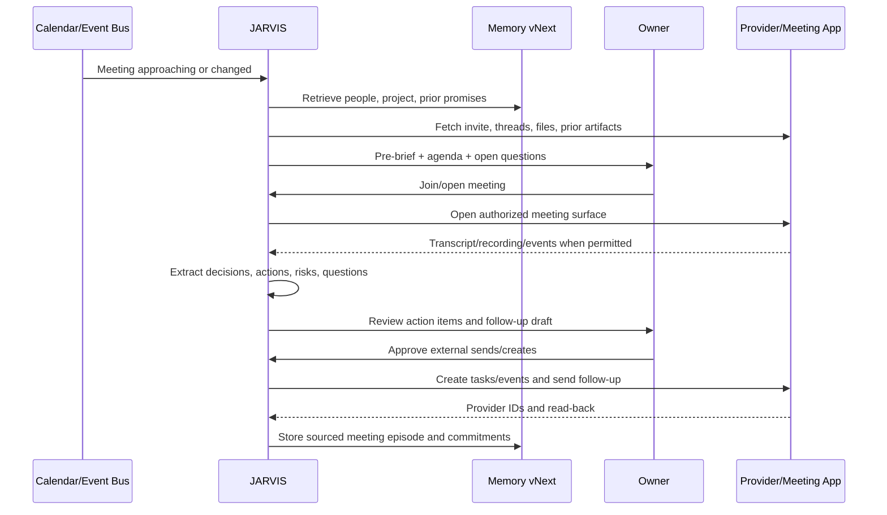
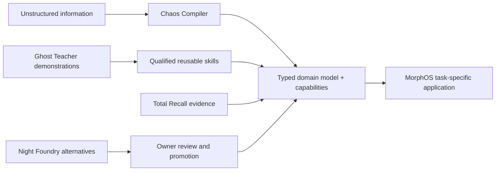

# JARVIS Personal Assistant OS — 90+ Capability Master Blueprint

**Status:** research and implementation specification; no code changes made by this document  
**Date:** 2026-08-03  
**Scope:** the main JARVIS assistant: time, commitments, communications, meetings, personal context, proactive intelligence, routines, life administration, device continuity and trustworthy execution  
**Target:** move JARVIS from a reactive chat-and-tools product to a dependable personal-assistant operating system

---

## 1. Executive verdict

JARVIS is not currently a complete personal assistant. It has a promising action kernel, browser/desktop primitives, Gmail draft/send code, notifications, Memory vNext infrastructure and a small proactive service. Those are components of an assistant, not the assistant product itself.

The live system inspection on 2026-08-03 showed:

- Action Fabric was running in **canary**, not authoritative production mode.
- It contained **50 historical tasks, zero automations, zero procedures and zero registered surfaces**.
- The release inventory still found **125 legacy action calls across 13 files**, so the new action authority was not cut over.
- The Google Workspace provider was **not configured or connected**.
- Its requested Google scopes covered only identity plus `gmail.compose` and `gmail.send`; there were no Calendar, Tasks, Contacts, Drive or Meet scopes.
- The action driver exposed only `gmail.draft` for Google Workspace.
- The generic Scheduler can persist time-based occurrences, but a scheduled occurrence creates a task record; it does not itself plan and execute a complete personal-assistant workflow.
- The proactive engine writes a JSON file and sends a fixed 8:00 AM push. It does not ingest Calendar, Gmail, Tasks, weather, travel, meetings or live priority changes.
- The current brief incorrectly classified assistant text and questionable prior answers as user “open loops.” This is an extraction-quality and provenance failure, not merely an empty state.
- There is no real Today surface, personal calendar, task manager, meeting lifecycle, people/relationship assistant, schedule editor, inbox command center or proactive notification center.

### Current honest score

| Area | Current score | Why |
|---|---:|---|
| Conversation and general reasoning | 22/100 | A model can answer, but response quality and tool grounding remain uneven. |
| Memory infrastructure | 38/100 | Strong new contracts exist, but authority/cutover and live populated domains remain incomplete. |
| Calendar and time management | 4/100 | A generic interval scheduler exists; no real calendar product or calendar provider. |
| Tasks and commitments | 12/100 | Action tasks exist, but not a human task/commitment system with recurrence, priorities and planning. |
| Email assistance | 24/100 connected-code potential; 0/100 live | Gmail draft/send logic exists, but the provider is disconnected and read/triage is absent. |
| Meetings | 2/100 | No coherent prepare → join → capture → decisions → follow-up loop. |
| Proactivity | 8/100 | Timer and stub briefing exist; relevance, source fusion and actionability do not. |
| Personal/life assistance | 5/100 | Weather and device primitives exist, but no unified life-management layer. |
| Trustworthy action operations | 43/100 foundation; lower live coverage | Approvals, receipts and task states are thoughtful; cutover and connector execution are incomplete. |
| User-facing assistant workspace | 7/100 | Runtime telemetry is not a personal-assistant experience. |
| **Overall personal-assistant maturity** | **11/100** | Better foundations than the visible product suggests, but the essential assistant loops are missing. |

The correct goal is not “add a calendar widget.” The goal is to build a **Personal Assistant OS** in which time, tasks, people, messages, meetings, files, places, goals and routines share one event-driven reality model and one trustworthy action fabric.

---

## 2. What the market establishes as baseline

No single product delivers the entire JARVIS vision. The best reference is a synthesis:

- **Gemini:** the broadest consumer personal-data surface—Gmail, Calendar, Drive, Tasks, Keep, Contacts, Photos, Search, Maps, Flights, Hotels, YouTube, Android utilities and Google Home—plus Daily Brief and scheduled actions.
- **Microsoft 365 Copilot Cowork:** the strongest visible work-execution loop—email, calendar, meetings, files, artifacts, scheduled work, approvals, pause/resume/cancel and clear task states.
- **Motion/Reclaim:** the strongest adaptive calendar optimization and constraint-based time protection.
- **Granola/Otter/Fireflies/Notion:** the clearest full meeting lifecycle and searchable meeting memory.
- **Alexa+:** the strongest consumer-life, household, routine, reservation and ambient-assistant direction.
- **ChatGPT/Claude:** strong flexible reasoning and research, but not complete personal time-and-commitment operating systems.
- **Home Assistant:** the strongest open, event-driven home/device integration model.
- **Temporal-style durable execution:** the reliability pattern required for workflows that wait hours, days or weeks and must survive restarts.

Therefore the minimum credible 2026 assistant already includes:

1. calendar read/write and conflict handling;
2. tasks, due dates, recurrence and reminders;
3. morning and event-driven briefings;
4. email retrieval, triage, drafting and follow-up;
5. meeting scheduling, preparation, joining, notes, decisions and follow-through;
6. contact/relationship disambiguation;
7. scheduled and event-triggered automations;
8. cross-device notifications and voice;
9. durable task states, approvals, receipts, recovery and audit history;
10. inspectable, correctable personal memory.

Without those, JARVIS is a chat interface with tools—not a personal assistant.

---

## 3. North-star behavior

JARVIS should continuously maintain a private, structured model of:

- **what is happening now;**
- **what the owner has promised;**
- **what other people are waiting for;**
- **what the owner is waiting for;**
- **what is scheduled;**
- **what is at risk;**
- **which information changed;**
- **which action is permitted;**
- **when interruption is worth its cost;**
- **what evidence proves completion.**

The owner should be able to say:

> “Handle my day.”

and receive a plan grounded in actual calendar events, tasks, email commitments, university deadlines, meeting preparation, travel buffers, personal routines and current priorities—not a generic motivational list.

The owner should also be able to say:

> “Set up a 30-minute meeting with Raghav next week about the APEX scanner, include the latest scanner document, avoid mornings, give me 20 minutes to prepare, and remind me if he has not replied in two days.”

JARVIS should resolve the person, inspect both calendars where permitted, propose slots, attach the correct artifact, create a draft invite, create a preparation block, establish a no-response follow-up timer, request one explicit approval for the externally visible package, execute idempotently and show proof.

---

## 4. Product principles

### 4.1 One reality, not disconnected widgets

Calendar, tasks, inbox, meetings, people, files, routines and Memory vNext must use shared canonical entities. A meeting action item cannot exist only inside a transcript panel; it must become a commitment linked to the meeting, person, project, source quote, deadline and calendar allocation.

### 4.2 Deterministic time; probabilistic interpretation

An LLM may interpret “next Friday after lunch,” infer a likely duration or summarize a changed inbox. It must not be responsible for clock wakeups, recurrence expansion, timezone conversion, idempotency, missed-run recovery or calendar collision math. Those are deterministic services.

### 4.3 API first, browser second, visual desktop last

For Google Calendar, Gmail, Tasks, Drive, Contacts and Meet, use provider APIs. Browser automation is appropriate only when no supported API exists. Desktop vision is the fallback of last resort.

### 4.4 Draft, stage, commit, verify

Every consequential action follows:

`understand → resolve entities → preview → approve if required → commit once → read back → record receipt → deliver result`

### 4.5 Proactivity must earn the interruption

The assistant must optimize for usefulness after interruption cost, not notification count. Low-importance changes are digested. High-impact, time-sensitive changes escalate. Repeated or unchanged facts are suppressed.

### 4.6 Personal memory is evidence, not mythology

Preferences, relationships and commitments require source, confidence, temporal validity and correction. An assistant utterance must never become a fact about the owner merely because it appeared in conversation history.

### 4.7 The system must remain useful when Gemini is unavailable

Existing reminders, calendar alarms, recurrence, synchronization, rule evaluation, notification delivery and approved deterministic routines must continue with zero model calls.

---

## 5. Target architecture: Personal Assistant OS



### 5.1 Plane A — Personal Event Bus

The event bus is the nervous system. It accepts normalized events such as:

- `calendar.event.created|updated|cancelled|starting|ended`;
- `mail.received|thread.updated|reply.overdue`;
- `task.created|due_soon|overdue|completed`;
- `commitment.detected|confirmed|at_risk|fulfilled`;
- `meeting.upcoming|started|ended|transcript.ready`;
- `file.created|changed|shared`;
- `person.contact_changed|birthday_approaching|followup_due`;
- `travel.flight_changed|leave_by_changed`;
- `device.online|battery_low|location.arrived|focus.changed`;
- `automation.due|missed|failed|recovered`.

Each event requires an event ID, source, source object ID, observed time, effective time, owner scope, sensitivity, payload schema version and deduplication key.

### 5.2 Plane B — Personal Reality Model

This is the operational digital twin of the owner’s life. It is not a replacement for Memory vNext; it is the current structured state that Memory vNext can enrich and remember.

Canonical object types:

- `Person`, `Relationship`, `Organization`, `Account`;
- `Calendar`, `Event`, `AvailabilityWindow`, `TimeBlock`;
- `Task`, `Commitment`, `Goal`, `Routine`, `Habit`;
- `Message`, `Thread`, `CommunicationObligation`;
- `Meeting`, `AgendaItem`, `Decision`, `ActionItem`, `Question`;
- `Project`, `File`, `Artifact`, `SourceReference`;
- `Place`, `Trip`, `Reservation`, `JourneyLeg`;
- `Notification`, `BriefingItem`, `Automation`, `Occurrence`;
- `Preference`, `Constraint`, `Policy`, `PermissionGrant`.

All cross-links are first-class. Example:

```text
Commitment C-204
  actor: owner
  beneficiary: Raghav Mittal
  action: send APEX scanner revision
  source: Meeting M-88 transcript entry 112
  due: 2026-08-07 17:00 Asia/Kolkata
  project: APEX
  artifact requirement: scanner report
  task: T-938
  scheduled block: E-610
  state: at_risk
  confidence: 0.94
```

### 5.3 Plane C — Temporal and Recurrence Engine

Required semantics:

- RFC 5545-compatible recurrence representation;
- explicit IANA timezone on every schedule;
- daylight-saving and travel-timezone behavior;
- one-time, fixed recurrence and completion-relative recurrence;
- event-relative triggers;
- calendar/filter/webhook triggers;
- overlap policy: skip, buffer one, buffer all, replace or allow;
- catch-up window after downtime;
- misfire policy: run late, skip, ask or summarize;
- retry and pause-on-failure;
- occurrence idempotency;
- preview of future occurrences;
- backfill for audits, not accidental external effects.

The existing `everyMs` scheduler is insufficient because it cannot express “the last working day,” “90 minutes before a meeting,” “when an email from X arrives,” exceptions, DST, catch-up policy or safe execution ownership.

### 5.4 Plane D — Constraint-Based Calendar Optimizer

Use a constraint solver for actual placement. The LLM converts natural language and memories into structured preferences; the solver handles feasibility.

Hard constraints:

- fixed events and non-movable commitments;
- deadlines and minimum duration;
- working/personal hours;
- attendee availability;
- locations and travel time;
- dependency order;
- sleep, class and immutable routine boundaries;
- account/calendar privacy rules.

Soft constraints:

- preferred time of day;
- energy profile;
- context switching penalty;
- meeting clustering;
- focus block continuity;
- buffer preference;
- task priority and lateness cost;
- workload fairness across days;
- relationship importance;
- predicted duration uncertainty.

The optimizer should return the chosen plan, alternatives, violated soft constraints, slack before deadlines and an explanation in normal language.

### 5.5 Plane E — Proactive Relevance Engine

For each candidate intervention compute:

```text
utility = consequence × urgency × relevance × actionability × confidence
          − interruption_cost − repetition_penalty − uncertainty_penalty
```

Policy outputs:

- ignore;
- remember silently;
- add to next digest;
- show passive card;
- notify;
- interrupt conversationally;
- prepare an action for approval;
- execute an already authorized deterministic rule.

The engine must use change detection. “Meeting still at 3 PM” is not a new insight. “Meeting moved to 2 PM and now conflicts with class” is.

### 5.6 Plane F — Action Fabric

Preserve and finish the existing strengths:

- typed capabilities;
- consequence levels;
- explicit approvals;
- idempotency keys;
- effect intents and reconciliation;
- task states;
- receipts and evidence;
- pause/resume/cancel/emergency stop;
- managed browser and desktop fallback.

Add the missing bridge from scheduled occurrence to actual plan execution. A task record without a worker owning its next step is not an automation.

### 5.7 Plane G — Memory vNext integration

Memory vNext remains the only long-term memory authority. The assistant OS uses it through contracts:

- `profile`: stable owner facts;
- `preference`: scheduling, communication and briefing preferences;
- `entity`: people, projects, places and organizations;
- `relationship`: owner↔person/project connections;
- `episodic`: relevant interactions and outcomes;
- `procedural`: qualified routines and successful workflows;
- `commitment`: promises, dependencies and status;
- `artifact`: files and outputs with lineage;
- `working`: current conversational and task state.

Write rules:

1. User statements can be candidate facts; assistant outputs cannot become owner facts without corroboration.
2. Every memory has source, observed time, confidence and sensitivity.
3. Corrections supersede prior facts without deleting history.
4. A preference learned from behavior requires repeated evidence or explicit confirmation.
5. Retrieval is query- and task-shaped; do not dump an entire profile into every prompt.
6. People and commitments use graph traversal, not flat similarity search alone.
7. Briefing feedback updates relevance models, not permanent owner identity claims.

### 5.8 Plane H — Assistant workspace

The product needs dedicated surfaces, not only chat and Runtime:

- Today;
- Calendar;
- Tasks and commitments;
- Inbox;
- Meetings;
- People;
- Briefing;
- Automations;
- Notifications;
- Connected accounts and permissions;
- Memory inspection/correction.

Runtime remains the action debugger and live task viewer. It must not carry the entire personal-assistant product.

---

## 6. The complete daily operating loop

### 6.1 Nightly preparation

1. Incrementally sync changed calendar events, tasks, messages, files and meeting artifacts.
2. Reconcile deleted/moved objects using provider sync tokens.
3. Expand only the necessary recurrence horizon.
4. Resolve new messages into people, projects and threads.
5. Extract candidate commitments with source spans.
6. Deduplicate against existing commitments.
7. Compute tomorrow’s fixed schedule, travel needs and available capacity.
8. Run the calendar optimizer for movable work.
9. Detect infeasibility, missing preparation and important unanswered communications.
10. Precompute briefing facts and source links without generating prose yet.

### 6.2 Morning briefing

The briefing should contain four adaptive sections:

1. **Top of mind:** the few items requiring action today.
2. **Your day:** calendar, locations, travel, preparation and protected work.
3. **Waiting and at risk:** unanswered items, threatened deadlines and conflicts.
4. **Looking ahead:** goal-aligned steps and upcoming risk over the next 7–30 days.

Every card includes:

- why it appeared;
- source(s);
- confidence;
- the consequence of ignoring it;
- one or two useful actions;
- `Done`, `Later`, `Dismiss`, `Wrong`, and `Why?` feedback.

### 6.3 Continuous adaptation

- Calendar changes trigger conflict analysis.
- Important email triggers task/commitment detection.
- A delayed meeting shifts travel and preparation blocks.
- Completing work early creates an opportunity suggestion, not noisy rescheduling.
- Missing a task triggers recovery according to importance and preference.
- When the user enters focus or a meeting, low-priority notifications are deferred.

### 6.4 Evening shutdown

1. Compare planned versus completed work.
2. Capture unfinished tasks without shaming language.
3. Ask only the minimum questions required to replan ambiguity.
4. Surface promises made today.
5. Propose tomorrow’s protected priorities.
6. Record a small, sourced episodic summary in Memory vNext.

### 6.5 Weekly review

- completed outcomes, not activity vanity metrics;
- commitments kept/missed;
- waiting-on-others ledger;
- time allocation by goal/project/life area;
- meeting load and focus fragmentation;
- repeatedly deferred work;
- relationship follow-ups if enabled;
- routines working or failing;
- suggested policy changes with simulation before activation.

---

## 7. End-to-end meeting lifecycle



### Before

- identify attendees and roles;
- show last interaction and relationship context;
- list prior promises in both directions;
- retrieve relevant files, threads and earlier meeting notes;
- create a short pre-read;
- propose agenda and questions;
- warn about missing context or conflicts;
- prepare a one-click Join/Open action.

### During

- explicit recording/transcription consent state;
- live transcript when the provider permits;
- bot-based or botless capture modes;
- decision markers;
- action-item capture with owner and deadline;
- “what did I miss?” recap;
- slide/screen capture only at meaningful transitions;
- private scratch notes separated from shared notes.

### After

- decisions with rationale and rejected alternatives;
- actions with owners and deadlines;
- open questions and risks;
- draft follow-up in the owner’s communication style;
- task/project/calendar updates;
- searchable meeting memory;
- recurring-theme and promise analysis;
- provenance to transcript spans and source files.

---

## 8. Google-first provider design

JARVIS already has a Google OAuth provider, but it is Gmail-compose/send only and presently disconnected. Extend the existing provider rather than inventing separate credentials for every Google feature.

### 8.1 Scope bundles

Request scopes progressively, by feature, with clear owner-facing explanations:

| Bundle | Minimum scopes | Purpose |
|---|---|---|
| Identity | `openid`, `email` | account identity |
| Mail read | `gmail.readonly` or narrower metadata/modify choice | retrieval, triage and thread grounding |
| Mail draft/send | `gmail.compose`, `gmail.send` | existing draft/send path |
| Calendar read | `calendar.events.readonly`, `calendar.calendarlist.readonly` | agenda and conflict detection |
| Calendar write | `calendar.events` | create/update/cancel events and Meet links |
| Availability only | `calendar.events.freebusy` | privacy-preserving scheduling |
| Tasks | Google Tasks read/write scope | task lists and tasks |
| Contacts | `contacts.readonly` initially | person resolution and birthdays |
| Drive | `drive.metadata.readonly` plus file-specific access where possible | artifact search and meeting attachments |
| Meet | narrow Meet artifact/read scopes | conference records, participants, transcripts and recordings |

Do not request a single maximum-power scope when a narrower bundle is sufficient. The capability registry must know which account and scope authorizes each action.

### 8.2 Calendar connector

Required operations:

- list calendars and settings;
- incremental event sync using sync tokens;
- event watch/push subscription with renewal;
- free/busy query;
- create/update/patch/delete event;
- recurring series and single-instance edits;
- attendee response handling;
- reminders and attachments;
- Google Meet conference creation;
- provider read-back after every write;
- event etag/version conflict handling.

### 8.3 Gmail connector

Extend beyond send:

- incremental mailbox sync using history IDs;
- watch renewal and dropped-notification recovery;
- thread/message metadata and body retrieval;
- attachment metadata and scoped downloads;
- labels, archive, mark read/unread and star actions;
- draft, verify, send and reconcile;
- no-reply follow-up timers linked to sent thread IDs;
- structured extraction with source spans;
- prompt-injection isolation for message content.

### 8.4 Tasks connector

- list task lists;
- create, read, update, move, complete and delete tasks;
- preserve provider ID and local canonical ID;
- detect provider limitations separately from JARVIS’s richer local task model;
- sync tasks into the unified timeline without confusing tasks and busy calendar events.

### 8.5 People connector

- search contacts and other contacts;
- normalize names, emails, phones, birthdays, organizations and aliases;
- never merge people solely by fuzzy name;
- present candidate cards when identity confidence is insufficient;
- maintain local relationship context in Memory vNext, not by overwriting provider contacts silently.

### 8.6 Meet connector

- create and retrieve meeting spaces;
- map Calendar events to conference records;
- subscribe to conference/transcript events;
- retrieve participants, transcript entries, recordings and Drive destinations;
- respect retention and availability windows;
- create derived summaries/actions only with source provenance.

---

## 9. Cost and latency model

The system can be highly capable without making every clock tick a Gemini request.

### Zero-model-call operations

- firing an existing reminder;
- expanding recurrence;
- timezone conversion;
- provider sync-token polling;
- webhook ingestion;
- deduplication;
- idempotency and retries;
- exact rule matching;
- calendar overlap checks;
- notification cooldown/bundling;
- rendering existing structured data;
- executing an already approved deterministic routine.

### Local/small-model operations

- message urgency classification;
- rough project/entity routing;
- duplicate detection;
- simple commitment candidate detection;
- notification relevance prefilter;
- OCR/ASR where local quality is sufficient.

### Gemini Flash-class operations

- ambiguous date/intent parsing;
- concise summaries of changed content;
- personalized briefing wording;
- email classification when rules are insufficient;
- meeting action extraction;
- tool routing for normal tasks.

### Gemini Pro/deep-reasoning operations

- complex multi-party scheduling trade-offs;
- long-horizon travel/project planning;
- research briefs;
- contradictory evidence resolution;
- cross-domain weekly review;
- complex multi-step agent plans.

### Latency targets

| Interaction | Target |
|---|---:|
| Open Today/Calendar from cache | under 150 ms perceived |
| Create simple reminder after parse | under 800 ms |
| Deterministic reminder firing | under 2 s from due time |
| Calendar read/update through API | p95 under 2.5 s excluding provider outage |
| Morning brief from precomputed facts | first useful card under 1 s; prose can stream |
| Email triage delta | under 30 s after event receipt for normal mail |
| Meeting pre-brief | ready 10–20 minutes before meeting |
| Consequential action approval → commit | immediate queueing; proof normally under 5 s |

---

## 10. Trust, privacy and failure semantics

### Consequence classes

| Class | Examples | Default behavior |
|---|---|---|
| Read | inspect calendar, summarize mail | run if connected and in scope |
| Prepare | draft email, propose event | run and show preview |
| Reversible write | add private task, move personal block | allow according to owner policy; show undo |
| External communication | send email, invite attendee, message person | explicit approval unless a narrow trusted rule exists |
| Financial/legal/irreversible | purchase, submit form, cancel booking | explicit contextual approval and strong verification |

### Required failure states

- `waiting_for_owner`;
- `waiting_for_approval`;
- `waiting_for_auth`;
- `waiting_for_provider`;
- `retrying`;
- `partially_completed`;
- `blocked_by_ambiguity`;
- `failed_uncommitted`;
- `effect_unknown_reconciling`;
- `completed_verified`.

“Done” is forbidden unless provider read-back or equivalent causal evidence proves the intended state.

### Memory/privacy controls

- per-domain connect/disconnect;
- per-scope explanation and revocation;
- private event visibility rules;
- sensitive-memory categories;
- temporary/private chat mode;
- source inspection and correction;
- retention by object type;
- delete local derivative when source is deleted, subject to audit policy;
- never expose raw chain of thought; expose decisions, evidence and concise reasoning summaries.

---

## 11. Capability catalog — 258 concrete features

Legend:

- **P0:** required before JARVIS can credibly be called a personal assistant.
- **P1:** strong executive-assistant capability.
- **P2:** broad personal/life-assistant capability.
- **P3:** differentiating or research-grade.

### 11.1 Time and calendar

1. **P0 — Natural-language event creation:** parse title, date, local time, timezone, duration, location, attendees, recurrence and reminders into a reviewable event draft.
2. **P0 — Natural-language event update:** resolve the correct event/instance before changing it.
3. **P0 — Safe cancellation:** distinguish delete, cancel-and-notify and decline invitation.
4. **P0 — Unified calendar:** overlay Google, Microsoft, CalDAV and optional local/private JARVIS calendars.
5. **P0 — Calendar source labels:** always expose which account owns an event.
6. **P0 — Correct timezones/DST:** store instant plus IANA timezone and preserve intended wall-clock semantics.
7. **P0 — Recurring events:** support RFC-style recurrence, exceptions and this-instance/series edits.
8. **P0 — Multi-calendar conflicts:** consider all selected calendars before commit.
9. **P0 — Free/busy scheduling:** retrieve availability without exposing private event titles unnecessarily.
10. **P0 — Event reminders:** multiple relative and absolute reminders.
11. **P0 — Preparation blocks:** automatically reserve prep time according to meeting type and preference.
12. **P0 — Travel buffers:** calculate before/after travel from places and live conditions when available.
13. **P0 — Decompression buffers:** protect user-defined recovery time after selected events.
14. **P0 — Hard versus movable blocks:** never let optimization move an immutable commitment.
15. **P0 — Tentative holds:** create expiring holds while scheduling is negotiated.
16. **P0 — Invite response:** accept, decline or tentatively accept with reason/draft response.
17. **P0 — Meeting link validation:** surface missing, malformed or expired joining details.
18. **P0 — Attachments and agenda:** link files and structured agenda to the event.
19. **P0 — Duplicate detection:** catch duplicate invites, mirrored calendars and repeated task-event sync.
20. **P1 — Three best options:** rank meeting times with constraint explanations.
21. **P1 — Preferred hours by context:** person/project-specific meeting and work preferences.
22. **P1 — Focus-time protection:** defend deep-work blocks and expose displacement cost.
23. **P1 — No-meeting days:** apply owner rules and controlled exceptions.
24. **P1 — Meeting clustering:** reduce fragmentation without creating exhausting clusters.
25. **P1 — Deadline reverse planning:** allocate milestones backward from a real deadline.
26. **P1 — Cascade rescheduling:** recompute downstream blocks after a delay/change.
27. **P1 — Missed-event recovery:** ask, reschedule or close according to event type.
28. **P1 — Energy-aware placement:** match high/low cognition tasks to learned preferred windows.
29. **P1 — Duration learning:** learn estimates only from verified start/finish evidence and keep uncertainty.
30. **P1 — Short-window planning:** answer “what can I finish in 25 minutes?” from duration, context and priority.
31. **P1 — Context batching:** group errands, calls, messages or research to reduce switching.
32. **P1 — End-of-day carryover:** propose, never silently hide or discard unfinished work.
33. **P1 — Weekly capacity forecast:** show committed, movable and unallocated time.
34. **P1 — Overcommit warning:** warn before accepting work that makes the horizon infeasible.
35. **P2 — Travel timezone transition:** alter briefing and routine delivery correctly during travel.
36. **P2 — Calendar health:** detect overload, fragmentation, impossible travel and insufficient recovery.

### 11.2 Tasks, commitments, reminders and goals

37. **P0 — Native task object:** title, notes, state, due date, deadline, duration, priority, energy, location and source.
38. **P0 — Task lists/projects:** separate capture, projects, areas and contexts without losing global retrieval.
39. **P0 — Subtasks:** parent-child progress with independent due dates.
40. **P0 — Dependencies:** blocked-by and blocks relationships.
41. **P0 — One-off reminders:** natural-language creation and edit.
42. **P0 — Recurring reminders:** calendar-based and completion-relative recurrence.
43. **P0 — Event-relative reminders:** e.g. “90 minutes before the interview.”
44. **P0 — Snooze:** retain original source and urgency while rescheduling delivery.
45. **P0 — Complete/dismiss/reschedule:** distinct semantics with audit history.
46. **P0 — Email-to-task:** preserve thread/message source.
47. **P0 — Meeting-to-task:** preserve transcript span, meeting and assigned owner.
48. **P0 — Conversation-to-task:** confirm ambiguous due dates or ownership.
49. **P0 — Commitment ledger:** explicit promise, actor, beneficiary, deadline, evidence and state.
50. **P0 — Waiting-on-me:** obligations requiring owner action.
51. **P0 — Waiting-on-them:** delegated work and expected replies.
52. **P0 — Due-soon/overdue state:** calculate deterministically.
53. **P0 — Overdue recovery:** replan based on consequence rather than repeatedly nagging.
54. **P0 — Task-to-calendar timeboxing:** create movable work blocks linked to the task.
55. **P0 — Calendar-to-task conversion:** retain event link and attendee/project context.
56. **P0 — Daily plan:** selected realistic outcomes, not an unbounded backlog.
57. **P0 — Weekly plan:** capacity-aware selection and risk flags.
58. **P1 — Goal-to-project decomposition:** reviewable milestones and success criteria.
59. **P1 — Dynamic replanning:** adapt when actual day diverges.
60. **P1 — Habit windows:** flexible schedule windows rather than rigid alarms only.
61. **P1 — Routine recovery:** handle missed days without breaking recurrence.
62. **P1 — Stalled-project detection:** based on expected next action and real inactivity.
63. **P1 — Suggested next action:** account for goals, urgency, energy, location, tools and available time.
64. **P1 — Focus launcher:** opens relevant context, silences low priority and starts timing.
65. **P1 — Task context bundle:** relevant files, people, messages, decisions and latest state.
66. **P1 — Completion verification:** provider/file/state evidence where possible.
67. **P1 — Deferral analysis:** find recurring cause after repeated delay; do not merely raise priority.
68. **P1 — Milestone forecast:** optimistic/likely/pessimistic dates from remaining work uncertainty.
69. **P1 — Minimum viable day:** protect essential work during overload or disruption.
70. **P1 — Catch-up plan:** rebuild after travel, illness or absence.
71. **P1 — Personal service rules:** e.g. “reply to professors within two days.”
72. **P1 — Priority explanation:** show binding reasons and owner-editable inputs.
73. **P2 — Location reminder:** arrive/leave zone trigger where device support exists.
74. **P2 — Person-relative reminder:** “next time I speak to AJ, ask about feedback.”
75. **P3 — Latent commitment candidate:** find implicit obligations but require confirmation when uncertain.

### 11.3 Briefings and proactivity

76. **P0 — Morning briefing:** live Calendar, Tasks, Gmail priorities, weather and commitments.
77. **P0 — Top of mind:** small set of high-utility actionable items.
78. **P0 — Your day timeline:** events, tasks, travel, buffers and prep.
79. **P0 — Waiting/at risk:** unanswered, blocked, overdue or infeasible items.
80. **P0 — Looking ahead:** 7–30 day goal and risk horizon.
81. **P0 — Source citations:** deep-link every claim to event, message, file, task or memory evidence.
82. **P0 — Why this appeared:** explain urgency, change and relevance.
83. **P0 — Feedback controls:** done, later, dismiss, wrong, useful and why.
84. **P0 — Delta briefing:** show only material change since last view.
85. **P0 — Deduplication:** merge the same fact from multiple sources.
86. **P0 — Quiet hours:** suppress or defer according to urgency.
87. **P0 — Multi-channel delivery:** JARVIS UI, desktop, phone, voice and optional email digest.
88. **P0 — Notification center:** one queue with state, actions, source and history.
89. **P0 — Scheduled briefing editor:** exact next run, timezone, channels and pause/edit/delete.
90. **P1 — Midday replanning check:** only when the plan materially diverges.
91. **P1 — Evening shutdown:** completed, carried, waiting and tomorrow preparation.
92. **P1 — Weekly review:** goals, commitments, focus, overload, relationships and routines.
93. **P1 — Commute briefing:** route, leave-by, first appointment and useful audio-safe actions.
94. **P1 — Travel-day briefing:** transport changes, documents, weather, reservations and buffers.
95. **P1 — Countdown briefing:** exams, interviews, applications or major events.
96. **P1 — Exception-only mode:** no daily prose when nothing important changed.
97. **P1 — Selectable depth:** glance, normal and detailed.
98. **P1 — Actionable cards:** open, reply, block time, reschedule, snooze or correct.
99. **P1 — Notify-on-material-change:** suppress stable monitored facts.
100. **P1 — Escalation ladder:** passive → digest → push → repeated critical escalation according to policy.
101. **P1 — Cooldowns:** per topic/person/event notification rate limits.
102. **P1 — Attention awareness:** meeting, presentation, focus, driving, sleep and device state.
103. **P1 — Proactivity domains:** independent owner controls for work, personal, health, finance, relationship and home.
104. **P1 — Goal-aware suggestions:** connect opportunity to an explicit goal.
105. **P1 — Schedule infeasibility warning:** days before failure, not after.
106. **P1 — Forgotten follow-up detection:** use communication/commitment state.
107. **P1 — Critical unanswered email detection:** combine sender, deadline, semantics and project context.
108. **P1 — Repeated overload detection:** propose policy changes, not motivational language.
109. **P1 — Routine suggestion:** propose from repeated behavior and request activation approval.
110. **P1 — Feedback learning:** update relevance calibration from user actions.
111. **P3 — Contextual silence receipt:** optionally show that JARVIS considered and intentionally suppressed low-value events.

### 11.4 Email and communications secretary

112. **P0 — Unified inbox projection:** messages normalized across connected providers without copying credential authority.
113. **P0 — Incremental Gmail synchronization:** history IDs, watch renewal and recovery polling.
114. **P0 — Intent-based priority:** action required, decision, deadline, FYI, automated, newsletter and spam-like categories.
115. **P0 — VIP/project rules:** relationship and project-aware prioritization.
116. **P0 — Thread summaries:** cite source messages and dates.
117. **P0 — Why it matters:** explain deadline, commitment or relationship relevance.
118. **P0 — Draft reply:** use current thread facts and style preference.
119. **P0 — Draft-only mode:** safe default for new communication classes.
120. **P0 — Exact send preview:** recipients, cc/bcc, subject, body and attachments.
121. **P0 — Attachment-aware drafting:** inspect and name actual attachments.
122. **P0 — Missing attachment warning:** detect “attached” with no file.
123. **P0 — Recipient disambiguation:** resolve person and account before send.
124. **P0 — Send approval:** bind approval to final immutable payload hash.
125. **P0 — Send verification:** read back sent object/thread ID.
126. **P0 — Follow-up-if-no-reply:** durable timer linked to thread state.
127. **P0 — Waiting classification:** waiting on owner versus counterpart.
128. **P0 — Commitment extraction:** source spans and confidence.
129. **P0 — Deadline extraction:** preserve stated timezone/uncertainty.
130. **P0 — Email-to-calendar:** draft event from reservation/invite/message.
131. **P0 — Email-to-task:** create reviewable task with source.
132. **P0 — Archive/read/star/label:** typed reversible operations.
133. **P1 — Learned writing style:** per relationship/context, owner correctable.
134. **P1 — Scheduled send:** suggest based on timezone and preference.
135. **P1 — Meeting negotiation:** propose times, track replies and update holds.
136. **P1 — Communication channel preference:** per person and subject.
137. **P1 — Sensitive-data warning:** catch unintended secrets/personal data before send.
138. **P1 — Misaddressed-recipient warning:** compare content, thread and recipient history.
139. **P1 — Translation with tone preservation:** show original and translated preview.
140. **P1 — Voice-dictated reply:** transcript, edit and explicit send boundary.
141. **P1 — Newsletter/low-priority digest:** batch summaries with unsubscribe/source controls.
142. **P1 — Auto-reply rules:** narrow, deterministic and auditable; no broad autonomous sending by default.
143. **P1 — Channel handoff:** start on phone, continue on desktop with same draft/task.

### 11.5 Meeting chief of staff

144. **P0 — Upcoming meeting detection:** from all connected calendars.
145. **P0 — One-click join/open:** choose exact conference URL/application and intended screen placement.
146. **P0 — Join reminder:** target active device with snooze/open controls.
147. **P0 — Attendee resolution:** people, roles, organizations and relationship context.
148. **P0 — Prior interaction summary:** last relevant meetings/messages and commitments.
149. **P0 — Relevant file retrieval:** latest verified artifacts, not filename-only guessing.
150. **P0 — Relevant thread retrieval:** scope by people/project/time.
151. **P0 — Pre-meeting brief:** purpose, people, context, agenda, open items and sources.
152. **P0 — Suggested agenda:** editable and linkable to event.
153. **P0 — Questions to ask:** tied to unresolved decisions/risks.
154. **P0 — Consent state:** visible, explicit recording/transcription policy.
155. **P0 — Transcript ingestion:** provider API or permitted local/bot capture.
156. **P0 — Speaker labeling:** confidence and correction support.
157. **P0 — Post-meeting summary:** concise outcomes and unresolved issues.
158. **P0 — Decision register:** decision, rationale, alternatives and source spans.
159. **P0 — Action items:** owner, due date, source and confirmation state.
160. **P0 — Open questions:** preserve unresolved issues.
161. **P0 — Draft follow-up:** recipients and exact action list.
162. **P0 — Task/calendar routing:** review before uncertain assignments are committed.
163. **P0 — Search across meetings:** people/project/topic/time filters.
164. **P1 — Device readiness:** network, camera, microphone and required application checks.
165. **P1 — Policy-controlled auto-join:** only for qualified meeting classes.
166. **P1 — Botless local capture:** system audio where legally and technically permitted.
167. **P1 — In-person capture:** phone/device mode with explicit consent.
168. **P1 — Live transcript:** streaming and searchable.
169. **P1 — “What did I miss?”:** short current recap.
170. **P1 — Live decision/action markers:** human-editable during meeting.
171. **P1 — Meaningful slide capture:** not indiscriminate screenshots.
172. **P1 — Shared link/file capture:** attach to meeting record.
173. **P1 — Private scratchpad:** separate from shareable summary.
174. **P1 — Cross-meeting themes:** recurring risks, commitments or contradictions.
175. **P1 — Promise ledger:** owner and counterpart promises over time.
176. **P1 — Meeting quality analysis:** agenda coverage, lateness and closure rate without intrusive employee scoring.
177. **P1 — Confidential no-retention mode:** avoid retained transcript/audio where provider permits.
178. **P3 — Argument map:** claims, evidence, objections, decisions and unresolved branches.

### 11.6 People and relationship intelligence

179. **P0 — Person cards:** canonical identity plus provider identities and aliases.
180. **P0 — Contact search:** names, nicknames, emails, phones, handles and organization.
181. **P0 — Identity confidence:** never merge by fuzzy name alone.
182. **P0 — Ambiguity card:** candidates, evidence and explicit selection before sending/inviting.
183. **P0 — Relationship timeline:** meetings, messages, files, promises and milestones.
184. **P0 — Open promises:** both directions.
185. **P0 — Last contact:** by channel and topic.
186. **P0 — Birthday/milestone:** sourced and permissioned.
187. **P0 — Preferred channel/time:** explicit or carefully learned.
188. **P0 — Source and confidence:** every personal fact inspectable.
189. **P0 — Correction/deletion:** supersede and stop retrieval of wrong facts.
190. **P0 — Temporal validity:** old employer/address/preference marked historical.
191. **P1 — Pre-conversation brief:** appropriate context, not a surveillance dump.
192. **P1 — Follow-up recommendation:** only for enabled relationship groups.
193. **P1 — Gift/preference notes:** sensitive and explicitly managed.
194. **P1 — Important life events:** user-approved relevance.
195. **P1 — Contact-specific tone:** e.g. professor, friend, recruiter.
196. **P1 — Sensitive-topic boundaries:** never surface in unrelated contexts.
197. **P1 — Agent memory isolation:** specialists receive only relevant relationship facts.
198. **P2 — Life timeline:** link people, places, projects, trips and episodes.
199. **P3 — Relationship neglect signal:** opt-in, explainable and non-manipulative.

### 11.7 Presence, voice and device continuity

200. **P0 — Push-to-talk:** immediate, visible recording state.
201. **P0 — Wake word:** local detection where feasible and clear enable/disable state.
202. **P0 — Streaming STT:** partial transcript and correction.
203. **P0 — Streaming TTS:** first useful sentence early.
204. **P0 — Barge-in:** stop/suspend speech when owner interrupts.
205. **P0 — False-interruption recovery:** resume gracefully.
206. **P0 — Local basic-command lane:** alarms, timers, open, pause and device controls without cloud dependency.
207. **P0 — Conversation continuity:** same task/context across voice and text.
208. **P0 — Cross-device handoff:** move conversation/task to another device.
209. **P0 — Active-device inference:** delivery follows current device when safe.
210. **P0 — Actionable phone notification:** reply, snooze, approve, open or complete.
211. **P0 — Driving mode:** audio-first, restricted interaction and no visual overload.
212. **P0 — Meeting/presentation/focus state:** adjust interruptions.
213. **P0 — Quiet/sleep state:** preserve only critical escalation.
214. **P0 — Device health:** connectivity and battery considered before delivery/action.
215. **P1 — Local/cloud fallback:** degraded capability is explicit.
216. **P1 — Room-aware response:** choose appropriate speaker/display.
217. **P1 — Private/whispered output:** sensitive information on safe surface.
218. **P1 — Voice satellites:** distributed microphone/speaker endpoints.
219. **P1 — Lock-screen assistant:** limited approved actions.
220. **P1 — Voice capture to task/event/file:** structured confirmation.
221. **P1 — Clipboard/file/link handoff:** scoped device transfer.
222. **P1 — Find/ring phone:** explicit device identity.
223. **P1 — Notification reply:** provider/platform constraints visible.
224. **P1 — Accessibility mode:** larger controls, reduced density and simplified prompts.
225. **P1 — Voice identity hint:** never sole authority for consequential action.

### 11.8 Home and household

226. **P2 — Home Assistant connector:** typed entities/actions and permission scope.
227. **P2 — Trigger-condition-action routines:** time, sensor, weather, presence and calendar inputs.
228. **P2 — Arrival/departure scenes:** stale-presence protection.
229. **P2 — Safety alerts:** smoke, leak, door or critical device events with escalation.
230. **P2 — Energy anomaly:** detect abnormal device/house usage.
231. **P2 — Shopping lists:** shared lists and voice capture.
232. **P2 — Pantry/expiry:** optional inventory with confidence and manual correction.
233. **P2 — Meal planning:** dietary, time, inventory and household constraints.
234. **P2 — Chores/responsibility:** shared assignments and completion.
235. **P2 — Appliance maintenance:** manuals, warranty and recurring checks.
236. **P2 — Package tracking:** message/email extraction and delivery alerts.
237. **P2 — Guest mode:** limited temporary permissions.
238. **P2 — Family/shared calendar:** private/free-busy boundaries.
239. **P2 — Household collision detection:** school, work, transport and responsibility conflicts.
240. **P2 — Announcements/intercom:** explicit household channel.
241. **P2 — Away/return preparation:** owner-approved security and comfort routines.
242. **P2 — “Where is this?” inventory:** sourced location records with freshness.

### 11.9 Travel and personal administration

243. **P2 — Booking extraction:** flights, trains, hotels and reservations from email/files.
244. **P2 — Unified trip itinerary:** legs, local times, confirmations, contacts and documents.
245. **P2 — Live status monitoring:** flight/train/bus changes where data exists.
246. **P2 — Leave-by calculation:** traffic/transit, parking, walking and personal buffer.
247. **P2 — Check-in/gate/platform alerts:** change-sensitive escalation.
248. **P2 — Offline trip package:** itinerary, tickets, addresses and emergency contacts.
249. **P2 — Packing list:** weather, duration, activities and known preferences.
250. **P2 — Passport/visa/document expiry:** sourced reminder and renewal window.
251. **P2 — Disruption recovery:** prepare alternatives, costs and consequences; approval before purchase/rebooking.
252. **P2 — Receipt/expense capture:** trip/project linkage.
253. **P2 — Document OCR/classification:** bills, contracts, certificates, receipts and warranties.
254. **P2 — Renewal/subscription monitor:** dates, amounts, cancellation windows and source evidence.
255. **P2 — Academic assistant:** classes, Canvas/email assignments, exams and deadlines.
256. **P2 — Job-application tracker:** role, stage, contacts, deadlines, documents and follow-ups.
257. **P2 — Health routine/appointment reminder:** privacy-preserving; never imply medical authority.
258. **P2 — Weekly life-admin queue:** highest-consequence renewals, forms, payments, applications and documents.

---

## 12. Thirty-five research-grade differentiators

These must follow the dependable basics; they are not substitutes for calendar correctness or verified sends.

1. **Personal digital-twin scheduler:** simulate several future weeks before proposing a plan.
2. **Counterfactual planning:** show what is displaced if a new commitment is accepted.
3. **Uncertainty-aware time:** duration and travel represented as distributions, not false precision.
4. **Causal routine model:** distinguish helpful intervention from mere correlation.
5. **Personal opportunity radar:** combine free time, location, goals and prerequisites.
6. **Cognitive-load model:** decide when not to ask or notify.
7. **Adaptive notification budget:** learn tolerable interruption by surface, day and context.
8. **Contextual silence:** record deliberate non-interruption for audit/calibration.
9. **Specialist shadow staff:** scheduler, communications secretary, meeting chief, travel concierge, household steward and verifier.
10. **Expected-value agent routing:** deploy specialists only when benefit exceeds context/cost overhead.
11. **Plan tournament:** several candidate plans checked by one deterministic constraint validator.
12. **Outcome-calibrated autonomy:** autonomy grows per action class only after verified success.
13. **Rehearsal sandbox:** simulate event cascades, sends and desktop changes before commit.
14. **Personal workflow compiler:** turn repeated verified workflows into a proposed deterministic skill.
15. **Failure-maze learning:** remember rejected paths and verified recoveries, not brittle coordinates.
16. **Cross-device mission migration:** resume from the same checkpoint on another device.
17. **Ambient overlay:** show one relevant action in context without obscuring the application.
18. **Meeting argument map:** claims, evidence, objections, decisions and open questions.
19. **Commitment contradiction detector:** conflicts across mail, meetings, calendar and project files.
20. **Relationship-state forecasting:** opt-in and non-manipulative.
21. **Life-event horizon:** future risk map joining time, finance, travel, documents and relationships.
22. **Personal resilience mode:** lower-demand plan during overload or disruption.
23. **Private local multimodal recall:** user-approved screen, voice, document and activity evidence.
24. **Family-agent negotiation:** exchange constraints without leaking private memories.
25. **Travel disruption war room:** verified alternatives and one concise decision request.
26. **Predictive meeting preparation:** complete briefs before the reminder fires.
27. **Latent commitment mining:** implicit candidate obligations with evidence and review.
28. **Long-horizon proactive benchmark:** hidden constraints across weeks and multiple sessions.
29. **Personal constitution:** owner rules such as “never move family events automatically.”
30. **Forgetting simulator:** preview which behaviors change before deleting a memory/policy.
31. **Digital estate/export:** safe export or transfer of explicitly selected information.
32. **Executable life playbooks:** travel, exams, interviews, emergencies and recurring events.
33. **Multi-objective life planning:** balance deadlines, health, cost, relationships and opportunity.
34. **Constraint explainability:** show binding constraints and rejected alternatives.
35. **Selective model escalation:** deep reasoning only when deterministic/smaller lanes cannot resolve the problem.

### 12.1 Five flagship inventions — genuinely new product systems

These are not improved reminders, scheduling variations or renamed agent workflows. They are separate product categories that can make JARVIS materially different from existing assistants.

#### Flagship A — JARVIS MorphOS

**Idea:** JARVIS synthesizes a temporary application around the current task instead of forcing every task through chat or predefined widgets.

Example request:

> “Help me organize my Goa trip.”

JARVIS constructs a purpose-built Trip Room with a live itinerary, map, tickets, email evidence, calendar conflicts, weather, travellers, budget, packing state, reservations and executable controls. A university request produces an Exam Command Center; a repository investigation produces a code-evidence cockpit.

MorphOS requirements:

- infer the domain, entities, states, actions and success criteria;
- generate a typed data model and view contract;
- bind panels to real JARVIS capabilities and source data;
- create task-specific navigation and commands;
- expose provenance, permissions and action consequence;
- remain editable by the owner;
- support ephemeral, saved-template and permanent-application modes;
- preserve outputs as normal JARVIS artifacts;
- prohibit generated UI from expanding tool or data authority;
- compile repeated successful rooms into reviewed reusable room templates.

MorphOS is not unrestricted runtime code generation. Generated interfaces consume an approved component library and capability registry. All effects still pass through Action Fabric.

#### Flagship B — Ghost Teacher

**Idea:** the owner demonstrates an unfamiliar workflow once while explaining intent; JARVIS learns a generalized, testable skill rather than a brittle coordinate macro.

Learning pipeline:

```text
demonstration → semantic step segmentation → intent/invariant extraction
→ ambiguity questions → generalized procedure graph → generated fixtures
→ perturbation tests → qualification → owner review → deployable skill
```

The learner must distinguish:

- stable intent from accidental cursor path;
- fixed rules from example values;
- required steps from optional convenience;
- semantic targets from coordinates;
- selection policy from one demonstrated choice;
- external effect boundaries from reversible preparation.

It should test the learned workflow against changed layouts, renamed buttons, different values, multiple matching results, missing data, provider failure and interrupted sessions. A skill becomes trusted only after qualification cases succeed with verified outcomes.

#### Flagship C — Total Recall and Workspace Resurrection

**Idea:** an encrypted, user-controlled multimodal timeline allows JARVIS to recover something the owner previously saw or did and reconstruct the useful working context.

Possible approved event sources:

- active application/window metadata;
- browser URL/title and selected text;
- file open/change events;
- screenshots at meaningful transitions rather than continuous surveillance;
- clipboard events with sensitive-data filtering;
- voice notes and meeting artifacts;
- task/command/action receipts;
- room and project context.

Example:

> “What was the semiconductor-demand chart I saw three weeks ago?”

JARVIS locates the exact evidence, shows why it matches and restores the associated sources. Workspace Resurrection can reopen the relevant files, tabs, scroll positions and JARVIS task package without rolling back unrelated system or file changes.

Privacy requirements:

- disabled until explicitly configured;
- per-application and per-source capture policy;
- local encryption and short default retention;
- private/redacted zones;
- pause and visible capture state;
- source deletion and forgetting controls;
- no automatic ingestion of raw replay data into global memory;
- retrieval access scoped to the requesting task/agent.

#### Flagship D — Night Foundry

**Idea:** rough instructions become multiple actual working solutions produced by isolated specialist laboratories—not merely recommendations or hypothetical plans.

For a request such as:

> “Explore fundamentally different APEX scanner designs.”

Night Foundry can produce:

- a conservative production candidate;
- a data-intensive candidate;
- a radical experimental candidate;
- runnable prototypes in separate sandboxes/worktrees;
- tests and measured benchmarks;
- visual previews;
- cost, dependency and maintenance reports;
- failure and security analysis;
- a comparison gallery with mergeable components.

Operating rules:

- experiments cannot mutate production or external systems;
- each laboratory has a bounded objective, workspace and capability grant;
- evaluation fixtures are shared while implementation context remains isolated;
- no candidate is promoted automatically;
- owner selects, combines or rejects candidates;
- the winning design still passes the normal build, review and release gates.

#### Flagship E — Chaos Compiler

**Idea:** point JARVIS at a disorganized collection of files and information; it discovers the hidden domain model and generates a usable operational system around it.

Inputs may include PDFs, screenshots, spreadsheets, messages, images, notes, folders and web exports. The compiler identifies entities, repeated fields, dates, relationships, contradictions, missing values, document types and implicit workflows.

It can generate:

- normalized database/schema;
- source-to-record lineage;
- entity and relationship graph;
- validation and contradiction rules;
- semantic search and question interface;
- live dashboard and task-specific MorphOS interface;
- import/update pipeline;
- APIs and typed capabilities;
- reports and export formats;
- automation candidates;
- human review queue for uncertain mappings.

Example:

> “Turn this university folder into something usable.”

The result is a student operating system linking modules, assignments, deadlines, grades, files, lecturers, messages and revision material. The crucial differentiator is **schema discovery plus operating-interface generation**, not another document chatbot.

### 12.2 Flagship composition

The strongest combined system is:



This lets JARVIS understand arbitrary information, learn unfamiliar operations, create working alternatives, preserve past context and synthesize the appropriate software interface—all while retaining ordinary permissions, receipts and verification.

---

## 13. User experience specification

### 13.1 Information architecture

The main product navigation should expose normal human concepts:

1. **Today**
2. **Calendar**
3. **Tasks**
4. **Inbox**
5. **Meetings**
6. **People**
7. **Automations**
8. **Memory and privacy**

Runtime, provider diagnostics, receipts and raw events remain available to advanced users, but do not dominate the personal-assistant workflow.

### 13.2 Today

Today is the default home for the assistant. It contains:

- a quiet greeting and last-sync health;
- **Now/Next** with the current focus and next transition;
- a unified timeline of events, timeboxed tasks, reminders, travel and routines;
- at most three Top-of-mind cards by default;
- Waiting/At-risk summary;
- a small opportunity card only when actionable;
- an expandable morning/evening brief;
- one command entry supporting text and voice.

It must not become a telemetry dashboard. Event counts, receipt ratios and model traces belong elsewhere.

### 13.3 Calendar

Required views:

- day, week, month and agenda;
- multi-account overlays;
- tasks/time blocks alongside events;
- protected blocks and movable blocks visibly distinct;
- travel/prep/buffer segments;
- conflict and feasibility lane;
- drag-reschedule preview with downstream effects;
- “Optimize my day/week” preview mode;
- suggestion diff before applying changes;
- source account, timezone and privacy visible on selection.

The assistant panel should answer:

- why a block is placed there;
- what happens if it moves;
- which constraints are binding;
- which alternatives exist;
- whether the change affects other people.

### 13.4 Tasks and commitments

Views:

- Today;
- Inbox;
- Upcoming;
- Waiting on me;
- Waiting on others;
- Projects;
- Goals;
- Routines;
- Completed.

A task detail page includes source evidence, related people/project/files, time estimate, dependencies, planned block, history and completion proof. A commitment shows actor and beneficiary explicitly so “AJ said he will send it” never becomes an owner obligation.

### 13.5 Inbox

Default sections:

- Needs reply;
- Needs decision;
- Deadlines/commitments;
- Waiting for reply;
- FYI;
- Digests.

Each message card exposes the reason for priority, a source-safe summary, thread state and draft/action buttons. Sending always has a clear payload preview and final boundary.

### 13.6 Meetings

Views:

- Upcoming with readiness score and Join;
- Needs preparation;
- Live meeting assistant;
- Recent summaries;
- Decisions;
- Action items;
- Search all meetings.

The live surface prioritizes transcript, current topic, decisions/actions and private notes. It does not display decorative “AI activity” metrics.

### 13.7 People

Each person page contains:

- canonical identity and linked accounts;
- relationship context;
- last relevant contact;
- upcoming shared events;
- open commitments in both directions;
- relevant projects/files;
- important dates where enabled;
- source/confidence/edit controls.

### 13.8 Automations

The current Runtime automation count is not enough. Build a first-class page with:

- Active;
- Paused;
- Needs attention;
- History;
- Templates;
- Draft automations.

Every automation card shows:

- plain-language purpose;
- trigger;
- conditions;
- action(s);
- next three predicted runs;
- timezone;
- consequence class;
- approval policy;
- last outcome and receipt;
- pause, run now, edit, duplicate and delete;
- simulation/dry-run preview.

### 13.9 Briefing cards

Card anatomy:

```text
[importance] Meeting moved and now conflicts with class
APEX review moved from 3:00 to 2:00 PM. Your class ends at 2:15 PM.
Sources: Calendar event · University timetable
Why now: changed 4 minutes ago · conflict in 3 hours
[Propose options] [Open event] [Later] [Wrong]
```

### 13.10 Notification design

- Use natural language: “Raghav has not replied to the invite” rather than `followup.timer.expired`.
- One primary action and at most two secondary actions.
- Bundle related events.
- Show criticality and reason, not fake urgency styling.
- Never require the user to return to chat merely to approve a task opened elsewhere.
- Sensitive content is redacted on unsafe/locked surfaces.

### 13.11 Three assistant widget states

If implemented as a spatial-workspace widget, keep the existing system rule of minimized, normal and expanded states:

- **Minimized:** current/next item, one status, expand.
- **Normal:** Now/Next, top three items, compact day timeline, one action composer.
- **Expanded:** full Today or currently selected assistant surface.

The widget must remain movable/resizable, but state changes alter information architecture—not merely scale the same dense layout.

---

## 14. Specialist-agent organization

Recommended bounded specialists:

| Specialist | Responsibility | Default authority |
|---|---|---|
| Executive Scheduler | constraint extraction, schedule options and plan explanation | read/prepare |
| Communications Secretary | triage, thread synthesis, drafts and follow-up | read/draft |
| Meeting Chief of Staff | pre-brief, live/post analysis and action routing | read/prepare |
| Research Scout | source retrieval and evidence package | read |
| Travel Concierge | itinerary, disruption alternatives and documents | read/prepare |
| Household Steward | home routines, inventory and shared chores | reversible within policy |
| Relationship Steward | sourced people context and follow-up candidates | read/suggest |
| Document Clerk | OCR, classify, link, expiry extraction and forms | read/prepare |
| Device Operator | scoped device/app actions | consequence-limited |
| Finance Monitor | bills, renewals and read-only anomalies | read-only by default |
| Safety/Policy Officer | permission and policy validation | veto, not execution |
| Outcome Verifier | independent read-back and semantic outcome check | read-only |

Each specialist receives:

- exact objective and termination condition;
- a minimal context package;
- explicit capabilities and consequence ceiling;
- deadline and latency/token envelope;
- structured output contract;
- proof requirements;
- no implicit access to all personal memory or credentials.

Single-agent execution is the default. Deploy specialists for domain expertise, parallel independent evidence, context isolation or independent verification—not as ceremony for simple requests.

### 14.1 Universal ten-capability agent contract

Every JARVIS agent—scheduler, researcher, meeting chief, document clerk or temporary Night Foundry worker—must provide these ten basics. An agent missing any of them remains experimental and cannot receive consequential authority.

1. **Typed objective and completion contract**  
   The agent receives a concrete objective, success criteria, non-goals, expected output schema and termination condition. It cannot redefine its own mission silently.

2. **Relevant context and memory retrieval**  
   The agent can request the minimum relevant working state, people/project graph, preferences, prior decisions and artifacts from Memory vNext. It must cite retrieved memory provenance and cannot ingest all owner memory by default.

3. **Capability and permission awareness**  
   The agent knows which tools, accounts, data scopes and consequence levels it possesses. It can report missing authority and request escalation; it cannot improvise unauthorized substitutes.

4. **Planning and dependency tracking**  
   For nontrivial work, the agent decomposes the objective into structured steps or a DAG, tracks prerequisites and identifies which steps can run in parallel. Simple tasks remain direct and fast.

5. **Real tool execution**  
   The agent can use its approved capabilities, files, connectors, browser or desktop lane instead of replying with instructions when execution is requested. API and native interfaces take priority over visual automation.

6. **Durable state and resumability**  
   The agent persists checkpoints, current step, intermediate artifacts, blockers and external effect state. It can resume after restart, pause, owner interruption or provider failure without beginning blindly again.

7. **Verification and evidence**  
   The agent distinguishes attempted from completed. It reads back provider state, validates artifacts against success criteria and produces task-bound receipts, sources or screenshots where appropriate.

8. **Failure detection, recovery and honest blocking**  
   The agent classifies ambiguity, authentication failure, stale state, provider failure and semantic verification failure. It retries only safe/idempotent operations, changes strategy when justified and never manufactures success.

9. **Communication and control surface**  
   The owner can see the agent’s goal, current step, meaningful progress, required input, produced artifacts and final result—and can steer, pause, resume, cancel or take over. This exposes concise decision rationale, not private chain of thought.

10. **Outcome learning with governed memory writes**  
    The agent records verified outcomes, failure lessons and qualified procedure candidates with provenance. It cannot convert its own prose into owner facts or promote an untested workflow directly into production.

Universal baseline test:

```text
Can it understand the objective?
Can it retrieve only the context it needs?
Does it know its authority?
Can it plan proportionately?
Can it actually perform the work?
Can it survive interruption?
Can it prove the result?
Can it recover or block honestly?
Can the owner control it?
Can it learn without corrupting memory?
```

---

## 15. Implementation plan — 21 ordered waves (Wave 0 through Wave 20)

### Era A — Make time and state real

#### Wave 0 — Baseline, ownership and freeze

Deliver:

- freeze this blueprint and define accepted scope;
- inventory every current scheduling, proactive, notification, task, Gmail, memory and Runtime path;
- assign one authority each for operational state, long-term memory and external effects;
- record current live baselines: provider connections, tasks, automations, procedures, legacy callers and latency.

Gate:

- no duplicate scheduler/memory authority introduced;
- read-only inventory test passes;
- existing main JARVIS and rooms still boot.

#### Wave 1 — Canonical contracts and database

Deliver:

- versioned schemas for events, tasks, commitments, reminders, people refs, notifications, automations and occurrences;
- operational SQLite database with WAL, foreign keys, migrations and transaction boundaries;
- source/provider ID mapping;
- transactional outbox and effect ledger;
- provenance/sensitivity fields.

Gate:

- migration rollback fixture;
- duplicate source events collapse correctly;
- operational records do not get copied into Memory vNext as raw memories.

#### Wave 2 — Temporal engine

Deliver:

- IANA timezone and DST-safe date service;
- RFC-style recurrence and exceptions;
- one-time and completion-relative schedules;
- occurrence idempotency;
- overlap, misfire, catch-up and retry policies;
- next-occurrence preview;
- durable wakeup worker.

Gate:

- DST spring/fall tests;
- restart/missed-run recovery;
- no duplicate occurrence after crash/retry;
- complex recurrence golden fixtures.

#### Wave 3 — Action Fabric scheduled execution bridge

Deliver:

- scheduled occurrence becomes a mission owned by a worker;
- planner/driver/executor binding;
- checkpoint and lease recovery;
- result/receipt returned to the automation occurrence;
- explicit waiting/failure states.

Gate:

- a scheduled safe local action actually executes and verifies;
- restart between occurrence creation and action completion resumes once;
- external mutation remains approval-gated.

### Era B — Connect the owner’s actual time and work

#### Wave 4 — Google OAuth progressive scope system

Deliver:

- progressive scope bundles;
- connection health per service;
- refresh/revocation handling;
- owner-facing scope explanations;
- credential migration preserving current Gmail setup.

Gate:

- Gmail-only owner does not accidentally grant Calendar/Drive;
- revoked scope degrades only the affected capabilities;
- secrets never enter model context/logs.

#### Wave 5 — Google Calendar read model

Deliver:

- calendar list/settings;
- incremental event sync and deletion handling;
- watch/push renewal plus recovery polling;
- recurring instance normalization;
- free/busy;
- unified cached agenda projection.

Gate:

- sync-token invalidation recovery;
- duplicate mirrored event handling;
- private-event redaction;
- source deep-links work.

#### Wave 6 — Calendar write and verification

Deliver:

- create, patch, move, cancel and attendee response;
- reminders, attachments and Meet conference creation;
- preview/approval/read-back;
- etag conflict and compensation behavior.

Gate:

- exact event semantic verification;
- recurring single-instance and whole-series edits;
- retry cannot duplicate an event/invite.

#### Wave 7 — Native tasks, commitments and reminders

Deliver:

- local rich task/commitment model;
- Google Tasks adapter;
- natural-language capture;
- recurrence and reminders;
- waiting-on ledgers;
- task↔calendar time blocks;
- source evidence.

Gate:

- conversation/email/meeting sources maintain correct actor and due date;
- completion-relative recurrence works;
- user correction supersedes wrong extraction.

#### Wave 8 — Calendar optimizer v1

Deliver:

- hard/soft constraint representation;
- deterministic feasibility check;
- constraint solver for task placement;
- preview/diff/alternatives/explanation;
- duration uncertainty and slack.

Gate:

- never violates hard constraints;
- deterministic same-input behavior;
- counterexample fixtures for travel, dependencies and deadlines.

### Era C — Communications and people

#### Wave 9 — Gmail read and event ingestion

Deliver:

- mailbox watch/history sync;
- threads/messages/attachments;
- safe content extraction;
- prompt-injection boundary;
- inbox projection.

Gate:

- push loss recovery;
- malicious email instructions cannot expand authority;
- sensitive fields remain outside unrelated tasks.

#### Wave 10 — Inbox intelligence and follow-up

Deliver:

- priority/intention classification;
- summaries with source spans;
- needs-reply/decision/waiting states;
- commitment/deadline candidates;
- no-reply timers;
- deduplicated email actions.

Gate:

- false-positive commitment set measured and reviewable;
- unchanged thread does not repeatedly notify;
- follow-up closes when a real reply arrives.

#### Wave 11 — Communication execution

Deliver:

- reply/forward/draft/attachment flows;
- exact approval payload hash;
- send/read-back/reconcile;
- missing attachment and recipient checks;
- scheduled send and meeting negotiation drafts.

Gate:

- no send without correct authority;
- changed draft invalidates old approval;
- provider response loss reconciles without duplicate send.

#### Wave 12 — People and relationship graph

Deliver:

- Google People read connector;
- canonical identity resolution;
- candidate disambiguation UI;
- relationship timeline and commitments;
- Memory vNext person/project relationship retrieval;
- source/confidence/correction.

Gate:

- same-name contacts remain separate;
- wrong merge can be undone;
- private relationship data is withheld from unrelated specialists.

### Era D — Meetings and proactive assistant

#### Wave 13 — Meeting pre-brief and Join

Deliver:

- detect meeting URL/provider;
- attendee/project/file/thread context;
- pre-brief generation;
- agenda/questions;
- active-device Join/Open;
- prep and travel blocks.

Gate:

- correct meeting selected among overlaps;
- no unrelated files/people leak into brief;
- Join produces visible proof or an honest blocked state.

#### Wave 14 — Meeting capture and artifacts

Deliver:

- Google Meet event/artifact integration;
- optional permitted local/bot capture adapter;
- transcript/speaker/source model;
- consent state and retention;
- recording/transcript availability events.

Gate:

- no silent capture;
- transcript source attribution survives post-processing;
- unavailable/expired artifacts fail honestly.

#### Wave 15 — Meeting intelligence and follow-through

Deliver:

- decisions/actions/open questions/risks;
- owner/deadline confirmation;
- follow-up draft;
- tasks/calendar/project routing;
- search across meetings;
- promise ledger.

Gate:

- claims link to transcript spans;
- uncertain actors/deadlines require review;
- sent follow-up and created tasks verify provider state.

#### Wave 16 — Proactive engine v2 and real briefing

Deliver:

- event-driven candidate generation;
- utility/interruption scoring;
- change detection/dedupe/cooldown;
- Top of mind/Your day/Waiting/Looking ahead;
- source links and feedback;
- morning, midday, evening and weekly loops;
- remove the current assistant-text “open loop” heuristic from authority.

Gate:

- no assistant response is misclassified as an owner commitment;
- briefing sources are live and inspectable;
- repeated unchanged facts are suppressed;
- critical-event miss and false-interruption rates measured.

### Era E — Product surface and broad life assistant

#### Wave 17 — Today, Calendar, Tasks and Notifications UI

Deliver:

- Today;
- unified calendar views;
- task/commitment views;
- briefing cards;
- notification center;
- three widget states if used;
- accessible loading/offline/empty/error states.

Gate:

- key tasks complete without opening Runtime;
- responsive/keyboard/screen-reader testing;
- normal UI contains no raw event schemas.

#### Wave 18 — Inbox, Meetings, People and Automations UI

Deliver:

- dedicated domain surfaces;
- payload preview and approvals in context;
- automation editor, next-runs and history;
- source/confidence/correction controls;
- clear recovery actions.

Gate:

- usability scenarios with non-technical wording;
- no duplicate command composer confusion;
- every error offers cause and next useful action.

#### Wave 19 — Voice, presence and cross-device delivery

Deliver:

- production voice pipeline;
- barge-in and turn handling;
- active-device selection;
- actionable mobile delivery;
- driving/meeting/focus/privacy policies;
- cross-device mission handoff.

Gate:

- low-latency simple commands;
- offline/degraded lane;
- voice identity never bypasses approval;
- privacy redaction on unsafe surfaces.

#### Wave 20 — Life domains and 90+ hardening

Deliver in opt-in modules:

- travel and leave-by;
- university/Canvas;
- documents/expiry/subscriptions;
- Home Assistant/household;
- relationship reminders;
- research-grade simulations and workflow compiler;
- long-horizon benchmark suite.

Gate:

- domain-specific privacy and authority tests;
- measured reliability, latency, cost and correction rate;
- no 90+ claim until the complete release rubric below passes.

---

## 16. Release rubric: what 90+/100 actually means

### 16.1 Required scenario suite

1. Create and edit a recurring event across a DST boundary correctly.
2. Detect a conflict across two calendar providers.
3. Suggest three meeting times respecting travel, focus and attendee availability.
4. Recover from a Calendar API timeout without duplicate events.
5. Create a private task and an external invite with different approval behavior.
6. Fire a reminder after a backend restart exactly once.
7. Produce a morning briefing with source links and no unchanged duplicates.
8. Correct a wrong briefing item and stop repeating it.
9. Extract a real email deadline with source span and reject a false one.
10. Draft and verify a reply with the intended recipient and attachment.
11. Track a no-reply follow-up and close it when a reply arrives.
12. Prepare a meeting using the correct people, project, files and prior decisions.
13. Join/open the correct overlapping meeting on the intended device.
14. Ingest a permitted transcript and map actions to correct owners.
15. Send a post-meeting follow-up only after appropriate approval.
16. Correct a mistaken person merge and preserve history.
17. Defer low-priority alerts during presentation/focus mode.
18. Escalate a genuinely time-critical travel or deadline change.
19. Continue a durable multi-day mission after restart.
20. Replan a day after a two-hour delay without moving immutable commitments.
21. Import a trip from approved email/files and build a sourced itinerary.
22. Prepare disruption alternatives without purchasing anything.
23. Perform Home Assistant actions only within scoped policy and fresh presence.
24. Transfer an active task from desktop to phone without losing state.
25. Explain why it acted, suggested or remained silent.
26. Use zero model calls to fire an already-created deterministic reminder.
27. Demonstrate lower latency/cost on simple tasks than complex planning.
28. Resist prompt injection in email, calendar text, web pages and transcripts.
29. Keep private relationship memories away from unrelated agents.
30. Function usefully in degraded provider/model/network states.

### 16.2 Quantitative gates

| Metric | 90+ target |
|---|---:|
| Duplicate external effects | 0 in release suite |
| Falsely claimed completion | 0 |
| Calendar recurrence/DST correctness | 100% golden fixtures |
| Critical reminder delivery | ≥99.9% within defined local tolerance |
| Briefing source coverage | 100% factual cards source-linked |
| False critical interruption rate | <1% in curated evaluation |
| Unchanged duplicate briefing items | <2% |
| Person/entity misresolution on external action | 0 without ambiguity gate |
| Restart recovery | 100% durable mission fixtures |
| Approval bypass | 0 |
| Simple reminder model calls after creation | 0 |
| Today cached first render | <150 ms target |
| Simple natural-language capture | p95 <1.5 s target |

### 16.3 Score interpretation

- **0–20:** reactive chat with isolated tools.
- **21–40:** useful assistant features but unreliable cross-domain state.
- **41–60:** dependable calendar/tasks/communications with partial proactivity.
- **61–75:** strong executive assistant with meeting and multi-device loops.
- **76–89:** broad personal assistant with calibrated proactivity and life domains.
- **90–95:** trustworthy Personal Assistant OS that passes the full scenario and quantitative gates.
- **96–100:** reserved for sustained real-world evidence over months, not a launch claim.

---

## 17. What not to build or copy

1. Do not turn the current `everyMs` scheduler into the only temporal model.
2. Do not let the LLM calculate recurrence/DST semantics unverified.
3. Do not build a second memory/vector/graph authority.
4. Do not treat emails, events or assistant replies as user facts.
5. Do not make n8n, Node-RED or Home Assistant the mission authority.
6. Do not make screenshot clicking the primary integration path.
7. Do not replan a UI mission from scratch after every click.
8. Do not treat “workflow ended” as proof of the intended outcome.
9. Do not retry external side effects without idempotency/reconciliation.
10. Do not send every detected insight as a notification.
11. Do not run the largest Gemini model for timers, recurrence or simple sync.
12. Do not give every specialist every credential or memory domain.
13. Do not let agents write executable production skills without qualification.
14. Do not silently join, record or transcribe meetings.
15. Do not use voice identity as authorization.
16. Do not copy entire provider datasets into Memory vNext.
17. Do not let stale presence trigger sensitive actions.
18. Do not put scheduling, mail, browser, devices and memory into one giant loop.
19. Do not call a fixed-time JSON summary “proactive intelligence.”
20. Do not optimize the owner’s life solely for productivity.

---

## 18. Current-code gap map

| Current component | What is good | What is missing or unsafe to claim | Required destination |
|---|---|---|---|
| `server/action-fabric/fabric.js` Scheduler | persisted automations, occurrence idempotency, next-run field | only `at`/`everyMs`; creates task record but no full workflow execution ownership | Temporal Engine + scheduled mission bridge |
| Action Fabric task kernel | states, approvals, receipts, idempotency and recovery ideas | live authority remains canary; 125 legacy calls; zero automations/procedures at inspection | finish cutover and domain workers |
| `server/proactive-intelligence.js` | background timer, push hook, consolidation hook | fixed 8 AM local timer, shallow sources, no change scoring, bad open-loop heuristic | Proactive Engine v2 |
| `daily_brief.json` | demonstrates a stored artifact | contains assistant-generated text misread as open loops; no Calendar/Gmail/Tasks grounding | delete as authority after migration; retain only as legacy evidence if needed |
| `server/providers/google-provider.js` | OAuth refresh, Gmail draft/send/read-back logic | provider disconnected; identity + compose/send scopes only | progressive Google Workspace connector |
| Gmail capabilities | draft hash verification and send reconciliation are good patterns | no inbox/thread/watch/triage/follow-up | full Communications Secretary |
| Runtime widget | task/event/receipt visibility | operations UI, not Today/Calendar/Inbox/Meetings | remain diagnostics/live execution |
| Memory vNext | rich planned contracts and governed authority model | rollout still guarded; operational objects must not become duplicate memories | sole long-term memory authority |
| Browser/desktop planes | useful fallback and verification artifacts | latency/fragility and authentication constraints | API-first capability routing |
| Push notifications | VAPID delivery hook exists | no actionable notification state, channel selection, dedupe or attention policy | Notification Center + Delivery Plane |

---

## 19. Immediate product decisions

1. **Google-first, provider-neutral contracts:** build Google now but keep canonical event/task/person models independent.
2. **Local operational database, Memory vNext long-term authority:** never merge the two concerns.
3. **Finish Action Fabric authority before broad life domains:** otherwise new features keep bypassing receipts and approvals.
4. **Build Calendar + Tasks + real Briefing before research-grade features:** these raise visible value fastest.
5. **Use a constraint solver for time placement:** the model interprets, the solver validates.
6. **Meeting capture must be modular:** Google Meet API first, optional local/bot adapters later.
7. **Today is the new assistant home:** Runtime stays an advanced execution/debug surface.
8. **Proactivity is change-driven:** timers can trigger evaluation, but relevance decides delivery.
9. **One Google connection with progressive scopes:** fewer confusing accounts and no repeated logins per Google service.
10. **No 90+ marketing until scenario gates pass:** architecture diagrams do not prove personal-assistant reliability.

---

## 20. Research source register

Sources below were selected for concrete capabilities, APIs, architecture or measured design lessons. Product capability claims should be rechecked before implementation because availability varies by date, region, account type and subscription.

### 20.1 Commercial personal-assistant benchmarks

#### ChatGPT and Claude

- [ChatGPT Tasks](https://help.openai.com/en/articles/10291617-tasks-inchatgpt) — one-off/recurring background work, notifications and current task limitations.
- [ChatGPT Memory FAQ](https://help.openai.com/en/articles/8590148-memory-faq) — saved memory and referenced history behavior.
- [Apps in ChatGPT](https://help.openai.com/en/articles/11487775-connectors-in) — connected search, sync, research and supported actions.
- [ChatGPT cloud browser](https://help.openai.com/en/articles/20001280-using-cloud-browser-in-chatgpt) — public-site automation and credential/payment limitations.
- [Claude Research and Google Workspace](https://www.anthropic.com/news/research) — multi-stage web/Workspace research and citations.
- [Claude Integrations](https://www.anthropic.com/news/integrations) — MCP-based tools and connected services.

#### Google Gemini

- [Gemini Connected Apps](https://support.google.com/gemini/answer/13695044) — Calendar, Workspace, communications, media, device and Home actions.
- [Personalization with Connected Apps](https://support.google.com/gemini/answer/16836988) — Gmail, Calendar, Drive, Contacts, Photos, Search, Maps, Shopping, Flights, Hotels, News and YouTube context.
- [Gemini Daily Brief](https://support.google.com/gemini/answer/17077455) — Top of mind, Looking ahead, sources and feedback.
- [Gemini Scheduled Actions](https://support.google.com/gemini/answer/16316416) — recurring background prompts and current product limits.
- [Android Utilities](https://support.google.com/gemini/answer/15235441) — alarms, timers, apps, device controls and notification interaction.
- [Gemini Live](https://support.google.com/gemini/answer/15274899) — voice, camera and screen-sharing patterns.

#### Microsoft Copilot

- [Microsoft 365 Copilot Cowork overview](https://learn.microsoft.com/en-us/microsoft-365/copilot/cowork/) — execution steps, skills, email, scheduling, meetings, daily briefing, research and approvals.
- [Schedule a meeting with Copilot](https://support.microsoft.com/en-us/outlook/schedule-a-meeting-using-copilot) — availability-aware conversational scheduling.
- [Calendar Instructions](https://support.microsoft.com/en-us/outlook/calendar-instructions-in-outlook-and-copilot) — standing accept/decline/follow/cleanup rules with review.
- [Automatic rescheduling](https://support.microsoft.com/en-us/office/automatically-reschedule-events-with-copilot-in-microsoft-outlook-and-microsoft-teams) — bounded conflict resolution.
- [Copilot Workflows](https://support.microsoft.com/en-US/Microsoft-365-Copilot/get-started-with-workflows-in-microsoft-365-copilot) — schedule/event triggers, Outlook and Teams workflows.
- [Meeting transcripts and recordings via Graph](https://learn.microsoft.com/en-us/microsoftteams/platform/graph-api/meeting-transcripts/overview-transcripts) — artifact availability and post-meeting intelligence.

#### Amazon Alexa+

- [50+ Alexa+ capabilities](https://www.aboutamazon.com/news/devices/new-alexa-top-features) — calendar extraction, routines, reservations, shopping, household context and proactive alerts.
- [Alexa routines developer overview](https://developer.amazon.com/en-US/alexa/alexa-haus/routines) — voice, time and smart-home triggers.

#### Apple

- [App Intents](https://developer.apple.com/documentation/appintents) — typed app actions/entities, system discovery, Siri/Shortcuts/widgets integration.
- [Apple Siri privacy architecture](https://www.apple.com/newsroom/2025/01/our-longstanding-privacy-commitment-with-siri/) — local processing, minimization and cloud privacy patterns.

#### Planning and meeting specialists

- [Reclaim features](https://help.reclaim.ai/en/articles/6210740-features-in-reclaim) — focus, habits, tasks, Smart Meetings, buffers, calendar sync and analytics.
- [Reclaim 2.0 overview](https://help.reclaim.ai/en/articles/14846468-reclaim-ai-2-0-overview) — conversational preview and background scheduling agents.
- [Reclaim prioritization](https://help.reclaim.ai/en/articles/8291694-how-reclaim-uses-priorities-to-intelligently-plan-your-workweek) — priority/flexibility trade-offs.
- [Sunsama Daily Planning](https://help.sunsama.com/docs/usage-guides/daily-planning/) — guided daily review, workload and shutdown ritual.
- [Todoist recurring dates](https://www.todoist.com/help/articles/introduction-to-recurring-dates-YUYVJJAV) — natural-language recurrence and completion-relative behavior.
- [Todoist reminders](https://www.todoist.com/help/articles/introduction-to-reminders-9PezfU) — time, recurring, location and automatic reminders.
- [Granola](https://www.granola.ai/) — meeting preparation, botless capture and meeting memory product pattern.
- [Otter Meeting Agent](https://get.otter.ai/ai-meeting-agent/) — calendar auto-join, transcript, summaries and actions.
- [Fireflies features](https://fireflies.ai/product/features) — capture, AskFred, clips and routing.
- [Notion AI Meeting Notes](https://www.notion.com/help/category/notion-ai) — meeting notes in a connected project/workspace knowledge surface.

### 20.2 Google Workspace implementation APIs

- [Google Calendar create events](https://developers.google.com/workspace/calendar/api/guides/create-events) — attendees, conferences and event creation.
- [Calendar Events insert](https://developers.google.com/workspace/calendar/api/v3/reference/events/insert) — reminders, attachments, attendee notification and conference data.
- [Calendar scopes](https://developers.google.com/workspace/calendar/api/auth) — least-privilege read/write/free-busy bundles.
- [Calendar push notifications](https://developers.google.com/workspace/calendar/api/guides/push) — change subscriptions.
- [Google Calendar sync](https://developers.google.com/workspace/calendar/api/guides/sync) — incremental synchronization and sync tokens.
- [Gmail push notifications](https://developers.google.com/workspace/gmail/api/guides/push) — Pub/Sub watches, history IDs, renewal and recovery requirements.
- [Google Tasks API](https://developers.google.com/workspace/tasks/reference/rest) — task lists and task CRUD/move operations.
- [Google People API](https://developers.google.com/people) — contacts, profiles, search and management.
- [Google Meet REST API](https://developers.google.com/workspace/meet/api/guides/overview) — spaces, conferences, participants, recordings and transcripts.
- [Meet artifacts](https://developers.google.com/workspace/meet/api/guides/artifacts) — recordings, transcript entries, Drive destinations and retention.

### 20.3 Temporal, calendar and optimization foundations

- [iCalendar RFC 5545](https://www.rfc-editor.org/info/rfc5545/) — recurrence, exceptions, timezones, events and alarms.
- [CalDAV RFC 4791](https://www.rfc-editor.org/info/rfc4791/) — provider-neutral calendar access.
- [Temporal documentation](https://docs.temporal.io/) — durable execution that resumes across failures.
- [Temporal schedule protocol](https://api-docs.temporal.io/) — overlap, catch-up, pause-on-failure, backfill and future occurrence concepts.
- [Google OR-Tools scheduling](https://developers.google.com/optimization/scheduling) — constraint-programming scheduling patterns.
- [OR-Tools CP-SAT scheduling recipes](https://github.com/google/or-tools/blob/stable/ortools/sat/docs/scheduling.md) — interval/no-overlap/cumulative constraint implementation references.
- [rrule.js](https://github.com/jkbrzt/rrule) — JavaScript recurrence implementation reference.
- [JavaScript Temporal](https://developer.mozilla.org/en-US/docs/Web/JavaScript/Reference/Global_Objects/Temporal) — modern date/time type semantics.
- [NATS JetStream JavaScript](https://nats-io.github.io/nats.js/jetstream/index.html) — future multi-device durable event-stream option; unnecessary for the first single-machine build.

### 20.4 Open-source assistant, voice and automation references

- [Home Assistant Assist pipeline](https://developers.home-assistant.io/docs/voice/pipelines/) — wake word/STT/intent/TTS pipeline and local VAD guidance.
- [Home Assistant local voice](https://www.home-assistant.io/voice_control/voice_remote_local_assistant) — local Whisper/Speech-to-Phrase and Piper options.
- [Home Assistant calendar](https://www.home-assistant.io/integrations/google) — events as automation triggers.
- [Home Assistant Google Tasks](https://www.home-assistant.io/integrations/google_tasks) — voice/task/home-event integration pattern.
- [Home Assistant daily summary](https://www.home-assistant.io/voice_control/assist_daily_summary/) — calendar/weather summary automation pattern.
- [OpenVoiceOS](https://github.com/OpenVoiceOS/ovos-core) — modular voice skills and distributed endpoints.
- [Leon](https://github.com/leon-ai/leon) — controlled/smart/agent modes and skill/action/tool layering.
- [LiveKit Agents](https://github.com/livekit/agents) and [turn handling](https://docs.livekit.io/agents/logic/turns/) — WebRTC voice sessions, interruption and turn control.
- [Pipecat](https://github.com/pipecat-ai/pipecat) — modular real-time multimodal pipeline alternative.
- [whisper.cpp](https://github.com/ggml-org/whisper.cpp), [faster-whisper](https://github.com/SYSTRAN/faster-whisper), [Piper](https://github.com/OHF-Voice/piper1-gpl) and [openWakeWord](https://github.com/dscripka/openWakeWord) — local speech stack components.
- [n8n](https://github.com/n8n-io/n8n), [Activepieces](https://github.com/activepieces/activepieces) and [Node-RED](https://nodered.org/docs/user-guide/concepts) — integration adapters, not core mission authority.
- [Vexa](https://github.com/Vexa-ai/vexa) — self-hostable Meet/Teams/Zoom bot, real-time transcript and persistent browser-session patterns.
- [browser-use](https://github.com/browser-use/browser-use), [Microsoft UFO²](https://github.com/microsoft/UFO/blob/main/documents/docs/ufo2/overview.md), [UI-TARS](https://github.com/bytedance/UI-TARS) and [OSWorld](https://github.com/xlang-ai/osworld) — automation/benchmark references reinforcing API/UIA/DOM before visual clicking.
- [Monica](https://github.com/monicahq/monica), [Vikunja](https://vikunja.io/), [Paperless-ngx](https://github.com/paperless-ngx/paperless-ngx), [Grocy](https://github.com/grocy/grocy), [Mealie](https://github.com/mealie-recipes/mealie) and [Firefly III](https://github.com/firefly-iii/firefly-iii) — mature schemas and domain patterns to integrate or borrow instead of rebuilding blindly.

### 20.5 Research on memory and proactive interaction

- [Associa: graph-structured long-term memory](https://aclanthology.org/2025.findings-acl.901/) — event-centric memory graph plus intuitive and deliberative retrieval.
- [Zep temporal knowledge graph](https://arxiv.org/abs/2501.13956) — temporal graph memory and latency/accuracy evidence.
- [LongMemEval](https://xiaowu0162.github.io/publications/13_longmemeval/) — extraction, multi-session reasoning, temporal reasoning, updates and abstention.
- [Attention-aware adaptive notification](https://www.sciencedirect.com/science/article/abs/pii/S1574119215001881) — evidence that breakpoint-aware notification timing reduces frustration.
- [Opportune proactive smart-speaker interactions](https://doi.org/10.1145/3411810) — context-aware timing for proactive voice.
- [Exploratory study of calendar use](https://research.google/pubs/an-exploratory-study-of-calendar-use/) — calendars as reminders, coordination and life archives.
- [Calendar.help](https://arxiv.org/abs/1703.08428) — structured, human-in-the-loop scheduling workflows.
- [ScheduleMe](https://arxiv.org/abs/2509.25693) — graph-coordinated specialist scheduling agents.
- [π-Bench](https://arxiv.org/abs/2605.14678) — long-horizon proactive-assistant evaluation direction.

### 20.6 YouTube/video research references

- [Home Assistant Voice Assistant Contest launch](https://www.youtube.com/watch?v=99lGuB4J-4o) — official walkthrough of cloud/local voice pipelines, Whisper, Piper, wake word and satellites.
- [LiveKit official Agents introduction/course links](https://docs.livekit.io/agents/) — production voice-agent demonstrations and course material.
- [LiveKit agent demo](https://www.youtube.com/watch?v=NAWk9mntnpU) — official real-time voice interaction reference.
- [Microsoft UFO² overview](https://github.com/microsoft/UFO/blob/main/documents/docs/ufo2/overview.md) — links to Microsoft’s official deep-dive video and documents hybrid GUI/API desktop automation.

---

## 21. Final recommendation

The highest-leverage first release is not all 258 features. It is a coherent vertical slice:

1. connect Google Calendar, Tasks, Gmail read/draft/send, People and Drive with progressive scopes;
2. implement deterministic recurrence and durable scheduled execution;
3. create the canonical task/commitment model;
4. ship Today, Calendar, Tasks and Automations;
5. replace the current stub brief with a sourced, delta-aware morning briefing;
6. add meeting pre-brief, Join, transcript artifacts and follow-through;
7. connect every action to the existing approval, idempotency, receipt and Memory vNext contracts;
8. measure correctness before broadening autonomy.

That release would make JARVIS recognizably useful as a personal assistant. The later travel, home, relationship, document and research-grade layers then compound a dependable core instead of hiding its absence.
