# JARVIS Existing-Model Rebuild Plan — Final Build Specification

Status: architecture and implementation contract complete; broad rebuild not yet implemented  
Date: 2026-07-23  
Revision: production memory/storage audit integrated; Wave 0-12 dependencies and Wave 8A-H migration/cutover gates reconciled  
Scope: repair Cortex and Eclipse, their shared runtime, tools, research, memory, browser/desktop automation, local files, response behavior, UI, persistence, cost controls, and evaluation.  
Non-goal: no third model and no new product name.

## 0. Build rule

The next implementation must not add another isolated subsystem. Cortex and Eclipse must become two policies over one durable JARVIS execution kernel.

- **Cortex** is the adaptive conversational operator. It handles ordinary conversation, personal context, current information, local inspection, files, browser work, desktop work, and bounded multi-step tasks.
- **Eclipse** is the deliberate mission policy. It uses the same tools, memory, evidence, permissions, artifacts, and task state, but adds explicit planning, parallel research workers, adversarial review, and a final deliverable.
- **The kernel** owns truth: task state, model calls, tool discovery, execution, verification, memory, evidence, receipts, resumability, and cost.

The product must be judged by completed outcomes, not by whether a model returned text or a handler returned without throwing.

---

## 1. Owner requirements converted into acceptance criteria

JARVIS must be able to:

1. Converse naturally without using the same greeting, acknowledgement, structure, length, or “sir” template on every turn.
2. Understand a request as one or more goals, preserve every goal, identify dependencies, execute independent work in parallel when safe, and visibly track unfinished work.
3. Decide when it needs live research, local machine inspection, a file, the browser, Windows UI Automation, visual computer use, code execution, memory, or no tool.
4. Perform compound work such as: research current Ollama requirements; inspect this laptop’s OS, CPU, instruction support, RAM, GPU, VRAM, drivers, and free disk; compare those observations with current requirements; recommend models and settings; clearly distinguish verified facts from estimates.
5. Read, search, create, edit, copy, move, rename, organize, hash, compare, zip, unzip, convert, download, and safely trash files and folders, with deterministic post-action verification.
6. Operate browsers through semantic DOM controls first, use the user’s live browser when explicitly selected, hand authentication back to the user, handle tabs/uploads/downloads, and fall back to vision only when semantic control fails.
7. Operate desktop applications through application APIs or CLI first, Windows UI Automation second, and coordinate vision third; control mouse and keyboard only through a stateful observe–act–verify loop.
8. Never say an action succeeded merely because a function returned. It must verify the intended state change.
9. Remember the active conversation, project, room, task, preferences, corrections, artifacts, and successful procedures with provenance and scope.
10. Produce the form the user requested: concise answer, technical explanation, comparison, checklist, table, report, code/file, presentation, dataset, website, or downloadable package.
11. Keep Eco inexpensive and fast, make Balanced robust, and allow Max to spend substantially more only when the task actually benefits.
12. Resume long tasks after reload, server restart, provider failure, approval, authentication handoff, or user interruption.

### Definition of “done”

A task is complete only when every required goal has one of these terminal states:

- `verified_complete` — evidence proves its acceptance test;
- `blocked_external` — a specific missing credential, approval, input, provider, or physical condition is named;
- `not_requested` — explicitly removed by the user;
- `failed_final` — retries and safe alternatives were exhausted, with retained partial results.

“Model produced an answer,” “tool returned OK,” and “operation queued” are not completion states.

---

## 2. Current system: factual baseline

### 2.1 Current Cortex flow

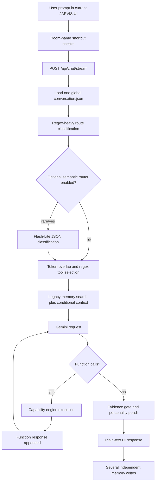

Important present facts:

- The active UI sends the current prompt and attachments but not its own complete thread history.
- The server loads a shared `runtime/conversation.json`, retains up to 120 messages, and routing/synthesis frequently uses only the last eight turns.
- Tool discovery is lexical. It scores name/description token overlap and then adds large regex-selected “always useful” sets.
- Cortex receives at most 5, 8, 10, or 12 exposed tools depending on the inferred route.
- Tool use is a six-turn loop, increased to ten for browser/screen workflows.
- Ordinary responses are capped at 700 output tokens, inferred-deep responses at 1,800, and Cortex Max at 8,000 including reasoning usage.
- Ordinary total latency budget is approximately 22 seconds; screen/browser paths get 60 seconds; Max gets 120 seconds.
- The current response surface renders the answer as `white-space: pre-wrap` text. It does not parse Markdown into real headings, tables, lists, code blocks, citations, or collapsible sections.
- Personality post-processing can force repeated phrases such as “Done, sir.” even after the model produced a more natural answer.

### 2.2 Current Eclipse flow

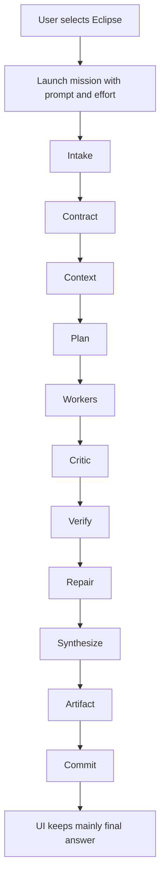

The graph shape is useful, but present implementations are incomplete: context is nearly empty, worker leases can conflict with mandatory web search, critic output is not used as advertised, citation verification is shallow, memory promotion may not write, artifact manifests are absent, and mission lookup depends partly on an in-memory map. The UI discards most evidence, plan, worker, artifact, cost, and resume state.

### 2.3 Current capability inventory

The capability engine declares **123 tools**: 77 observe, 22 prepare, 17 execute, and 7 commit. Quantity is not the problem; coherence and discoverability are.

#### Machine, application, and Windows control

`system_status`, `list_processes`, `network_inventory`, `open_app`, `close_app`, `open_url`, `desktop_control`, `screen_inspect`, `screen_act`, `screen_capture`, `screen_analyze`, `screen_locate`, `computer_use`, `mouse_scroll`, `list_windows`, `inspect_window`, `focus_window`, `invoke_control`, `set_control_value`, `run_command`, `read_clipboard`, `write_clipboard`, `toast_notification`, `youtube_open_video`.

#### Browser

`browser_search`, `browser_status`, `browser_login_handoff`, `browser_page_brief`, `browser_navigate`, `browser_snapshot`, `browser_tabs`, `browser_act`, `browser_commit`, `browser_file_search`, `browser_inspect`, `browser_click`, `browser_type`, `browser_extract`, `browser_screenshot`, `browser_wait`, `browser_verify`.

#### Files, projects, code, and artifacts

`search_projects`, `open_project`, `search_files`, `write_file`, `delete_file`, `codebase_search`, `jarvis_self_inspect`, `compose_artifact`, `artifact_status`, `pc_graph_rebuild`, `pc_graph_search`, `pc_graph_timeline`, `pc_graph_explain`, `pc_graph_inspect`.

There is also a richer local-file-access subsystem with search, find, list, open, close, read, summarize, index, patch preview/apply, registry, operation logs, and soft-delete behavior. It is exposed primarily as HTTP routes and is not represented as a complete model-facing tool family. This is why Cortex can possess a file subsystem without reliably using it.

Missing first-class file operations include stat, mkdir, copy, move, rename, tree, binary/media metadata, archive create/extract/list, robust document parsing, batch operations, conversion, duplicate detection, restore-from-trash, file watching, and durable long-running job status.

#### Research and public information

`web_research`, `research_v2`, `web_research_deep`, `url_read`, `news_headlines`, `weather_forecast`.

#### Memory and personal context

`memory_search`, `memory_add`, `life_graph`, `neural_vault_status`, `neural_vault_context`, `neural_vault_resolve`, `neural_vault_actions`, `neural_vault_integrations`, `neural_vault_api_key_metadata`, `neural_vault_maintenance`, `memory_os_v4_status`, `memory_os_v4_query`, `memory_os_v4_scan_files`, `memory_os_v4_run_agent`.

#### Agents and reusable workflows

`agent_deploy`, `skill_compile`, `skill_run`, `skill_list`, `skill_inspect`.

#### UI

`ui_open_widget`, `ui_focus_widget`, `ui_close_widget`, `ui_populate`, `ui_render_card`.

#### Device mesh and co-op

`device_files`, `device_latest_image`, `mesh_status`, `mesh_objects`, `mesh_pair_link`, `mesh_self_test`, `mesh_send_command`, `coop_symbiote_status`, `coop_symbiote_create_session`, `coop_symbiote_manifest`, `coop_symbiote_chat`, `coop_symbiote_patch`, `coop_symbiote_ghost_test`, `coop_symbiote_debate`, `coop_symbiote_memory`.

#### Communication and providers

`draft_email`, `send_email`, `instagram_reply`, `canvas_courses`, `canvas_assignments`, `canvas_browser_assignments`.

#### Kalshi and APEX

`kalshi_markets`, `kalshi_market_discovery`, `kalshi_balance`, `kalshi_positions`, `kalshi_fills`, `kalshi_portfolio`, `apex_catalog_search`, `apex_data_summary`, `apex_strategies`, `apex_forge`, `apex_report`, `apex_news`, `apex_market_snapshot`, `apex_ticker_report`, `apex_health_check`, `apex_health_apply`, `apex_brief`.

### 2.4 Exact structural defects

1. **No durable task object.** The runtime has a prompt, a route, tool results, and a response, but no canonical list of goals, dependencies, acceptance tests, open questions, partial artifacts, or remaining work.
2. **Conversation state is globally mixed.** Room, project, and task boundaries are not first-class in the main conversation store.
3. **Routing is regex-first.** Phrase variations determine whether tools and memory appear.
4. **Tool definitions overlap.** Several browser and screen tools express similar actions, increasing wrong-tool selection.
5. **MCP schemas accept anything.** The registered MCP input schema is a catch-all object instead of the declared parameter schema.
6. **Richer file access is disconnected.** HTTP routes exist, but Cortex cannot reliably discover the operations as typed tools.
7. **`run_command` is an oversized escape hatch.** It is useful but cannot replace typed filesystem, hardware, process, archive, and package-manager tools.
8. **Success verification is generic.** A successful handler return creates a receipt marked verified without proving the requested postcondition.
9. **Research is fragmented.** Three paths search/read/synthesize differently, and one “deep” path does not place read page content into final synthesis.
10. **Memory is multi-store and inconsistently typed.** The 2026-07-23 live audit found approximately 11.6% active-memory vector coverage; many stored items are not semantically retrievable.
11. **Hardcoded model IDs remain.** Computer use, screen analysis, research, and the mission ReAct loop can bypass the central registry.
12. **Thought/tool continuity is fragile.** Raw REST construction risks losing required Gemini thought/tool signatures and unified interaction state.
13. **Output shape is fixed by accident.** Token ceilings, personality templates, and plain-text rendering—not user intent—determine length and presentation.
14. **No semantic completion gate.** The fresh-information test proves unsupported current claims can survive without evidence.
15. **No cross-modality state.** DOM, UI Automation, screenshots, files, processes, and downloads do not update one shared world model.

### 2.5 Production memory audit (read-only, 2026-07-23)

This subsection is based on the live code paths, schemas, files, and aggregate production-store counts. No runtime data was modified. Counts are a point-in-time baseline and must be captured again immediately before migration.

#### Current physical and logical stores

| Store or layer | Current role | Observed state | Verdict |
|---|---|---:|---|
| `runtime/neural_vault/db/neural_vault.sqlite` / `memories` | Long-term episodes, semantics, procedures, artifacts, action observations | 832 rows; 750 active; every row has `scope='global'` | Largest active semantic store, but not safely scoped |
| Same DB / `ms_memories` | Short-term semantic/procedural memories | 205 active rows plus separate terms/events/entities | A second memory authority with different types, IDs, scores, correction rules, and deletion behavior |
| `runtime/memory-vectors.sqlite` | Gemini embedding mirror | 88 vectors; 87 cover active Neural Vault rows; about 11.6% active-memory coverage | Incomplete auxiliary index, not reliable semantic recall |
| `runtime/user-context.sqlite` | Claimed authoritative owner profile | 1 identity row, 1 core block, 2 preferences, no goals/facts/routines | Mostly seeded profile, isolated from correction/version flows |
| `runtime/conversation.json` | Main recent conversation | One shared rolling conversation | No thread, room, project, or task isolation |
| `runtime/memory/jarvis_memory.sqlite` | Agent-repair topic state and traces | One topic-state row and thousands of debug traces | Another continuity authority, not unified with thread/task memory |
| Neural Vault hot JSON + `continuity_state` | Pronoun/topic continuity | 15 global rows, 1 scope, 0 project-scoped rows; 1,560 referent candidates | Useful idea, but a single global pointer set is overwritten by unrelated rooms and internal calls |
| Neural Vault MemoryOS objects | File-backed canonical-looking objects | 643 objects, 220 file-index rows, 2 parent links, 0 graph edges, 0 MemoryOS entities | File mirror and catalog exist; graph/ontology claims are not implemented |
| MemoryOS agents | Named maintenance/curation roles | 19 definitions, 0 recorded runs | Most agent IDs route to generic list/query behavior rather than their stated specialist job |
| Raw Neural Vault journal | Append-only JSONL conversation/tool/device events | 44 files, about 22.4 MB | Valuable evidence base, but not transactionally linked to canonical assertions |
| HELIX `runtime/helix.sqlite` | Project research entries, evidence, runs, vault, sessions | 14 entries, 22 sources, 20 evidence records, 0 citations, 0 vectors, 0 entity graph nodes; 44 sessions with 32 still open | Project scoping is better than core memory, but retrieval and cross-room continuity are incomplete |
| APEX `runtime/apex.sqlite` | Market/news/strategy/report state | 2 saved analysis reports and domain tables, separate from JARVIS memory | Rich domain state is not published through a canonical context manifest |
| ECLIPSE `runtime/eclipse.sqlite` | Mission graph, evidence, receipts, semantic memory | 4 graph runs, 30 node runs, 15 receipts, 0 semantic-memory rows, 0 artifact manifests | Durable orchestration exists, but the memory-promotion claim is not fulfilled |
| Dormant legacy `runtime/jarvis-memory.sqlite` | Old memory-store database | 175 memories plus legacy terms/entities/events | No active code reference found; must be inventoried and migrated or explicitly archived |

The database-size value alone is misleading because several SQLite databases are in WAL mode; the `-wal` files contain current data even when the base file is only 4 KB. Migration and backup tooling must capture the base database, WAL, and SHM consistently or use SQLite's online backup API.

#### Current write and read topology

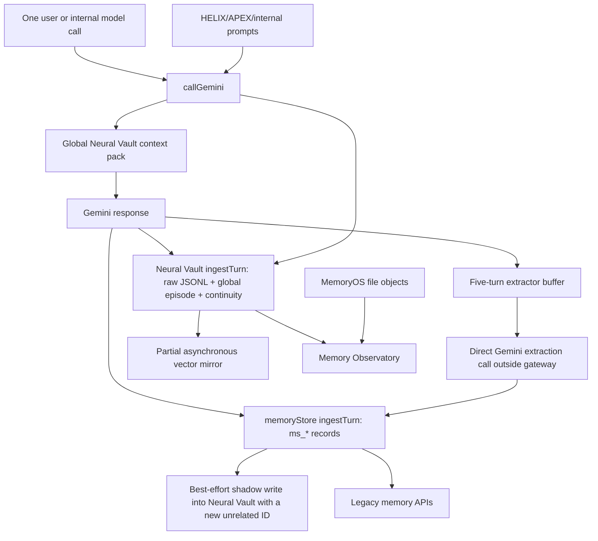

This produces accidental memory, not a controlled memory transaction. The same turn can become a raw event, a Neural Vault episode, an `ms_memories` item, an extracted item, a shadow duplicate, a continuity update, and sometimes a vector. Those records do not share one canonical ID or lifecycle.

#### Verified failure modes to design out

1. **Split authority.** `memories`, `ms_memories`, MemoryOS `memory_objects`, user-context tables, global conversation JSON, agent-repair topic state, HELIX, APEX, and Eclipse each own overlapping truth.
2. **Global contamination.** All 832 Neural Vault rows are global. `callGemini` retrieves and writes global memory for HELIX, APEX, classifiers, prior-art workers, synthesis agents, and other internal calls. At least 16 obvious HELIX machinery episodes are already in the core store; marker-based counting is only a lower bound.
3. **Internal-prompt recall.** An APEX or HELIX helper can receive unrelated owner memory and continuity because `getContextPack` has no caller-specific read policy. Its generated scaffolding can then be written back as a global episode.
4. **Duplicate initialization.** `memoryStore` and `memoryExtractor` are created before Neural Vault and then recreated with a bridge; the first instances are not explicitly closed. This creates unnecessary connections and lifecycle ambiguity.
5. **Volatile extraction.** The extractor clears a five-turn in-memory buffer before extraction succeeds. Missing credentials, provider failure, invalid JSON, or restart can permanently discard the candidate batch.
6. **Gateway and budget bypass.** The extractor and vector service call Gemini directly, bypassing central routing, pricing, retries, usage receipts, concurrency limits, and policy.
7. **Unsafe correction matching.** One short-term correction path supersedes the latest row with the same broad kind/category, even if it refers to another subject. The extractor records `isCorrection` metadata without consistently creating a supersession edge.
8. **Deletion does not propagate.** Forget/correct in `ms_memories` does not reliably tombstone the Neural Vault shadow, vector row, MemoryOS object, compiled context, or room projection.
9. **Embeddings are incomplete and stale-prone.** Coverage is about 11.6%; search performs an O(N) JavaScript cosine scan; vectors have no scope/status filter, checksum/version lifecycle, deletion reconciliation, or model-migration protocol. Semantic recall is invoked mainly by personal-memory regexes.
10. **The advertised graph is mostly decorative.** Core graph extraction recognizes a small hardcoded entity set and has only a handful of active relations. MemoryOS has zero edges and zero entities. `lifeGraph()` is a regex bucket view, not a relationship graph.
11. **MemoryOS health is falsely red by construction.** Object rows store a checksum of content, while the rechecker hashes the entire generated Markdown file, which includes frontmatter and trace text. All 643 inspected objects therefore mismatch even when unchanged.
12. **MemoryOS file/database writes are not atomic.** A file can be written before the row upsert succeeds, or the database can point to a stale/missing version after interruption.
13. **Retrieval confidence is not calibrated.** MemoryOS query confidence is derived from result count; it is not a relevance, entailment, freshness, or conflict score. Core `hybridSearch` combines FTS and a sparse entity path, not vectors.
14. **Influence cannot be proven.** There are 56,650 access-log rows, but `used_in_answer` is zero for every row. The system records retrieval, not whether a memory influenced planning or output. Hundreds of access-log rows also point to records no longer present.
15. **Continuity is a single mutable guess.** It defaults to Jarvis-specific state, uses regex/hardcoded topic inference, and has no room/project/thread stack. It can confidently resolve “it” to stale state and has no expiry or user confirmation loop.
16. **Maintenance is heuristic and fragmented.** Three maintenance implementations independently archive, decay, flag, deduplicate, and report. Contradiction detection is term overlap, procedure consolidation keeps a fixed top three per topic, and belief-revision history is empty.
17. **Procedural learning preserves old content.** Reinforcement updates metadata and scores around an existing rule; contradictory instructions can strengthen the wrong canonical text instead of creating a reviewed new version.
18. **Seeded personal data is treated as authority.** User context injects hardcoded identity/location/preferences into every prompt, is not synchronized with correction history, and stores sensitive categories without field encryption.
19. **Room bridges are summaries, not memory contracts.** HELIX export returns a Markdown string; capsules do not restore the full analysis graph; APEX reports and Forge runs are not automatically registered as artifacts; Eclipse promotion currently stores nothing in its semantic-memory table.
20. **The UI is primarily observability.** The Memory Observatory accurately exposes some gaps, but “Use as context,” audit, and maintenance controls mostly dispatch chat prompts. It lacks direct scoped correction, merge, provenance, influence, quarantine, retry, and migration controls.
21. **Tests prove APIs exist more often than meaning is correct.** Current tests cover basic add/search/reopen and UI route wiring, but not cross-room isolation, semantic correction targeting, failed-extraction recovery, embedding deletion, graph temporal validity, privacy filtering, actual answer influence, or production migration rollback.

#### What is worth preserving

- The append-only raw event journal and provenance intent.
- HELIX's project IDs, sources, evidence records, run log, and retrieval-event substrate.
- Eclipse's graph-run, node-run, evidence, and receipt concepts.
- MemoryOS stable URI idea, inspectable Markdown projection, storage-trace UI, and file index.
- The core temporal relationship columns, correction/supersession fields, access logs, maintenance hooks, and privacy fields.
- The separate local embedding index as an implementation option, provided it becomes a derived, rebuildable projection.
- The Memory Observatory's honest architecture view and continuity inspector.

These pieces should be migrated behind one authority; they should not be deleted and rebuilt blindly.

---

## 3. Research conclusions and design decisions

This plan uses primary documentation and engineering reports, not generic “agent framework” marketing.

| Source | Finding | JARVIS decision |
|---|---|---|
| [Gemini function calling](https://ai.google.dev/gemini-api/docs/function-calling) | Function calls are a repeated model → function → result → model interaction and can be sequential or parallel. | Preserve call IDs/signatures, support parallel read-only calls, and keep the loop until acceptance tests pass. |
| [Gemini tools](https://ai.google.dev/gemini-api/docs/tools) | Gemini supports Search, URL Context, Code Execution, File Search, custom functions, and combinations. | One provider gateway chooses built-in versus local tools; no parallel home-grown Gemini clients. |
| [Gemini Computer Use](https://ai.google.dev/gemini-api/docs/computer-use) | Computer use is a continuous screenshot/action/result loop with browser, mobile, and desktop environments, action intents, safety decisions, and prompt-injection detection. | Replace the one-off visual executor with a durable multimodal driver loop and explicit postconditions. |
| [Gemini thinking](https://ai.google.dev/gemini-api/docs/thinking) | Low/medium/high thinking should be chosen by workload; tool/thought signatures must be returned in continued calls. | Eco/Balanced/Max tune effort, but all continuations pass the complete protocol state. |
| [Gemini Interactions API](https://ai.google.dev/gemini-api/docs/interactions-overview) | Interactions is GA and Google's recommended interface for new Gemini model/agent work; it supports server-side conversation continuation, background execution, observability, and implicit caching. | Centralize new Gemini traffic behind an Interactions-first gateway, retain `generateContent` only for documented feature gaps, and make provider retention a visible privacy setting. |
| [Gemini optimization and inference](https://ai.google.dev/gemini-api/docs/optimization) | Standard is intended for normal interactive work; Priority trades 75–100% higher price for reliability/latency; Flex and Batch cost about 50% less for latency-tolerant work. | Service tier becomes a scheduling decision independent of model and effort: interactive uses Standard, exceptional latency-critical turns may use Priority, background chains may use Flex, and offline bulk work uses Batch. |
| [Gemini rate limits](https://ai.google.dev/gemini-api/docs/rate-limits) | Limits apply per project, span RPM/TPM/RPD and model-specific dimensions, and may include a rolling ten-minute spend limit. | Use a project-wide admission controller with separate resource buckets; never pretend that rotating API keys creates separate quota. |
| [Gemini Deep Research Agent](https://ai.google.dev/gemini-api/docs/deep-research) | Deep Research is a minutes-long background agent. Google estimates roughly $1–$3 for a typical run and $3–$7 for Max at current preview pricing. | Treat it as a separately estimated research job, not as an ordinary chat call hidden inside a fixed search allowance. |
| [Gemini structured outputs](https://ai.google.dev/gemini-api/docs/structured-output) | Structured output can coexist with tools, but syntax does not guarantee semantic truth. | Use schemas for task plans and UI blocks; verify their contents independently. |
| [Gemini context caching](https://ai.google.dev/gemini-api/docs/caching) | Stable prompt prefixes and repeated large contexts can receive cache savings. | Keep a lean stable kernel prompt, retrieve changing context just in time, and measure cached tokens. |
| [Anthropic: effective context engineering](https://www.anthropic.com/engineering/effective-context-engineering-for-ai-agents) | Context is finite; just-in-time retrieval, progressive disclosure, notes, compaction, and isolated sub-agent context prevent dilution. | Do not dump memory or 123 schemas into every call. Maintain a task notebook and load only relevant material. |
| [Anthropic: advanced tool use](https://www.anthropic.com/engineering/advanced-tool-use) | On-demand tool search and programmatic tool calling improve large-tool accuracy and reduce context usage. | Add semantic tool search and deterministic batch/program execution for bounded data work. |
| [RouteLLM](https://arxiv.org/abs/2406.18665) and [FrugalGPT](https://arxiv.org/abs/2305.05176) | Learned routing and confidence-gated cascades can move work between weaker and stronger models instead of binding every prompt to one fixed class. | Begin with an auditable hybrid router, collect Jarvis-specific outcomes, then train/calibrate routing on observed quality, latency, and cost rather than prompt length or regex alone. |
| [Self-RAG](https://arxiv.org/abs/2310.11511) | Retrieval should be conditional; indiscriminately retrieving a fixed number of passages can reduce usefulness. | Research depth is controlled by evidence gaps and claim verification, not a universal number of searches. |
| [Azure Bulkhead pattern](https://learn.microsoft.com/en-us/azure/architecture/patterns/bulkhead) and [AWS retry behavior](https://docs.aws.amazon.com/sdkref/latest/guide/feature-retry-behavior.html) | Inference workloads benefit from isolated capacity; retry quotas and adaptive rate limiting prevent outages from creating retry storms. | Separate interactive, background, research, and media pools; use bounded jittered retries paid from a retry-token bucket. |
| [Anthropic: effective tools](https://www.anthropic.com/engineering/writing-tools-for-agents) | Tools need distinct purposes, strict schemas, concise results, examples, and eval-driven descriptions. | Consolidate overlapping tools and add contract tests plus canonical examples. |
| [Anthropic Computer Use](https://platform.claude.com/docs/en/agents-and-tools/tool-use/computer-use-tool) | Effective desktop agents combine screenshots, mouse/keyboard, shell, and text editing in an agent loop. | Computer vision is one driver inside the kernel, not a separate agent that claims completion itself. |
| [OpenAI Computer Use](https://developers.openai.com/api/docs/guides/tools-computer-use) | Execute returned actions, capture the updated screen, return it, and repeat; important actions remain a security boundary. | Every UI action produces before/after state and a causal verifier result. |
| [OpenAI Shell](https://developers.openai.com/api/docs/guides/tools-shell) | Shell workflows must preserve non-zero output, partial timeout output, non-interactive behavior, and audit logs. | Replace string-only command handling with a job protocol that retains exit code, stderr, partial output, files, and timeout state. |
| [Playwright locators](https://playwright.dev/docs/locators) | User-facing role/label/text locators are more resilient than CSS/XPath; locators retry against current DOM. | Browser driver priority is role/label/text/test-id, with CSS only as fallback. |
| [Playwright actionability](https://playwright.dev/docs/actionability) | Actions should wait for visible, stable, enabled, editable, and event-receiving states. | Browser receipts record actionability checks and semantic postconditions. |
| [Microsoft UI Automation](https://learn.microsoft.com/en-us/windows/win32/winauto/uiauto-uiautomationoverview) | UIA exposes desktop elements as a tree with roles, properties, patterns, and actions. | UIA becomes the primary Windows GUI driver before pixel coordinates. |
| [LangGraph persistence](https://docs.langchain.com/oss/javascript/langgraph/persistence) | Per-step checkpoints support resume, memory, time travel, interrupts, and fault recovery. | Persist every task transition using a real thread/task ID; no in-memory mission authority. |
| [LangGraph interrupts](https://docs.langchain.com/oss/javascript/langgraph/interrupts) | Interrupted nodes resume by re-execution, so side effects must be idempotent. | Every mutating tool receives an idempotency key and separates prepare from commit. |
| [MCP tool annotations](https://modelcontextprotocol.io/specification/2025-11-25/schema) | Tools can declare read-only, destructive, idempotent, open-world, and long-running behavior. | Add these traits to the trusted registry, but enforce policy in code rather than trusting annotations. |
| [Ollama Windows](https://docs.ollama.com/windows) | Windows version, GPU drivers, disk space, and model storage location materially affect usability. | The hardware-assessment workflow must inspect all of these, not only total RAM. |
| [Ollama context length](https://docs.ollama.com/context-length) | Larger context raises memory use; agent/coding use may need 64K; `ollama ps` shows actual offload. | Recommendations must include model size, quantization, context target, expected GPU/CPU split, and a measured trial when requested. |

### Research verdict

The best architecture is not a huge prompt and not “more agents everywhere.” It is:

- one durable task state;
- a small model-selected action loop;
- on-demand typed tools;
- deterministic code for batching and transformations;
- API/CLI/DOM/UIA before vision;
- environment observation after every consequential step;
- evidence-linked completion tests;
- just-in-time context and memory;
- adaptive response rendering.

---

## 4. Target architecture

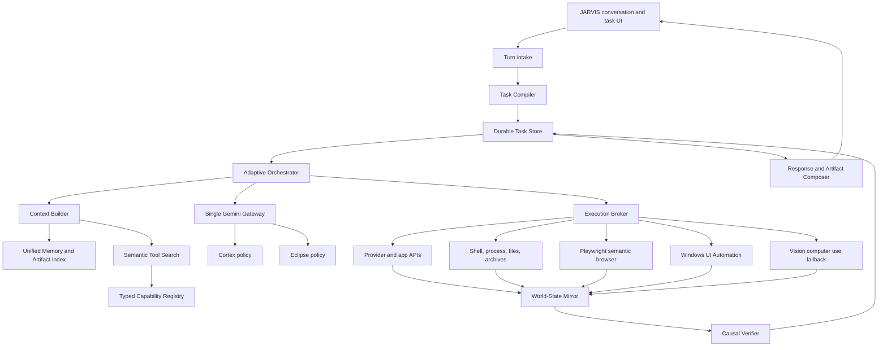

### 4.1 Shared kernel modules

1. `model-gateway` — the only module allowed to call Gemini.
2. `task-store` — durable tasks, goals, steps, checkpoints, retries, approvals, artifacts, sources, and terminal states.
3. `task-compiler` — converts the turn into an explicit task contract.
4. `orchestrator` — chooses direct answer, deterministic workflow, bounded agent loop, or Eclipse mission.
5. `tool-registry` — typed schemas, semantic index, examples, risk traits, preconditions, postconditions, and cost estimates.
6. `execution-broker` — one policy/receipt boundary for every driver.
7. `world-state` — normalized observations from web pages, windows, screen, filesystem, processes, providers, and device mesh.
8. `verifier` — compares expected and observed postconditions.
9. `memory-service` — thread state, task notebook, durable user/project memory, procedural traces, embeddings, corrections, and retention.
10. `evidence-service` — sources, excerpts, claims, citations, contradictions, freshness, and entailment.
11. `artifact-service` — generates, validates, stores, versions, previews, and downloads files.
12. `response-composer` — chooses narrative structure and UI blocks based on the request rather than a house template.

### 4.2 No duplicated authority

- Model name and fallbacks: only `model-gateway`.
- Tool schema and risk: only `tool-registry`.
- Whether an action succeeded: only `verifier` plus execution receipt.
- Conversation/task state: only `task-store`/thread store.
- Long-term memory object: only `memory-service`.
- Research claim and citation: only `evidence-service`.
- Artifact identity and file path: only `artifact-service`.

---

## 5. The Cognitive Transaction Kernel

Every non-trivial turn becomes a **Cognitive Transaction**. This is the central upgrade that prevents JARVIS from forgetting sub-tasks.

### 5.1 Task contract

```ts
type JarvisTask = {
  taskId: string;
  threadId: string;
  roomId: string;
  projectId?: string;
  userRequest: string;
  requestedOutput?: OutputContract;
  goals: Goal[];
  assumptions: Assumption[];
  constraints: Constraint[];
  plan: Step[];
  openQuestions: Question[];
  evidenceRequirements: EvidenceRequirement[];
  workProfile: WorkProfile;
  routeState: RouteDecisionState;
  status: "planning" | "running" | "waiting" | "verifying" | "complete" | "partial" | "failed";
  budget: TaskBudget;
  checkpointId: string;
  createdAt: string;
  updatedAt: string;
};

type Goal = {
  goalId: string;
  description: string;
  dependencies: string[];
  acceptanceTests: AcceptanceTest[];
  status: "pending" | "running" | "verified_complete" | "blocked_external" | "failed_final" | "not_requested";
  evidenceIds: string[];
  artifactIds: string[];
};
```

### 5.2 Full task lifecycle

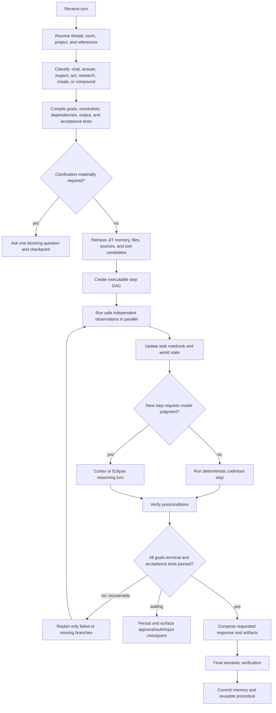

### 5.3 Task notebook

The model never receives the entire raw trace. It receives a compact task notebook:

- original request;
- current goals and statuses;
- immutable user constraints;
- decisions already made;
- observations with source/receipt IDs;
- files and artifacts by stable ID/path;
- failed approaches and why;
- next eligible steps;
- token/cost/time remaining.

After each step the kernel updates the notebook deterministically. This prevents the common failure where a model solves the final branch and forgets two earlier requirements.

### 5.4 Scheduling rules

- Run independent, read-only observations concurrently.
- Keep dependent steps sequential.
- Never parallelize two mutations of the same target.
- Use deterministic code for filtering, joins, ranking, checksums, file batches, table transformations, and hardware calculations.
- Invoke the model again only when new evidence can change the decision.
- Retry transient provider failures with bounded exponential backoff and model fallbacks.
- Retry UI actions only after a fresh observation; never repeat a coordinate blindly.
- Persist a checkpoint before approval, authentication, external commit, or long-running action.

---

## 6. Adaptive Compute Fabric: effort, demand, latency, risk, and cost

The previous idea of putting every request into a hard `instant`, `normal`, `compound`, `heavy`, or `long_running` box is too crude. Those names remain useful as **derived UI bands and evaluation cohorts**, but they must never be the primary execution policy. Prompt length is not task difficulty, task difficulty is not risk, risk is not latency, and none of them is the user's spending preference.

Jarvis therefore makes five independent decisions:

| Control plane | Question | Authority |
|---|---|---|
| User effort | How much optional quality, breadth, and test-time reasoning does the user want? | Eco / Balanced / Max plus explicit per-turn overrides |
| Work demand | What operations and evidence are actually required to satisfy this request? | Task Compiler plus observations during execution |
| Interaction deadline | Must the user receive an immediate response, an interactive stream, or a background job? | User language, operation duration, provider characteristics, and UI state |
| Action risk | Is the work read-only, reversible, consequential, authenticated, or externally committed? | Policy engine; effort can never weaken this floor |
| Resource budget | Can the proposed next step fit within project quota and the owner's task/session/day/month allowance? | Admission controller and Cost Governor |

This separation is non-negotiable. A two-word command such as “delete everything” is short but high risk. A 1,000-word passage followed by “fix spelling only” is long but computationally simple. “Research this company” may begin as a normal fact check or expand into a minutes-long due-diligence job depending on the requested claims and evidence gaps.

### 6.1 Continuous Work Profile, not one hard class

The Task Compiler emits a scored, inspectable work profile. Scores are estimates with confidence intervals, not permissions and not permanent labels.

```ts
type WorkProfile = {
  goals: Goal[];
  operationMix: Array<"converse" | "answer" | "inspect" | "research" | "act" | "create">;
  scope: {
    goalCount: number;
    estimatedEntities: number;
    estimatedFiles: number;
    estimatedSources: number;
    dependencyDepth: number;
  };
  demand: {
    reasoning: number;       // 0..1
    retrieval: number;       // 0..1
    toolUse: number;         // 0..1
    artifactWork: number;    // 0..1
    expectedDurationMs: Range;
  };
  uncertainty: {
    intent: number;          // 0..1
    factual: number;         // 0..1
    environment: number;     // 0..1
    routeConfidence: number; // calibrated, never invented prose confidence
  };
  freshness: "stable" | "possibly_changed" | "live";
  risk: "read_only" | "reversible" | "consequential" | "external_commit";
  interaction: "immediate" | "interactive" | "background" | "scheduled";
  outputContract: OutputContract;
};

type RouteDecisionState = {
  routerVersion: string;
  candidatePlanIds: string[];
  selectedPlanId: string;
  routeConfidence: number;
  derivedUiBand: "instant" | "normal" | "compound" | "heavy" | "long_running";
  escalationTriggers: string[];
  lastCheckpointId?: string;
  lastRouteChangeAt?: string;
};
```

`instant`, `normal`, `compound`, `heavy`, and `long_running` are calculated from this profile only for UI wording, dashboards, and test sampling. No code may say “normal therefore exactly three tools” or “Max therefore exactly twenty calls.”

### 6.2 Three-stage adaptive routing

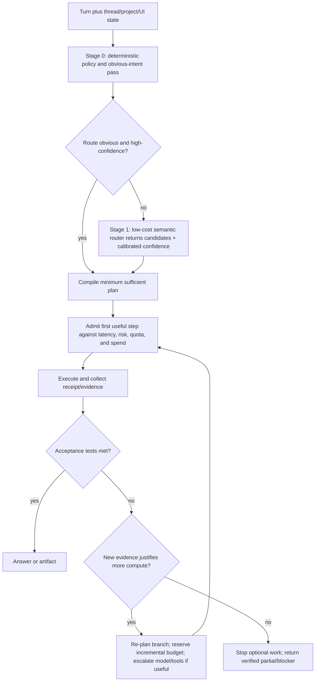

#### Stage 0 — zero-paid-call fast path

This stage is deterministic and must complete locally. It resolves explicit output requests, attachments, references such as “this file,” active room/project, obvious greetings, direct commands, risk keywords, and user constraints such as “quick,” “no web,” or “deep research.” It can answer deterministic UI acknowledgements without a model. It does **not** attempt to understand every prompt with a growing regex forest.

#### Stage 1 — semantic arbitration only when ambiguity matters

If two materially different execution plans remain plausible, use the cheapest suitable semantic router (initially Flash-Lite or a proven local classifier). It returns:

- intent and goal candidates;
- predicted operation mix and evidence needs;
- probability distribution over candidate execution shapes;
- ambiguity flags and the exact missing variable;
- no user-facing prose and no authority to perform actions.

Do not pay for a router call before obvious chat, explicit file commands, or deterministic workflows. Do not route solely from the latest prompt: include the compact active-task state, attached artifacts, active surface, and unresolved goals.

#### Stage 2 — evidence-gated execution

The chosen route is provisional. Every observation can change it. The kernel escalates, de-escalates, pauses, or backgrounds individual **branches**, not the whole conversation. Hysteresis prevents route thrashing: escalation requires a recorded trigger; de-escalation requires either acceptance-test completion or sustained budget/latency pressure. A branch cannot bounce between models on every step.

Escalation triggers include:

- source contradiction or insufficient claim coverage;
- low-confidence extraction that affects the answer;
- an unanticipated dependency, file count, application, or authentication boundary;
- verifier failure after a genuine repair attempt;
- a cheap model explicitly defers or fails a task-specific confidence threshold;
- consequential action whose preconditions cannot be proven;
- user request to broaden, deepen, or maximize.

Non-triggers include verbosity, formal vocabulary, prompt length, the mere availability of Max, or a model asking for more work without identifying an evidence gap.

### 6.3 Minimum-sufficient compute with a quality floor

Research on learned routers and LLM cascades supports conditional escalation, but Jarvis cannot deploy a black-box router and assume it works for personal-assistant tasks. The initial production strategy is hybrid and auditable:

1. policy floors handle risk, permissions, live-data requirements, and explicit user choices;
2. deterministic features handle obvious routes without latency;
3. the semantic router handles only ambiguous cases;
4. execution receipts and acceptance tests decide whether escalation helped;
5. shadow evaluation collects Jarvis-specific preference, correctness, latency, and cost data;
6. a learned router replaces heuristics only after calibrated offline and canary evaluation.

The optimization target is multi-objective:

```text
maximize expected task utility
  = correctness + completion + user preference + evidence quality
  - latency penalty - monetary cost - unnecessary interaction - risk exposure
subject to authorization, privacy, hard budget, and acceptance-test constraints
```

This is not “always start with the cheapest model.” It is “start with the least expensive plan that has a high measured chance of meeting the contract.” Known difficult or consequential tasks may begin on Pro or with a verifier because a failed cheap attempt would add latency and cost.

At each checkpoint the scheduler estimates the **expected value of computation** for candidate next steps: how much a search, stronger model, extra verifier, or additional tool observation is expected to improve the probability of satisfying an unmet acceptance test, minus its latency, monetary cost, failure probability, and risk. It selects only Pareto-useful steps—ones for which no available alternative is simultaneously cheaper, faster, safer, and at least as likely to succeed. Early versions use explicit calibrated rules; after enough verified Jarvis traces exist, a constrained contextual-bandit policy may rank candidates while the deterministic authorization and hard-budget layers remain in control.

### 6.4 Eco, Balanced, and Max become utility policies

| Policy | Quality/cost preference | Default model behavior | Optional breadth | Escalation behavior |
|---|---|---|---|---|
| Eco | Strong correctness floor, aggressive efficiency | Gemini Flash at minimal/low dynamic thinking; deterministic work first | Close only evidence gaps required for the answer | Escalate only when the cheaper path cannot satisfy an acceptance test; ask before crossing the configured silent allowance |
| Balanced | Best default quality/latency trade-off | Gemini Flash at medium dynamic thinking; Pro only where predicted quality gain is material | Reasonable source diversity, repair, and verification | Escalate branch-by-branch using evidence and confidence |
| Max | Highest useful quality within the owner's hard limit | Pro/high for substantive reasoning; trivial chat/acknowledgement may use Flash or no model | Wider research, counter-analysis, specialist/critic passes, richer artifact validation | Spend is available, not mandatory; each extra branch still needs a purpose and stopping rule |

Rules:

1. Eco must remain capable. It removes optional breadth and redundant judgment, never required facts, verification, or action safety.
2. Max inherits the former Cortex Prime benefit for substantive work. It does not launch agents, Deep Research, or multiple Pro calls merely because Max is selected.
3. A user can pin a model or request “always Pro for this turn/session”; the UI must show the latency/cost implication and the route receipt must record the override.
4. Answer length is controlled by the output contract, not effort. A Max one-line request stays one line; an Eco requested report can be long while using economical inference.
5. The tool set is discovered just in time. Effort changes search breadth, not a static number of schemas injected into context.

### 6.5 Coverage-based research depth

Research ends when the claim/evidence graph satisfies the requested coverage, not after an arbitrary number of searches.

1. Convert the request into answerable claims and explicit unknowns.
2. Mark which claims require current or primary evidence.
3. Search in parallel only for independent gaps.
4. Read and score sources for authority, relevance, freshness, and contradiction.
5. Stop a branch when its claim is supported to the required level, is honestly unresolved, or further search has diminishing expected value.
6. Re-open only when a contradiction or user follow-up creates a new gap.

Fast fact checking may need one search; a well-scoped analysis may need five to fifteen source reads; hosted Deep Research may autonomously issue roughly 80 searches, and Max may reach roughly 160 at current preview estimates. Those are observations and estimate inputs, not Jarvis hard limits.

### 6.6 Latency architecture: first feedback is not final completion

Use service-level objectives (SLOs), not promises that every provider must return within a fixed number of seconds:

| Experience | Target behavior |
|---|---|
| Immediate local feedback | UI accepts the turn and shows the inferred contract/current action within 250 ms |
| Direct conversational turn | no router call when obvious; streaming begins as soon as the provider emits tokens |
| Tool-assisted interactive turn | show useful observations/progress as they arrive; do not wait to reveal the entire final answer |
| Predicted long work | create a durable task immediately, keep chat usable, and stream checkpointed progress |
| Provider-managed agent | always background; save interaction/event IDs and support reconnect/cancel/resume |

Scheduling rules:

- Standard inference is the default for interactive work.
- Priority is an explicit latency/reliability upgrade for genuinely time-critical user-facing turns because it currently costs materially more.
- Flex is eligible for latency-tolerant sequential background branches; Batch is eligible for offline independent work.
- If predicted execution may exceed a safe synchronous window (normally about 45 seconds) or an operation exposes a background API, detach it before the request becomes fragile.
- Stream one coherent answer. Do not manufacture a cheap preliminary answer that later contradicts the real result.
- Parallelize independent reads only when quota headroom exists and the combined latency gain exceeds scheduling overhead.
- Exact token counting is not a mandatory extra network call for tiny text requests. Use a conservative local estimate for small calls; call `countTokens` for large contexts, multimodal payloads, large tool sets, threshold-near requests, and expensive models.

### 6.7 Hierarchical Cost Governor

Cost protection is a hierarchy, not one per-task dollar constant:

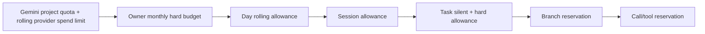

```ts
type TaskBudget = {
  effort: "eco" | "balanced" | "max";
  policyVersion: string;
  priceSnapshotId: string;
  currency: "USD";
  silentSpendUsd: number;
  hardSpendUsd: number;
  softThresholdRatio: number;
  reservedSpendUsd: number;
  actualSpendUsd: number;
  optionalWorkStopped: boolean;
  hardDeadlineAt?: string;
};

type ResourceReservation = {
  taskId: string;
  branchId: string;
  purpose: string;
  model?: string;
  serviceTier?: "standard" | "priority" | "flex" | "batch";
  estimatedInputTokens: Range;
  maxOutputAndThinkingTokens: number;
  estimatedSearchQueries: Range;
  estimatedToolCostUsd: Range;
  estimatedTotalCostUsd: Range;
  rpmUnits: number;
  tpmUnits: number;
  wallTimeMs: Range;
  expiresAt: string;
};
```

The live price registry must model input, cached input, output plus thinking, long-context price steps, search-query charges, image/video/audio generation, code/sandbox time, service tier, and hosted-agent estimates. At current published prices, Gemini 3.6 Flash standard is $1.50/M input and $7.50/M output/thinking; Gemini 3.1 Pro Preview is $2/M input and $12/M output/thinking up to 200K prompt tokens, with higher rates beyond 200K. These values are dated examples for tests, never permanent constants.

#### Budget policy

- The owner configures monthly and daily hard limits plus per-effort **silent allowances**. A silent allowance is what Jarvis may spend without interrupting, not a target.
- A task receives a computed budget from its plan, current prices, user effort, quota headroom, and remaining owner allowance. It does not receive fixed universal call/search/token counts.
- Every new paid branch reserves its expected and upper-bound cost before execution. Actual provider usage then reconciles the reservation.
- At a soft threshold, stop optional branches, compact context, reuse evidence/results, and prefer deterministic transformations.
- At the hard threshold, begin no paid operation. Return the verified partial result/checkpoint and request a budget extension only if remaining goals cannot be met.
- Unused reservations expire promptly; cancelled work cannot leave phantom spend locked.
- UI shows actual, reserved, remaining, cache savings, and the next proposed paid step in human terms.

Hosted Deep Research and Deep Research Max have their own job class and preflight. Google's current preview estimate is approximately $1–$3 for ordinary Deep Research and $3–$7 for Max. Jarvis must display that range, reserve against the configured hard limit, run it in the background, and never launch it silently from an ordinary chat classification.

### 6.8 Project-wide admission control and failure containment

Gemini rate limits apply per project, not per API key. Jarvis therefore maintains resource-specific token buckets for RPM, input TPM, daily requests, search usage, image/media limits, and the provider's rolling ten-minute spend window. Active limits come from owner configuration/AI Studio and observed provider responses; they are not guessed from the key name.

Use separate bulkheads for:

- interactive chat and direct answers;
- background agent/tool branches;
- hosted research;
- image/video/audio generation;
- retries and fallbacks.

This prevents one runaway research task from freezing normal conversation. Admission is weighted and adaptive rather than a global static semaphore: interactive work keeps reserved capacity; background work uses remaining headroom; paid parallelism shrinks on throttling and grows cautiously after sustained success.

Retry policy:

1. classify the error before retrying;
2. never retry invalid/auth/policy requests unchanged;
3. respect provider retry timing for throttling;
4. use exponential backoff with jitter for transient failures;
5. charge each retry against a separate retry-token bucket and the original task budget;
6. cap attempts and open a circuit breaker on repeated equivalent failure;
7. use a fallback model only when it can satisfy the same contract and does not duplicate a possibly successful mutation.

### 6.9 Stateful Gemini sessions, caching, and privacy

The provider gateway should be Interactions-first because it unifies normal models, tools, background work, and agents. Persist `interaction_id`, `previous_interaction_id`, and stream `last_event_id` in the durable task state. Re-specify interaction-scoped tools, system instruction, and generation configuration on every continuation.

Stateful continuation can reduce resent history and improve implicit cache reuse, but paid Interactions are stored by default and currently retained for 55 days unless changed. Jarvis therefore exposes a provider-retention setting:

- **Provider stateful:** enables continuation/background/cache advantages and records the configured retention window.
- **Provider stateless/private:** uses `store=false`, sends only compact required history, and explains that provider background execution and `previous_interaction_id` are unavailable.
- Local Jarvis memory remains the authority in both modes; provider history is an optimization, never the only copy.

Do not pad prompts to reach caching thresholds. Keep stable prefixes stable, measure actual cached tokens, and compact tool results before model context. Cache hits reduce cost but never substitute for freshness checks.

### 6.10 Router learning, evaluation, and rollback

The adaptive system must prove that it is better than fixed buckets:

- build a labeled evaluation set covering chat, current facts, multi-file work, browser/desktop operations, deep research, artifacts, ambiguous follow-ups, short-high-risk commands, and long-low-demand prompts;
- record route probabilities, selected model/tier/tools, escalations, latency, cost, acceptance-test result, user correction, and alternate-route outcome where safely shadowed;
- measure calibration error, task success, unnecessary escalation rate, harmful under-routing rate, p50/p95 first-feedback and completion latency, and cost per successful task;
- shadow new router versions without allowing side effects;
- canary by task family, retain deterministic policy floors, and support instant rollback;
- periodically retrain or recalibrate from Jarvis-specific preferences and verified outcomes, not generic benchmark difficulty alone.

The principal success metric is **cost and latency per verified successful task**, not cheapest average call and not highest raw token use.

---

## 7. Semantic tool system

### 7.1 Tool discovery

Replace token-overlap selection with a two-stage process:

1. **Deterministic domain hints** for obvious nouns and active UI state: current screen, active browser, attached file, current project, Kalshi, Canvas, APEX.
2. **Semantic capability search** over tool name, purpose, examples, preconditions, outputs, risk, and historical success for similar tasks.

Only a small set of discovery primitives is initially visible:

- `tool_search(query, required_traits, target_type)`;
- `tool_describe(tool_ids)`;
- `task_state()`;
- critical always-visible observation and approval tools.

The selected full schemas are then loaded just in time. This keeps 123+ tools available without flooding the model.

### 7.2 Required tool contract

```ts
type CapabilityDefinition = {
  id: string;
  version: string;
  family: string;
  purpose: string;
  whenToUse: string[];
  whenNotToUse: string[];
  inputSchema: JSONSchema;
  outputSchema: JSONSchema;
  examples: ToolExample[];
  traits: {
    readOnly: boolean;
    destructive: boolean;
    idempotent: boolean;
    openWorld: boolean;
    longRunning: boolean;
    reversible: boolean;
  };
  preconditions: Check[];
  postconditions: Check[];
  timeoutPolicy: TimeoutPolicy;
  retryPolicy: RetryPolicy;
  estimatedCost: CostEstimate;
};
```

MCP registration must use the actual JSON/Zod schema. `z.object({}).catchall(z.unknown())` is forbidden for production tools.

### 7.3 Unified receipt

Every execution returns:

```ts
type ToolReceipt = {
  receiptId: string;
  taskId: string;
  stepId: string;
  toolId: string;
  idempotencyKey?: string;
  target: TargetRef;
  requestedEffect: string;
  startedAt: string;
  endedAt: string;
  exitStatus: "succeeded" | "failed" | "timed_out" | "cancelled" | "waiting";
  rawResultRef?: string;
  beforeStateIds: string[];
  afterStateIds: string[];
  postconditionResults: CheckResult[];
  verified: boolean;
  reversible: boolean;
  rollbackRef?: string;
  error?: StructuredError;
};
```

`verified` can be true only when the tool-specific postcondition passes.

### 7.4 Consolidate overlapping capabilities

- Keep legacy IDs as migration aliases, but expose one canonical browser family.
- Fold `browser_click`, `browser_type`, and ad-hoc selector operations under typed `browser.act` with semantic locators.
- Fold `screen_act`, `desktop_control`, and mouse primitives under `desktop.act`, while retaining vision and UIA as selectable drivers.
- Replace generic research variants with `research.run(mode)` and separate `source.search`, `source.read`, and `evidence.verify` internals.
- Connect local-file-access directly to the registry; do not duplicate file truth in `write_file`, `search_files`, PC graph, and HTTP-only endpoints.

---

## 8. Universal local computer and filesystem control

### 8.1 New canonical tool family

#### Observation

- `system.inventory` — OS edition/build, architecture, CPU, cores, instruction flags, RAM, page file, disks/free space, GPU(s), VRAM, driver versions, display, battery, network, virtualization, NPU when available.
- `system.health` — temperatures where supported, disk SMART/status, memory pressure, top processes, startup load, update/reboot state.
- `app.inventory` — installed applications, versions, executable paths, package-manager records.
- `process.list`, `process.inspect`, `process.wait`.
- `fs.stat`, `fs.list`, `fs.tree`, `fs.find`, `fs.search_content`, `fs.duplicates`.
- `fs.read_text`, `fs.read_binary_metadata`, `fs.read_document`, `fs.preview`.
- `archive.list` and `artifact.inspect`.

#### Reversible preparation

- `fs.mkdir`, `fs.write_temp`, `fs.copy`, `fs.move`, `fs.rename`, `fs.batch_plan`.
- `archive.create`, `archive.extract_to_temp`.
- `file.convert_preview`, `file.diff`, `file.patch_preview`.
- `process.exec` with explicit executable/arguments/cwd/env/timeout rather than one PowerShell string.
- `package.inspect`, `package.plan_install`, `download.prepare`.

#### Commit or destructive

- `fs.write`, `fs.patch_apply`, `fs.replace`, `fs.trash`, `fs.restore`, `fs.permanent_delete`.
- `archive.extract_commit`, `package.install`, `package.remove`.
- `process.terminate`, `system.setting_change`.

### 8.2 Path and file semantics

- Resolve paths to canonical absolute Windows paths before execution.
- Check the final resolved source and destination, including symlinks/junctions.
- Separate workspace, Desktop, Documents, Downloads, user-selected roots, runtime, artifacts, and protected locations.
- Never infer recursive deletion from “remove this” without an exact target.
- Use recycle/trash by default; permanent deletion is a distinct tool.
- Use atomic write/rename for generated files.
- Preserve timestamps and metadata for copy/move when requested.
- Detect collisions and ask or apply the user’s saved collision policy: skip, overwrite, rename with suffix, or merge.
- Batch operations produce a manifest before execution and a manifest plus checksums afterward.
- Long file operations stream progress and survive UI disconnects.

### 8.3 File understanding

Readers must be format-aware:

- plain text/code/config/logs;
- PDF with page references, text, tables, and rendered-page fallback;
- DOCX paragraphs/tables/styles;
- XLSX sheets, formulas, types, tables, and charts metadata;
- PPTX slide text, notes, shapes, and images;
- CSV/TSV with encoding and delimiter detection;
- ZIP and common archives without extracting first;
- images with OCR/vision and dimensions/metadata;
- audio/video metadata and transcript path;
- SQLite schema and safe read-only queries;
- source trees with language-aware symbols.

Large files are chunked and indexed. JARVIS stores stable file IDs, checksum, path, version, parser, extracted sections, embedding status, and provenance. It loads only relevant chunks during a task.

### 8.4 Shell and command execution

`run_command` remains an expert fallback, not the default interface.

The replacement job protocol must support:

- executable plus argument array;
- working directory;
- bounded environment variables;
- stdin only when explicitly provided;
- stdout and stderr separately;
- exit code and signal;
- partial output on timeout;
- background job ID, status, logs, cancel, and final result;
- produced/modified file detection;
- network destination logging when possible;
- idempotency and retry classification.

Do not use `ExecutionPolicy Bypass` by default. Never hide a non-zero exit behind `{ok:false}` inside a tool result that the outer engine marks verified.

---

## 9. Browser and desktop control

### 9.1 Driver arbitration

For every step, choose the highest-reliability driver:

```text
Provider/API > application CLI > browser DOM > Windows UIA > vision grounding > raw coordinates
```

The decision is per step, not per task. A workflow may research through APIs, download through Playwright, open the result with a native app through UIA, and visually verify a chart.

### 9.2 Browser modes

1. **Managed browser profile** — isolated, reproducible, best for automated tasks.
2. **Live user-browser bridge** — an explicitly connected Chrome/Edge tab/profile, used when the owner asks JARVIS to operate what is already open.
3. **Headless worker browser** — extraction/testing only, never used when the owner expects visible interaction.

The UI must always show which mode and profile are active.

### 9.3 Browser state machine

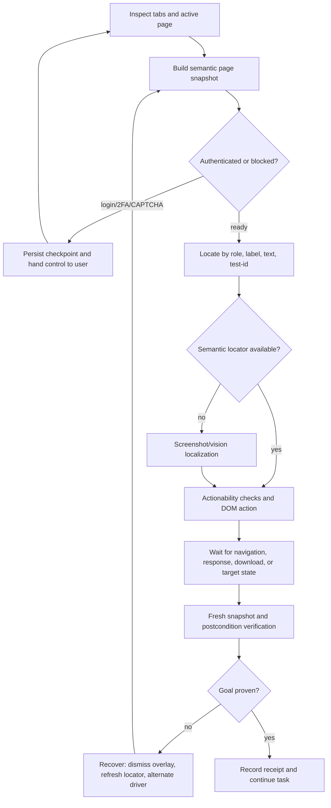

Required additions:

- role/label/text/test-id locators;
- navigation, network-idle, response, download, popup, dialog, and new-tab handling;
- iframe and shadow-DOM support;
- upload chooser and downloaded-file registration;
- saved auth state separated by profile;
- cookie/banner/overlay recovery;
- prompt-injection detection on page text and screenshots;
- current page summary with forms, actions, risk points, and likely next steps;
- DOM plus screenshot pair for disputed actions;
- browser trace/video option for failed Max missions;
- no stale element references after page-changing operations.

### 9.4 Windows desktop state machine

- Observe top-level windows and active window.
- Build a UIA tree using control type, name, automation ID, value, enabled state, bounding rectangle, and supported patterns.
- Choose Invoke, Value, Selection, Toggle, Expand/Collapse, Scroll, or Window pattern when available.
- Re-read the target immediately before action.
- Focus only the intended window and verify focus.
- Perform the semantic action.
- Wait for a UIA event, window state, process state, or bounded visual change.
- Re-inspect and evaluate the requested postcondition.
- Fall back to vision only for inaccessible/custom-rendered regions.
- Use raw coordinates only from a current screenshot with display scaling recorded.

### 9.5 World-State Mirror

The kernel maintains a normalized, timestamped state graph:

- browser sessions, tabs, URLs, titles, forms, downloads, authentication state;
- desktop windows, controls, focus, bounds, display scaling;
- running processes and installed apps;
- files, paths, checksums, versions, and recent mutations;
- active task, goals, approvals, artifacts, and sources.

An action declares its expected delta, for example:

```json
{
  "before": { "fileExists": false },
  "action": "archive.create",
  "after": { "fileExists": true, "zipReadable": true, "entryCount": 12 }
}
```

The Causal Verifier compares the mirror before and after. This makes “done” a measured transition rather than model prose.

---

## 10. Multi-part task example: “Can my laptop run Ollama?”

### 10.1 Required goal decomposition

1. Determine the owner’s desired workload if materially necessary: basic chat, coding, vision, agent use, model size, expected speed.
2. Research current official Ollama Windows, GPU, storage, and context guidance.
3. Inspect the current laptop.
4. Compare observed hardware/software against relevant model footprints and context settings.
5. Produce a tiered recommendation with limitations and next actions.

### 10.2 Execution plan

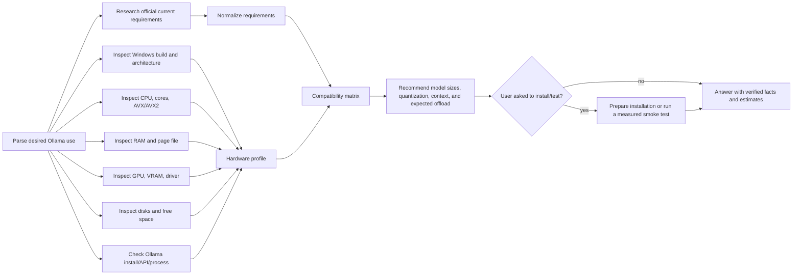

### 10.3 Local observations

Use typed tools to gather:

- Windows version/build and architecture;
- CPU model, physical/logical cores, instruction flags;
- installed and available RAM, page file;
- GPU vendor/model, dedicated VRAM, shared memory, driver version;
- free storage on intended install/model drive;
- installed Ollama version, service/process, API availability;
- environment variables such as `OLLAMA_MODELS` and `OLLAMA_CONTEXT_LENGTH` without exposing secrets;
- existing models and `ollama ps` output when installed.

### 10.4 Reasoning and answer

The compatibility calculation is deterministic. It should compare:

- model artifact size plus runtime/KV-cache overhead;
- available VRAM and expected CPU offload;
- system RAM headroom after current use;
- context-length memory increase;
- disk headroom for multiple models;
- driver/OS compatibility;
- whether the intended workflow needs 4K, 32K, or approximately 64K context.

The response should lead with a verdict such as “Comfortable for 7–8B quantized models; 14B is usable with partial CPU offload; 32B is not a good interactive fit,” followed by the exact observed machine, the current-source requirements, recommended models/settings, expected tradeoffs, and an optional benchmark step. It must label performance as an estimate unless a model was actually run and measured.

This one example becomes an evaluation template for all compound tasks: external research + local inspection + deterministic comparison + evidence-aware synthesis.

---

## 11. Research and evidence engine

### 11.1 One research service, three starting policies

Fast, Standard, and Deep are user-facing starting policies, not fixed search-count classes. The claim/evidence graph and Adaptive Compute Fabric determine the work actually performed.

#### Fast

- Start with one focused claim gap and often one Gemini grounded-search call; expand only for contradiction, missing authority, or an unmet evidence requirement.
- Use for a current fact, price, schedule, release, definition, or quick verification.
- Return the answer with direct citations and timestamp.
- If evidence is absent, say it is unverified; never pass provider prose through as fact.

#### Standard

- Decompose into a compact claim/question graph; many tasks will begin with roughly two to five questions, but the contract determines the real count.
- Search independent gaps, deduplicate results, prefer primary/current sources, and read until the required claims pass coverage or further retrieval has low expected value.
- Extract claim-level evidence and contradictions.
- Synthesize only after coverage checks.

#### Deep

- Confirm scope, audience, time range, geography, comparison criteria, and output form when these materially change the work.
- Show/edit an initial plan.
- Build a question/claim graph.
- Search iteratively until coverage and source-diversity thresholds pass or the budget is reached.
- Read web pages, PDFs, tables, datasets, and user files with format-specific parsers.
- Use parallel research workers only for genuinely independent branches.
- Run citation, contradiction, freshness, numerical, and adversarial review.
- Produce a navigable report plus evidence/source ledger and requested downloadable artifacts.

### 11.2 Evidence objects

```ts
type Evidence = {
  evidenceId: string;
  sourceId: string;
  sourceType: "web" | "file" | "database" | "tool" | "screen" | "user";
  locator: string;       // URL + section, file + page/line/sheet, tool receipt, screenshot region
  excerpt: string;
  capturedAt: string;
  publishedAt?: string;
  checksum?: string;
  authorityScore: number;
  relevanceScore: number;
  freshness: "current" | "dated" | "unknown";
};

type Claim = {
  claimId: string;
  text: string;
  kind: "fact" | "calculation" | "inference" | "recommendation";
  evidenceIds: string[];
  support: "supported" | "partial" | "contradicted" | "unsupported";
  confidence: number;
};
```

### 11.3 Verification gates

- Every time-sensitive factual claim requires current evidence.
- Every citation must support the nearby claim, not merely share keywords.
- Numerical claims must be reproduced with deterministic code when possible.
- Recommendations must separate observed facts, sourced requirements, assumptions, and inference.
- A source read must contribute excerpts/structured data to synthesis; merely opening a URL does not count.
- Contradictions must be shown or resolved, not silently averaged.
- Deep research stops on coverage, diminishing returns, or explicit budget—not an arbitrary fixed number of searches.

### 11.4 Repair current research paths

- Make `research.run` the public entry.
- Use Gemini Google Search/URL Context for fast current grounding.
- Use the shared source/evidence store for all local iterative research.
- Use hosted Gemini Deep Research through the Interactions API only when selected by policy and supported by the key; run it asynchronously, poll/stream correctly, and ingest its plan, sources, report, and usage into the same task.
- Remove model IDs from research modules.
- Delete or migrate the path that reads pages but synthesizes from the original grounded answer without the read contents.

---

## 12. Unified memory and context

Memory must be a governed evidence system, not a bag of text sent to the model. The canonical authority is a local-first memory service owned by the shared kernel. Cortex and Eclipse use the same service through different policies; HELIX and APEX publish scoped domain context into it without surrendering ownership of their operational databases.

### 12.1 Non-negotiable invariants

1. One event has one globally unique `eventId`; every derived assertion, summary, embedding, graph edge, artifact, and projection retains that lineage.
2. One assertion has one canonical identity and version chain. Mirrors and indexes never invent independent semantic truth.
3. Every read and write declares `userId`, `caller`, `roomId`, `projectId`, `threadId`, `taskId`, purpose, and policy version.
4. Scope filtering happens before ranking and again before context assembly. A high similarity score cannot bypass scope or privacy.
5. Raw evidence is immutable; interpretations are versioned; corrections supersede rather than erase history.
6. No model-generated fact becomes owner memory merely because the assistant said it. User assertions, verified observations, and model inferences are different evidence classes.
7. Internal prompts, classifiers, agent instructions, failed outputs, fixtures, and synthetic tests are never owner memories.
8. Forget, quarantine, and correction propagate to every derived index and compiled context within a bounded service-level objective.
9. Embeddings and graphs are rebuildable indexes, not sources of truth.
10. Every memory included in a model call produces an influence receipt; every memory-derived output claim can be traced to source evidence.
11. Memory failure degrades to explicit no-memory operation. It must not block a greeting or silently inject stale context.
12. No migration deletes a legacy record until reconciliation, sampling, rollback export, and owner-visible sign-off are complete.

### 12.2 Six layers with separate policies

| Layer | Contents | Write timing | Default retention | Model visibility |
|---|---|---|---|---|
| **L0 Event journal** | User/assistant turns, tool calls, source reads, room events, corrections, approvals, artifact changes | Synchronous append before acknowledgement | Immutable until governed deletion | Evidence lookup only; never pasted wholesale |
| **L1 Working continuity** | Active room/project/thread/task, focus stack, open loops, unresolved references, artifacts, commitments | Synchronous compare-and-swap | Minutes to days with expiry | Small scoped always-on pack |
| **L2 Task memory** | Goal graph, plan, checkpoints, observations, decisions, receipts, blockers, budgets, partial results | Synchronous per task event | Task lifetime plus archive policy | Full for active task; summaries for archived tasks |
| **L3 Semantic/personal** | User-stated preferences, facts, goals, people, projects, routines, corrections, important episodes | Durable promotion pipeline | Type-specific and versioned | Retrieved only when relevant and allowed |
| **L4 Procedural** | Verified workflows, tool traces, assumptions, parameters, qualification runs, drift/failure history | After verified success or reviewed import | Long-lived with revalidation | Retrieved by task/tool signature |
| **L5 Artifact/domain index** | Files, reports, presentations, datasets, sites, HELIX packages, APEX analyses, Eclipse manifests | On verified commit/domain publish | Artifact/project policy | Metadata first; chunks on demand |

The graph, vector index, FTS, summaries, Obsidian view, and MemoryOS Markdown files are projections over these layers, not additional authorities.

### 12.3 Canonical data model

Use normalized records rather than one overloaded memory table.

```ts
type MemoryScope = {
  userId: string;
  roomId?: "main" | "helix" | "apex" | "eclipse" | string;
  projectId?: string;
  threadId?: string;
  taskId?: string;
  visibility: "private" | "project" | "room" | "global-owner";
};

type MemoryEvent = {
  eventId: string;
  eventType: string;
  actor: "user" | "jarvis" | "tool" | "agent" | "system";
  caller: string;
  scope: MemoryScope;
  payloadRef: string;
  payloadHash: string;
  sourceRefs: string[];
  occurredAt: string;
  ingestedAt: string;
  idempotencyKey: string;
  sensitivity: "normal" | "personal" | "sensitive" | "secret";
  retentionPolicyId: string;
};

type MemoryAssertion = {
  assertionId: string;
  canonicalKey: string; // normalized subject + predicate + scope
  type: "identity" | "fact" | "preference" | "goal" | "commitment" | "decision" | "episode" | "procedure" | "correction";
  subjectEntityId: string;
  predicate: string;
  valueJson: unknown;
  normalizedText: string;
  summary: string;
  scope: MemoryScope;
  evidenceEventIds: string[];
  evidenceClass: "user_explicit" | "verified_observation" | "trusted_import" | "model_inference";
  confidence: number;
  salience: number;
  status: "candidate" | "active" | "disputed" | "superseded" | "quarantined" | "forgotten";
  validTime: { from: string; to?: string };
  transactionTime: { recordedAt: string; supersededAt?: string };
  supersedes: string[];
  conflictsWith: string[];
  sensitivity: string;
  retentionPolicyId: string;
  schemaVersion: number;
  createdAt: string;
  updatedAt: string;
};

type MemoryEdge = {
  edgeId: string;
  fromEntityId: string;
  predicate: string;
  toEntityId?: string;
  valueJson?: unknown;
  scope: MemoryScope;
  evidenceAssertionIds: string[];
  confidence: number;
  validFrom: string;
  validTo?: string;
  recordedAt: string;
  status: "active" | "disputed" | "superseded";
};

type MemoryInfluenceReceipt = {
  receiptId: string;
  turnId: string;
  taskId?: string;
  assertionId: string;
  retrievalIntent: string;
  rankFeatures: Record<string, number>;
  includedInContext: boolean;
  citedByOutputClaimIds: string[];
  modelCallId?: string;
  policyVersion: string;
  createdAt: string;
};
```

Additional canonical tables:

- `memory_entities` and `memory_aliases` for normalized identity and entity resolution;
- `memory_assertion_versions` for immutable version history;
- `memory_extraction_jobs` and `memory_index_jobs` with leases, heartbeats, attempts, retry time, error class, and dead-letter state;
- `memory_embeddings` keyed by assertion/chunk ID, content hash, model, dimension, and index version;
- `memory_summaries` keyed by source-set hash and summary policy version;
- `memory_artifact_refs` for verified files, MIME, checksum, parser version, chunk set, and room ownership;
- `memory_policy_rules` for read, write, retention, privacy, and export policy;
- `memory_migration_map` for every legacy store/table/row to canonical ID and reconciliation status;
- `memory_influence_receipts`, `memory_quality_events`, and `memory_eval_cases` for observability and regression.

Large bodies remain in content-addressed files/object storage. SQLite keeps metadata, retrievable text, hashes, and references. Encrypt sensitive fields with an OS-bound key; never embed raw secrets.

### 12.4 Caller-scoped read and write contract

Every model or tool call receives a `MemoryAccessContext` before retrieval:

```ts
type MemoryAccessContext = {
  userId: string;
  caller: "cortex" | "eclipse" | "helix" | "apex" | "router" | "extractor" | "tool" | string;
  purpose: "answer" | "plan" | "execute" | "verify" | "extract" | "summarize" | "domain_analysis";
  roomId: string;
  projectId?: string;
  threadId?: string;
  taskId?: string;
  readClasses: string[];
  writeClasses: string[];
  sensitivityCeiling: string;
  includeGlobalOwner: boolean;
  policyVersion: string;
};
```

| Caller | Reads | Writes |
|---|---|---|
| Cortex owner conversation | Current thread/task, current room/project, relevant owner semantics/procedures, selected manifests | Turn/task events now; long-term candidates later |
| Eclipse mission | Mission task/evidence/artifacts, selected owner/project memory, qualified procedures | Mission events/receipts/artifacts; reviewed/evidence-qualified promotion only |
| HELIX inquiry/worker | HELIX project, sources/evidence/artifacts, explicitly attached package | HELIX DB plus scoped room events; curated publish on lock/export |
| APEX analysis/Forge | Selected symbol/strategy/run/report and attached package | APEX DB plus scoped manifest/artifact; no global personal episode |
| Router/classifier/verifier | Minimum current turn/task fields | Route/evaluation receipt only |
| Extractor/curator | Leased event batch and candidate neighborhood | Candidate/version/quality records only |

`includeGlobalOwner` is false for internal room workers by default. An explicit context attachment is logged and expires with the task. This prevents hidden personal-data leakage while still supporting “use what you know about me.”

### 12.5 Durable ingestion and promotion

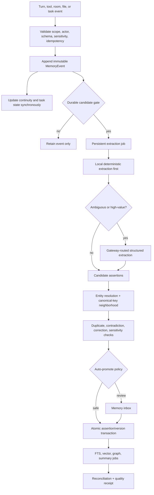

Synchronous work stays small: append event, update active continuity/task state, enqueue. A normal turn does not wait for extraction, embedding, graph enrichment, or consolidation.

Jobs use stable event IDs and a source-set hash. Retry is idempotent. Provider, JSON, and schema failures remain queued with exponential backoff and jitter; permanent failures enter a UI-visible dead-letter queue. No in-memory buffer is authoritative.

### 12.6 Durable admission and Gemini cost

Use local extraction for explicit patterns such as “call me X,” “I prefer X,” “remember X,” verified artifact commits, tool receipts, project selections, and direct corrections. Use a paid Gemini extraction call only when:

- several turns require coherent consolidation;
- subject, predicate, or entity resolution is genuinely ambiguous;
- a possible contradiction cannot be resolved locally;
- salience affects long-term retention;
- a complex procedure/episode needs semantic compression.

Eco batches ambiguous candidates and uses the cheapest qualified structured-output model; Balanced runs sooner for high-salience candidates; Max can perform richer consolidation and relationship extraction after the answer, not on its critical path. All extraction and embedding calls use the single gateway, budget reservations, actual usage receipts, and central retry policy. The graph itself adds no Gemini cost; optional extraction, summarization, and embedding do.

```text
durability = explicitness + futureUtility + verifiedOutcome + recurrence + userSalience
             - transience - speculation - duplication - sensitivityRisk
```

Never auto-promote greetings, system prompts, raw web claims, internal instructions, failed answers, transient prices, or unverified model statements. Current facts live in evidence/domain stores with time and TTL, not timeless owner memory.

### 12.7 Correction, conflict, and truth maintenance

Corrections are subject-predicate operations, never “replace the latest preference.” The write path must:

1. Parse the target and resolve its entity/canonical key.
2. Retrieve only active/disputed assertions in a compatible scope.
3. Store the correction event before mutation.
4. Create a new assertion version with explicit evidence.
5. Mark matching old versions `superseded`; mark uncertain alternatives `disputed`.
6. Close temporal edges and create the new valid-time edges.
7. Invalidate summaries, embeddings, context caches, and room projections containing the old version.
8. Verify negative retrieval: the old value cannot appear except as labeled history.
9. Record belief-revision and propagation receipts.

Conflict rules:

- newer explicit user correction outranks older user assertion in the same scope;
- verified machine observation outranks model inference for machine state, but expires quickly;
- project-specific preference overrides global only inside that project;
- incompatible high-quality sources produce `disputed`, not a silent winner;
- low recent use lowers priority but does not make a durable fact false;
- procedure authority depends on verified success and environment compatibility.

### 12.8 Retrieval and calibration

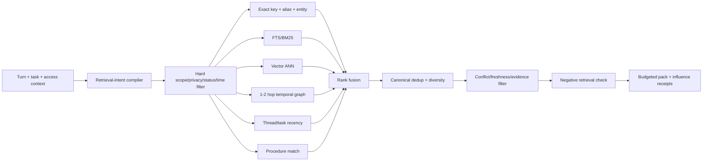

Scope is a hard prefilter, never merely a scoring feature. Candidate rank is logged and tunable:

```text
score = w_exact*exact + w_lexical*bm25 + w_semantic*cosine + w_entity*entityMatch
      + w_graph*pathScore + w_task*taskAffinity + w_recency*recency
      + w_salience*salience + w_evidence*evidenceQuality + w_procedure*qualification
      - w_stale*staleness - w_conflict*conflictRisk - w_repeat*redundancy
```

Use RRF or a learned ranker only when offline evaluation beats the explicit baseline. Never fabricate confidence from result count. Calibrate against labeled recall, precision, conflict detection, and answer support.

Negative retrieval is mandatory after correction/forgetting: apply tombstone filters, search for conflicting historical variants, and prove exclusion. If top candidates conflict or confidence is low, JARVIS exposes uncertainty or asks one targeted question.

### 12.9 Personal Memory Lattice: graph as a secondary index

The graph is worth adding, but only as a derived temporal relationship index over canonical assertions. It supports “who is this?”, “what changed?”, “what did we decide?”, “which artifact came from that analysis?”, and cross-room provenance.

Node types include person, organization, project, room, thread, task, goal, preference, decision, source, claim, evidence, artifact, file, dataset, report, strategy, procedure, tool, device, application, location, event, and concept.

Core edges include `OWNS`, `WORKS_ON`, `PREFERS`, `HAS_GOAL`, `DECIDED`, `CORRECTS`, `DERIVED_FROM`, `SUPPORTED_BY`, `CONTRADICTS`, `SUPERSEDES`, `SUMMARIZES`, `CREATED_ARTIFACT`, `ABOUT`, `USES_SOURCE`, `EXECUTED_WITH`, `VERIFIED_BY`, `HELIX_PUBLISHED`, `APEX_ANALYZED`, `ECLIPSE_PRODUCED`, and `BELONGS_TO_TASK`.

Every edge carries scope, confidence, evidence IDs, valid time, transaction time, and status. Entity merging is transactional, prevents self-loops, preserves aliases, remaps all references, and emits a reversible receipt. Retrieval expands only one or two allowlisted hops; it never dumps an unrestricted graph into a prompt.

Eclipse's temporary Hypothesis Graph remains separate. Hypotheses become persistent claims only after verification and promotion. HELIX's claim/evidence graph stays domain-authoritative and publishes selected nodes with stable references.

### 12.10 Continuity and reference resolution

Replace the global JSON object with a scoped focus stack:

```text
owner -> room -> project -> thread -> task -> active step -> focused artifact/entity
```

Each frame has an ID, source event, confidence, version, created/confirmed time, expiry, open loops, commitments, and candidate referents. Resolution uses grammar, current UI selection, recent turns, task graph, room/project focus, and entity salience. Low confidence becomes an explicit assumption or one concise clarification; it never silently rewrites the prompt.

Continuity uses optimistic concurrency so background workers cannot overwrite owner focus. Entering a room resumes its frame; leaving suspends it; returning restores it. Internal calls update owner focus only when their task publishes a verified artifact or progress event.

### 12.11 HELIX, APEX, Eclipse, and main-JARVIS packages

Rooms retain operational tables suited to their domains, then publish canonical manifests.

#### HELIX package

On inquiry, source ingest, analysis completion, vault lock, decision, artifact export, or project close, publish/update:

- project, folder, inquiry, entry, run, and artifact IDs;
- objective, current state, open questions, decisions, risks, contradictions, next actions;
- claim/evidence/source/citation references and freshness;
- generated files, reports, datasets, images, presentations, code, and checksums;
- compact summary plus retrieval handles for full content.

Do not copy HELIX worker prompts into global memory. Main JARVIS answers “what did I just do in HELIX?” from the latest scoped manifest/event. Promotion of a HELIX decision or preference to owner-global memory is explicit.

#### APEX package

On watchlist change, strategy save, backtest/report completion, Improver run, paper-trade event, or export, publish:

- symbol/strategy/run/report IDs and engine/data versions;
- metrics, assumptions, regimes, risks, claims, evidence, recommendations, validation gates;
- data window/freshness and report/artifact references;
- status and next valid actions.

Prices, news, and signals remain timestamped APEX/evidence records with TTL. Only durable user decisions, strategies, and verified reports become long-term artifact/project memory.

#### Eclipse package

During a mission, share task notebook, evidence IDs, worker results, checkpoints, and artifact manifest through scoped task memory. At commit, promote only verified claims, decisions, procedures, and artifacts. Speculative or failed hypotheses stay in the mission archive.

#### Cross-room query behavior

“What did I just do?” resolves from the focus stack. “What happened in HELIX project X?” targets HELIX manifests. “Compare my HELIX research with the APEX strategy report” creates an explicit multi-domain retrieval intent and preserves both provenances instead of flattening them into anonymous text.

### 12.12 Artifact and file memory

Every artifact gets a stable ID, content hash, MIME, size, parser version, room/project/task ownership, source lineage, title, summary, and storage URI. Folder membership is explicit.

Parseable files get versioned chunk manifests with page, sheet, slide, cell, or line anchors. Re-parse only when content hash/parser version changes. Images get metadata and optional OCR/caption regions; blobs do not enter SQLite or prompts. Archives keep an internal manifest and safe-extraction status.

Artifact commit requires existence, hash, readable type, expected structure, and optional render/test verification. A moved file retains artifact identity and gains a location version.

### 12.13 Embedding lifecycle and performance

- Embed canonical assertions and artifact chunks, not every raw turn.
- Key vectors by object ID, content hash, embedding model, dimension, and index version.
- Changed, superseded, forgotten, or re-scoped objects enqueue deletion/re-embedding.
- Backfill uses a durable cursor, batching, resume, retry, and no permanent first-60 cap.
- Use an indexed local vector engine; do not scan all vectors in JavaScript per query.
- Treat the vector store as rebuildable and keep canonical content elsewhere.
- Shadow-evaluate a new model/index before version cutover.
- Report eligible, ready, pending, failed, stale, orphaned, and excluded counts by scope/type.

Release targets: at least 98% eligible coverage, zero active stale vectors after reconciliation, zero forgotten/superseded results, acceptable p95 local retrieval, and no embedding call for a greeting.

### 12.14 Consolidation, decay, retention, and summaries

Decay changes retrieval priority, not truth:

- machine/web/market observations expire quickly and refresh;
- thread continuity expires unless reinforced by the task;
- ordinary episodes compact into summaries while retaining source lineage;
- explicit identity/preferences/goals do not silently decay into falsehood;
- procedures remain authoritative only while qualification/environment compatibility hold;
- correction tombstones persist to prevent resurrection.

Consolidate by canonical key, entity, scope, time window, and semantic similarity; never collapse unrelated facts just because they share a topic. Summaries are keyed by source-set hash and policy version. Changed/forgotten sources invalidate dependent summaries. Each run reports inputs, outputs, conflicts, skips, cost, duration, and rollback mapping.

### 12.15 Privacy, security, and control

- Physically and cryptographically separate production, development, tests, and imports.
- Encrypt sensitive payloads with DPAPI or another OS-bound key; secrets stay in the secret store and memory keeps metadata only.
- Redact before journals, embeddings, summaries, logs, exports, and model calls.
- Enforce agent/caller sensitivity ceilings and log denied reads without leaking values.
- Support “do not remember,” per-turn incognito, room/project-only scope, pin, expiry, correction, quarantine, forget, and export.
- Forget tombstones/removes the canonical record, compiled context, vector, graph, summaries, caches, and room projections, then runs a negative-retrieval verification.
- Treat imported Markdown/Obsidian content as untrusted data, never instructions or permissions.

### 12.16 Memory Observatory control plane

Retain the current Observatory concept, but provide real typed controls:

1. **Now** — focus stack, thread/task budget, open loops, commitments, room/project, and activation reason.
2. **Recall** — scoped search, retrieval explanation, lexical/vector/graph contributions, conflicts, freshness, provenance.
3. **People and projects** — temporal evidence-backed graph; gaps are labeled, never visually fabricated.
4. **Inbox** — candidates, ambiguous corrections, conflicts, sensitive promotions, and dead-letter jobs.
5. **Artifacts** — files/reports/datasets/images/code/presentations with source room/task, versions, preview, download/open/attach.
6. **Health** — writer lag, queues, failures, coverage, stale/orphan indexes, leakage tests, retrieval quality, spend.
7. **History** — versions, correction chains, merges, forget receipts, migration mapping, rollback.
8. **Policies** — room retention, global promotion, sensitivity, embedding/model policy, Obsidian projection.

Controls call APIs rather than dispatching chat prompts. Mutations show preview, affected projections, proportional confirmation, progress, and verification. “Use as context” creates a scoped, expiring attachment receipt beside the composer.

### 12.17 Canonical APIs and events

```text
POST   /api/memory/v1/events
POST   /api/memory/v1/query
POST   /api/memory/v1/context-packs
GET    /api/memory/v1/assertions/:id
POST   /api/memory/v1/assertions/:id/correct
POST   /api/memory/v1/assertions/:id/quarantine
DELETE /api/memory/v1/assertions/:id
POST   /api/memory/v1/entities/merge/preview
POST   /api/memory/v1/entities/merge/commit
GET    /api/memory/v1/influence/:turnId
GET    /api/memory/v1/jobs
POST   /api/memory/v1/jobs/:id/retry
POST   /api/memory/v1/rooms/:roomId/projects/:projectId/publish
GET    /api/memory/v1/health
GET    /api/memory/v1/migrations
```

Stream `memory.event_appended`, `memory.candidate_created`, `memory.promoted`, `memory.disputed`, `memory.corrected`, `memory.forgotten`, `memory.index_pending`, `memory.index_ready`, `memory.job_failed`, `memory.context_attached`, and `memory.room_manifest_published`.

Compatibility adapters may serve `/api/memory`, `/api/neural-vault/*`, and `/api/memory-os/v4/*`, but all writes enter the canonical service. Old routes become read-only before removal.

### 12.18 Migration and cutover


Required mappings:

- `memories` and `ms_memories` to assertions/events with deterministic migration keys;
- profile items and user-context to versioned owner assertions, never blind last-write-wins;
- conversation JSON and agent-repair topic state to thread/task/focus records where lineage exists;
- MemoryOS objects/files to artifact projections with fixed checksum semantics and URI collision handling;
- vectors to re-embeddable index records, not assumed complete;
- HELIX records to manifests/references rather than duplicated full content;
- APEX strategies/reports/runs to manifests and artifact references;
- Eclipse evidence/claims/runs/receipts to mission/evidence records and promotion candidates;
- dormant databases to mapped records or a signed archive ledger.

Use SQLite's online backup API to capture database plus WAL consistently. Migration has dry runs, deterministic IDs, chunked transactions, resumable cursors, and per-row mappings. Reconcile counts/status/type/scope, source hashes, correction chains, forgotten items, vector eligibility, graph integrity, files, privacy, and representative queries. Cut over a canary scope first; rollback switches readers without deleting canonical work.

Never deduplicate solely on normalized text. Use subject, predicate, scope, evidence, time, and semantic review; preserve uncertain cases in the merge inbox.

### 12.19 Context-pack budget

Use progressive disclosure:

1. stable lean system contract;
2. scoped focus frame and relevant turns;
3. active task notebook and acceptance tests;
4. top assertions/procedures/domain manifests with provenance/conflict labels;
5. selected tool schemas;
6. required source/file chunks;
7. older observations as referenced summaries.

Packs record typed sections, token counts, omission reasons, policy version, and source IDs. A greeting gets no semantic retrieval; a personal follow-up gets a small owner pack; a file task gets artifact chunks; Eclipse gets mission/evidence context. When over budget, preserve current task state, corrections, relevant high-confidence facts, and acceptance tests before older episodes.

Never paste every memory, graph neighborhood, profile field, room report, tool schema, or raw log into the model. Load detail only for the branch that needs it.

### 12.20 Obsidian decision

Obsidian is optional as a human-facing projection/export for selected projects, decisions, artifacts, and graph links. It is not the runtime DB, vector index, permission engine, correction system, or queue. Add it only after canonical memory stabilizes, with one-way generated folders by default, explicit import, stable frontmatter IDs, conflict handling, privacy filters, and no requirement that Obsidian be open. It adds no Gemini cost unless the user asks for model-generated summaries or import curation.

### 12.21 Memory SLOs and release gates

| Concern | Target gate |
|---|---|
| Event durability | Acknowledged event survives immediate restart; replay creates no duplicate |
| Interactive latency | Event/focus/task write does not materially delay first feedback; indexing stays off-path |
| Scope isolation | Zero cross-user/room/project leakage in adversarial tests |
| Correction | New version visible and old excluded within one completed propagation window |
| Forgetting | Canonical and projections removed/tombstoned; negative-retrieval test passes |
| Embeddings | >=98% eligible active items ready; zero stale active vectors after reconciliation |
| Retrieval | Recall@K, precision@K, MRR/nDCG, conflict detection, and answer support beat baseline |
| Influence | Every included memory has a receipt; memory-derived claims link to used evidence |
| Room continuity | Main JARVIS recalls latest HELIX/APEX/Eclipse activity without ingesting internal prompts |
| Cost | No paid memory call for trivial turns; all calls metered by caller/purpose/effort |
| Recovery | Queues, migration, and context resume after crash without lost batches/repeated effects |
| UI truth | Counts, graph, agents, health, and confidence reflect executed behavior, not labels |

---

## 13. Cortex behavior after rebuild

### 13.1 Conversation policy

Cortex first determines whether the user wants conversation, knowledge, inspection, action, creation, or a compound task. Obvious casual conversation receives a direct natural response without a router call or tools. Operational work enters the task kernel.

Cortex should:

- use the user’s vocabulary and current tone;
- answer the actual question before offering extras;
- infer harmless typos and follow-ups from scoped thread context;
- ask one question only when the answer materially changes the task;
- avoid announcing a plan for trivial work;
- provide short progress updates for work longer than a few seconds;
- never expose hidden chain-of-thought;
- explain evidence, decisions, and action receipts when useful;
- vary openings and structure naturally;
- not call the owner “sir” by default on every response;
- not force a success/failure template over a good model response.

### 13.2 Answer length policy

Length is inferred independently from reasoning effort.

| User/task signal | Default presentation |
|---|---|
| Greeting, acknowledgement, one fact | 1–4 sentences |
| Simple explanation | 2–6 short paragraphs or a tiny list |
| Comparison | concise verdict plus table when mappings matter |
| Troubleshooting | diagnosis, evidence, fix/options, verification |
| Multi-part request | outcome first, then a section per requested part |
| Research | executive answer, findings, evidence/citations, limits |
| Action | result, exact affected targets, verification, remaining work |
| User asks “full/deep/in detail” | comprehensive structured response or artifact |

Eco can reason efficiently and still return a complete answer. Max can reason deeply but should not inflate a simple answer.

### 13.3 Response contract

The provider returns a structured internal envelope, not presentation Markdown alone:

```ts
type JarvisResponse = {
  answer: string;
  blocks: Array<
    | { type: "markdown"; markdown: string }
    | { type: "table"; columns: string[]; rows: unknown[][] }
    | { type: "code"; language: string; code: string; filename?: string }
    | { type: "status"; goals: GoalStatus[] }
    | { type: "sources"; sourceIds: string[] }
    | { type: "files"; artifactIds: string[] }
    | { type: "approval"; approvalId: string }
    | { type: "warning"; text: string }
  >;
  task: { taskId?: string; status?: string; remaining?: string[] };
  provenance: { claimIds: string[]; receiptIds: string[] };
};
```

The application validates the envelope and renders it. Plain conversation may use only `answer`; operational and research tasks add typed blocks.

### 13.4 Formatting rules

- Outcome first.
- Headings only when they reduce cognitive load.
- Tables only for true comparison/mapping.
- Code in fenced, copyable blocks with filename/language.
- Citations beside the claims they support.
- Files as named downloadable objects with type, size, version, and verification.
- Avoid repetitive “Here’s…” introductions and generic conclusion sections.
- Preserve user-requested formats exactly.
- Technical trace remains collapsible and separate from the main answer.

---

## 14. Eclipse behavior after rebuild

Eclipse uses the same Cognitive Transaction, tools, memory, evidence, and artifacts as Cortex. It adds mission-level rigor.

### 14.1 Correct mission graph

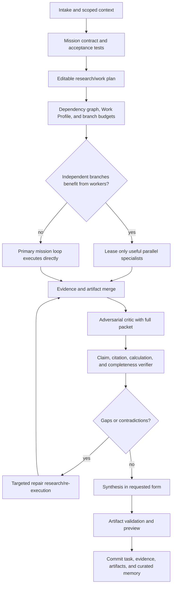

### 14.2 Worker policy

- Workers are optional compute, not an Eclipse ritual. Spawn them only when independent branches are substantial enough that specialization or parallel latency gain exceeds coordination/context cost.
- Workers receive a complete scoped sub-question, explicit deliverable, relevant source universe, tool lease, cost/time budget, and return schema.
- No worker is forced to use a tool outside its lease.
- Workers return claims, evidence IDs, uncertainties, contradictions, source gaps, and a compact conclusion—not just 900 characters of prose.
- The critic receives the complete claim/evidence packet and its structured findings are retained.
- Repairs perform new targeted work. They cannot promote weak evidence by relabeling it.
- Synthesis sees verified claims plus relevant excerpts and citation locators.

### 14.3 Durability and UI

- Database-backed mission lookup is authoritative.
- Every node is checkpointed and resumable.
- Pause, resume, cancel, retry failed branch, edit plan, add instruction, and fork from checkpoint are real API/UI operations.
- The UI displays plan, progress, worker branches, evidence, contradictions, usage, artifacts, and final report.
- Artifact manifests are persisted and connected to the shared artifact service.
- Curated memory promotion writes a real canonical memory object only after verification.

---

## 15. Automations, recurring work, and reusable procedures

### 15.1 Automation types

- one-time delayed task;
- recurring schedule;
- file/folder watcher;
- provider/webhook event;
- device-mesh event;
- application/process state trigger;
- condition-based monitor;
- manually reusable procedure/macro.

### 15.2 Automation contract

Every automation stores:

- owner and scope;
- trigger and timezone;
- task template with variables;
- allowed tools and target roots/domains/apps;
- budget/effort;
- idempotency window;
- retry and missed-run policy;
- approval boundaries;
- output destination and notification policy;
- last/next run, receipts, artifacts, and health.

Automations create normal durable tasks. They do not use a separate weaker execution path. A background task can prepare consequential work and checkpoint, but an interactive owner session must perform the required commit approval.

### 15.3 Procedure learning

After a successful repeatable task, JARVIS may propose saving a procedure. The procedure contains generalized steps, parameter slots, required tools, preconditions, postconditions, example inputs, success history, and the application/site versions on which it was validated.

Before replay, **drift detection** checks whether files, selectors, app versions, APIs, or expected UI state changed. A drifted procedure falls back to normal planning and is re-qualified after success.

---

## 16. Main UI requirements

The main UI must become a conversation plus task surface, not a single temporary text card.

### 16.1 Conversation surface

- persistent scoped thread history;
- real Markdown rendering with sanitized links;
- headings, tables, lists, inline/fenced code, copy buttons, citations, and images;
- adjustable response panel height/width and full-screen reading mode;
- “shorter,” “expand,” “explain,” “turn into file,” and “continue task” actions;
- exact file/artifact cards with preview and download;
- sources drawer with claim linkage;
- no mojibake characters.

### 16.2 Task surface

- task title and durable ID;
- overall status and progress;
- goals/checklist with verified, running, waiting, failed states;
- current operation and driver: API, shell, DOM, UIA, or vision;
- a compact adaptive-route chip showing immediate/interactive/background, current model/tier, and derived UI band without implying that the task is locked to that band;
- an expandable “why this route?” receipt with detected goals, evidence needs, uncertainty, risk floor, estimated time/cost range, and the trigger for any escalation;
- direct controls for “answer with what you have,” “continue deeper,” “move to background,” and an eligible budget/model override without forcing the user to rewrite the prompt;
- compact event timeline;
- blocker/approval/authentication card;
- pause, cancel, resume, retry branch, and edit-plan controls;
- actual/reserved/remaining cost, cache savings, model/service tier, searches, tool operations, and the next proposed paid branch in a collapsed panel;
- retained task history after reload.

### 16.3 Desktop/browser indicator

Always show:

- managed browser versus live user browser;
- active tab/window target;
- whether JARVIS is observing or controlling;
- most recent screenshot/snapshot time;
- current approval boundary;
- stop-control that immediately cancels queued UI actions.

### 16.4 Eclipse mission surface

- plan editor before/while running;
- dependency graph and worker lanes;
- evidence/claim inspector;
- contradiction and gap queue;
- report outline and live draft;
- artifact shelf;
- checkpoint/fork/replay view.

---

## 17. Three advanced upgrades

### Upgrade A — Cognitive Transaction Kernel

Free-form requests compile into durable goals, dependencies, acceptance tests, evidence requirements, and an output contract. The model may replan, but it cannot silently drop a goal. Every branch remains visible and resumable.

Why it matters: it converts JARVIS from a reply generator into an outcome system while allowing cheap deterministic execution on Eco.

### Upgrade B — World-State Mirror plus Causal Verifier

JARVIS maintains one time-stamped graph of the browser, desktop, files, processes, tasks, and artifacts. Every action declares an expected state delta, and success is granted only after that delta is observed.

Why it matters: the model can switch intelligently between API, CLI, DOM, UIA, and vision while maintaining one understanding of what changed. False “done” claims become structurally difficult.

### Upgrade C — Self-Healing Procedure Foundry

Successful verified task traces can be distilled into reusable typed procedures. Before replay, JARVIS checks environment drift; when a procedure fails, it re-enters the general planner, repairs only the broken steps, re-verifies them, and versions the improved procedure.

Why it matters: JARVIS becomes faster and cheaper with use without blindly replaying brittle mouse macros.

---

## 18. Implementation program

Each wave ends with passing gates before the next wave begins. Existing aliases remain temporarily so current UI features do not break during migration.

The numbered sequence expresses production dependencies, not permission to postpone containment. Wave 0 freezes and snapshots memory; Wave 1 centralizes its paid calls; Wave 2 creates its event/scope substrate; Waves 4, 5, and 7 create influence, artifact, and evidence primitives; Wave 8 performs semantic migration/cutover; Waves 9-12 consume and harden it.

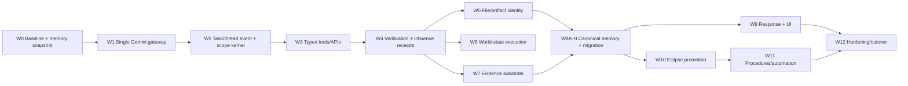

No wave may create a new private memory/profile/continuity database. Domain operational databases are allowed only when they publish stable canonical manifests and do not become competing owner-memory authorities.

### Wave 0 — Baseline, isolation, and truth

- [ ] Freeze representative Cortex and Eclipse task fixtures.
- [ ] Separate production memory/runtime data from test fixtures.
- [ ] Capture a consistent read-only inventory and SQLite online backup of every production memory database, WAL, raw journal, MemoryOS file, room store, vector store, legacy database, and profile store.
- [ ] Freeze labeled memory evals for exact recall, paraphrase recall, correction, negative retrieval, room/project leakage, failed extraction, restart, artifact lineage, and “what did I just do?” across main/HELIX/APEX/Eclipse.
- [ ] Record the audited baseline: canonical candidates, active/status/type/scope counts, 11.6% vector coverage, graph/index gaps, queue/agent activity, access-log influence gap, and legacy source mappings.
- [ ] Add end-to-end traces for model calls, selected tools, receipts, context size, and final claims.
- [ ] Remove assertions that cannot fail.
- [ ] Add the currently failing unsupported-fresh-information test as a release blocker.
- [ ] Record existing latency/cost/success baselines for Eco, Balanced, and Max.
- [ ] Build the routing evaluation corpus, including short-high-risk, long-low-demand, ambiguous follow-up, current-fact, multi-file, research, artifact, and desktop-control tasks.
- [ ] Capture p50/p95 first-feedback/completion latency, verified success, correction rate, provider calls, tokens, searches, and cost per successful task.

Exit: failures are reproducible, every production store has a consistent rollback snapshot and mapping inventory, and no test can read or write production memory.

### Wave 1 — Single Gemini gateway

- [ ] Move all Gemini calls from server, research, computer-use, screen analysis, ReAct, and Eclipse behind one client.
- [ ] Centralize registry, availability probes, fallbacks, retries, timeouts, usage, cost, and caching.
- [ ] Make Interactions the default where supported; preserve interaction/event/thought/tool IDs and retain a documented `generateContent` adapter only for feature gaps.
- [ ] Reject unknown or unavailable model IDs before task execution.
- [ ] Make provider errors structured and retry-classified.
- [ ] Add the live price/deprecation registry, usage reconciliation, threshold-aware token counting, provider retention mode, and Standard/Priority/Flex/Batch selection.
- [ ] Add project-wide resource buckets, weighted bulkheads, retry quota, rolling ten-minute spend protection, and hosted-agent preflight.
- [ ] Move memory extraction, summarization, contradiction review, relationship extraction, and embeddings behind the same gateway with `caller`, `purpose`, effort, budget, latency class, usage receipt, and retry classification.
- [ ] Prohibit memory/index services from constructing raw Gemini HTTP requests or hardcoding embedding/generation model IDs.

Exit: repository search finds no direct Gemini API call outside the gateway and gateway tests cover failover/signature continuity.

### Wave 2 — Durable task/thread kernel

- [ ] Add task, goal, step, checkpoint, task-event, blocker, and budget tables.
- [ ] Add scoped thread/room/project conversation state.
- [ ] Make the kernel event ledger the L0 memory journal and implement scoped, versioned L1 focus frames instead of global conversation/continuity authority.
- [ ] Require `MemoryAccessContext` on every model call; router/classifier/internal calls default to no owner-global memory and no semantic write.
- [ ] Implement Task Compiler and task notebook.
- [ ] Implement continuous `WorkProfile`, zero-call fast path, ambiguity-only semantic arbitration, route-decision receipts, and derived UI bands.
- [ ] Implement branch-local evidence-gated escalation/de-escalation, hysteresis, expected-value candidate ranking, and acceptance-test stopping.
- [ ] Implement owner month/day/session/task/branch/call budgets with reservation, reconciliation, expiry, and silent-versus-hard allowance behavior.
- [ ] Implement dependency scheduling, bounded parallel reads, cancellation, pause, resume, and branch retry.
- [ ] Make side-effecting steps idempotent.
- [ ] Migrate Eclipse mission authority from in-memory Map to persistent storage.

Exit: a compound task survives server restart and resumes without repeating completed mutations.

### Wave 3 — Typed semantic tool registry

- [ ] Convert all 123 definitions to strict input/output schemas.
- [ ] Add examples, traits, preconditions, postconditions, cost, timeout, and retry metadata.
- [ ] Build semantic tool index and tool-search calls.
- [ ] Consolidate overlap and retain compatibility aliases.
- [ ] Update MCP registration to actual schemas and annotations.
- [ ] Make tool results concise by default with retrievable raw-result references.
- [ ] Replace overlapping memory tools with typed query, context-attach, correct, quarantine, forget, merge-preview/commit, publish-manifest, job-retry, influence, and health operations; retain old names as adapters only.

Exit: paraphrase evals select the right tool family without regex-specific wording and malformed parameters fail before execution.

### Wave 4 — Verification and receipts

- [ ] Implement canonical before/after state records.
- [ ] Add tool-specific postcondition evaluators.
- [ ] Separate handler success, operation success, and goal completion.
- [ ] Add idempotency keys and rollback/trash references.
- [ ] Block unsupported current/action claims at final semantic verification.
- [ ] Add memory influence receipts that distinguish retrieved, included, cited/used, rejected, stale, and conflict-blocked items; link them to output claim IDs.
- [ ] Add propagation receipts for correction, forgetting, summary invalidation, vector deletion/re-embed, graph update, and room-manifest refresh.

Exit: no tool can emit `verified:true` from a successful return alone.

### Wave 5 — Files, shell, and system intelligence

- [ ] Connect local-file-access to the tool registry.
- [ ] Implement canonical observation, batch, mutation, archive, conversion, and restore tools.
- [ ] Build format-aware readers and chunk indexes.
- [ ] Replace ordinary PowerShell strings with typed process jobs.
- [ ] Implement full hardware/app/disk/GPU inventory.
- [ ] Add the Ollama assessment workflow and tests.
- [ ] Register every verified file/dataset/image/report/code/presentation as a stable artifact with hash, parser/chunk manifest, versions, task/room/project scope, and source lineage.

Exit: JARVIS can inspect, organize, copy, move, zip/unzip, create, edit, restore, and verify files; the compound Ollama task passes from a fresh conversation.

### Wave 6 — Browser and desktop kernel

- [ ] Implement managed, live-user, and headless browser modes.
- [ ] Add Playwright role/label/text/test-id locators and actionability verification.
- [ ] Add robust tabs, frames, popups, dialogs, uploads, downloads, auth handoff, and overlays.
- [ ] Expand UIA patterns and event-based waiting.
- [ ] Integrate Gemini Computer Use as vision fallback through the shared gateway.
- [ ] Build driver arbitration, World-State Mirror, prompt-injection checks, and causal verification.
- [ ] Add immediate stop/cancel.

Exit: browser/desktop benchmark tasks pass with verified outcomes and no stale blind retries.

### Wave 7 — Unified research and evidence

- [ ] Implement fast, standard, and deep research modes.
- [ ] Add source, evidence, claim, contradiction, and citation tables.
- [ ] Add iterative query/coverage loop and format-aware web/PDF/table reading.
- [ ] Add numerical reproduction and adversarial review.
- [ ] Correctly integrate hosted Deep Research as an optional asynchronous backend.
- [ ] Delete/migrate incomplete research paths.
- [ ] Make claim/evidence/source/citation records reusable by HELIX, Eclipse, and canonical memory; keep domain ownership and stable source references rather than copying prose.
- [ ] Expose contradiction and evidence-quality signals to memory admission so unverified web/model claims cannot become owner facts.

Exit: every current claim has supporting evidence; every citation passes claim-level support checks.

### Wave 8 — Unified memory

#### Wave 8A — Contain current damage without deleting data

- [ ] Stop global Neural Vault retrieval/write for HELIX, APEX, router, classifier, verifier, extractor, and internal agents unless a scoped policy explicitly allows it.
- [ ] Initialize each current memory service exactly once; close old connections and remove the untracked recreate-with-bridge lifecycle.
- [ ] Replace the volatile five-turn buffer with durable event/job capture before disabling any legacy writer.
- [ ] Fix MemoryOS checksum semantics so stored and checked hashes cover the same canonical bytes; distinguish missing, changed, stale-index, and healthy.
- [ ] Mark current MemoryOS agent definitions as `implemented`, `partial`, or `stub`; UI cannot call a generic query a specialist run.
- [ ] Quarantine known fixtures/stress-test/system-prompt/internal-room candidates in a dry-run report; no automatic deletion.

Gate: new internal calls cannot contaminate global owner memory, no extraction batch is lost on failure/restart, and existing data is untouched except explicit metadata/quarantine approved for this wave.

#### Wave 8B — Canonical service and transaction substrate

- [ ] Create canonical event, assertion/version, entity/alias, temporal edge, artifact ref, extraction/index job, summary, policy, influence, quality, and migration tables.
- [ ] Implement one `MemoryTransactionService` with idempotent append, promote, correct, dispute, quarantine, forget, merge, attach-context, and publish-manifest operations.
- [ ] Implement `MemoryAccessContext` validation and the caller policy matrix.
- [ ] Make events immutable, projections rebuildable, and assertion/file/index updates transactionally staged with recovery markers.
- [ ] Add field encryption/redaction and physical production/test/import separation.

Gate: canonical events/assertions survive crash tests, replay is idempotent, unauthorized scopes are denied, and partial file/database writes recover deterministically.

#### Wave 8C — Dual-read migration and reconciliation

- [ ] Dry-run deterministic mappings for `memories`, `ms_*`, user-context/profile, conversation JSON, repair topic state, MemoryOS objects/files, vectors, raw events, HELIX, APEX, Eclipse, and dormant legacy databases.
- [ ] Normalize type aliases (`episode/episodic`, `procedure/procedural`, preference variants) while retaining source type and row ID.
- [ ] Infer scope only from strong lineage; route uncertain global rows to a review/quarantine inbox rather than inventing project ownership.
- [ ] Import corrections/supersessions/forgotten state before ordinary assertions so old beliefs cannot resurrect.
- [ ] Run dual-read shadow queries and produce per-case diffs for retrieved IDs, ranks, conflict labels, context tokens, and expected answer support.
- [ ] Reconcile counts, hashes, files, status, privacy, lineage, correction chains, and representative samples; maintain per-row rollback mapping.

Gate: 100% of source rows are mapped, archived with reason, or flagged for review; no silent loss; canary dual-read meets or beats baseline and rollback works.

#### Wave 8D — Retrieval, vectors, and Personal Memory Lattice

- [ ] Implement retrieval-intent compilation, hard scope/privacy/time filters, exact/alias/entity, BM25, vector ANN, bounded temporal graph, task recency, and procedure matching.
- [ ] Implement logged rank features, fusion, canonical dedup, diversity, conflict/freshness/evidence filtering, negative retrieval, and calibrated confidence.
- [ ] Rebuild embeddings with versioned content hashes, durable cursor, batching, retries/DLQ, deletion/re-scope reconciliation, and shadow index migration.
- [ ] Build typed temporal graph nodes/edges from canonical assertions and research/artifact provenance; transactionally resolve aliases/merges and prevent self-loops.
- [ ] Backfill to at least 98% of eligible active assertions/chunks; explain every exclusion/failure.

Gate: paraphrase, entity, temporal, cross-artifact, correction, forgotten-item, and adversarial scope evals pass within latency/cost SLOs; zero stale active vectors.

#### Wave 8E — Curator, consolidation, decay, and procedures

- [ ] Implement local-first deterministic extraction plus gateway-routed ambiguity handling with per-effort policies and usage receipts.
- [ ] Add subject/predicate correction targeting, dispute state, belief revision, summary source-set invalidation, and end-to-end propagation verification.
- [ ] Replace topic-count procedure pruning with versioned procedural evidence, qualification history, environment compatibility, negative outcomes, and drift state.
- [ ] Apply decay to retrieval priority and TTL-backed observations, not explicit identity/preferences as accidental truth deletion.
- [ ] Consolidate by entity/canonical key/scope/time/evidence with reversible receipts; send uncertain merges/conflicts to the inbox.

Gate: failed extraction recovers, contradictory preference tests do not reinforce the old rule, summary invalidation works, and maintenance never silently discards durable truth.

#### Wave 8F — HELIX/APEX/Eclipse room bridges

- [ ] Publish stable HELIX manifests for project/inquiry/source/evidence/analysis/vault/decision/artifact/open-loop state; add citation/vector/entity coverage inside HELIX rather than relying on global memory.
- [ ] Publish APEX manifests for strategy/backtest/Improver/report/paper-trade/artifact state with data and engine versions; keep transient market facts TTL-scoped.
- [ ] Publish Eclipse mission/task/evidence/receipt/artifact manifests and implement verified promotion into canonical memory.
- [ ] Add active-room focus frames and explicit expiring cross-room context attachments.
- [ ] Make cross-room comparisons retrieve both domain packages with distinct provenance.

Gate: main JARVIS answers latest-room and named-project questions after restart, without ingesting internal prompts or leaking unrelated room/project memory.

#### Wave 8G — Observatory controls and owner review

- [ ] Build Now, Recall, Graph, Inbox, Artifacts, Health, History, and Policies views against canonical APIs.
- [ ] Add direct preview/commit controls for correction, merge, quarantine, forget, pin, expiry, scope, export, promotion, retry, and context attachment.
- [ ] Show why a memory was retrieved, whether it entered context, which claim used it, and which policy allowed it.
- [ ] Show real job progress, vector coverage, stale/orphan counts, graph coverage, queue lag, cost, migration state, and room publish health.
- [ ] Keep current stable MemoryOS URIs as aliases where possible; make Markdown/Obsidian optional projections.

Gate: every displayed count and action is API-backed, mutating controls verify propagation, stubs are labeled, and no control relies on a chat prompt to perform deterministic memory administration.

#### Wave 8H — Cutover and retirement

- [ ] Cut over reads per canary scope, then all Cortex, Eclipse, HELIX/APEX bridges, UI, and tool callers.
- [ ] Convert legacy writers to read-only compatibility projections; monitor mismatch, queue, latency, cost, and leakage budgets through the rollback window.
- [ ] Remove direct Gemini calls from extractor/vector paths, global continuity authority, shadow writes, O(N) vector scan, fabricated query confidence, and duplicate maintenance ownership.
- [ ] Archive old databases/files with signed inventory and restore instructions only after owner sign-off; never silently delete user data.

Exit: event durability, continuity, personal/project recall, room manifests, paraphrase, correction, forgetting, graph, embeddings, scope/privacy, restart, influence, cost, latency, migration, and rollback gates in Section 12.21 all pass.

### Wave 9 — Response composer and main UI

- [ ] Remove fixed operational/personality rewriting that damages natural answers.
- [ ] Add structured response envelope and semantic validator.
- [ ] Implement Markdown/component rendering, sources, tables, code, files, images, and artifact previews.
- [ ] Add durable task panel, plan/checklist, progress, blockers, stop/resume/retry, and trace drawer.
- [ ] Implement adaptive answer length independent of effort.
- [ ] Surface scoped context attachments and memory provenance without exposing hidden chain-of-thought; allow removing an attachment before send.
- [ ] Link memory-derived statements to influence/provenance drawers and distinguish owner memory, verified observation, domain manifest, and live evidence.

Exit: the same question does not always produce the same shell, and requested formats render correctly.

### Wave 10 — Eclipse correctness

- [ ] Feed real scoped context into mission intake.
- [ ] Generate dependency-aware plans and valid leases.
- [ ] Give critic/verifier full claim/evidence packets and retain outputs.
- [ ] Make repair gather new evidence.
- [ ] Persist artifact manifests and real curated memory promotions.
- [ ] Connect Eclipse fully to task/evidence/artifact UI.
- [ ] Keep hypothesis/reflexion state mission-scoped; require verifier evidence and a promotion receipt before it enters persistent semantic/procedural memory.
- [ ] Prove Eclipse pause/resume/replay neither duplicates promotions nor loses pending memory/index jobs.

Exit: live Eclipse missions complete across restart, expose all evidence/artifacts, and outperform Cortex on selected complex research evals within declared budget.

### Wave 11 — Automations and Procedure Foundry

- [ ] Route schedules/triggers through the same durable task kernel.
- [ ] Add health, retries, missed-run policy, notification, and run history.
- [ ] Compile verified traces into parameterized procedures.
- [ ] Add drift detection, qualification, versioning, and repair.
- [ ] Store automation/procedure success and failure as scoped evidence; never strengthen a rule from a positive phrase alone.
- [ ] Re-qualify procedures when tools, environment fingerprints, permissions, model policy, or target UI versions change.

Exit: a procedure can replay after restart, detect a changed environment, recover, and produce verified receipts.

### Wave 12 — Hardening and rollout

- [ ] Run security and prompt-injection tests across web/file/screen inputs.
- [ ] Run destructive-operation, path-boundary, symlink/junction, and race tests.
- [ ] Add provider outage and corrupted-checkpoint recovery.
- [ ] Load-test event streaming, parallel reads, and long-running tasks.
- [ ] Run full regression suite plus live canary tasks.
- [ ] Run memory privacy, secret-redaction, prompt-injection-through-memory, scope-confusion, stale-summary, vector-tombstone, entity-merge, correction resurrection, room contamination, and migration rollback suites.
- [ ] Load-test synchronous event/focus writes separately from asynchronous extraction/index workers and enforce queue backpressure/degraded-mode behavior.
- [ ] Roll out behind feature flags with per-wave rollback.

Exit: all release gates pass and legacy paths are removed only after telemetry confirms no callers.

---

## 19. Evaluation matrix

### Conversation and formatting

- casual greeting produces a natural short answer without tools;
- follow-up resolves from the correct thread, not another room;
- requested one-sentence, table, checklist, deep report, and code formats render correctly;
- five paraphrases do not produce identical opening/section templates;
- effort changes reasoning/cost, not arbitrary verbosity.

### Multi-part reasoning

- Ollama hardware assessment;
- inspect laptop, research a current app requirement, compare, recommend;
- find several files, extract facts, research missing facts, create a cited report, zip outputs;
- diagnose a failing app using processes/logs/web docs and preserve every requested branch;
- interrupt halfway, restart server, resume without losing or repeating work.

### Files and shell

- read small/large/text/document/spreadsheet/PDF/image files;
- copy/move/rename with collision handling;
- create/list/extract ZIP and verify checksums/entries;
- batch operation manifest and rollback/restore;
- timeout preserves partial stdout/stderr and correct non-zero exit;
- protected path, traversal, symlink/junction, and secret tests.

### Browser and desktop

- managed browser search/extract/download;
- live-browser tab inspection and explicit control;
- login handoff and resume;
- form preparation versus consequential commit;
- popup, iframe, overlay, download, upload, stale DOM, and layout-change recovery;
- UIA control, inaccessible canvas fallback, display scaling, and multi-monitor handling;
- every success linked to a postcondition.

### Research

- fresh fact without evidence is blocked;
- citations support their claims;
- conflicting sources are exposed;
- PDF/table data survives into synthesis;
- deep research iterates when coverage is missing;
- source quality, date, and primary-source preference are measured.

### Memory

- immediate thread continuity;
- independent room/project/thread/task focus stacks and background-worker isolation;
- cross-session preference recall;
- project/room isolation;
- caller/purpose read-write policy and sensitivity ceilings;
- correction supersedes prior fact;
- subject/predicate targeting prevents an unrelated preference from being superseded;
- forgotten memory no longer appears;
- negative retrieval proves superseded/forgotten values and dependent summaries are excluded;
- extraction jobs survive missing credentials, invalid JSON, provider outage, process crash, and replay without loss/duplication;
- embedding eligible/ready/pending/failed/stale/orphan counts, >=98% coverage, index-version migration, and tombstone propagation;
- temporal entity/relationship recall, conflict state, merge rollback, and graph referential integrity;
- artifact identity survives path moves and preserves file/room/task/source lineage;
- memory influence receipts identify retrieved, included, used, and rejected items;
- HELIX/APEX/Eclipse manifests answer cross-room questions without storing internal prompts as owner facts;
- privacy filtering, secret redaction, encryption, incognito, and context-attachment expiry;
- p50/p95 event-write, context-pack, retrieval, index-lag, and correction/forget propagation latency;
- extraction/embedding/summarization cost by caller, purpose, effort, and successful promotion;
- migration dry run, dual-read comparison, canary cutover, reconciliation, rollback, and legacy archive restore;
- test data never appears in owner context.

### Eclipse

- all effort levels respect worker/search/budget policy;
- leases match tools;
- critic output changes or approves claims based on evidence;
- repair performs real work;
- artifact and curated-memory records persist;
- pause/resume/cancel/fork/restart work from the UI.

### Metrics

- goal completion rate;
- verified completion rate;
- unsupported-claim rate;
- correct-tool selection and parameter validity;
- recovery success;
- dropped-goal rate;
- resume correctness;
- p50/p95 latency;
- input/cached/reasoning/output tokens;
- cost per verified task;
- user correction/retry rate.
- memory recall@K, precision@K, MRR/nDCG, conflict-detection F1, and memory-supported answer accuracy;
- memory scope-leakage rate, stale-memory injection rate, lost-event rate, duplicate-promotion rate, and negative-retrieval failure rate;
- eligible embedding coverage, index lag, queue age, DLQ rate, propagation completion, and cost per useful promoted memory.

---

## 20. Final no-skip build checklist

The next build turn must maintain this checklist and may mark an item complete only with code plus verification.

### Foundation

- [ ] No new model/product introduced.
- [ ] Cortex Prime remains removed; Max retains its benefit.
- [ ] Shared kernel used by Cortex and Eclipse.
- [ ] Existing user changes outside scope preserved.
- [ ] Production and test state separated.

### Model gateway and cost

- [ ] All Gemini calls centralized.
- [ ] Current model registry and fallbacks honored everywhere.
- [ ] Tool/thought/interaction IDs preserved.
- [ ] Eco/Balanced/Max implemented as independent utility policies; effort never substitutes for demand, latency, risk, or authorization.
- [ ] Continuous `WorkProfile` implemented; instant/normal/compound/heavy/long-running exist only as derived UI/evaluation bands.
- [ ] Zero-call deterministic fast path, ambiguity-gated semantic router, and evidence-gated branch escalation implemented.
- [ ] Router confidence calibrated on Jarvis task families; prompt length and wording alone cannot determine route.
- [ ] Escalation receipts, hysteresis, branch-local re-planning, and diminishing-value stopping rules tested.
- [ ] Live provider price registry covers cached/uncached tokens, thinking/output, long-context tiers, search, media, service tier, and hosted agents.
- [ ] Hierarchical owner month/day/session/task/branch/call reservation, reconciliation, expiration, and soft/hard enforcement implemented.
- [ ] Project-wide RPM/TPM/RPD/search/media/rolling-ten-minute-spend admission control tested; quotas are never treated as per-key.
- [ ] Interactive/background/research/media/retry bulkheads and adaptive weighted concurrency tested.
- [ ] Retry token bucket, error classification, jittered backoff, circuit breaker, and duplicate-loop detection tested.
- [ ] Hosted Deep Research/Max requires background execution, current cost-range preflight, budget reservation, reconnect, and explicit eligible action.
- [ ] Standard/Priority/Flex/Batch tier selection follows interaction deadline and cost policy rather than model name alone.
- [ ] Small-call local token estimation and threshold-aware exact `countTokens` policy measured for added latency versus estimate error.
- [ ] Provider-stateful versus stateless/private retention setting and Interactions continuation IDs implemented and tested.
- [ ] Shadow routing, canary rollout, calibration/task-success/cost/latency metrics, and instant rollback implemented.
- [ ] Stable prompt caching and tool/result compaction measured.
- [ ] Max is adaptive, not wasteful on trivial turns.

### Task intelligence

- [ ] Every compound request becomes a durable task.
- [ ] Every requested goal is represented.
- [ ] Dependencies and acceptance tests exist.
- [ ] Parallelism respects read/write conflicts.
- [ ] Progress, remaining work, and blockers persist.
- [ ] Restart/resume/cancel/retry work.
- [ ] Final completion checks every goal.

### Tools

- [ ] Strict input and output schemas.
- [ ] Semantic tool discovery.
- [ ] Minimal on-demand schema loading.
- [ ] Examples and when-to-use/not-use guidance.
- [ ] Risk, idempotency, reversibility, open-world, timeout, retry traits.
- [ ] Handler return is not treated as verification.
- [ ] Tool overlap consolidated with migration aliases.

### Files, system, shell

- [ ] Full system/GPU/VRAM/disk/app inventory.
- [ ] Read/list/find/search/stat/tree.
- [ ] Create/edit/copy/move/rename/mkdir.
- [ ] Trash/restore/permanent-delete separation.
- [ ] Zip/unzip/list/archive verification.
- [ ] Format-aware PDF/DOCX/XLSX/PPTX/CSV/image/database readers.
- [ ] Batch manifests, collision policy, checksums, atomic writes.
- [ ] Typed process jobs, partial output, background status, cancel.
- [ ] Ollama compound assessment passes.

### Browser and desktop

- [ ] Managed/live/headless browser modes explicit.
- [ ] Semantic Playwright locators first.
- [ ] Tabs/frames/popups/dialogs/uploads/downloads/auth supported.
- [ ] UIA patterns and events used before coordinates.
- [ ] Vision Computer Use integrated through shared gateway.
- [ ] Prompt-injection detection and stop control.
- [ ] World-State Mirror updated after every step.
- [ ] Causal postcondition verification.

### Research and evidence

- [ ] Fast/standard/deep modes.
- [ ] Iterative coverage-driven research.
- [ ] Claim/evidence/citation/contradiction graph.
- [ ] Primary/current source preference.
- [ ] Read content actually reaches synthesis.
- [ ] Numerical reproduction.
- [ ] Unsupported current claims blocked.
- [ ] Hosted Deep Research handled asynchronously when used.

### Memory

- [ ] L0 event, L1 focus, L2 task, L3 semantic/personal, L4 procedural, and L5 artifact/domain layers have separate policies.
- [ ] One canonical assertion/version authority; FTS/vector/graph/Markdown/Obsidian are projections.
- [ ] Every access has user/caller/purpose/room/project/thread/task/sensitivity policy context.
- [ ] Internal routers, classifiers, verifiers, HELIX/APEX workers, and failed calls cannot read/write global owner memory by default.
- [ ] Durable idempotent extraction/index queues replace volatile buffers; retry, heartbeat, backoff, DLQ, and restart recovery are visible.
- [ ] Local-first admission avoids paid calls for explicit/trivial cases; every optional Gemini call uses the gateway and cost receipt.
- [ ] Canonical taxonomy, temporal validity, transaction time, provenance, evidence class, confidence, salience, sensitivity, and retention are implemented.
- [ ] Correction targets subject/predicate/scope, versions history, propagates invalidation, and passes negative retrieval.
- [ ] Forget/quarantine/pin/expiry/scope/export propagate to summaries, compiled packs, FTS, vectors, graph, caches, and room manifests.
- [ ] Vector index is versioned, content-hash keyed, ANN-backed, resumable, reconciled, and >=98% complete for eligible active content.
- [ ] Personal Memory Lattice has typed temporal edges, evidence, bounded expansion, transactional entity merge, and rollback.
- [ ] Context packs are typed, budgeted, scoped, conflict-aware, provenance-rich, and recorded by influence receipts.
- [ ] HELIX, APEX, and Eclipse publish stable scoped manifests and artifacts; main JARVIS can retrieve them after restart.
- [ ] Artifact/file records have stable IDs, hashes, parser/chunk versions, path history, room/task ownership, and verified commit.
- [ ] Maintenance has one owner and reversible receipts; decay changes priority rather than silently erasing identity/preferences.
- [ ] Sensitive fields are encrypted/redacted; secrets never enter raw logs, embeddings, summaries, or exports.
- [ ] Observatory Now/Recall/Graph/Inbox/Artifacts/Health/History/Policies views use typed APIs and truthful implementation status.
- [ ] Legacy store mappings, online backups, dry runs, dual-read diffs, canary cutover, reconciliation, rollback, and signed archive ledger pass.
- [ ] No production test contamination and no test process can open production memory.

### Response and UI

- [ ] Natural conversation without repeated template.
- [ ] Adaptive length independent of effort.
- [ ] Structured response envelope validated.
- [ ] Markdown, tables, code, citations, images, and files render properly.
- [ ] Task plan/checklist/progress/blockers visible.
- [ ] Adaptive-route chip, route rationale, time/cost estimate, actual/reserved spend, and answer-now/continue-deeper/background controls work without changing the task contract.
- [ ] Artifacts previewable and downloadable.
- [ ] Technical trace collapsible.
- [ ] No mojibake.

### Eclipse

- [ ] Real context compiler.
- [ ] Dependency-aware plan and correct leases.
- [ ] Worker evidence packets retained.
- [ ] Critic and verifier receive full data.
- [ ] Repair gathers new evidence.
- [ ] Durable missions and checkpoints.
- [ ] Artifact manifests and curated memory writes.
- [ ] Complete mission UI and controls.

### Release

- [ ] Unit, integration, live, restart, and end-to-end evals pass.
- [ ] No non-failing assertions.
- [ ] No known P0 evidence/action defect.
- [ ] Cost and latency within effort budgets.
- [ ] Feature-flag rollback available.
- [ ] Legacy paths removed only after successful migration.

---

## 21. Final build recommendation

The first implementation work must not begin with UI polish, more named agents, another database, or more regex rules. First take a consistent production-memory snapshot, freeze the current retrieval/correction/leakage baselines, stop new cross-room global contamination, and route every paid memory call through the gateway. Then build durable task/thread/event scope, semantic typed tools, and real postcondition/influence receipts. Those pieces create the substrate on which file control, browser/desktop automation, research, canonical memory migration, natural answers, and Eclipse can work consistently.

The finished system should feel simple to the owner even though the kernel is sophisticated:

1. Say what you want in ordinary language.
2. JARVIS understands every requested outcome and shows a plan only when useful.
3. It gathers the right live, local, personal, and file context.
4. It chooses the most reliable execution method for each step.
5. It visibly tracks progress, recovers, and asks only for truly blocking input.
6. It verifies every result.
7. It answers in the requested form and retains the task, evidence, and files for later use.

That is the rebuild target for Cortex and Eclipse. The next prompt can begin implementation directly from Wave 0 and this checklist.
