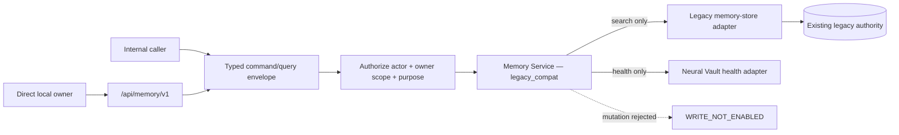

# ADR-001: One Logical Memory Service Boundary

- Status: Accepted for Wave 2
- Date: 2026-07-23
- Scope: JARVIS Memory vNext compatibility phase

## Decision

All new memory work enters through the versioned Memory Service contract. During Wave 2, the boundary runs in `legacy_compat` mode:

- the existing legacy memory system remains the only writable authority;
- vNext creates no canonical database and accepts no mutation command;
- `memory-store` is exposed through a read-only adapter;
- Neural Vault contributes health only because its current `searchMemories` path updates access metadata;
- the HTTP surface is restricted to the direct local owner;
- future command names are declared, but `remember`, `correct`, `forget`, and `pin` fail closed with `WRITE_NOT_ENABLED`;
- no caller receives a database handle or legacy store object through this boundary.

## Invariants

1. `writableAuthority` is `legacy`.
2. `vnextWritesEnabled` and `dualWritable` are always false.
3. `canonicalStoreCreated` is false.
4. Authorization completes before any adapter search.
5. Adapters with `capabilities.write === true` cannot be registered.
6. The Wave 2 compatibility modules import no SQLite driver and issue no SQL; later protected-storage modules remain behind the same contract.
7. Request envelopes reject secret-bearing fields, excessive size, excessive depth, and missing actor/scope/purpose data.
8. Adapter failures are returned as generic availability codes; exception text is not exposed.
9. Telemetry contains operation, timing, counts, and scope class only—never query text or returned memory text.
10. Boundary shutdown does not close legacy stores because it does not own them.

## Why this precedes storage replacement

Replacing storage before introducing a stable contract would produce a second authority and force every existing caller to migrate at once. This boundary makes the eventual Wave 3 store replaceable behind one interface while preserving current behavior. The old system is archived only after staged import, reconciliation, shadow evaluation, writer cutover, and reader cutover pass their gates.

## Consequences

- Existing legacy direct calls still operate and are explicitly grandfathered during migration.
- New production modules may not construct legacy memory stores; the repository boundary guard detects that bypass.
- The compatibility search is not yet the final retrieval engine. It exists to prove contract, authorization, failure, and ownership behavior.
- No Gemini, embedding, or other paid-provider call is made by this boundary.
