# JARVIS Memory Rebuild — Final First-Principles Architecture and Build Specification

**Working name:** JARVIS Cognitive Memory Fabric (JCMF)  
**Codename:** MNEMOSYNE  
**Status:** Authoritative v2 design plan; runtime-memory review incorporated; implementation has not started  
**Research and read-only audit date:** 2026-07-23  
**Runtime architecture revision:** 2026-07-23  
**Scope:** Complete replacement of JARVIS memory storage, live conversation state, ingestion, correction, retrieval, cache coherence, context runtime, consolidation, room awareness, artifact memory, task/agent learning, privacy, observability, synchronization, migration, UI, and evaluation  
**Sequencing rule:** Build, migrate, evaluate, and cut over this memory system first. Only afterward revise the frozen model/runtime plan around the contracts that were actually built.

---

## 0. Executive decision

The correct rebuild is **not a larger memory table, a vector database, a knowledge graph, an Obsidian vault, or a bigger prompt**. It is a local-first memory operating system with seven deliberately separate concerns:

1. **Canonical truth:** typed, provenance-bearing, bitemporal records in one transactional authority.
2. **Live cognitive state:** current topic/branch, referents, open loops, commitments, focused artifacts, task checkpoint, and a protected verbatim turn tail.
3. **Evidence and artifacts:** immutable source captures, precise locators, versioned files, and lineage.
4. **Rebuildable projections:** lexical, vector, graph, timeline, and summary indexes optimized for retrieval but never treated as truth.
5. **Adaptive context runtime:** decides whether memory is needed, retrieves it under a consistency snapshot, and assembles model-specific evidence packs.
6. **Coherent cache fabric:** record, embedding, retrieval, artifact, context, negative, and provider caches with dependency-aware invalidation.
7. **Memory control plane:** deterministic commands, durable workers, consolidation, evaluation, replay, repair, and operator-visible health.

High-volume domain stores such as APEX market data, HELIX research objects, Eclipse graph runs, PC indexing, and raw mission telemetry retain domain ownership. The Memory Fabric receives versioned manifests, meaningful events, claims, decisions, summaries, and stable pointers. It must not duplicate every market tick or debug trace into “memory.”

### 0.1 The one-sentence architecture

> One logical local Memory Service journals live conversational state, accepts typed commands, commits authoritative records plus an outbox atomically to a protected SQLite core, drives idempotent workers and coherent caches, projects truth asynchronously into searchable views, and uses an Adaptive Context Runtime to deliver scoped, reproducible evidence packs with temporal correctness, deletion closure, and influence receipts.

### 0.2 The non-negotiable decisions

| Decision | Final choice | Why |
|---|---|---|
| Truth store | One canonical `memory-core.sqlite` owned by one Memory Service | Ends overlapping authorities and permits real transactions/invariants |
| Runtime location | `%LOCALAPPDATA%\Jarvis\memory-vNext`, outside OneDrive/repository | Live SQLite WAL files must not be synchronized as ordinary cloud files |
| Database | Current SQLite, `STRICT` tables, foreign keys, WAL, `synchronous=FULL` for truth | Best fit for a single-owner local desktop service; simple, ACID, portable |
| Event sourcing | Selective, not universal | Audit corrections/actions/tasks without event-sourcing caches and simple configuration |
| Time model | Bitemporal assertions: valid time + recorded time | Correct answers to “what was true then?” and safe knowledge updates |
| Retrieval | Hybrid exact + FTS5/BM25 + dense/multimodal + temporal graph + reranking | No single retrieval method covers exact, semantic, multi-hop, temporal, and artifact questions |
| Vector store | Rebuildable embedded projection behind an adapter; LanceDB target, exact-scan fallback | Supports local, multimodal, multi-vector growth without making vectors authoritative |
| Graph store | Typed relational nodes/edges in the core first; optional specialized graph projection later | Strong constraints and temporal provenance now; avoid premature graph-server operations |
| Files | Content-addressed blob store plus versioned artifact manifests | Stable identity, deduplication, lineage, integrity, and format independence |
| Sensitive memory | Local-only by default; application AEAD for sensitive fields/blobs; DPAPI-wrapped keys; full-page encryption only through a verified SQLite-compatible build | DPAPI protects keys but does not encrypt SQLite; a paid API key is not permission to upload private memory |
| Gemini use | Provider adapter; paid calls are optional enrichment, embedding, reranking, and consolidation | Memory must still work when Gemini is unavailable, rate-limited, or disabled |
| Corrections | Targeted retraction/supersession with dependency invalidation | Never “correct the latest item in this category” |
| Forgetting | Policy-driven deletion graph with verified removal from every projection and blob | A tombstone in one table is not forgetting |
| Cross-device sync | Signed/encrypted logical events or snapshots; never sync live DB/WAL files | Prevent corruption and make conflicts inspectable |
| CRDTs | Only for concurrently editable documents/layouts, not factual truth | CRDT convergence cannot decide which real-world fact is correct |
| Obsidian | Optional human-readable projection/import surface, never source of truth | Useful for browsing and manual notes; unsafe as the runtime authority |
| Live conversation | Dedicated Conversation State Kernel with event journal, structured working set, checkpoints, and topic/branch lifecycle | Fixed last-N-turn windows lose referents, commitments, branches, and restart state |
| Model context | Adaptive Context Runtime with retrieval-need gating, consistency snapshots, model profiles, citations, and conflict labels | Prevent memory dumps, unnecessary retrieval, prompt bloat, poisoning, and stale mixed-index results |
| Caches | Disposable, scope-separated cache fabric keyed by policy/index/canonical versions with exact dependency invalidation plus epoch fallback | A fast stale or cross-scope answer is a correctness and privacy failure |
| Memory automation | Deterministic Memory Supervisor commands plus durable, idempotent workers | The LLM may propose memory operations but never owns storage invariants |

---

## 1. What “best” means for JARVIS

The system is successful only if it produces visible product behavior, not merely database rows.

### 1.1 Required user outcomes

JARVIS must be able to:

- Remember an explicit fact immediately and recall it in a later session without requiring shared keywords.
- Distinguish the user’s verified facts, preferences, hard instructions, tentative statements, and third-party claims.
- Know the current project, open task, latest artifact, pending decision, and next step without flattening them into global chat memory.
- Continue the active conversational branch, resolve “that file/plan/result,” retain unanswered questions and promises, and resume a suspended branch after restart without replaying the whole transcript.
- Answer temporal questions such as “Where did I live last year?” and “What did we believe before the correction?”
- Accept “No, that was wrong; X is true” and retire precisely the contradicted assertion while preserving the audit trail.
- Abstain when no supported memory exists instead of manufacturing familiarity.
- Explain where a remembered item came from, when it was learned, whether it is still current, and whether it influenced the answer.
- Remember what happened in HELIX, APEX, Forge, Eclipse, Device Mesh, and co-op sessions without copying their entire databases into a personal-memory bucket.
- Find a report, dataset, image, slide, code file, source passage, chart, or generated artifact from a natural-language description.
- Resume a multi-step mission from an exact checkpoint, including completed steps, tool receipts, pending approvals, artifacts, and failures.
- Learn a reusable procedure only from validated outcomes; one failed trajectory must not become a permanent rule.
- Respect project/room/thread/agent/privacy boundaries before retrieval, not after an LLM sees the data.
- Show and manage memory in a serious UI: inspect, correct, pin, scope, expire, export, forget, trace, and test.
- Continue functioning with lexical/exact retrieval and local state when Gemini or the internet is unavailable.
- Continue functioning correctly after every disposable cache is purged; caches may change speed/cost, never truth.
- Explain whether it used only working context, retrieved memory, a live domain query, or deep/multi-hop recall and which consistency snapshot supported the result.

### 1.2 Quality attributes

| Attribute | Required property |
|---|---|
| Correctness | Current truth, historical truth, and uncertainty are different query modes |
| Provenance | Every derived memory reaches immutable evidence or an explicit user action |
| Extensibility | New rooms/types add schemas and projectors through versioned contracts, not edits across the entire server |
| Cost | Zero paid calls for greetings, exact recall, routine state reads, corrections, and most writes |
| Latency | Memory must not make instant chat feel like deep research |
| Privacy | Sensitive records are local-only unless the user explicitly changes policy |
| Resilience | Canonical writes survive projection/model failure and can be replayed |
| Auditability | Every retrieval, mutation, correction, deletion, and learned procedure is inspectable |
| Deletability | Forget requests close over indexes, summaries, graph edges, caches, and blobs |
| Portability | Export is documented, versioned, and does not require a proprietary memory vendor |
| Testability | Retrieval and update behavior can be evaluated independently of answer style/model quality |
| Conversational continuity | Branches, referents, open loops, commitments, focus, and checkpoints survive compaction/restart |
| Cache coherence | No stale or cross-scope hit can masquerade as current canonical knowledge |
| Evolvability | Storage, workers, caches, retrievers, models, and rooms change behind versioned contracts and replay gates |

---

## 2. Read-only cross-reference of the current system

This inventory describes the data JARVIS produces today. It is input to the new design, not a requirement to preserve old table boundaries.

### 2.1 Physical inventory snapshot

The primary runtime databases currently occupy about **927 MiB before WAL files**. The largest stores are:

| Current store | Approximate main-file size | Important row counts | What it currently represents |
|---|---:|---:|---|
| `jarvis-missions.sqlite` | 671.47 MiB | 15,898 missions; 272,776 mission events | Mission state and extremely verbose operational event history |
| `memory/jarvis_memory.sqlite` | 175.28 MiB | 5,276 debug traces; one conversation-state row | Debug/answer traces presented as a memory-adjacent store |
| `apex.sqlite` | 29.18 MiB | 8,000 universe; 11,449 news events; 8,769 stories; 2,242 impacts | APEX market/news domain data |
| `neural_vault.sqlite` | 27.59 MiB | 832 memories; 205 `ms_memories`; 643 memory objects; 56,650 access-log rows | Overlapping memory, capability, device, co-op, file, skill, profile, and governance concepts |
| `jarvis-skills.sqlite` | 11.79 MiB | 11 skills; 3,098 runs | Compiled/reusable skills and executions |
| `jarvis-pc-graph.sqlite` | 8.42 MiB | 1,215 nodes; 1,200 edges | Local file/system knowledge graph |
| `jarvis-memory.sqlite` | 1.57 MiB | 175 memories; 8,782 terms | Older/dormant short-term memory implementation |
| `helix.sqlite` | 1.09 MiB | 4 projects; 71 logical tables; current research objects listed below | HELIX research workspace |
| `eclipse-checkpoints.sqlite` | 0.40 MiB | 36 checkpoints; 184 writes | LangGraph-style execution checkpoints |

The live mission WAL was approximately **124 MiB** during the audit. Other WALs were typically 1–5 MiB. All inspected databases passed `PRAGMA quick_check`, use WAL, and report `synchronous=NORMAL`. The SQLite library was version 3.53.2, which is newer than the 3.51.3 fix for SQLite’s rare 2026 WAL-reset bug.

### 2.2 Current logical authorities and overlap

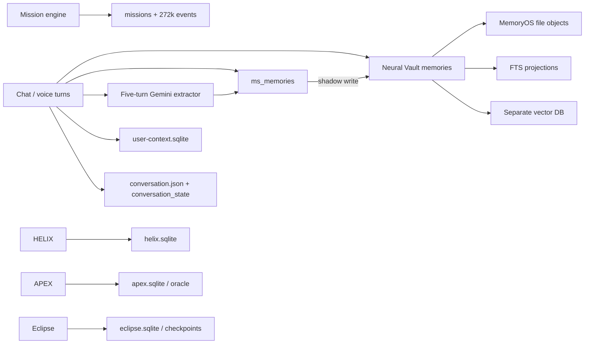

The problem is not that there are multiple databases. Multiple domain stores are reasonable. The problem is that several stores independently claim to be the authority for the same personal fact, conversation continuity, memory object, or correction.

### 2.3 Current Neural Vault coverage

The Neural Vault database has 97 physical tables (including FTS internals) and 77 logical tables. It currently mixes:

- long-term memories, `ms_memories`, terms, entity mentions, and access logs;
- profile items, projects, continuity, carryover summaries, and referent candidates;
- MemoryOS objects, file indexes, object parents, agents, and maintenance runs;
- action macros, browser workflows, capability memory, integrations, and API-key metadata;
- skills, task-to-skill candidates, procedures, and run tables;
- device mesh and co-op sessions/events/messages/patches/permissions;
- local file registry/operations/sessions;
- artifacts, sources, entities, relationships, beliefs, and episodes.

Key observed coverage gaps:

- 832 `memories`, 750 active; all used the `global` scope.
- 205 active `ms_memories` form a second personal-memory authority.
- 88 vectors covered roughly 11.6% of active memories.
- 643 MemoryOS objects existed, but there were only two parent links, zero `memory_edges`, zero MemoryOS entities, zero MemoryOS agent runs, and one query record.
- 56,650 access-log rows all had `used_in_answer=0`; influence is therefore not measured.
- 1,560 referent candidates existed, but continuity remained global rather than project-scoped.
- Zero belief revisions and zero canonical episodes existed.
- The code initializes `memoryStore` and `memoryExtractor`, then recreates both after the Neural Vault bridge is available.

### 2.4 User-context data that must be represented safely

The current `user-context.sqlite` schema anticipates identity, contact methods, contacts, devices, documents, facts, goals, health profile/metrics, locations, patterns, preferences, routines, subscriptions, trips, accounts, session state, and vault references. The live data contains one identity, one core memory block, two preferences, and one location; most other categories are empty.

This is an important taxonomy signal but not a safe implementation. Highly sensitive fields share a plain local schema, foreign keys are not declared, and “always in context” profile text can make stale or seeded values look authoritative.

### 2.5 HELIX data that Memory Fabric must understand

HELIX already models a serious research domain even though much of the workflow is unpopulated:

- projects, folders, folder items, segments, entries, inquiries, questions, plans, subquestions;
- sources, source pointers, files, file claims, evidence, assertions, hypotheses, contradictions, confidence assessments;
- analyses, decisions, reviews, risks, scenarios, causal chains, strategy options, triangulations, red-team sessions;
- operations, runs, workflow runs/node runs, tool results, retrieval events, manifests;
- artifacts, objects, citations, deep briefs, capsules, living briefs, sessions, vault items;
- entities, relations, vectors, FTS, signals, alerts, pattern scans, oracle queries, custom agents.

Live population at audit time included 4 projects, 14 entries, 13 inquiries, 22 sources, 20 evidence objects, 20 source pointers, 7 artifacts/manifests/operations, 5 decisions, 5 runs, 23 retrieval events, 44 sessions, and zero citations/vectors/entity edges/deep briefs/capsules. All 14 entries belonged to one project and were not assigned through folder items.

The new memory system must make HELIX results visible to JARVIS through manifests and claims, not by treating every internal Gemini call as a global personal conversation.

### 2.6 APEX, Forge, and Oracle data

APEX stores high-volume and rapidly changing domain state: universe instruments, live quotes, bars, news events/stories/impact, sources, strategies, signals, variables, catalog datasets, bots, orders, fills, positions, paper-account equity, reports, and health. Oracle separately stores predictions, outcomes, calibration, feature cache, news log, and relationships.

These records should remain in APEX. Memory Fabric should store:

- the user’s strategy intent and constraints;
- strategy/report/artifact versions and lineage;
- decisions, test outcomes, accepted/rejected hypotheses, and lessons;
- stable dataset/source manifests and query pointers;
- current open work and important alerts;
- summaries of market sessions only when admitted by policy.

It should not copy the 8,000-instrument universe or every news/quote row into personal memory.

### 2.7 Eclipse, agent, task, file, device, and co-op data

- Eclipse contains graph runs, node runs, receipts, claims, evidence edges/objects, capability leases, reputation, semantic memory, personas, and artifact manifests. Its checkpoint DB contains durable thread/channel writes.
- Mission storage contains a valuable task model but conflates durable task history with 272k operational messages.
- PC graph contains file nodes, edges, summaries, and full text; this is a domain index, not personal memory.
- Skills contain definitions, versions, reliability, tests, and runs; these belong to procedural/experience memory through validated contracts.
- Device Mesh/co-op contain devices, permissions, sessions, stream/control events, inbox items, messages, patches, file access, tasks, replays, and memory packets. Shared memory must be capability- and scope-limited.

### 2.8 Structural findings that the rebuild must eliminate

1. Multiple writable authorities for the same conceptual fact.
2. Global scope as a default, causing room and internal-agent contamination.
3. LLM extraction that runs on a fixed five-turn counter rather than semantic boundaries and durable intent.
4. Direct provider calls outside the shared model/cost/privacy gateway.
5. Correction by “latest kind/category,” which can supersede the wrong subject.
6. Forget/supersede operations that do not close over FTS, vectors, graph edges, summaries, files, and room projections.
7. Vector rows without source version, chunk identity, status, deletion propagation, or complete coverage.
8. Graph tables and agent labels that overstate implemented behavior.
9. Retrieval confidence inferred from result count rather than evidence quality.
10. Access logging without a second-stage “actually used in answer” signal.
11. File and database representations that can diverge without an atomic commit boundary.
12. High-value task events mixed with debug noise, producing a 671 MiB mission DB and a 124 MiB WAL.
13. Very few declared foreign keys: 3 across the 97-table Neural Vault, 0 in user context, missions, APEX, and Eclipse, and 29 across HELIX.
14. Live runtime databases stored under a OneDrive-synchronized repository.
15. Misleading implementation comments: the code calls Neural Vault “704 MB,” while the audited Neural Vault main file is about 27.6 MiB and the mission DB is the ~671 MiB store.

---

## 3. Research synthesis: what to adopt and what not to copy blindly

### 3.1 Cognitive and agent-memory research

| Work | Useful idea | JARVIS adoption | Necessary caution |
|---|---|---|---|
| [CoALA](https://arxiv.org/abs/2309.02427) | Modular working, episodic, semantic, and procedural memory with structured internal/external actions | Use a typed taxonomy and explicit memory actions | It is an organizing framework, not a production database design |
| [MemGPT](https://arxiv.org/abs/2310.08560) | OS-inspired tiers and virtual context management | Use hot/working, warm/indexed, and cold/archive tiers plus a context compiler | Do not let the model freely rewrite canonical truth |
| [Generative Agents](https://arxiv.org/abs/2304.03442) | Memory stream; relevance, recency, importance; reflection and planning | Use episodic streams and scheduled reflection with evidence links | Importance/recency alone are inadequate for truth or scope |
| [Reflexion](https://arxiv.org/abs/2303.11366) | Store verbal feedback from task outcomes | Add validated experience cases and lessons | Self-critique is not automatically correct and must not become policy without outcome evidence |
| [A-MEM](https://arxiv.org/abs/2502.12110) | Zettelkasten-style contextual notes, tags, dynamic links, evolving representations | Use structured notes and dynamic relationship projections | Historical derived notes cannot be silently mutated; preserve versions and provenance |
| [Mem0](https://arxiv.org/abs/2504.19413) | Extract, consolidate, retrieve salient information; graph variant | Use candidate extraction and consolidation behind policy | Vendor-authored benchmark claims are signals, not final proof; evaluate on JARVIS data |
| [MemOS](https://arxiv.org/abs/2505.22101) | Memory as a first-class operational resource with standardized containers | Use versioned envelopes, lifecycle operations, migration/export contracts | Avoid inventing a monolithic “memory OS” that absorbs unrelated domain stores |
| [Graphiti/Zep](https://arxiv.org/abs/2501.13956) | Temporal knowledge graph, episodic provenance, fact invalidation, hybrid retrieval | Use bitemporal assertions and provenance-bearing relationship edges | Keep graph extraction governed; a graph edge produced by an LLM is still a claim |
| [HippoRAG](https://arxiv.org/abs/2405.14831) | Knowledge graph plus Personalized PageRank for multi-hop retrieval | Add bounded graph expansion/PPR for genuine multi-hop queries | Do not pay graph-expansion cost on ordinary personal recall |
| [Microsoft GraphRAG](https://microsoft.github.io/graphrag/query/overview/) | Local, global, DRIFT, and basic retrieval lanes | Apply to HELIX/artifact corpora and route by query type | Global community map-reduce is resource-intensive and inappropriate for every chat turn |
| [TriMem](https://arxiv.org/abs/2605.19952) | Raw dialogue, atomic facts, and synthesized profiles coexist at different granularities | Preserve all three representations with source coverage and versioned profile synthesis | A profile is a derived view, not a replacement for raw evidence or typed truth |
| [Hierarchical Long-Term Semantic Memory](https://arxiv.org/abs/2604.26197) | Schema-aligned hierarchical memory supports low-latency, privacy-aware retrieval at multiple levels | Add owner/project/topic/entity trees and coarse-to-fine retrieval | Production claims are a design signal; JARVIS must reproduce gains on its own workload |
| [ProactAgent](https://arxiv.org/abs/2604.20572) | Retrieval can be an explicit policy action chosen when it improves the next decision | Add a value-of-information retrieval gate and mid-task retrieval checkpoints | Begin with inspectable rules; do not deploy an opaque learned controller without safe counterfactual evaluation |
| [MemRL](https://arxiv.org/abs/2601.03192) | Two-stage semantic relevance plus learned utility can suppress similar but unhelpful experiences | Record outcome-conditioned retrieval utility and use it as one ranking feature | Utility never overrides permission, temporal validity, provenance, or exact truth |

### 3.2 Evaluation research

The minimum evaluation surface must exceed “can it retrieve a similar sentence?”

- [LongMemEval](https://arxiv.org/abs/2410.10813) tests information extraction, multi-session reasoning, temporal reasoning, knowledge updates, and abstention. It reports major drops for long-context and commercial assistants and finds value in session decomposition, fact-augmented keys, and time-aware query expansion.
- [LoCoMo](https://aclanthology.org/2024.acl-long.747/) covers very long-term, multi-session, and multimodal conversational memory.
- [MemoryAgentBench](https://arxiv.org/abs/2507.05257) adds accurate retrieval, test-time learning, long-range understanding, and selective forgetting.
- [MemBench](https://arxiv.org/abs/2506.21605) evaluates factual and reflective memory across participation/observation scenarios, including effectiveness, efficiency, and capacity.

JARVIS must run these where practical, but none is sufficient alone. Public benchmarks may contain judge-model or labeling weaknesses and do not cover JARVIS room manifests, file lineage, permissions, tool receipts, device sync, or deletion closure. A private `JarvisMemoryBench` is mandatory.

### 3.3 Retrieval research

- FTS/BM25 is required for names, file paths, identifiers, quotes, error text, tickers, and exact terms.
- Dense embeddings are required for paraphrase and cross-modal similarity but must be versioned because model spaces are incompatible.
- [Reciprocal Rank Fusion](https://cormack.uwaterloo.ca/cormacksigir09-rrf.pdf) is a strong, transparent baseline for combining ranked lists without pretending incomparable scores are calibrated.
- [HNSW](https://arxiv.org/abs/1603.09320) is useful at scale but approximate search has recall/filtering trade-offs. Exact search remains the correctness oracle for evaluation and small corpora.
- [ColBERT](https://dl.acm.org/doi/10.1145/3397271.3401075) and late interaction can improve difficult retrieval after candidate generation; it should be benchmark-gated, not the default cost.
- [Late Chunking](https://arxiv.org/abs/2409.04701) shows how naive independent chunks lose document context.
- [ColPali](https://arxiv.org/abs/2407.01449) demonstrates direct visual-page retrieval for layout-rich documents. This is important for PDFs, slides, charts, and scanned material.

### 3.3.1 Conversation state, cache, and runtime-memory findings

- [LangGraph persistence](https://langchain-ai.github.io/langgraph/concepts/time-travel/) separates thread-scoped checkpoints from cross-thread stores. JARVIS adopts the separation but uses its own typed contracts and authority rules.
- [LangMem](https://langchain-ai.github.io/langmem/) distinguishes hot-path memory tools from background extraction/consolidation. JARVIS adopts both lanes but never gives model-written memory automatic canonical authority.
- [Letta's context hierarchy](https://docs.letta.com/guides/core-concepts/memory/context-hierarchy) validates the practical distinction between always-visible blocks, searchable files, archival memory, and external RAG. JARVIS uses attachable context blocks only as derived runtime views with strict token, scope, and version limits.
- [Gemini context caching](https://ai.google.dev/gemini-api/docs/caching) reuses precomputed input tokens and can reduce latency/cost. It is a provider computation cache, can expire, and is never memory truth.
- [SmartCache](https://papers.nips.cc/paper_files/paper/2025/hash/fb74b63d225f846e6032bf3e3ab0f4ec-Abstract-Conference.html) shows why query-only semantic response caching is unsafe for multi-turn dialogue: conversational context must participate in the match. JARVIS defaults to caching retrieval products and context manifests, not final personal answers.
- [TinyLFU](https://doi.org/10.1109/PDP.2014.34) provides a compact frequency-based cache-admission baseline. JARVIS may use Window-TinyLFU behind a cache-policy adapter, but eviction policy is workload-benchmarked rather than hard-coded into the architecture.

These sources support a runtime design with separate working state, durable memory, background consolidation, and caches. They do not justify letting an agent freely rewrite its own identity, owner directives, evidence, or permissions.

### 3.4 Storage and reliability research

- [SQLite’s own guidance](https://www.sqlite.org/whentouse.html) explicitly fits local application/device storage with low writer concurrency. It also advises client/server storage for many concurrent writers or network-separated data.
- [SQLite WAL](https://sqlite.org/wal.html) permits concurrent readers and one writer, requires checkpoint management, and must remain on one host. SQLite disclosed a rare WAL-reset race fixed in 3.51.3; the current 3.53.2 runtime passes that version gate.
- [SQLite online backup](https://sqlite.org/backup.html) or `VACUUM INTO` must create consistent snapshots. Copying a live `.sqlite` file independently from its WAL is not a backup.
- [SQLite STRICT tables](https://www.sqlite.org/stricttables.html), checks, foreign keys, and `quick_check`/`integrity_check` provide enforceable local invariants.
- [Event sourcing guidance](https://learn.microsoft.com/en-us/azure/architecture/patterns/event-sourcing) explicitly warns that the pattern is complex and should be adopted only where audit/history justify it. Therefore JARVIS uses selective streams for facts, tasks, policies, artifacts, and actions—not for caches or every telemetry row.
- The [transactional outbox](https://learn.microsoft.com/en-us/azure/architecture/databases/guide/transactional-out-box-cosmos) converts a fragile state-write-plus-publish dual write into one atomic commit plus a durable, idempotent relay.
- Bitemporal databases distinguish real-world validity from database-recording history; see the [IEEE access-method paper](https://doi.org/10.1109/69.667079) and [Bitemporal History](https://martinfowler.com/articles/bitemporal-history.html).

### 3.5 Privacy and security research

- The [NIST Privacy Framework](https://www.nist.gov/document/nist-privacy-frameworkv10pdf) requires data to be reviewable, alterable, deletable, destroyed by policy, and accompanied by processing permissions.
- [NIST key-management guidance](https://csrc.nist.gov/projects/key-management/key-management-guidelines) treats key generation, storage, use, rotation, and destruction as a lifecycle.
- Windows [DPAPI](https://learn.microsoft.com/en-us/dotnet/standard/security/how-to-use-data-protection) can bind protected key material to the current user or machine; it reduces but does not eliminate backup/key-recovery design.
- [OWASP’s prompt-injection guidance](https://cheatsheetseries.owasp.org/cheatsheets/LLM_Prompt_Injection_Prevention_Cheat_Sheet.html) identifies context/RAG poisoning and multimodal injection. [OWASP Agent Memory Guard](https://owasp.org/www-project-agent-memory-guard/) treats persistent memory as an integrity-sensitive attack surface.

### 3.6 Gemini and local model findings

- Gemini’s current [Embedding 2 documentation](https://ai.google.dev/gemini-api/docs/embeddings) supports text, images, video, audio, and PDFs in one space, with 768/1536/3072 dimensions recommended. Its embedding space is incompatible with Embedding 1, so migration requires a full re-embed.
- The [Gemini Batch API](https://ai.google.dev/gemini-api/docs/batch-api) supports embedding batches and is priced at 50% of interactive processing, with a target turnaround up to 24 hours. Use it for non-urgent backfills, not immediate recall.
- [BGE-M3](https://arxiv.org/abs/2402.03216) supports dense, sparse, and multi-vector retrieval across 100+ languages and long inputs. [Nomic Embed](https://arxiv.org/abs/2402.01613) offers an auditable local long-context alternative.

The target is therefore a provider-neutral embedding contract with a privacy router and an internal bake-off. Gemini Embedding 2 is the preferred cloud-eligible multimodal lane; a local model is the default for sensitive text. Neither model name is allowed to appear as an invariant in canonical schemas.

---

## 4. Core design laws

These are architectural invariants, not suggestions.

1. **Evidence precedes belief.** Derived assertions reference evidence or an explicit owner action.
2. **Model output is a proposal.** An LLM can produce candidates, links, summaries, and scores; policy code decides what becomes active.
3. **Retrieval indexes are disposable.** FTS, vectors, graph communities, and summaries can be deleted and rebuilt from canonical records.
4. **Scope is mandatory.** No memory write defaults silently to global.
5. **Time has two axes.** “When true” and “when learned/recorded” are stored separately.
6. **Confidence is decomposed.** Source reliability, extraction confidence, corroboration, user confirmation, and freshness are not one magical number.
7. **Corrections never mutate history.** They close/retract a version and create a new version with a causal link.
8. **Forget means closure.** Canonical content, blobs, FTS, vectors, graph edges, caches, summaries, and exports are addressed.
9. **Hard instructions are not inferred preferences.** Only the owner can create protected directives.
10. **Untrusted content cannot become instructions.** Web pages, files, email, images, and tool output remain data regardless of what they say.
11. **Working state is not long-term memory.** It expires unless explicitly promoted.
12. **Telemetry is not autobiographical memory.** Keep debug streams out of the cognitive store.
13. **Domain data stays with its domain.** Memory stores manifests, meaning, decisions, and pointers.
14. **Every context pack is reproducible.** It records query, policy, candidates, ranks, selected items, versions, and token budget.
15. **Every answer influence is measurable.** Retrieval and actual use are separate events.
16. **Paid calls are optional accelerators.** The canonical write path cannot depend on an external model succeeding.
17. **One writer owns invariants.** Other modules use commands/events, not direct SQL.
18. **Schema evolution is explicit.** Every event, object, policy, projector, model, and extraction prompt has a version.
19. **Backups are tested restores.** A copied file is not evidence of recoverability.
20. **Complexity must buy capability.** GraphRAG, rerankers, CRDTs, and agentic consolidation are routed only where their measured benefit exceeds cost and risk.
21. **Conversation continuity is structured state.** Recent text, topic branches, referents, open loops, commitments, focus, and checkpoints are maintained separately and source-linked.
22. **Retrieval is an action, not a reflex.** A retrieval-need gate may choose none, exact, local hybrid, live domain, or deep retrieval based on expected value, latency, privacy, and cost.
23. **Caches never become authorities.** Every cache is disposable, scoped, version-keyed, observable, and invalidated by canonical changes.
24. **No mixed freshness without disclosure.** Each retrieval/context pack records the canonical sequence, policy version, and projection epochs it used.
25. **Workers are at-least-once and idempotent.** Exactly-once claims are forbidden; ordering, leases, retries, dedupe, and side-effect receipts are explicit.
26. **Consolidation is governed derivation.** Sleep/reflection jobs create versioned proposals with source coverage and replay tests; they do not silently rewrite truth.
27. **Learning is outcome-gated.** Retrieval utility and procedures can adapt only from measured outcomes, with rollback and regression protection.
28. **Operational visibility begins on day one.** Queue lag, cache freshness, consistency, privacy, cost, and restore health exist before advanced retrieval.

---

## 5. Target system topology

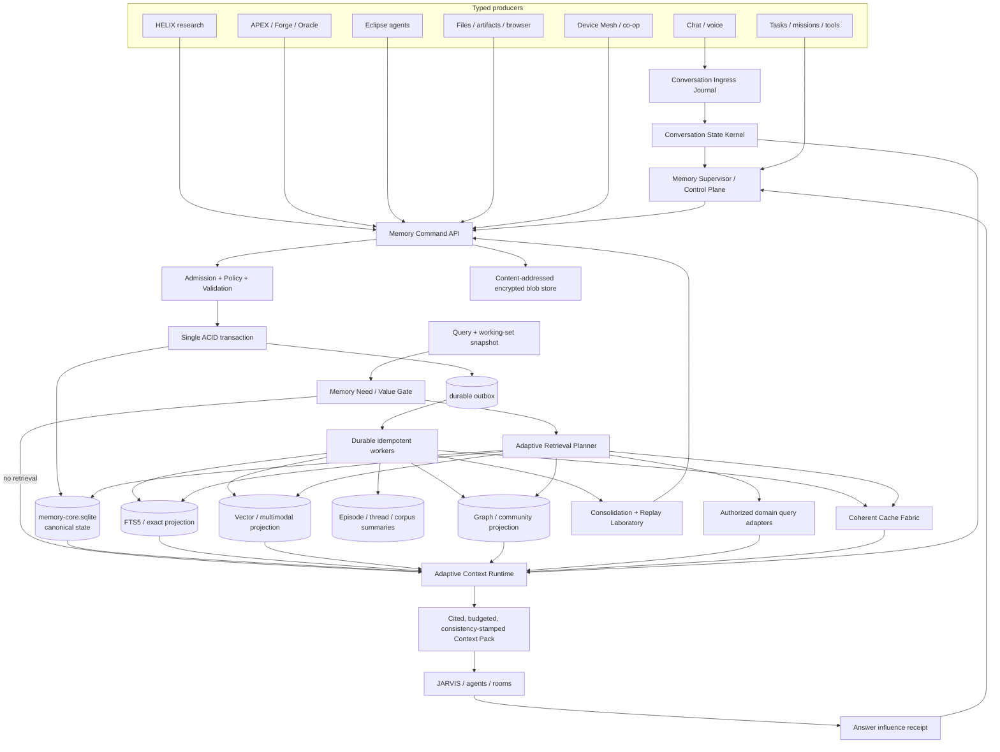

### 5.1 Process boundary

Create a dedicated in-process service module first, with a stable API that can later move to a separate local process without changing callers. It owns:

- the canonical database connection and all write transactions;
- schema migrations and compatibility checks;
- admission, scope, privacy, and retention policy;
- the outbox and job queue;
- the conversation journal, Conversation State Kernel, and checkpoint lifecycle;
- retrieval-need gating, adaptive planning, and context compilation;
- cache namespace, dependency, epoch, admission, and invalidation policy;
- worker leases, ordering, backpressure, dead letters, and replay;
- governed consolidation and predictive staging;
- encryption/key access;
- backup/restore and integrity maintenance;
- metrics and health.

No room, tool, agent, widget, or model pipeline may open `memory-core.sqlite` directly.

### 5.2 Physical directory

```text
%LOCALAPPDATA%\Jarvis\memory-vNext\
  core\
    memory-core.sqlite
    memory-core.sqlite-wal
    memory-core.sqlite-shm
  blobs\
    sha256\ab\cd\<full-hash>.blob
  projections\
    lexical.sqlite
    vectors.lance\
    graph-cache.sqlite
    summaries.sqlite
  cache\
    metadata.sqlite
    artifacts\
  checkpoints\
    conversations\
  journals\
    quarantine\
    imports\
  backups\
    local\
  locks\
  diagnostics\
```

OneDrive may receive **closed, encrypted, checksummed backup packages** after the backup API completes. It must not receive live `core`, WAL, projection, or lock files.

### 5.3 Tier model

| Tier | Contents | Latency | Durability | Model calls |
|---|---|---:|---|---|
| L0 turn buffer | Immutable new turn, attachments, UI/room/task focus, active capability set | sub-ms | journaled immediately | none |
| L1 conversation working set | Verbatim tail, topic/branch stack, referents, open loops, commitments, focus, task/agent checkpoints | sub-ms to low-ms | checkpointed | none |
| L2 canonical hot | Active identity/preferences/goals/assertions/recent episodes | low-ms | full | none |
| L3 coherent caches and projections | Record/context/artifact caches, FTS, embeddings, graph expansion, artifact parts | low to medium | disposable/rebuildable | query embedding only if cache miss |
| L4 domain recall | HELIX/APEX/Eclipse/file adapters | medium | domain-owned | only if domain operation requires it |
| L5 archive | Raw captures, old episodes, retired assertions, cold blobs | medium to high | full/encrypted | background only |
| L6 external enrichment | Web, paid embeddings, reranking, consolidation | variable | cached with provenance | explicitly budgeted |

The tiers are lifecycle classes, not separate truths. Promotion and demotion are explicit events: turn buffer to working set, working set to episode candidate, candidate to canonical memory, hot canonical record to archive, and archive back to a staged working set when a task resumes.

---

## 6. Memory taxonomy

### 6.1 Canonical classes

| Class | Purpose | Examples | Default lifetime | Write authority |
|---|---|---|---|---|
| Identity | Stable owner identity | preferred name, pronouns, verified home timezone | until corrected | owner or verified import |
| Directive | Hard behavioral requirement | “Never send without approval” | until revoked | owner only |
| Preference | Soft, contextual tendency | response length, UI taste, food preference | review/decay | owner or evidence-backed inference |
| Semantic assertion | Claim about a subject | project uses Node; contact works at X | bitemporal | owner, trusted source, governed extraction |
| Goal/commitment | Intended future state | finish memory rebuild; call someone Friday | until completed/cancelled/expired | owner/task system |
| Episode | Bounded event with participants and evidence | completed research run, meeting, deployment | retention policy | event/episode builder |
| Working state | Immediate scratch/continuity | active file, unresolved referent, partial tool output | minutes/hours/task | runtime |
| Task checkpoint | Recoverable execution state | step 3 complete; approval pending | task lifetime + archive | task engine |
| Procedure | Validated reusable method | browser workflow, research method | versioned | promotion gate |
| Experience case | Trajectory + outcome + lesson | failed selector, corrected recovery | review/decay | evaluator/owner |
| Entity | Canonical real or digital object | person, project, room, file, company, ticker | durable | resolver + governance |
| Relationship | Typed, temporal relation | works-at, part-of, created-by | bitemporal | evidence-backed |
| Source/evidence | Captured support with locator | URL passage, PDF page, tool receipt | retention policy | ingestion/tool gateway |
| Claim/analysis | Derived proposition | HELIX conclusion, Eclipse claim | versioned/contested | room/agent with evidence |
| Artifact | Versioned output and its parts | report, slide deck, image, code, dataset | durable | artifact service |
| Conversation | Thread/turn structure and summaries | chat session, topic segment | policy | conversation service |
| Agent/session | Delegated state and boundaries | agent role, lease, checkpoint, result | mission lifetime | orchestrator |
| Domain manifest | Stable pointer into room/domain data | HELIX research package, APEX report | versioned | owning room |
| Negative/constraint memory | Known invalid option or prohibition | rejected approach, unsafe selector | review/expiry | owner/evaluator |

### 6.2 Explicit separation of directives and preferences

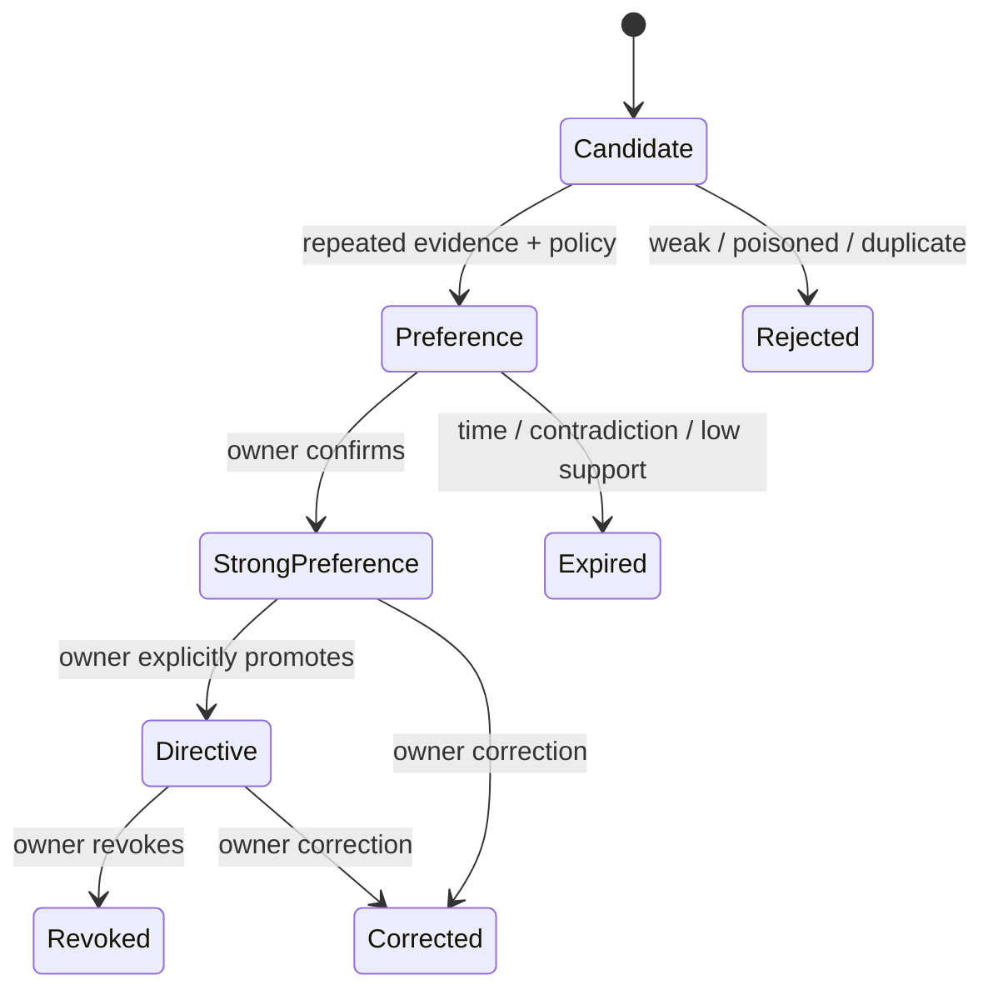

An inferred preference can adjust style. It cannot silently become a permission, prohibition, financial rule, or tool authority.

### 6.3 Scope lattice

Every record has an explicit scope; visibility is computed before retrieval.

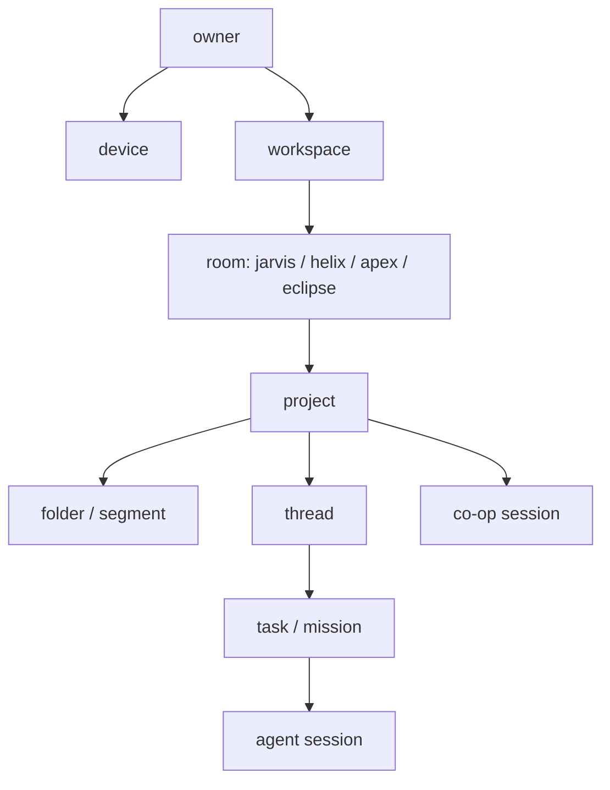

Scope is represented as typed nodes plus `scope_edges`, not a nullable `project_id` and a string defaulting to `global`. Cross-scope visibility requires an explicit policy edge or manifest.

### 6.4 Sensitivity and cloud eligibility

| Sensitivity | Examples | Cloud default | Export/share default |
|---|---|---|---|
| Public | public URLs, published papers | allowed | allowed |
| Internal | project notes, code summaries | local preferred | owner approval |
| Private | personal preferences, conversations | denied | denied |
| Restricted | health, finance, credentials, exact location, private contacts | denied; local model only | explicit one-time approval |
| Secret reference | API key/vault credential locator | content never stored | never |

API keys are not memory. Store provider/key metadata and a reference to the OS credential vault; never store key content, even encrypted in an LLM-retrievable database.

---

## 7. Data ownership: one cognitive authority without one giant database

| Data | Canonical owner | What Memory Fabric stores |
|---|---|---|
| User identity/preferences/directives/goals | Memory Core | Full typed record and history |
| Conversation turns | Conversation domain + Memory Core event/segment metadata | Turn references, admitted evidence, topic segments, summaries |
| Active task/checkpoint | Task service | Current checkpoint mirror, task episode, decisions, result artifact links |
| Raw mission debug events | Telemetry/operations store | Only significant typed events and aggregate metrics |
| HELIX sources/evidence/analyses | HELIX | Research package manifest, stable claims/decisions, artifact/source pointers |
| APEX market/news/ticks | APEX | Strategy intent, decisions, reports, test outcomes, noteworthy episodes/pointers |
| Forge strategies/improver tree | Forge/APEX | Strategy version, branch lineage, accepted/rejected changes, metrics, lessons |
| Eclipse run graph/checkpoints | Eclipse | Mission manifest, validated claims, evidence pointers, artifacts, learned cases |
| PC/file index | File Knowledge service | Artifact/file identity, content hash, semantic purpose, authorized pointers |
| Skills/procedures | Skill service + Memory Core procedure registry | Version, trigger, constraints, evidence, reliability, promotion state |
| Device/co-op transport | Mesh/co-op | Session manifests, permissions, decisions, shared memory packets, replay pointers |
| Raw files/media | Artifact blob store or owning filesystem | Content hash, URI, versions, extracted parts, permissions, lineage |
| Retrieval vectors/FTS | Projection services | Nothing authoritative; projector cursor/model metadata only |

This is **logical unification through contracts**, not indiscriminate physical centralization.

---

## 8. Canonical envelope and identity model

Every canonical object uses a common envelope:

```ts
type MemoryEnvelope<T> = {
  id: string;                 // UUIDv7/ULID: sortable, globally unique
  type: string;               // registered namespaced type
  schemaVersion: number;
  scopeId: string;            // required
  ownerSubjectId: string;
  sensitivity: "public" | "internal" | "private" | "restricted";
  cloudPolicy: "allow" | "deny" | "ask";
  status: "candidate" | "active" | "contested" | "superseded" |
          "retracted" | "expired" | "quarantined";
  sourceIds: string[];
  provenance: Provenance;
  retentionPolicyId: string;
  validFrom: string | null;
  validTo: string | null;
  recordedFrom: string;
  recordedTo: string | null;
  contentHash: string;
  createdBy: ActorRef;
  payload: T;
};
```

### 8.1 Identifier rules

- IDs never encode mutable labels or paths.
- File identity is content hash + artifact/version ID; a path is a locator, not identity.
- URL identity separates canonical locator, capture time, response hash, and publication time.
- Entity aliases are versioned observations, not a JSON text field searched with `LIKE`.
- Provider/model IDs live in provenance, never in the semantic identity of a memory.
- Every stream has a monotonic `stream_sequence`; cross-device events additionally carry a hybrid logical clock.

### 8.2 Provenance object

```ts
type Provenance = {
  originEventId: string;
  sourceType: "owner_statement" | "conversation" | "file" | "web" |
              "tool_receipt" | "room_manifest" | "import" | "model_derivation";
  sourceLocator?: SourceLocator;
  actorId: string;
  deviceId: string;
  sessionId?: string;
  taskId?: string;
  agentId?: string;
  modelProvider?: string;
  modelId?: string;
  promptTemplateVersion?: string;
  extractorVersion?: string;
  capturedAt: string;
  derivedFromIds: string[];
};
```

### 8.3 Confidence is a vector, not a scalar

Store components independently:

```ts
type ConfidenceBreakdown = {
  extraction: number;         // did parsing preserve the statement?
  sourceReliability: number;  // how reliable is the source class?
  corroboration: number;      // independent support
  freshness: number;          // domain-specific staleness
  userConfirmation: number;   // explicit owner confirmation
  contradictionPenalty: number;
  computed: number;           // derived, never edited directly
  policyVersion: string;
};
```

The UI may show a simple label, but the database must retain the components and policy version.

---

## 9. Canonical relational schema

The exact DDL will be migration-versioned. The following is the required logical schema.

### 9.1 Foundation tables

| Table | Key fields | Purpose |
|---|---|---|
| `schema_registry` | type, current_version, JSON schema, migration handler | Extensible typed payload contracts |
| `actors` | id, actor_type, owner/device/agent refs | Who caused a change |
| `scopes` | id, type, name, owner, status | Mandatory containment/visibility units |
| `scope_edges` | parent, child, relation, policy | Explicit inheritance and room/project/thread relations |
| `policies` | id, version, kind, expression, effect | Admission, privacy, retention, share, cloud rules |
| `grants` | actor, capability, resource pattern, expiry | Non-LLM access enforcement |
| `ledger_events` | event id, stream, sequence, type, payload, hash/HMAC, time | Selective append-only audit/history |
| `outbox_events` | event id, projector targets, attempts, lease, status | Atomic projection/event relay |
| `jobs` | type, priority, dedupe key, payload, lease, retry policy | Durable background work |
| `projection_cursors` | projector, event sequence, version, health | Replay/rebuild state |

### 9.2 Sources and evidence

| Table | Required fields |
|---|---|
| `sources` | id, type, title, canonical locator, publisher/author, publication/capture times, content hash, trust zone, reliability, freshness, access policy, version/supersedes |
| `source_captures` | source id, capture version, headers/metadata, blob id, extractor status, checksum |
| `evidence_units` | source capture id, modality, exact locator, quote/text hash, context, page/section/line/bbox/timecode/cell/commit/tool-result locator |
| `evidence_links` | evidence id, assertion/claim/artifact id, stance, entailment score, independent-source group |

Evidence text remains immutable. A corrected web page creates a new capture/version.

### 9.3 Entities and assertions

| Table | Required fields |
|---|---|
| `entities` | id, canonical label, entity type, scope, status, sensitivity |
| `entity_names` | entity id, normalized name, display name, locale, valid/recorded intervals, evidence |
| `entity_merge_events` | primary, duplicate, rationale, evidence, reversible mapping |
| `assertions` | id, subject entity, predicate, object type/value/entity, polarity, scope, status |
| `assertion_versions` | assertion id, version, valid-from/to, recorded-from/to, provenance, confidence vector, evidence set |
| `conflict_sets` | id, predicate/subject key, competing version ids, resolution status/rationale |
| `relations` | typed assertion view for entity-to-entity facts; temporal and provenance-bearing |

An assertion’s identity is based on **subject + predicate + scope + object semantics**, not a broad category such as `personal`.

### 9.4 Personal memory

| Table | Purpose |
|---|---|
| `identity_attributes` | Protected, verified owner attributes with bitemporal versions |
| `directives` | Owner-created hard behavior requirements; protected from model mutation |
| `preferences` | Subject/domain/condition/value/strength/evidence/decay model |
| `goals` | desired outcome, state, priority, target window, dependencies, project/task links |
| `commitments` | actor, promise/action, due time, completion/cancellation evidence |
| `routines` | schedule, condition, location scope, confidence, status |
| `personal_records` | typed extension records for contacts, trips, subscriptions, health, etc. with dedicated schemas and restricted policy |

Sensitive categories are not generic JSON if the system needs field-level deletion, policy, or queries.

### 9.5 Conversations, episodes, and working state

| Table | Purpose |
|---|---|
| `conversations` | room/project/thread ownership, title, state, retention |
| `turns` | role, content/blob ref, timestamp, model/tool refs, sensitivity, admission status |
| `turn_events` | immutable ingress event, client sequence, branch, attachment/focus deltas, checksum |
| `topic_segments` | contiguous or linked turn ranges, topic entity set, start/end, summary version |
| `conversation_branches` | parent branch/turn, active/suspended/merged state, resume pointer |
| `episodes` | bounded event, participants, location/time, outcome, importance, evidence |
| `episode_members` | raw events/turns/tools/artifacts included in the episode |
| `thread_summaries` | hierarchical level, covered turn range, source checksum, summary, supersedes |
| `working_set_snapshots` | journal sequence, active branch/topic/task, exact covered turn/event range, checksum |
| `working_slots` | scope/task/agent namespace, typed key/value, TTL, owner, source refs, promotion status |
| `referent_state` | mention, candidates, selected target, confidence, valid turn range |
| `open_loops` | unanswered question, promised action, pending decision/approval, owner, status, source turn |
| `focus_state` | active room/project/task/artifact/UI object/tool/agent with lease and source event |
| `context_block_bindings` | derived block, agent/model profile, attach/detach lease, scope, source versions |

Summaries never replace raw turns. They are versioned projections with coverage and checksums.

The Conversation State Kernel updates from `turn_events`, never by rewriting an opaque conversation blob. It exposes one deterministic snapshot per invocation containing:

1. protected verbatim tail selected by dependency, not only recency;
2. active and suspended topic/branch stack;
3. resolved and unresolved referents;
4. open questions, commitments, decisions, approvals, and constraints;
5. focused rooms, tasks, files, artifacts, tools, agents, and UI objects;
6. latest durable checkpoints and failure state;
7. source-linked compact capsules for older active branches.

Style/affect signals are ephemeral hints with short TTLs. They are not promoted into durable personality claims without repeated evidence or explicit owner confirmation.

### 9.6 Tasks, tools, agents, and procedures

| Table | Purpose |
|---|---|
| `tasks` | objective, constraints, status, parent, room/project, current checkpoint |
| `task_steps` | stable step IDs, dependencies, status, attempt policy, outputs |
| `task_checkpoints` | exact state snapshot, completed/pending steps, approvals, artifact refs, resume token |
| `tool_invocations` | tool/version, canonical args hash, result status, receipt, approval, side effects |
| `agent_sessions` | blueprint/version, lease, scope, task, checkpoint, outcome |
| `experience_cases` | task signature, context, actions, result, evaluator, lesson candidate |
| `procedures` | trigger/inputs/steps/permissions/success criteria/fallbacks/version/status |
| `procedure_evidence` | successful and failed cases, reliability metrics, user approvals |
| `procedure_promotions` | candidate to active decision, policy/evaluator/version |

### 9.7 Artifacts and files

| Table | Purpose |
|---|---|
| `blobs` | content hash, byte size, encryption envelope, storage URI, media type |
| `artifacts` | stable logical output identity, type, owner/scope, current version |
| `artifact_versions` | blob/content refs, MIME, renderer/tool/model, checksum, parent/supersedes |
| `artifact_parts` | pages, slides, sheets, cells, sections, figures, code symbols, frames, clips |
| `artifact_lineage` | derived-from/combined-with/transformed-by edges and operation manifest |
| `file_locators` | artifact version, path/URI, device, first/last seen, availability |
| `artifact_manifests` | inputs, source/evidence versions, tool calls, costs, exclusions, validation, reproduction instructions |

### 9.8 Retrieval and influence records

| Table | Purpose |
|---|---|
| `retrieval_runs` | query, intent, need-gate decision, expected value, scope filters, canonical sequence, policy/index epochs, latency/cost |
| `retrieval_candidates` | channel, raw rank/score, feature vector, filter/rejection reason |
| `context_manifests` | selected record versions, ordering, token allocation, conflict labels |
| `answer_influence` | context item, claim/answer span, used/not used, citation, model confirmation |
| `memory_feedback` | owner correction, helpful/unhelpful, missing/wrong/stale reason |
| `retrieval_outcomes` | answer/task outcome, used/missed/distracting records, utility deltas, evaluator version |

### 9.9 Cache, worker, and control-plane records

| Table | Purpose |
|---|---|
| `cache_namespaces` | cache kind, owner/scope, policy version, generation/epoch, limits, status |
| `cache_entries` | opaque key, content/dependency hash, size, expiry, admission/eviction metadata, encryption class |
| `cache_dependencies` | cache entry to canonical record/version, artifact, domain manifest, projection epoch |
| `provider_cache_refs` | provider/model cache handle, exact prefix hash, sensitivity, expiry, cost/hit counters |
| `projection_epochs` | projection/shard/model/schema version, source sequence, active/retiring state |
| `memory_jobs` | immutable input ref, type/version, partition, prerequisite sequence, lease, attempts, budget, status |
| `job_receipts` | idempotency key, output IDs/hash, cost, side effects, error/dead-letter reason |
| `worker_leases` | worker, partitions, heartbeat, capability/scope, drain state |
| `consolidation_proposals` | source coverage, proposed derived change, evaluator, replay result, review state |
| `replay_cases` | frozen query/context/expected support/privacy outcome used before promotion or cutover |
| `memory_commands` | command/version, actor, purpose, scope, idempotency, accepted/rejected result |

Cache payloads are disposable. Canonical data referenced by a cache entry is never copied back into truth from that entry. Provider cache handles contain no authority and may expire without affecting correctness.

This replaces the current pattern where 56,650 retrieval accesses are logged but none records real answer use.

---

## 10. Selective event streams

Use append-only events for domains that require causality, replay, audit, or history:

- assertion proposed/activated/contested/superseded/retracted;
- directive/preference created/confirmed/revoked;
- goal/commitment state transitions;
- task/step/checkpoint/approval transitions;
- artifact/version/lineage changes;
- policy/grant changes;
- agent session/lease/outcome;
- deletion and restoration operations;
- room manifest publication;
- projection failures/rebuilds.

Do **not** event-source:

- vector rows;
- FTS postings;
- cached query embeddings;
- UI layout pixels unless a collaborative layout specifically needs CRDT history;
- ephemeral hover/widget state;
- raw high-volume quote/tick streams already owned by APEX;
- every debug string or model token.

### 10.1 Event envelope

```ts
type LedgerEvent = {
  eventId: string;
  streamType: string;
  streamId: string;
  streamSequence: number;
  eventType: string;
  schemaVersion: number;
  actorId: string;
  scopeId: string;
  occurredAt: string;
  recordedAt: string;
  deviceHlc?: string;
  causationId?: string;
  correlationId?: string;
  idempotencyKey: string;
  payload: unknown;
  previousMac: string;
  mac: string;
};
```

Use an HMAC chain with a DPAPI-protected integrity key. Plain SHA-256 detects accidental corruption but not an attacker who can rewrite both content and hash.

### 10.2 Atomic command transaction

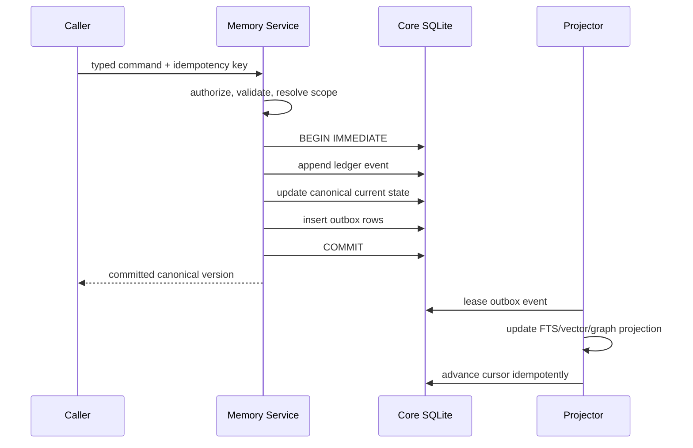

If Gemini, embedding, graph, or projection work fails, the canonical command is still committed. The outbox retries with bounded exponential backoff, a dead-letter state, and an operator-visible reason.

### 10.3 Memory Supervisor and durable worker protocol

The Memory Supervisor is a deterministic control plane, not a free-running LLM agent. It accepts commands, evaluates policy, schedules work, exposes health, and coordinates pause/drain/replay. A model may propose a command; only the supervisor can authorize and commit it.

Every worker job includes:

```ts
type MemoryJob = {
  jobId: string;
  jobType: string;
  jobVersion: number;
  partitionKey: string;       // preserves ordering where required
  prerequisiteSequence?: number;
  inputRef: string;           // immutable canonical/event/blob reference
  scopeId: string;
  sensitivity: string;
  cloudEligibility: boolean;
  idempotencyKey: string;
  leaseOwner?: string;
  leaseExpiresAt?: string;
  attempt: number;
  maxAttempts: number;
  latencyClass: "instant" | "normal" | "background" | "batch";
  maxCostUsd: number;
  status: "queued" | "leased" | "succeeded" | "retry" | "dead_letter" | "cancelled";
};
```

Worker families:

1. turn ingestion/segmentation and working-set checkpointing;
2. candidate extraction and deterministic admission;
3. entity resolution and contradiction analysis;
4. exact/FTS/vector/graph/summary projectors;
5. cache invalidation, expiry, admission, and prewarming;
6. episode/profile/consolidation proposal generation;
7. artifact parsing, OCR, rendering, and multimodal indexing;
8. retention, forget closure, and crypto-shred verification;
9. retrieval evaluation, drift detection, and replay;
10. backup, integrity, orphan repair, and dead-letter diagnosis.

Delivery is **at least once**. Correctness comes from idempotency keys, compare-and-swap state transitions, unique constraints, ordered partitions, immutable inputs, and side-effect receipts—not from an unverifiable exactly-once claim. Jobs that repeatedly fail enter a quarantined dead-letter queue with their scope, cause, safe retry action, and affected freshness indicators visible in the Command Center.

### 10.4 Consistency watermark

Every committed command advances a canonical sequence. Every projector and cache namespace advertises the greatest contiguous canonical sequence it has incorporated plus its schema/model epoch. Retrieval chooses one of three declared modes:

- `strict`: wait within a small budget or fall back to canonical/exact sources; never mix stale projections silently;
- `bounded_stale`: accept a configured lag for non-critical discovery and label the manifest;
- `live_domain`: query the owning domain for current state and combine it with a canonical memory snapshot.

The context manifest records `canonicalSequence`, `policyVersion`, `workingSetSequence`, `ftsEpoch`, `vectorEpoch`, `graphEpoch`, `summaryEpoch`, and any domain-manifest versions. This makes every context package reproducible and gives stale cache/index behavior a measurable definition.

---

## 11. Write and admission pipeline

### 11.1 Three write lanes

| Lane | Trigger | Response requirement | Typical cost |
|---|---|---|---:|
| Immediate deterministic | “Remember this,” correction, forget, task transition, tool receipt, artifact creation | Commit before acknowledging | zero model calls |
| Nearline governed | ordinary conversation, completed task, room event | Queue candidate within seconds; never block reply | local rules; optional cheap model batch |
| Deep consolidation | topic/episode close, nightly curation, corpus analysis | background with visible job state | budgeted local/Gemini calls |

The current five-turn extractor is replaced by semantic and event boundaries. A five-turn counter is neither a reliable episode boundary nor a retention policy.

### 11.2 Full write state machine

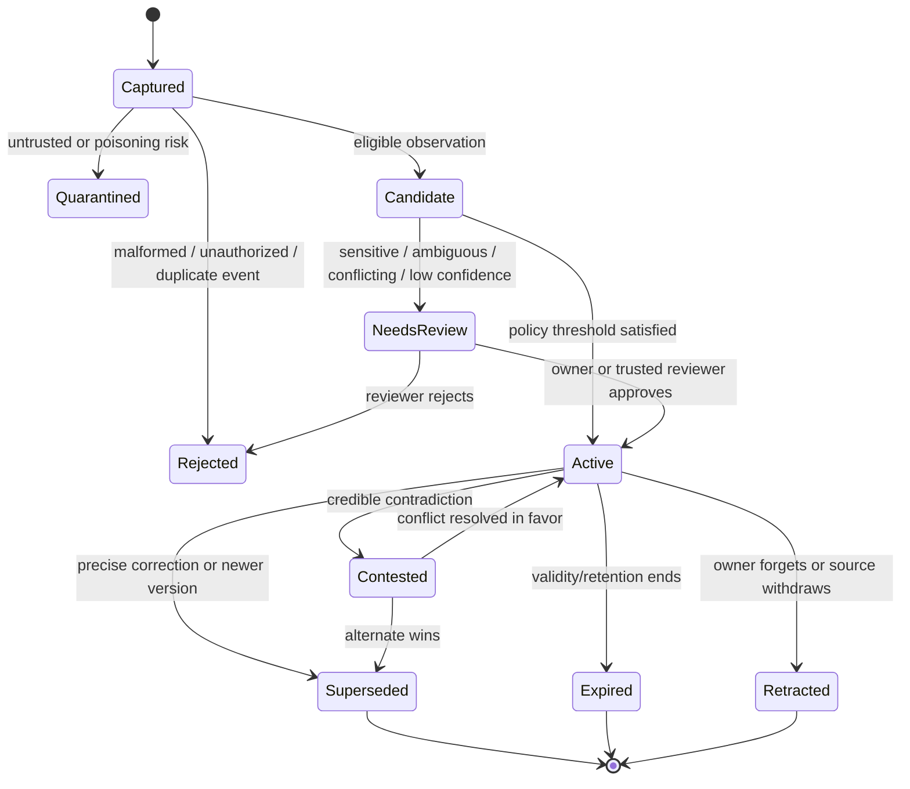

### 11.3 Capture stage

Capture a small immutable event before any lossy summarization:

- actor, device, room, project, thread, task, agent, and session;
- occurred/recorded time and timezone;
- raw content reference or content hash;
- source trust zone;
- explicit verbs such as remember/correct/forget/pin/never/always;
- tool/artifact/source references;
- privacy hint and cloud eligibility;
- idempotency and correlation IDs.

Raw content retention is policy-specific. A restricted conversation may retain only an encrypted local blob plus typed records; a public web source can retain its capture openly inside the local artifact store.

### 11.4 Deterministic admission before model extraction

Rules that do not require an LLM:

1. Explicit owner command `remember X` creates a candidate immediately and may auto-activate if the type is safe and unambiguous.
2. `never`, `always`, and permission-related language creates a directive candidate, never an inferred procedure.
3. Corrections enter the correction resolver, not the generic extractor.
4. Tool results create receipts and task events, not personal facts.
5. Assistant text cannot be admitted as an owner statement.
6. Web/file/email/image text is tagged untrusted data and cannot create directives or grants.
7. Greetings, acknowledgements, duplicated quoted text, generated system prompts, and internal model scaffolding are rejected.
8. Restricted fields invoke local-only handling and may require owner confirmation.
9. Project/room/task scope comes from runtime context; absence creates `unscoped-review`, never `global`.

### 11.5 Candidate extraction

The extractor returns typed candidates and spans, not prose facts:

```json
{
  "candidates": [
    {
      "type": "preference",
      "subjectRef": "owner",
      "predicate": "response.detail_level",
      "object": { "value": "detailed", "conditions": ["architecture reviews"] },
      "sourceSpan": { "start": 42, "end": 109 },
      "validTime": { "from": null, "to": null },
      "scopeHint": "project:jarvis",
      "sensitivity": "private",
      "extractionConfidence": 0.94,
      "isCorrection": false
    }
  ]
}
```

Required extractor properties:

- constrained JSON schema validation;
- source-span grounding;
- subject/predicate/object decomposition;
- separate observation and inference labels;
- explicit negation and modality (“may,” “plans,” “is,” “was”);
- time-expression normalization with original text retained;
- prompt/model/extractor versions in provenance;
- no silent retry with a different semantic schema;
- all failures durable in the job record, never swallowed.

### 11.6 Admission score

The score routes workflow; it does not define truth:

```text
admission =
  0.30 * explicit_owner_intent
+ 0.18 * predicted_future_utility
+ 0.15 * stability
+ 0.12 * source_reliability
+ 0.10 * extraction_grounding
+ 0.08 * project_relevance
+ 0.07 * novelty
- 0.20 * sensitivity_risk
- 0.18 * contradiction_ambiguity
- 0.15 * prompt_injection_risk
- 0.10 * redundancy
```

Thresholds are type-specific. An explicit owner directive can auto-activate; an inferred health fact cannot. The score, features, policy version, and decision are logged.

### 11.7 Entity resolution

Use a blocking-and-review pipeline:

1. Exact stable identifiers (artifact ID, email hash, URL, ticker, file hash).
2. Normalized exact name within scope/type.
3. Alias and historical-name match.
4. Lexical/vector candidates.
5. Relationship/context compatibility.
6. LLM adjudication only for ambiguous high-value cases.
7. Human review for sensitive merges.

Merges are reversible mapping events. Never delete the duplicate entity row and destructively repoint all history as the current code does.

### 11.8 Consolidation and reflection

Consolidation operates on bounded episodes or topic clusters and emits derived candidates:

- episode summary;
- stable assertion candidates;
- changed preference strength;
- unresolved conflict;
- reusable experience lesson;
- project status/carryover;
- entity/link candidates;
- artifact/source manifest.

Every output cites its covered records. Re-consolidation creates a new version. It never rewrites historical summaries in place.

### 11.9 Live conversation lifecycle

Every turn follows a latency-bounded two-phase lifecycle.

#### Synchronous pre-answer phase

1. Journal the immutable turn, attachment pointers, focus delta, client sequence, room/project/task, and privacy class.
2. Advance the Conversation State Kernel from the prior checkpoint.
3. Resolve whether the turn continues, branches, resumes, or replaces a topic.
4. Update referents, open loops, commitments, decisions, focused objects, and tool/agent state deterministically where possible.
5. Run the memory-need gate: `none`, `working_only`, `exact`, `hybrid`, `live_domain`, or `deep`.
6. Take a consistency watermark and perform only the routed retrieval lanes.
7. Compile a model-specific context package and answer.

#### Asynchronous post-answer phase

1. Store the answer/tool receipt and influence manifest.
2. Commit explicit remember/correct/forget/directive/task transitions immediately.
3. Queue bounded extraction candidates for the completed semantic segment.
4. Detect topic/episode closure without depending on a fixed turn count.
5. Invalidate dependencies and refresh the working-set checkpoint.
6. Consolidate only when a boundary, idle window, scheduled policy, or explicit command justifies it.

Greetings, acknowledgements, simple UI commands, and resolvable follow-ups must not trigger vector search, graph traversal, or generative extraction. A long turn may create several semantic segments; a long-running topic may span many sessions.

### 11.10 Consolidation Laboratory

The laboratory is a quarantined proposal-and-replay environment for expensive or self-modifying memory work. It can:

- close and summarize episodes;
- construct/update owner/project/topic/entity hierarchy nodes;
- discover duplicate assertions or likely entity merges;
- find contradictions and stale derived profiles;
- propose reusable task lessons;
- calculate retrieval utility from verified outcomes;
- simulate correction/deletion dependency effects;
- compare new extractor, embedding, ranking, or summary versions against frozen replay cases.

Promotion requires source coverage, policy validation, no protected-record mutation, no privacy regression, replay thresholds, and an auditable receipt. High-impact or ambiguous proposals require owner review. A failed experiment is discarded without changing canonical state.

---

## 12. Correction, contradiction, truth maintenance, and forgetting

### 12.1 Correction algorithm

Given: “No, I live in Philadelphia now, not Boston.”

1. Parse explicit correction, subject `owner`, predicate `residence`, new object `Philadelphia`, possible old object `Boston`, valid-from `now` unless specified.
2. Retrieve active assertion versions with the same subject/predicate and compatible scope.
3. If exactly one target is supported, create a `CorrectionAccepted` command.
4. If multiple materially different targets remain, ask one focused question; do not guess.
5. In one transaction:
   - close the old valid interval if the statement is a real-world change, or retract it if it was always false;
   - close the old recorded interval;
   - insert the new assertion version;
   - create a causal `corrects`/`supersedes` link;
   - update the conflict set;
   - enqueue invalidation for projections and dependent derived records.
6. Return a precise acknowledgement showing what changed and its scope.

### 12.2 Real-world change versus correction of error

| User meaning | Old record | New record |
|---|---|---|
| “I moved from Boston to Philadelphia today” | remains historically valid until today | valid from today |
| “I never lived in Boston; that was wrong” | retracted for all valid time, preserved in recorded history | Philadelphia version inserted with stated validity |
| “For this project, use concise answers” | owner-wide preference unchanged | project-scoped preference inserted |
| “Don’t do that anymore” | directive/preference closed at now | optional replacement created |

This distinction is why `valid_time` and `recorded_time` cannot be one `updated_at` field.

### 12.3 Contradiction handling

Not every contradiction should auto-replace:

- Owner correction over owner fact: owner wins, subject to ambiguity.
- Trusted tool output versus stale derived summary: tool evidence wins for its domain/time.
- Two independent external sources: create a contested conflict set.
- Agent claim versus cited evidence: evidence governs; unsupported claim quarantined.
- Different scopes: both may be true.
- Different valid times: both may be true.
- Preference variance by context: model conditional preference, not conflict.

### 12.4 Dependency invalidation graph

Every derived object has `derived_from` edges. When a source/assertion is superseded, retracted, or deleted:

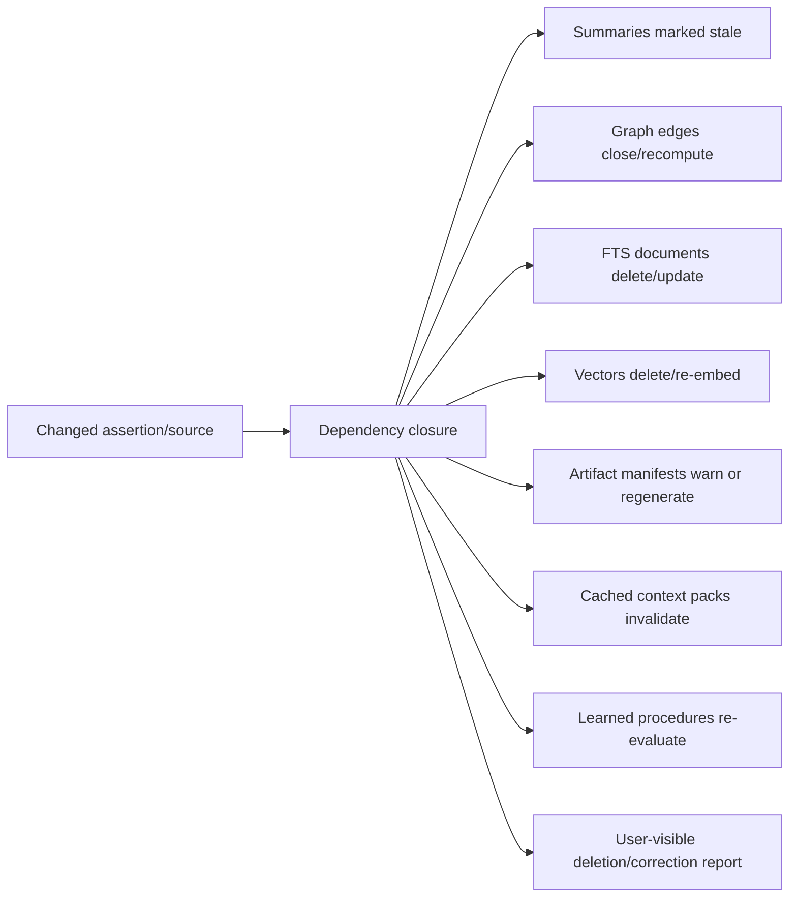

### 12.5 Forget protocol

Forget is a durable workflow with a closure report:

1. Resolve target and show scope/count preview.
2. Authorize with direct-owner policy for sensitive or broad deletions.
3. Freeze new projection work for target IDs.
4. Retract/delete canonical payload according to legal/audit policy.
5. Delete or crypto-shred referenced private blobs.
6. Delete FTS rows, embeddings, graph/cache/community projections, query caches, exported notes, and generated summaries containing only that fact.
7. Mark mixed derived artifacts as stale/redacted and regenerate if needed.
8. Verify no active dependency or projection contains the target content/hash.
9. Produce a signed deletion receipt with structural IDs but no deleted content.

For event streams, PII belongs in separately encrypted payload records referenced by structural events. Deleting the per-subject/data key enables crypto-shredding without breaking stream ordering.

### 12.6 Retention and decay

Decay affects retrieval priority, not truth. Use policies:

- working slots: TTL minutes/hours/task;
- raw conversation: configurable 30/90/365 days or durable;
- episode summaries: durable while source coverage exists;
- inferred preferences: review after 90–180 days without reinforcement;
- owner-confirmed facts/directives: no automatic deletion;
- locations/device state: short TTL unless promoted;
- task telemetry: aggressive aggregation after task close;
- tool receipts: retain for side effects/important tasks; compact low-value reads;
- external facts: domain freshness policy;
- projections: rebuildable, garbage-collected by canonical status.

No background process may archive a memory solely because it was not accessed. Rarely accessed identity facts can remain important.

---

## 13. Retrieval architecture

### 13.1 Memory-need gate and adaptive retrieval planner

Before choosing channels, decide whether retrieval has positive expected value. Inputs include the working-set snapshot, query ambiguity, missing referents, answer-risk class, scope, available live tools, estimated retrieval benefit, latency budget, privacy exposure, and paid-call cost.

```text
retrieve when:
  expected_answer_or_action_gain
  - latency_penalty
  - cost_penalty
  - privacy_risk
  - distraction_risk
  > policy_threshold(task_class)
```

The first version is an inspectable policy/rule model. Outcome-conditioned learning may later tune it inside fixed safety boundaries. It cannot override permission, cloud eligibility, explicit temporal requirements, or mandatory exact checks for corrections/deletions.

Classify memory need independently from conversation intent:

| Memory intent | Example | Preferred channels |
|---|---|---|
| None | “hi” | protected directives + active thread only |
| Exact personal | “What is my preferred name?” | typed identity lookup |
| Semantic personal | “What kinds of UI do I like?” | preferences + dense + evidence |
| Continuity | “Continue what we were doing” | thread/task checkpoint/referents |
| Temporal | “What was the plan before we changed it?” | bitemporal assertions/events |
| Episodic | “What happened in the last HELIX session?” | episodes + room manifests |
| Multi-hop | “Which strategy used the dataset from that report?” | graph + artifacts + manifests |
| Artifact | “Find the slide with the risk chart” | artifact parts, OCR/visual vectors, FTS |
| Procedural | “Do it the way that worked last time” | validated procedures/experience cases |
| Global research | “What are the main themes across this HELIX project?” | HELIX GraphRAG-like corpus lane |
| Domain live | “What changed in APEX today?” | live APEX adapter, then memory context |
| Deletion/correction | “Forget that address” | exact management query; no general RAG |

A deterministic classifier covers obvious forms. A cheap local/router model is used only when ambiguous. Deep mode does not mean every query becomes graph/global search.

The planner can re-enter during a long task. If an agent encounters an unresolved entity, missing procedure, failed tool step, or low-confidence decision, it may issue a bounded `memory.search` action rather than relying only on memory selected at task start.

### 13.2 Security filter order

The correct order is:

```text
authenticate actor
→ resolve active scope
→ compute allowed scope closure
→ enforce sensitivity/cloud/share policy
→ apply status and time lens
→ query eligible indexes
→ rank
→ compile context
```

Filtering after vector retrieval is insufficient: sensitive candidates would already have been exposed to the retrieval/model layer and ANN post-filtering can reduce recall unpredictably.

### 13.3 Candidate channels

1. **Typed exact:** identity, directive, goal, task, artifact ID, file path, ticker, URL, entity/predicate.
2. **Lexical FTS5/BM25:** names, quotes, filenames, code symbols, errors, unique phrases.
3. **Dense semantic:** paraphrase, concept, cross-language, cross-modal search.
4. **Temporal:** valid/recorded interval overlap, recent episode windows, relative-date expansion.
5. **Graph:** one/two-hop typed edges; bounded Personalized PageRank for multi-hop.
6. **Thread/task:** active checkpoint, unresolved referents, recent topic segment.
7. **Artifact-part:** page/slide/sheet/code symbol/image/frame/audio segment.
8. **Procedural/experience:** task-signature match plus outcome/reliability.
9. **Room/domain:** HELIX/APEX/Eclipse adapter with versioned manifest results.

### 13.4 Fusion and ranking

Use RRF as the baseline union, then a transparent feature scorer:

```text
base = RRF(exact, lexical, dense, graph, temporal, task, artifact)

final =
  0.22 * base_rank
+ 0.15 * exact_entity_predicate_match
+ 0.13 * task_thread_relevance
+ 0.10 * semantic_similarity
+ 0.09 * lexical_score
+ 0.08 * temporal_fit
+ 0.07 * provenance_quality
+ 0.06 * user_confirmation
+ 0.05 * freshness
+ 0.05 * graph_path_quality
- 0.18 * contradiction_or_stale_penalty
- 0.12 * weak_derivation_penalty
- 0.10 * redundancy_penalty
```

Weights are configuration with evaluation versioning, not permanent constants. Exact typed facts should not lose to semantically similar prose. Apply maximal marginal relevance or cluster quotas to prevent five duplicates from consuming the context budget.

### 13.5 Optional reranking

Rerank only when:

- candidate ambiguity is high;
- the query is deep/research/artifact-oriented;
- the initial channels disagree;
- multi-vector visual/page retrieval needs late interaction;
- evaluation shows a benefit large enough to justify latency/cost.

Use a local cross-encoder where possible. A Gemini reranker call is cloud-policy- and budget-gated.

### 13.6 Retrieval result contract

```ts
type RetrievalResult = {
  queryId: string;
  intent: string;
  needDecision: "none" | "working_only" | "exact" | "hybrid" | "live_domain" | "deep";
  expectedValueFeatures: Record<string, number>;
  timeLens: { validAt?: string; recordedAt?: string };
  scopeIds: string[];
  consistency: {
    mode: "strict" | "bounded_stale" | "live_domain";
    canonicalSequence: number;
    workingSetSequence: number;
    policyVersion: number;
    projectionEpochs: Record<string, string>;
  };
  candidates: Array<{
    recordId: string;
    version: number;
    channels: string[];
    rawRanks: Record<string, number>;
    featureScores: Record<string, number>;
    finalScore: number;
    provenanceQuality: string;
    conflictState: string;
    evidenceIds: string[];
  }>;
  indexVersions: Record<string, string>;
  latencyMs: number;
  modelCalls: number;
  costUsd: number;
};
```

### 13.7 Outcome-conditioned utility

Semantic similarity estimates topical closeness; it does not prove usefulness. After permission, status, temporal validity, exact-match priority, and provenance filters, the ranker may use a bounded utility feature derived from verified outcomes:

- helped answer a supported claim;
- enabled a successful task step;
- was ignored or displaced more useful evidence;
- caused a correction or stale answer;
- was useful only under a particular task/environment/version.

Utility is versioned and decays when environments change. New memories receive neutral priors; low historical utility never hides an exact owner fact or mandatory directive.

### 13.8 Exact search remains the oracle

For small collections, exhaustive vector scoring is often fast enough and provides a recall oracle. Approximate HNSW/IVF indices are performance layers. Every vector backend must support evaluation against an exact subset, filtered-recall measurement, and blue/green re-indexing.

---

## 14. Adaptive Context Runtime

### 14.1 Purpose

The runtime converts the live Conversation State Kernel plus any retrieval results into a small, structured, injection-resistant, model-specific evidence package. It decides whether retrieval is needed, which blocks remain attached, how older branches are compacted, how much evidence each model/effort receives, and whether the request can proceed under the selected consistency mode. It is not a concatenation function and it does not treat provider context caching as memory.

### 14.2 Pack structure

```text
[SYSTEM-ENFORCED DIRECTIVES]
- protected owner directives relevant to this task

[ACTIVE EXECUTION STATE]
- current branch/topic, task, checkpoint, pending approvals, open loops

[CONVERSATION WORKING SET]
- protected verbatim tail, referents, commitments, decisions, focused objects

[VERIFIED PERSONAL CONTEXT]
- typed current facts/preferences with source/version

[RELEVANT EPISODES]
- bounded events, not entire transcripts

[ROOM / ARTIFACT MANIFESTS]
- stable IDs, versions, summaries, source pointers

[EVIDENCE]
- quotes/locators/receipts required for claims

[CONFLICTS / UNCERTAINTY]
- competing versions and abstention instruction

[CONSISTENCY MANIFEST]
- canonical sequence, working-set sequence, policy version, projection/domain epochs

[UNTRUSTED RETRIEVED DATA]
- fenced; never instructions
```

### 14.3 Budget profiles

| Profile | Total memory budget | Typical contents |
|---|---:|---|
| Instant | 0–350 tokens | directives + active referent/task pointer |
| Normal | 600–1,800 | task state + 3–8 facts/episodes |
| Heavy | 2,000–5,000 | multi-hop evidence, artifacts, conflicts |
| Research | 5,000–15,000 | HELIX package, source passages, analysis manifests |

Budgets adapt to the target model, effort, active tools, output need, and user request, but the runtime always reserves output/tool space. Stable prefixes are content-addressed so Gemini context caching can be used only when exact policy-safe content repeats. Cache expiry or miss changes performance/cost, never correctness.

### 14.4 Selection rules

- Protected directives first; do not repeat irrelevant directives.
- Current task/checkpoint outranks historical discussion of the task.
- Current assertion versions are shown by default; historical versions only for temporal queries.
- Conflicts are grouped, never silently flattened.
- Every factual item includes a compact source/version tag.
- Raw messages are included only when wording matters.
- Summaries include covered-range and checksum metadata.
- Untrusted content is structurally separated and stripped of tool authority.
- Private/restricted items remain local and are excluded if the chosen model/provider is not eligible.
- If evidence is insufficient, the pack carries an explicit abstention condition.
- Verbatim recent turns are selected by unresolved dependency and referent coverage, not a fixed last-N count.
- Suspended branches remain checkpointed but leave the hot context until resumed.
- Provider/model profiles determine block order, schema, token budget, and tool description layout without changing canonical records.
- Final personal answers are not semantic-cache hits by default; reusable evidence/context products must still pass consistency and scope validation.

### 14.5 Influence receipts

After generation, record:

- context item IDs delivered;
- citations/record IDs referenced in final answer spans;
- claims supported by each item;
- items delivered but unused;
- model/provider and pack version;
- user feedback/correction.

Do not infer “used” merely because an item was retrieved. When exact span mapping is unavailable, record `unknown`, not false certainty.

### 14.6 Per-turn runtime sequence

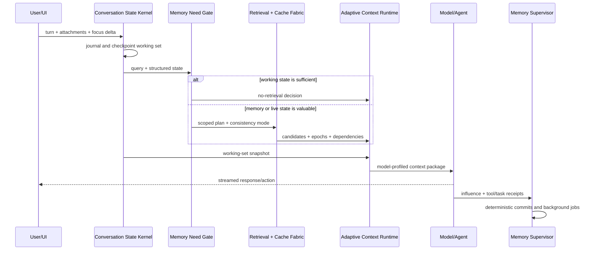

---

## 15. Lexical, vector, graph, and summary projections

### 15.1 Lexical projection

Use a separate rebuildable `lexical.sqlite` with FTS5 tables for:

- assertions and preferences;
- episode summaries and selected turn spans;
- artifact/part metadata and extracted text;
- source/evidence passages;
- task/procedure names, steps, errors, and outcomes;
- entities/aliases;
- room manifests.

Each document has `record_id`, `record_version`, `scope_id`, `sensitivity`, `status`, `valid_from/to`, `projection_version`, and `content_hash`. Projection events explicitly delete prior versions.

### 15.2 Vector projection

Target an embedded LanceDB projection behind this interface:

```ts
interface VectorProjection {
  upsert(records: VectorRecord[]): Promise<void>;
  remove(recordVersionIds: string[]): Promise<void>;
  search(query: VectorQuery, filters: ScopeTimePolicyFilter): Promise<VectorHit[]>;
  exactSearch(query: VectorQuery, sample: string[]): Promise<VectorHit[]>;
  modelInventory(): EmbeddingIndexVersion[];
  rebuild(targetVersion: string): Promise<JobRef>;
}
```

Why a projection adapter rather than vectors in the core:

- embedding models and dimensions change;
- text, image, audio, video, code, and page embeddings need different/multiple vectors;
- ANN indexes are optimized data structures, not canonical records;
- deletion/rebuild can be verified independently;
- the system can fall back to exact local scan or switch backend without migrating truth.

### 15.3 Embedding records

Every vector must include:

- record/version/part ID;
- embedding provider/model/version/dimension;
- task instruction or task type;
- normalized/not-normalized flag and metric;
- source content hash;
- modality and chunk/page/timecode;
- scope/sensitivity/status/time filters;
- created/replaced/deleted times;
- projector version.

Never compare vectors from incompatible model spaces. Re-embedding uses a new index, validation, then an atomic pointer switch.

### 15.4 Chunking and artifact parts

- Conversations: segment by topic/event boundary, retain turn IDs.
- Reports: semantic sections with heading path and overlap.
- PDFs/slides: page image + OCR/text + layout/figure/table parts.
- Spreadsheets: workbook/sheet/table/range with headers repeated.
- Code: repository/commit/file/symbol/block, preserving imports and call relations.
- Audio/video: transcript segments plus timestamps, speaker, keyframe, and optional multimodal vector.
- Images: visual vector, OCR, caption as derived metadata, region/bbox parts where needed.

Late chunking or contextual prefixes should be benchmarked for long documents. No chunk may lose its parent artifact/version and exact locator.

### 15.5 Temporal graph

Canonical graph nodes are entities, assertions, episodes, tasks, agents, artifacts, sources, scopes, and procedures. Edges are typed assertions or structural links with evidence and valid/recorded intervals.

Required relations include:

```text
MENTIONS, PARTICIPATED_IN, PART_OF, DERIVED_FROM, SUPPORTS, CONTRADICTS,
SUPERSEDES, CORRECTS, CREATED_BY, USED_TOOL, PRODUCED, CONSUMED,
DEPENDS_ON, BLOCKED_BY, RESOLVED_BY, BELONGS_TO_SCOPE, REFERENCES,
TESTED_BY, LEARNED_FROM, SHARED_WITH, VERSION_OF
```

Graph retrieval modes:

- zero/one hop for ordinary context;
- bounded two/three hop for explicit relationship questions;
- PPR seeded by exact/vector entity matches for multi-hop;
- community reports only for sizable HELIX/artifact corpora;
- path explanations included in retrieval diagnostics.

### 15.6 Summary projection

Use a hierarchy:

```text
turns → topic segment → episode → thread summary → project/room digest → corpus community report
```

Each summary records covered IDs, uncovered/failed IDs, evidence/source versions, summary model/prompt, token cost, checksum, and staleness. The system can descend to raw evidence when a summary lacks necessary detail.

### 15.7 Coherent Cache Fabric

Caching is a performance layer over canonical truth and versioned projections. It is split by semantics because each cache has different correctness and eviction rules.

| Cache | Value | Key requirements | Invalidation |
|---|---|---|---|
| Canonical record | Immutable record version | record ID + version + policy view | version immutable; evict on memory pressure/key rotation |
| Working-set snapshot | Structured conversation state | thread + branch + journal sequence + kernel version | next accepted state delta or lease expiry |
| Embedding | Vector | content hash + modality + preprocessing + model + dimensions | model/preprocessing retirement or forget closure |
| Retrieval plan | need/intent/channel plan | normalized query + working-state/task signature + policy/router version | state/policy/router epoch |
| Candidate set | ranked IDs/features | full scope/time/task key + canonical sequence + projection epochs | dependency change or bounded TTL |
| Context manifest | selected record versions/ordering | candidate hash + model/effort profile + token budget + policy version | exact dependency change or namespace epoch |
| Artifact derivative | OCR/render/table/page features | artifact-version hash + extractor/renderer version | artifact/extractor retirement or forget closure |
| Negative result | verified empty lookup | exact typed query + scope/time + epochs | very short TTL or any relevant namespace advance |
| Provider context | provider cache handle | exact prefix hash + provider/model/tools/policy class | provider expiry, policy/key/model change, or forget closure |

Minimum logical key:

```text
H(normalized_query,
  owner, room, project, thread, branch, task, agent,
  allowed_scope_closure, sensitivity_policy,
  valid_time_lens, recorded_time_lens,
  working_set_sequence, canonical_sequence,
  projection_epochs, retrieval_strategy_version,
  model_effort_profile)
```

#### Admission and eviction

- Tiny ephemeral records use bounded LRU as the simple baseline.
- Expensive reusable artifacts/embeddings use size- and cost-aware admission.
- Candidate/context caches may prototype Window-TinyLFU, but must beat LRU on production traces before adoption.
- Sensitive namespaces have smaller limits, encryption, and shorter TTLs.
- Large entries pay a size penalty; expensive-to-recompute entries receive a bounded cost benefit.
- Negative entries never outlive the freshness window of their underlying domains.

#### Dependency invalidation protocol

1. Each cache entry stores exact record/artifact/manifest dependencies where feasible.
2. A canonical command emits invalidation events in the same transaction through the outbox.
3. Exact dependents are evicted first.
4. A namespace generation/epoch advances as the correctness fallback.
5. In-flight retrieval detects a changed watermark before final context emission and recompiles or reports bounded staleness.
6. Forget closure verifies that cache payloads, provider handles, disk spill, thumbnails, summaries, and backups governed by deletion policy no longer expose target content.

Do not cache final personalized responses by semantic similarity in the first production release. If later introduced for narrow deterministic domains, require conversation-aware matching, exact policy/version keys, entailment validation, strict TTL, and a fresh retrieval fallback.

#### Predictive staging

The supervisor may prewarm a bounded working set when there is strong deterministic evidence: opening a HELIX project, resuming a mission checkpoint, focusing an artifact, switching to APEX, or attaching an agent to a task. Prefetch is cancelled when focus changes, respects scope/cloud policy, and has its own latency/cost budget. It stages record IDs and derived views; it does not promote new truth.

---

## 16. Artifact and multimodal memory

Artifacts are not attachments tacked onto chat messages. They are versioned, addressable products.

### 16.1 Content-addressed storage

1. Stream bytes and compute SHA-256.
2. Classify MIME from content plus extension.
3. Apply sensitivity/encryption policy.
4. Store once under hash path; deduplicate bytes.
5. Create artifact/version/locator records transactionally.
6. Queue safe extractors/renderers.
7. Generate part records and projections.
8. Validate checksums and renderability.

### 16.2 Artifact manifest minimum

```json
{
  "artifactId": "...",
  "version": 3,
  "kind": "research_report",
  "mime": "application/pdf",
  "inputs": [{ "recordId": "...", "version": 2 }],
  "sources": [{ "sourceId": "...", "captureVersion": 1 }],
  "evidence": [{ "evidenceId": "...", "stance": "support" }],
  "operations": [{ "tool": "composer", "version": "...", "argsHash": "..." }],
  "lineage": [{ "relation": "derived_from", "artifactVersionId": "..." }],
  "checks": { "opens": true, "citations": 0.96, "visual": "passed" },
  "reproduce": { "workflowId": "...", "environment": "..." },
  "visibility": ["jarvis", "helix:project-123"]
}
```

### 16.3 Cross-format retrieval and conversion

The folder/segment “combine” action should consume manifests rather than raw filenames:

1. Resolve selected folder/segment version and authorized artifact versions.
2. Inspect MIME, structure, citations, assets, tables, code, and lineage.
3. Build a normalized intermediate document graph.
4. Preserve source/evidence IDs at node level.
5. Choose output renderer (paper, presentation, website, dataset, code package, PDF, DOCX, etc.).
6. Apply audience/style/layout rules.
7. Render and validate openability, fonts, page/slide bounds, links, citations, animation/media, and accessibility.
8. Create a new artifact version with a complete operation manifest.
9. Publish a room manifest event so JARVIS can immediately find and explain it.

### 16.4 Obsidian integration

Obsidian is worthwhile as an optional human surface, not a storage engine for JARVIS.

Recommended export:

```text
Jarvis Vault/
  People/
  Projects/
  Decisions/
  Episodes/
  Research/
  Artifacts/
  Procedures/
```

Each Markdown note carries stable frontmatter IDs/versions and links. Manual edits are imported as **candidates** with a diff and provenance; they never mutate canonical rows directly. Restricted memories are excluded unless the user explicitly enables an encrypted/private export.

---

## 17. Tasks, missions, agents, and procedural learning

### 17.1 Task memory versus telemetry

Split the current mission data into:

- **Task truth:** objective, constraints, plan/step graph, state, approvals, checkpoints, artifacts, result.
- **Significant events:** started, step completed, blocked, approved, side effect, artifact produced, completed/failed.
- **Telemetry:** progress messages, tokens, model/tool timings, debug traces, retries.

Task truth and significant events live in/are mirrored to canonical memory. Telemetry uses a separate retention-optimized operations store with aggregation and compression.

### 17.2 Checkpoint contract

```ts
type TaskCheckpoint = {
  taskId: string;
  revision: number;
  graphVersion: string;
  completedStepIds: string[];
  activeStepIds: string[];
  pendingStepIds: string[];
  blockedReasons: Blocker[];
  pendingApprovals: ApprovalRef[];
  variables: Record<string, unknown>;
  inputManifestIds: string[];
  outputArtifactVersionIds: string[];
  toolReceiptIds: string[];
  agentSessionIds: string[];
  cost: Usage;
  resumeToken: string;
  createdAt: string;
};
```

### 17.3 Agent memory boundaries

Each agent session gets:

- immutable blueprint/version;
- task-scoped lease and explicit tools/resources;
- private working slots;
- read-only shared context pack;
- writable result/claim/evidence/artifact channels;
- no direct canonical fact write;
- expiration and cancellation;
- outcome evaluator.

Agent results flow through promotion gates. “No restrictions” is not a viable architecture: permissions are how JARVIS prevents an untrusted webpage or faulty sub-agent from turning a memory into a desktop side effect.

### 17.4 Experience and procedure promotion

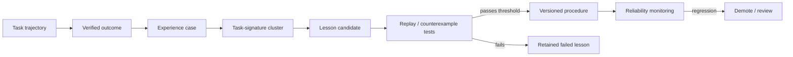

Promotion requirements:

- at least one verified successful outcome; higher-risk procedures require multiple independent successes;
- failure and counterexample cases;
- declared inputs/outputs/tools/permissions;
- deterministic success criteria;
- owner approval for side-effecting or protected behaviors;
- reliability tracked by procedure version and environment;
- regression automatically suspends rather than reinforces the procedure.

This prevents the current procedural memory from learning confident rules from a correction phrase or a single old canonical response.

---

## 18. Room integration contracts

### 18.1 Universal room manifest

Every room publishes a versioned manifest when meaningful work begins, changes state, or completes:

```ts
type RoomManifest = {
  manifestId: string;
  room: "jarvis" | "helix" | "apex" | "forge" | "eclipse" | string;
  projectId: string;
  operationId?: string;
  runId?: string;
  status: string;
  objective: string;
  currentSummary: string;
  decisions: VersionRef[];
  claims: VersionRef[];
  evidence: VersionRef[];
  sources: VersionRef[];
  artifacts: VersionRef[];
  tasks: VersionRef[];
  openLoops: OpenLoop[];
  warnings: string[];
  cost: Usage;
  visibilityScopes: string[];
  createdAt: string;
  supersedesManifestId?: string;
};
```

On room entry, JARVIS receives a compact current manifest/context package. It does not receive “literally every row.” On demand it can follow versioned pointers through authorized room adapters.

### 18.2 HELIX integration

HELIX retains its research substrate. The Memory Fabric must:

- register HELIX project/folder/segment/question/plan/run/artifact identities;
- ingest source/evidence/claim/decision manifests with precise versions;
- expose current research status, open questions, conflicts, and artifacts to JARVIS;
- create a research episode after meaningful run stages;
- permit JARVIS queries over source passages and evidence without copying entire source bodies into personal memory;
- publish deep brief/paper/presentation/site/code outputs as artifact versions;
- store user decisions and annotations as canonical scoped records;
- treat internal `callGemini` invocations as HELIX operations, not global user conversations.

### 18.3 APEX and Forge integration

- APEX emits domain events for strategy created/versioned/tested/selected, report produced, risk threshold breached, paper trade executed, and prediction resolved.
- Forge emits strategy DAG/branch lineage, block versions, improvement proposals, test metrics, accepted/rejected mutations, and final artifact manifests.
- JARVIS remembers objectives, selected strategy versions, rationale, outcomes, and reusable lessons.
- Market/news/quote datasets remain queryable by pointer in APEX with freshness semantics.

### 18.4 Eclipse integration

- Mirror mission summary, graph/checkpoint version, capability lease, validated claims/evidence, receipts, artifacts, and outcome.
- Eclipse semantic memory becomes a candidate producer; it is not a competing global memory table.
- Agent reputation remains domain-owned but can supply a signed qualification summary to orchestration.
- Cross-task lessons require procedure promotion tests.

### 18.5 Device Mesh and co-op

- Device sessions and permissions are short-lived canonical operational records.
- Shared memory packets contain allowlisted record/version IDs or redacted snapshots, never broad DB access.
- Every packet has sender, recipient, scope, expiry, purpose, sensitivity, signature, and revocation.
- Remote co-op edits to a collaborative document may use a CRDT; fact/assertion conflicts enter truth maintenance.
- Screen streams/keyframes stay in media retention storage unless explicitly promoted to an episode/artifact.

---

## 19. Privacy, security, poisoning resistance, and permissions

### 19.1 Key hierarchy

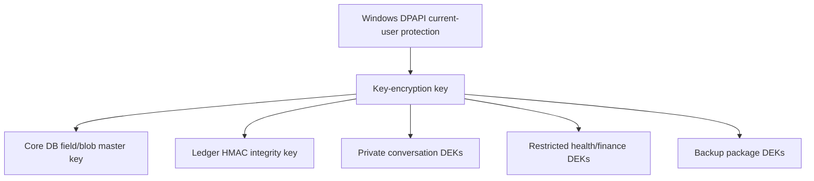

- DPAPI protects local wrapping keys, not the only backup copy of irreplaceable data.
- Recovery material is exported separately with explicit owner action.
- Keys are versioned and rotatable.
- Highly sensitive domains use separate DEKs for selective crypto-shredding.
- Full-disk encryption is recommended but does not replace application-level policy.

### 19.2 Trust zones

| Zone | Sources | Memory privileges |
|---|---|---|
| Z0 owner-authoritative | direct owner commands on trusted surface | directives, corrections, permissions, facts |
| Z1 verified system | signed tool receipts, local OS facts, validated room manifests | domain facts/events within declared scope |
| Z2 trusted authored | owner files, approved collaborators | evidence/candidates; limited auto-admission |
| Z3 external | web, email, third-party files/APIs | evidence only; cannot create instructions/grants |
| Z4 model-derived | summaries, extraction, agent claims | candidate/derived records only |
| Z5 quarantined | injection/anomaly/suspicious provenance | not retrievable into normal context |

### 19.3 Poisoning controls

1. Instruction/data separation enforced structurally, not by a sentence in the prompt.
2. Protected predicates (`permission.*`, `directive.*`, `identity.*`, credential metadata) have owner/system-only writers.
3. Source spans and content hashes required for extracted candidates.
4. Model-generated assertions are labeled derived and cannot self-corroborate.
5. Independent-source grouping prevents ten syndicated copies from counting as ten confirmations.
6. Rapid protected-field change, impossible time, scope jumps, source withdrawal, and abnormal write volume trigger quarantine.
7. Tool receipts are signed/hashed at the gateway; an LLM cannot forge a successful side effect.
8. Retrieved files/web content are fenced as untrusted and never inserted into system/directive sections.
9. Memory writes from agents require leases and typed capability checks.
10. Snapshot/rollback tools restore canonical versions without trusting poisoned projections.

### 19.4 Permission evaluation

Permissions are deny-by-default predicates over:

```text
actor × action × record type × scope × sensitivity × purpose × provider × device × time
```

Examples:

- Gemini embedding request over `restricted` content → deny.
- HELIX agent reads evidence inside its project → allow.
- APEX agent reads owner-wide private conversation → deny.
- Co-op guest receives redacted artifact manifest → allow if session grant active.
- JARVIS retrieves credential locator metadata → allow; credential value → impossible because not stored.

### 19.5 Logs and redaction

- Never log raw API keys, authorization headers, full restricted prompts, or unrestricted tool outputs.
- Debug traces use structured IDs and redacted excerpts.
- Sensitive logs have shorter retention and encryption.
- Export/diagnostic bundles run a secret/PII scanner and produce a manifest of exclusions.

---

## 20. Reliability, backup, recovery, and maintenance

### 20.1 SQLite configuration

Canonical core:

```sql
PRAGMA journal_mode = WAL;
PRAGMA synchronous = FULL;
PRAGMA foreign_keys = ON;
PRAGMA trusted_schema = OFF;
PRAGMA busy_timeout = 5000;
```

Use `STRICT` tables, checks, unique constraints, explicit transactions, parameterized queries, and a single writer queue. Rebuildable projections may use `synchronous=NORMAL` after risk testing.

### 20.2 Version gate

At startup:

- reject unsupported SQLite versions;
- require at least 3.51.3 because of the 2026 WAL-reset fix;
- record actual runtime version and compile options;
- run schema compatibility before opening writes;
- never auto-migrate without a pre-migration snapshot.

### 20.3 WAL management

- Observe WAL bytes, frames, oldest reader age, checkpoint duration, busy errors, and write queue depth.
- Use short read transactions and paginated diagnostics.
- Passive checkpoints during normal operation; scheduled restart/truncate only during safe reader gaps.
- Alert on sustained WAL growth, e.g. >64 MiB core or project-specific threshold.
- Never delete `-wal`/`-shm` files manually.

The current ~124 MiB mission WAL becomes a regression test.

### 20.4 Backups

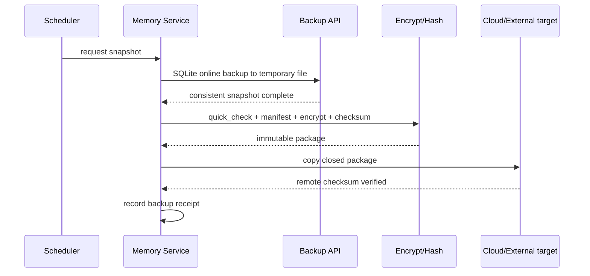

Backup policy:

- rolling local snapshots: hourly/daily based on write volume;
- encrypted daily off-device/OneDrive packages;
- weekly full blob/CAS manifest plus incrementals;
- retention tiers (e.g. 24 hourly, 30 daily, 12 monthly) configurable;
- automated restore drill to an isolated directory at least weekly;
- restore validation includes schema, quick/integrity check, random blob hashes, projection rebuild, and golden queries.

### 20.5 Projection rebuild

Any projection can be rebuilt from a canonical event/version boundary:

1. create new projection directory/version;
2. snapshot the canonical read point;
3. replay eligible current versions;
4. process tail outbox events;
5. compare counts, filtered recall, random hashes, and deletion exclusions;
6. atomically swap active projection pointer;
7. retain old projection briefly for rollback;
8. delete it after validation.

### 20.6 Maintenance jobs

- schema/integrity check;
- outbox/projector lag;
- WAL/checkpoint health;
- orphan/dependency scan;
- projection coverage and version mismatch;
- expired working state/retention jobs;
- unresolved conflicts and candidate inbox aging;
- artifact/blob availability and checksum sampling;
- stale summaries after source changes;
- backup/restore freshness;
- embedding model inventory and incompatible mixed-space detection;
- cost and cloud-policy audit;
- memory benchmark smoke suite.
- Conversation State Kernel journal/checkpoint divergence and unresolved referent/open-loop aging;
- worker partition lag, expired leases, retry storms, dead-letter age, and backpressure;
- canonical/projection/cache consistency-watermark lag;
- cache hit quality, stale-hit prevention, dependency coverage, namespace size, and privacy isolation;
- consolidation proposal backlog, replay failures, and accidental protected-record mutation attempts;
- predictive-staging usefulness/waste and cancellation effectiveness;

Maintenance never silently rewrites user facts. It proposes repair commands with receipts.

---

## 21. Cost and latency governor

### 21.1 Query classes

| Class | Examples | Retrieval/model policy | Target memory overhead |
|---|---|---|---:|
| Instant | hello, simple UI command, current clock | Conversation State Kernel only; zero retrieval/model-enrichment calls | p95 <20 ms |
| Normal | personal recall, continue task, find recent artifact | need gate + typed/FTS/cache; local vector only when valuable | p95 <120 ms before answer model |
| Heavy | temporal/multi-hop/artifact search | strict snapshot + hybrid/graph + optional local rerank | p95 <500 ms before answer model |
| Research | cross-corpus HELIX synthesis | domain retrieval, DRIFT/global if routed, evidence pack | streamed job; explicit cost/time |

### 21.2 Write-call policy

- Explicit remember/correct/forget: zero generative calls.
- Deterministic extraction patterns: zero.
- Ordinary conversation candidates: batch after topic/episode close, not every N turns.
- Background consolidation: local small model by default; Gemini Flash-class only for cloud-eligible content and when measured quality justifies it.
- Embeddings: cached by content hash; local for private/restricted; Gemini Embedding 2 for cloud-eligible multimodal; batch for backfills.
- No vectorization at startup beyond a small resumable queue; never block server readiness.
- Turn journaling and working-set updates are local/deterministic and occur on every accepted turn; generative consolidation does not.
- Cache prewarming and predictive staging run only inside explicit background budgets and are cancelled on focus changes.

### 21.3 Provider gateway requirements

Every external memory call passes through one gateway that enforces:

- provider/model allowlist;
- sensitivity/cloud policy;
- per-turn/job/day budget;
- input/output token and actual cost ledger;
- timeout/retry/idempotency;
- cache and batch eligibility;
- provider-context-cache prefix hash, TTL, deletion handle, and actual cached-token ledger;
- redaction;
- provenance;
- circuit breaker and local fallback.

The current extractor/vector direct Gemini calls are forbidden in vNext.

### 21.4 Embedding strategy

Default starting profile:

- 768-dimensional embeddings unless JARVIS-specific evaluation proves 1536/3072 materially better;
- separate text and multimodal index versions where appropriate;
- content-hash cache;
- query embedding cache with normalized query + task instruction + model version;
- no embedding for typed records whose retrieval policy is exact-only; “100% coverage” means every record selected by the versioned projection policy, not every row in the core;
- asynchronous Batch API for historical backfill;
- dual-index blue/green migration for model changes;
- budget and data-egress counters visible in Memory Command Center.

### 21.5 Degradation behavior

If vector provider fails:

- continue exact/FTS/graph/task retrieval;
- mark semantic lane unavailable in diagnostics;
- queue reattempt if appropriate;
- never return “no memory” solely because vector search failed.

If the entire projection layer fails:

- serve protected directives, typed exact facts, task state, and recent episodes from core;
- rebuild projections in background;
- expose degraded status honestly.

If the cache fabric fails or is purged:

- serve from canonical records and active projections;
- rebuild lazily under normal budgets;
- never interpret a miss as “no memory” until the authoritative retrieval lanes are checked;
- keep conversation checkpoints and explicit commands operational.

---

## 22. API and event contracts

### 22.1 Command APIs

```text
POST /memory/v1/commands/remember
POST /memory/v1/commands/correct
POST /memory/v1/commands/forget
POST /memory/v1/commands/pin
POST /memory/v1/commands/unpin
POST /memory/v1/commands/set-scope
POST /memory/v1/commands/confirm-candidate
POST /memory/v1/commands/reject-candidate
POST /memory/v1/commands/publish-room-manifest
POST /memory/v1/commands/register-artifact
POST /memory/v1/commands/checkpoint-task
POST /memory/v1/commands/record-tool-receipt
POST /memory/v1/commands/propose-procedure
POST /memory/v1/commands/journal-turn
POST /memory/v1/commands/checkpoint-working-set
POST /memory/v1/commands/attach-context-block
POST /memory/v1/commands/detach-context-block
POST /memory/v1/commands/pause-cloud
POST /memory/v1/commands/resume-cloud
```

Every command requires actor/session/scope, idempotency key, schema version, and purpose.

### 22.2 Query APIs

```text
POST /memory/v1/query/context-pack
POST /memory/v1/query/need
POST /memory/v1/query/search
POST /memory/v1/query/as-of
POST /memory/v1/query/graph
POST /memory/v1/query/artifacts
GET  /memory/v1/records/:id
GET  /memory/v1/records/:id/history
GET  /memory/v1/records/:id/provenance
GET  /memory/v1/retrieval/:queryId/trace
GET  /memory/v1/conversations/:id/working-set
GET  /memory/v1/conversations/:id/branches
GET  /memory/v1/conversations/:id/open-loops
GET  /memory/v1/tasks/:id/checkpoint
GET  /memory/v1/health
```

### 22.3 Administrative APIs

```text
POST /memory/v1/admin/backup
POST /memory/v1/admin/restore-verify
POST /memory/v1/admin/rebuild-projection
POST /memory/v1/admin/run-evals
POST /memory/v1/admin/run-replay
POST /memory/v1/admin/export
POST /memory/v1/admin/import
POST /memory/v1/admin/drain-workers
POST /memory/v1/admin/retry-dead-letter
POST /memory/v1/admin/purge-cache
POST /memory/v1/admin/prewarm-scope
POST /memory/v1/admin/verify-consistency
GET  /memory/v1/admin/candidates
GET  /memory/v1/admin/conflicts
GET  /memory/v1/admin/deletions/:id
GET  /memory/v1/admin/costs
GET  /memory/v1/admin/workers
GET  /memory/v1/admin/cache
GET  /memory/v1/admin/consistency
GET  /memory/v1/admin/consolidation-proposals
```

Administrative mutations require the direct owner surface and explicit confirmation where destructive.

### 22.4 Event namespace

Use namespaced, versioned events:

```text
memory.assertion.proposed.v1
memory.assertion.activated.v1
memory.assertion.superseded.v1
memory.record.forgotten.v1
memory.projection.failed.v1
memory.artifact.versioned.v1
memory.task.checkpointed.v1
memory.conversation.turn_journaled.v1
memory.conversation.working_set_checkpointed.v1
memory.conversation.branch_changed.v1
memory.cache.namespace_advanced.v1
memory.cache.invalidated.v1
memory.worker.dead_lettered.v1
memory.consistency.degraded.v1
memory.consolidation.proposed.v1
memory.replay.failed.v1
memory.procedure.promoted.v1
room.helix.manifest.published.v1
room.apex.strategy.tested.v1
room.eclipse.mission.completed.v1
mesh.memory_packet.shared.v1
```

Consumers must be idempotent and retain a dead-letter reason. Schema compatibility is checked in CI.

### 22.5 Extension SDK

A new room/plugin registers:

- record schemas and validators;
- event types;
- ownership rules;
- retention/sensitivity defaults;
- manifest mapper;
- retrieval adapter;
- artifact extractors/renderers;
- UI inspectors/actions;
- projector(s);
- migration and conformance tests.

No extension receives raw SQL access or unrestricted memory reads.

---

## 23. Memory Command Center UI

This UI is a control plane, not a decorative graph.

### 23.1 Primary surfaces

1. **Overview:** health, active scopes, candidates, conflicts, stale projections, backups, cost, and recall-quality trend.
2. **Memory Inbox:** extracted candidates with source span, proposed type/scope/sensitivity, accept/edit/reject.
3. **Truth Inspector:** current assertion, history, valid/recorded timeline, evidence, conflicts, dependents, correction/forget.
4. **Timeline:** episodes/tasks/artifacts/decisions with as-of lens.
5. **Context Inspector:** exact pack delivered for a turn and why each item ranked.
6. **Influence Trace:** which memories supported which answer claims; unused retrievals shown separately.
7. **Graph Explorer:** typed paths, temporal slider, source/evidence drill-down; never force graph as the only view.
8. **Artifacts:** versions, parts, previews, lineage, citations, download/open, room visibility.
9. **Tasks & Procedures:** checkpoints, experience cases, procedure promotion/reliability/regressions.
10. **Scopes & Privacy:** room/project/thread inheritance, cloud eligibility, shares, retention, device sync.
11. **Forget Center:** target preview, dependency closure, progress, verification receipt.
12. **Retrieval Lab:** run a query, compare exact/FTS/vector/graph, inspect ranks, choose time/scope, benchmark.
13. **Conversation Cortex:** active/suspended topic branches, verbatim-tail coverage, referents, open loops, commitments, focused objects, and checkpoint history.
14. **Worker Control:** partitions, leases, queue/backpressure, retries, dead letters, drain/replay, affected freshness.
15. **Cache Fabric:** hit quality, size/cost, namespace isolation, dependencies, epochs, provider caches, purge/prewarm controls.
16. **Consolidation Lab:** proposed episodes/profiles/merges/lessons, covered sources, replay result, approve/reject.
17. **Consistency View:** canonical sequence, per-projector/cache/domain lag, strict/bounded-stale decisions, degraded-answer traces.
13. **Operations:** WAL, projector lag, queues, dead letters, backups/restores, schema/index/model versions.

### 23.2 In-conversation behavior

Use subtle, actionable indicators:

- “Remembered” with click-to-inspect after an explicit save.
- “Updated Boston → Philadelphia” for a precise correction.
- “Using 4 memories · 2 HELIX sources” expandable to context/influence.
- “Continuing: Memory rebuild · 2 open items” with branch/open-loop inspection.
- “Resumed from checkpoint” with task/artifact/last-successful-step details.
- “I found conflicting records” with a resolve action.
- “This is private and stayed local” when relevant.
- “Semantic memory unavailable; exact search still used” for degradation.
- “Memory indexes are 3 events behind; answered from canonical state” only when bounded degradation matters.

Do not spam every reply with a memory dump or force a fixed answer template.

### 23.3 UI invariants

- Every count drills into the underlying records.
- Graph/timeline/list are synchronized views of the same canonical IDs.
- Destructive operations show scope and downstream effects.
- Candidate/conflict badges cannot claim zero if queues are unreadable.
- Health distinguishes core truth, projections, provider, backup, and domain adapters.
- Cache hit labels never imply factual confidence; cached, current, supported, and verified are separate states.
- Conversation Cortex shows active versus suspended branches and never exposes hidden reasoning traces.
- Accessibility, keyboard navigation, reduced motion, and non-color status labels are required.

---

## 24. Migration from the current stores

Migration is a product/data project, not a SQL copy.

### 24.1 Pre-migration freeze and evidence package

1. Stop old background writers in a controlled maintenance window.
2. Use SQLite backup API for every current store; include WAL-consistent snapshots.
3. Record file sizes, schemas, row counts, quick/integrity checks, hashes, SQLite/runtime versions.
4. Export a sanitized structural catalog and baseline queries.
5. Resume old system while vNext imports the closed snapshots.
6. Never transform the only copy.

### 24.2 Import adapters

| Current source | Import strategy |
|---|---|
| `memories` | Map status/provenance; classify scope; create candidates where origin/subject is ambiguous |
| `ms_memories` and dormant memory DB | Exact/content-hash dedupe first; retain origin events; do not auto-supersede by category |
| personal profile/user context | Dedicated typed imports; restricted fields local-only; distinguish seed/default from owner-confirmed |
| continuity/carryover/referents | Import only current supported state; project/thread scope reconstruction; expire heuristics |
| MemoryOS objects/files | Register artifact/file manifests; verify hash semantics; do not treat generated Markdown hash mismatch as source corruption |
| vectors/FTS | Do not import as authority; rebuild from accepted canonical versions |
| mission DB | Import task current states/significant events; archive raw telemetry separately and compact |
| debug traces | Retain in telemetry archive with short policy; extract no owner facts automatically |
| skills/procedures | Import as candidates with reliability/test evidence; do not auto-promote |
| PC graph | Register file index as domain adapter; map stable artifacts/projects where possible |
| HELIX | Preserve domain DB; publish manifests for sources/evidence/claims/decisions/artifacts/runs |
| APEX/Oracle/Forge | Preserve domain DB; import strategy/report/outcome manifests and selected user decisions |
| Eclipse/checkpoints | Preserve checkpoints; publish mission/evidence/artifact/lesson manifests |
| Device/co-op | Import current devices/sessions/permissions selectively; expire old grants |

### 24.3 Scope reconstruction

All current `global` memories enter one of:

- owner-wide verified;
- project/room/thread/task inferred with strong evidence;
- `unscoped-review` candidate;
- rejected internal/test/generated content.

No bulk import may simply preserve `global` for all 750 active memories.

### 24.4 Deduplication

Use staged matching:

1. stable ID/source link;
2. exact content hash and normalized typed key;
3. deterministic subject/predicate/object equivalence;
4. near-duplicate text within compatible scope/time;
5. semantic candidates;
6. conflict-aware human/model review.

Never merge records solely on cosine similarity. Preserve a reversible `import_equivalence` mapping.

### 24.5 Shadow operation

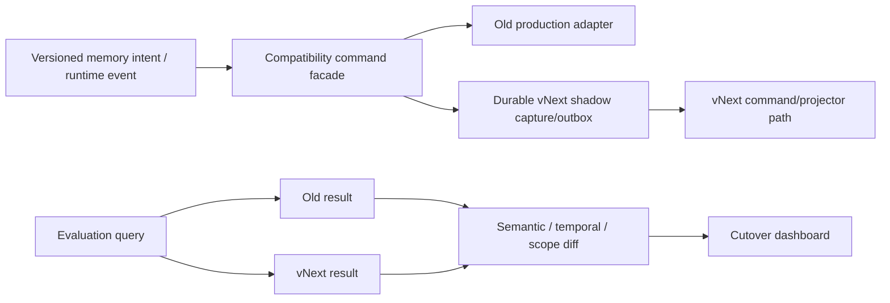

Prefer capturing one typed intent/event at the compatibility facade and replaying it idempotently into vNext over two unrelated application writes. Where a legacy path cannot expose a safe intent, use a reconciled bridge with explicit divergence telemetry. Shadow operation must not double paid calls: extraction/enrichment runs once, its immutable result is referenced by both comparison paths. Production answers continue using the old path until the read gate passes.

### 24.6 Cutover gates

- import reconciliation within documented tolerances;
- zero unresolved high-severity integrity errors;
- protected directives/identity verified by owner;
- scope leakage tests pass 100%;
- deletion closure tests pass 100%;
- correction/temporal benchmark exceeds target;
- p95 normal retrieval within target;
- projection coverage 100% for records selected by the active projection policy;
- backup restore and full projection rebuild pass;
- room manifests available for HELIX/APEX/Forge/Eclipse/Device Mesh;
- no direct production caller opens canonical DB;
- rollback rehearsal succeeds.

### 24.7 Cutover sequence

1. Enable typed intent capture and idempotent vNext shadow replay.
2. Run reconciliation and benchmark period.
3. Switch reads for internal/debug users.
4. Switch JARVIS Adaptive Context Runtime to vNext with old read fallback.
5. Observe at least a defined soak window.
6. Stop old writes; archive immutable snapshots.
7. Remove fallback only after rollback window.
8. Retain old stores read-only for at least 90 days or owner-selected period.
9. After successful memory cutover, revise the frozen model/runtime plan around vNext APIs.

### 24.8 Rollback

Rollback switches the context provider pointer and writer bridge, never rewrites migrated old databases. vNext events after cutover remain exportable for forward replay when the issue is fixed.

---

## 25. Evaluation program

### 25.1 Benchmark layers

1. Unit invariants: schemas, authorization, time intervals, correction targets, cascade deletion.
2. Retrieval components: exact, FTS, vector, graph, time, artifact, fusion.
3. Public memory benchmarks: LongMemEval, LoCoMo, MemoryAgentBench, MemBench.
4. `JarvisMemoryBench`: product-specific synthetic and owner-approved cases.
5. End-to-end answers: context → answer → evidence/influence mapping.
6. Chaos/recovery: model outage, projection corruption, crash mid-write, WAL growth, restore.
7. Security: prompt/memory poisoning, scope exfiltration, agent privilege, secret leakage.
8. Conversation runtime: branch/topic transitions, referents, open loops, focus changes, compaction, restart continuity.
9. Cache correctness: cross-scope isolation, dependency invalidation, stale-hit prevention, provider expiry, purge/forget closure.
10. Worker/control plane: ordering, duplicate delivery, lease loss, retry storm, backpressure, dead-letter repair.
11. Counterfactual replay: compare retrieval/answer/task outcomes before promotion, model/index change, and cutover.

### 25.2 JarvisMemoryBench suites

| Suite | Cases |
|---|---|
| Identity | exact facts, aliases, sensitive fields, unknowns |
| Preference | conditional preference, reinforcement, decay, contradictory contexts |
| Directive | owner-only creation, revocation, protection from files/web/agents |
| Temporal | moves, role changes, old plans, as-of recorded/valid time |
| Correction | explicit old target, ambiguous target, scope-specific replacement, “never true” retraction |
| Abstention | missing fact, weak candidate, source conflict, unavailable domain |
| Continuity | pronouns, topic switches, resumed thread, resumed task after restart |
| Working set | branch/suspend/resume, unresolved dependency tail, open-loop closure, focus switch, attachment binding |
| Task | checkpoint recovery, approval pending, tool retry, parent/subtask |
| Procedure | successful promotion, failed lesson, regression/demotion, environment mismatch |
| Artifact | file renamed, version changed, page/slide/image/chart/cell/code retrieval |
| HELIX | current run, evidence/citation, decision, folder/segment package, generated output |
| APEX/Forge | strategy lineage, test outcome, source dataset, fresh domain query |
| Eclipse | claim/evidence, graph run, artifact, agent outcome |
| Scope/privacy | cross-project denial, co-op share expiry, cloud-policy denial |
| Forget | exact record, entity, conversation, blob, vector, summary, export closure |
| Poisoning | malicious PDF/web text, forged tool output, model self-confirmation, rapid protected edits |
| Sync | offline edits, duplicate event, clock skew, CRDT doc conflict, fact conflict |
| Cache | same query/different scope, correction invalidation, stale epoch, negative-cache expiry, provider-cache deletion |
| Runtime routing | no-retrieval greeting, exact-only recall, mid-task retrieval, live-domain freshness, deep-query escalation |
| Workers | duplicate job, lost lease, ordered partition, poisoned job, budget cancellation, safe replay |

### 25.3 Metrics

Retrieval:

- Recall@1/5/10, MRR, nDCG@10;
- exact filtered recall compared with ANN;
- temporal version accuracy;
- multi-hop path precision;
- citation/source locator precision and recall;
- conflict surfacing and abstention accuracy;
- stale/retracted record retrieval rate;
- scope leakage rate;
- duplicate/context redundancy rate.

System:

- p50/p95/p99 retrieval and context compilation latency;
- paid calls/tokens/cost per turn and per admitted memory;
- index coverage and projector lag;
- WAL size/checkpoint latency/write busy rate;
- backup RPO/RTO and restore success;
- deletion closure duration;
- queue retry/dead-letter rate;
- context tokens and cache hit rate.
- cache precision, stale-hit rate, cross-scope hit rate, byte/cost hit benefit, invalidation latency, dependency coverage;
- working-set update/checkpoint latency, branch/referent/open-loop accuracy, recovery success;
- canonical-to-projection/cache watermark lag and strict-query fallback rate;
- retrieval-need precision/recall, avoided retrieval/model calls, and missed-beneficial-retrieval rate;
- prefetch usefulness/waste/cancellation rate and consolidation promotion/replay-failure rate.

Outcome:

- answer correctness with and without memory;
- supported-claim rate;
- owner correction recurrence rate;
- task resume success;
- procedure success/regression;
- user-rated helpfulness without fixed-format overanswering.

### 25.4 Initial acceptance targets

Targets must be calibrated after the baseline, but the build gate starts with:

| Metric | Gate |
|---|---:|
| Scope leakage / unauthorized retrieval | 0 |
| Protected directive written by untrusted/model source | 0 |
| Forget closure on test corpus | 100% verified |
| Current-vs-historical temporal selection | ≥95% |
| Deterministic explicit correction target accuracy | 100% on unambiguous cases; ambiguous cases must ask |
| Automatic ambiguous correction resolver | ≥98% precision and never silently choose below threshold |
| Projection coverage for records selected by active projection policy | 100% |
| Normal memory overhead p95 | <120 ms excluding answer model |
| Instant memory overhead p95 | <20 ms |
| Conversation restart/branch/referent golden suite | 100% exact state recovery; ≥95% referent/branch selection |
| Cache cross-scope or stale canonical hit | 0 |
| Strict-query mixed-epoch response without disclosure | 0 |
| Duplicate worker delivery causing duplicate canonical effect | 0 |
| Dead-letter/worker/cache degradation visible in health UI | 100% of injected failures |
| Canonical paid calls for explicit remember/correct/forget | 0 |
| Restore drill success | 100% before cutover |
| Unsupported confident answer on abstention suite | <2% |

No single LLM judge determines release. Use deterministic answers where possible, evidence-based checks, multiple judges for semantic cases, and human review of critical suites.

---

## 26. Implementation program: 32 dependency-ordered waves

The wave count is dictated by separable risk and verifiable exits, not aesthetics. Correctness-critical waves are sequential. Documentation, benchmark-corpus preparation, UI read models, and adapter prototypes may overlap only when they do not create a second writable authority. Every wave ships tests, telemetry, rollback instructions, and an updated architecture decision record.

### 26.0 Execution protocol and start-ready gate

Before implementation begins:

1. Treat this document as the controlling specification and the frozen model/runtime plan as read-only.
2. Create an implementation decision register and wave ledger; record start/end commit, migration impact, tests, metrics, rollback, deviations, and owner-visible behavior for each wave.
3. Work on one correctness-critical wave at a time. A later prototype may not become a production dependency before its prerequisite wave exits.
4. Preserve all legacy stores; every diagnostic/migration read is non-destructive and every snapshot is checksummed.
5. Do not start by replacing the existing reply path. Waves 1–6 establish evidence, contracts, storage safety, job correctness, permissions, and observability first.
6. No hidden fallback may report success. Unavailable stores, failed jobs, stale epochs, skipped extraction, and shadow divergence are explicit typed states.
7. No benchmark is run only after implementation. Each wave adds its failing baseline/golden tests before the production behavior.
8. No paid-model call is added without gateway policy, cost telemetry, privacy classification, timeout, fallback, and a benchmark showing benefit.
9. No schema, cache key, event, worker job, context block, or manifest ships without a version and compatibility rule.
10. A wave exits only when its written exit gate and regression suite pass; “UI appears to work” or “database row exists” is insufficient.

Wave 1 is ready to start on the next implementation instruction. Its first artifacts are:

- immutable snapshot manifest with hashes and restore instructions;
- sanitized schema/count/foreign-key/WAL/version catalog;
- current memory-writer and direct-SQL call map;
- baseline latency/cost/retrieval/extraction report;
- initial `JarvisMemoryBench` golden corpus and expected results;
- migration-source registry with sensitivity and ownership;
- Wave 1 evidence report confirming zero runtime behavior change.

### Era A — Evidence, boundary, and operational foundation

#### Wave 1 — Freeze, baseline, and replay corpus

- Produce transactionally consistent snapshots and hashes of every current store.
- Capture schemas/counts/WAL/SQLite versions, latency/cost traces, current extraction behavior, and baseline memory queries.
- Build sanitized golden cases for continuity, corrections, retrieval, scope, HELIX/APEX/Eclipse, files, and failure recovery.
- Create the migration mapping registry and immutable audit manifest.

**Exit:** Restorable audit package plus reproducible baseline/replay corpus; no runtime behavior change.

#### Wave 2 — Logical Memory Service boundary

- Define versioned command, query, event, streaming-health, and administrative interfaces.
- Add dependency injection and legacy adapters; ban new direct SQL.
- Add contract/conformance tests and a no-op/read-only vertical slice.
- Keep one logical authority while allowing future read workers or a separate local process behind the same contract.

**Exit:** A test caller can journal/query through the contract; CI detects any new bypass.

#### Wave 3 — Protected core storage and migrations

- Create the `%LOCALAPPDATA%` runtime path, `STRICT` schema, FK/check constraints, migration runner, and repository guard.
- Configure WAL, measured `synchronous` policy, busy timeout, version gate, connection ownership, checkpoint limits, and pre-migration backup.
- Implement application AEAD for sensitive fields/blobs and DPAPI key wrapping; prototype full-page encryption only behind the encryption ADR and compatibility/latency tests.

**Exit:** Crash, migration, key-loss/recovery, integrity, and permission tests pass; repository/OneDrive contains no live vNext DB/WAL.

#### Wave 4 — Ledger, outbox, Memory Supervisor, and job runtime

- Implement selective event envelope, stream sequence, integrity chain, atomic state/outbox commit, and command idempotency.
- Implement durable jobs with partitions, ordering, leases, heartbeats, retry/backoff, cost limits, cancellation, backpressure, dead letters, and side-effect receipts.
- Provide pause/drain/replay controls and graceful shutdown.

**Exit:** Fault injection at every transaction/lease boundary produces no lost canonical effect, no duplicate canonical effect, and an explainable recovery state.

#### Wave 5 — Scopes, actors, policies, capabilities, and key hierarchy

- Implement the scope lattice and deny-before-retrieval evaluator.
- Add sensitivity/cloud/retention/share policy, agent capability leases, purpose binding, and co-op expiry.
- Complete key rotation/destruction metadata, redacted logs, and recovery-key UX contract.

**Exit:** Cross-scope/security/agent matrix passes with zero protected values in logs or unauthorized model/provider inputs.

#### Wave 6 — Observability and Command Center skeleton

- Ship real health read models for canonical sequence, WAL, migrations, jobs, worker leases, outbox, dead letters, policy denials, cost, and backups.
- Add correlation IDs from command through event/job/projection/retrieval.
- Implement read-only operator screens before advanced workers exist.

**Exit:** Every injected foundation failure is visible with cause, affected scope/freshness, and safe operator action.

### Era B — Live cognitive runtime and canonical cognition

#### Wave 7 — Conversation ingress journal

- Journal immutable turns, attachments, focus deltas, room/project/task/agent context, client sequence, branches, privacy, and checksums.
- Reconcile retries, offline duplicates, and interrupted streaming responses.
- Keep raw-retention policy separate from turn identity/structure.

**Exit:** No accepted turn is lost or duplicated across restart, retry, branch, and attachment cases.

#### Wave 8 — Conversation State Kernel

- Implement verbatim dependency tail, topic/branch stack, referents, open loops, commitments, decisions, constraints, focus state, TTL working slots, and context-block bindings.
- Create deterministic state deltas and source-linked checkpoints.
- Add suspend/resume/merge semantics without globally leaking a prior topic.

**Exit:** Restart and golden branch/topic/referent/open-loop suites recover exact structural state; ambiguous referents remain unresolved rather than guessed.

#### Wave 9 — Tasks, checkpoints, focus, agents, and tool receipts

- Implement task/step/checkpoint truth, approvals, tool side-effect receipts, agent leases, active artifacts, and resume tokens.
- Separate significant task events from raw mission/debug telemetry.
- Project active task state into the Conversation State Kernel.

**Exit:** An interrupted mission resumes exactly without repeating completed side effects; telemetry volume does not grow the cognitive core.

#### Wave 10 — Semantic segmentation and episode lifecycle

- Implement deterministic boundaries plus benchmarked local classification for ambiguous topic changes.
- Create linked/non-contiguous topic segments, episode candidates, branch capsules, and closure triggers.
- Remove all fixed-N-turn extraction/consolidation behavior.

**Exit:** Long topic, rapid topic switch, branch resume, and multi-session episode tests meet segmentation/coverage targets without blocking answers.

#### Wave 11 — Sources, evidence, entities, aliases, and multigranular hierarchy

- Implement immutable captures, precise multimodal locators, source trust zones, reversible entity merges, and aliases.
- Preserve raw segment, atomic typed candidate, and hierarchical owner/project/topic/entity profile representations together.
- Ensure every derived profile/summary records complete source coverage and uncovered failures.

**Exit:** Evidence drill-down, reversible merge, hierarchy traversal, and raw-to-fact-to-profile coverage tests pass.

#### Wave 12 — Bitemporal assertions, epistemic states, and conflicts

- Implement assertion/version/conflict schemas and valid-time/recorded-time queries.
- Add epistemic status: observed, owner-asserted, source-asserted, inferred, hypothetical, disputed, superseded, and retracted.
- Add decomposed confidence and independent-source grouping.

**Exit:** Temporal and epistemic golden tests never flatten hypotheses, third-party claims, history, and current owner truth.

#### Wave 13 — Identity, directives, preferences, goals, and commitments

- Implement protected owner predicates before inferred personalization.
- Add conditional preferences with decay/reinforcement evidence and typed goal/commitment transitions.
- Migrate only high-confidence, sourceable values into candidates.

**Exit:** Model/untrusted content cannot alter owner-protected records; context-specific preference and commitment tests pass.

#### Wave 14 — Correction, contradiction, dependency, and forget engine

- Implement exact target resolution, bitemporal correction, conflict sets, dependency closure, cache/projection invalidation, deletion jobs, and crypto-shred receipts.
- Separate real-world change from “never true” correction.
- Require questions for ambiguous high-impact targets.

**Exit:** Unambiguous explicit corrections are 100%; ambiguous automatic resolver meets precision gate; deletion closure is 100% across test copies and caches.

### Era C — Retrieval, coherence, and adaptive context

#### Wave 15 — Exact and lexical retrieval oracle

- Implement typed exact queries, FTS5/BM25, time/scope/status filters, traces, exact vector-evaluation harness, and blue/green rebuild pointer.
- Cover names, paths, IDs, quotes, tickers, errors, and exact predicates before embeddings.

**Exit:** Exact/lexical benchmark, scope denial, correction, deletion propagation, and rebuild tests pass.

#### Wave 16 — Consistency watermarks and Coherent Cache Fabric

- Implement canonical/working-set sequences, projection epochs, strict/bounded-stale/live-domain modes, and in-flight watermark checks.
- Add record, working-set, embedding, plan, candidate, context, artifact, negative, and provider-cache namespaces.
- Add exact dependency invalidation plus generation fallback, privacy-separated keys, expiry, admission/eviction metrics, purge, and prewarm.

**Exit:** Zero stale-canonical or cross-scope hits in chaos suites; cache failure changes latency only, not answer correctness or memory availability.

#### Wave 17 — Vector and embedding gateway

- Implement provider-neutral embedding API, preprocessing/model/dimension versioning, privacy routing, content-hash cache, local/cloud lanes, and Batch backfills.
- Prototype LanceDB versus exact/sqlite-vec alternatives using production-shaped traces.
- Embed records selected by versioned projection policy rather than blindly embedding every row.

**Exit:** Selected-record coverage is 100%; mixed-space rejection, filtered-recall, deletion, blue/green re-index, cost, and offline fallback gates pass.

#### Wave 18 — Memory-need gate and adaptive retrieval planner

- Implement `none/working_only/exact/hybrid/live_domain/deep` routing from task risk, uncertainty, expected value, latency, privacy, and cost.
- Add RRF, transparent features, diversity, temporal expansion, optional reranking, and bounded mid-task retrieval.
- Log avoided calls, missed-beneficial retrieval, distracting results, and outcome-conditioned utility without allowing utility to override truth/safety.

**Exit:** Greetings/simple follow-ups make zero retrieval/enrichment calls; overall answer/task quality improves over always-retrieve and never-retrieve baselines within latency/cost gates.

#### Wave 19 — Adaptive Context Runtime and influence receipts

- Build model/effort-specific block profiles, protected working context, evidence/conflict fences, strict consistency manifests, token/tool/output reservation, and deterministic pack hashes.
- Attach/detach derived context blocks by lease; preserve suspended branches outside the hot prompt.
- Record delivered, used, unused, unsupported, and unknown influence states.

**Exit:** Context packs reproduce exactly from manifests; supported-claim and injection suites pass across every existing model/effort mode.

#### Wave 20 — Temporal graph, hierarchy, and multi-hop retrieval

- Implement canonical typed temporal edges, bounded traversal/PPR, hierarchy navigation, path explanations, and optional HELIX corpus communities.
- Route graph/global work only when it beats exact/FTS/vector baselines.

**Exit:** Multi-hop/global suites improve materially without normal-query latency regression; disabling graph leaves ordinary recall correct.

#### Wave 21 — Consolidation Laboratory, replay, and predictive staging

- Implement source-covered episode/profile/merge/conflict/lesson proposals in quarantine.
- Run frozen replay/counterfactual comparisons before promotion or extractor/ranker/index changes.
- Add deterministic focus-triggered staging with cancellation, privacy, and cost budgets.

**Exit:** No failed replay or protected-record mutation auto-promotes; staged context improves measured resume latency/quality without cross-scope exposure or excessive waste.

### Era D — Artifacts and outcome-gated learning

#### Wave 22 — Artifact registry and content-addressed blobs

- Implement encrypted hash storage, stable artifacts, versions, locators, lineage, manifests, rename/move reconciliation, and derived-cache invalidation.

**Exit:** Same bytes dedupe, renamed/moved files remain findable, versions reproduce, and deletion closes blobs/projections/caches.

#### Wave 23 — Multimodal extraction and retrieval

- Add PDF/page/slide/sheet/code/image/audio/video parts, OCR, tables, visual/page vectors, exact locators, rendering, and grounding confidence.
- Create cross-format equivalence and normalized document-graph links.

**Exit:** Artifact suite retrieves the exact page/slide/chart/cell/symbol/frame/clip and validates source/render integrity.

#### Wave 24 — Experience cases and procedural learning

- Implement outcome cases, environment/version context, clustering, lesson tests, procedure promotion/demotion, skill adapter, and regression suspension.
- Add retrieval utility only from verified task/answer outcomes.

**Exit:** Failed trajectories cannot auto-promote; regressions suspend active procedures; environment-mismatched lessons are not applied.

### Era E — Domain integrations through manifests

#### Wave 25 — HELIX integration

- Publish source/evidence/claim/decision/artifact/run manifests, current room context, folder/segment packages, and deep-research lineage.
- Exclude internal model calls from global conversation memory.

**Exit:** JARVIS can answer what happened, why, from which sources/files, and what remains unresolved in HELIX without duplicating the HELIX database.

#### Wave 26 — APEX and Forge integration

- Publish strategy/dataset/signal/test/outcome/report manifests and live-domain freshness contracts.
- Preserve raw market/telemetry ownership in APEX while memory stores decisions, validated results, and lineage.

**Exit:** Strategy and dataset questions resolve lineage and validated outcomes; current market questions use live APEX state with explicit freshness.

#### Wave 27 — Eclipse integration

- Publish mission/branch/node/claim/evidence/artifact/agent-outcome manifests with capability-scoped recall.
- Map successful/failed agent experience without promoting raw reasoning traces as truth.

**Exit:** Eclipse work is resumable and explainable from JARVIS; agent-private or untrusted state does not leak into owner-wide memory.

#### Wave 28 — Device Mesh and co-op integration

- Implement signed/encrypted logical envelopes, HLC ordering, capability/lease checks, selective sync, replay pointers, revocation, and shared-memory packets.
- Use CRDTs only for approved collaborative documents/layouts.

**Exit:** Offline/duplicate/clock-skew/revocation/share-expiry suites pass with zero live DB/WAL synchronization.

### Era F — Product hardening, migration, and cutover

#### Wave 29 — Full Command Center, backup, and operational hardening

- Complete Conversation Cortex, Truth/Context/Influence inspectors, Worker Control, Cache Fabric, Consistency View, Consolidation Lab, Forget Center, cost/privacy health, and real actions.
- Complete encrypted online backup, off-device package, restore drills, projection rebuild, WAL/checkpoint policy, key recovery, and performance soak.

**Exit:** Every UI value/action is live; destructive actions are confirmed/audited; automated restore and degraded-mode drills pass.

#### Wave 30 — Import, dedupe, scope reconstruction, and owner review

- Run store-specific import adapters into candidate/staging space.
- Reconstruct scope, preserve provenance, deduplicate, quarantine conflicts/seeds, and expose review batches.
- Never overwrite or mutate legacy databases.

**Exit:** Counts, hashes, exclusions, conflicts, sensitive-data policy, and owner-reviewed samples reconcile to the audit manifest.

#### Wave 31 — Shadow reads, command capture, and counterfactual comparison

- Prefer capturing legacy intents/events into the vNext outbox over fragile independent dual writes.
- Shadow-read both systems without duplicate model spend and compare context, answers, latency, cost, privacy, and deletion/correction effects.
- Run public/private benchmarks, chaos, replay, and per-domain rollback rehearsals.

**Exit:** Every cutover gate holds for the soak window; divergences are classified and resolved; rollback paths are proven.

#### Wave 32 — Progressive cutover, archive, and model-plan handoff

- Cut over explicit commands, conversation runtime, retrieval/context, then domain integrations in reversible stages.
- Purge incompatible caches, verify projection epochs, observe, archive old stores read-only, and retain rollback/export tooling for the defined window.
- Complete owner acceptance queries and post-cutover benchmarks.
- Reopen the frozen model/runtime plan and revise it only against the Memory Fabric contracts actually built.

**Exit:** vNext is the sole active cognitive authority; no legacy writer remains; rollback was rehearsed; the revised model plan can begin.

> Implementation status, 2026-07-26: Waves 30-32 construction and isolated proof are complete. The production exit above is intentionally **not** claimed: the real import, owner review, shadow soak, domain canaries, archive registration, owner acceptance, and final authority switch remain operational gates. See `memory-vnext/waves30-32/COMBINED_BUG_AND_TEST_REPORT.md`.

---

## 27. Detailed build checklist

### 27.1 Canonical correctness

- [ ] Exactly one writable authority for identity/preferences/directives/assertions.
- [ ] All canonical tables are `STRICT` where possible.
- [ ] Foreign keys/checks/unique constraints enforce relationships.
- [ ] No nullable/global default scope on memory records.
- [ ] Valid and recorded time supported for assertions/relations.
- [ ] Model outputs are candidates/derived records.
- [ ] Source spans/evidence required for extracted facts.
- [ ] Confidence components and policy version stored.
- [ ] Reversible entity merges.
- [ ] Selective ledger streams have HMAC integrity and sequence checks.

### 27.2 Write path

- [ ] Immediate explicit remember/correct/forget is model-free.
- [ ] Semantic/event boundaries replace fixed five-turn extraction.
- [ ] Raw capture is durable before lossy processing when policy permits.
- [ ] State and outbox commit atomically.
- [ ] All workers idempotent and resumable.
- [ ] Provider calls route through cost/privacy gateway.
- [ ] Failed extraction jobs remain visible/retryable.
- [ ] Assistant/system/tool text cannot masquerade as owner facts.
- [ ] Protected predicates have fixed writer policies.
- [ ] Turn ingress is immutable, deduplicated, ordered, and checkpointed before lossy processing.
- [ ] Worker delivery is at-least-once with idempotent canonical effects and visible dead letters.
- [ ] Job partitions, prerequisites, leases, budgets, cancellation, and side-effect receipts are enforced.

### 27.2.1 Conversation State Kernel

- [ ] Verbatim tail is dependency/referent-aware rather than fixed-N only.
- [ ] Topic branches can be created, suspended, resumed, and merged with source history.
- [ ] Referents, open loops, commitments, decisions, constraints, focus, tools, agents, and artifacts are structured slots.
- [ ] Every working-state item has source turn/event, scope, owner, TTL/lease, and promotion status.
- [ ] Restart restores exact journal/checkpoint state.
- [ ] Ambiguity remains explicit; kernel does not fabricate referent resolution.
- [ ] Ephemeral style/affect hints cannot silently become durable owner traits.

### 27.3 Retrieval/context

- [ ] Exact, FTS, dense, temporal, graph, task, artifact, procedure channels.
- [ ] Scope/sensitivity/time/status filters run before retrieval.
- [ ] RRF baseline and feature scores logged.
- [ ] Exact vector oracle evaluates ANN recall.
- [ ] Duplicate/diversity handling.
- [ ] Context budgets by query class.
- [ ] Untrusted data fenced.
- [ ] Conflicts/uncertainty preserved.
- [ ] Context manifest is reproducible.
- [ ] Influence receipt separates delivered from used.
- [ ] Memory-need gate can choose no retrieval, working-only, exact, hybrid, live-domain, or deep.
- [ ] Retrieval may re-enter at bounded mid-task checkpoints.
- [ ] Every result and context pack records canonical/working-set sequences and projection/domain epochs.
- [ ] Outcome-conditioned utility cannot override scope, time, exact truth, provenance, or directives.

### 27.3.1 Cache and consistency

- [ ] Record, working-set, embedding, plan, candidate, context, artifact, negative, and provider caches have separate policies.
- [ ] Cache keys include full scope/policy/time/task/branch/model/index identity.
- [ ] Exact dependency invalidation plus namespace-generation fallback.
- [ ] Strict queries never mix stale projection epochs silently.
- [ ] Cache/provider outage degrades performance only, not correctness.
- [ ] Final personal-answer semantic cache disabled by default.
- [ ] Cache privacy isolation, stale-hit, invalidation-latency, and usefulness metrics are live.
- [ ] Forget closure covers memory, disk spill, provider handles, derivatives, and governed backups.

### 27.4 Corrections/deletion

- [ ] Precise subject/predicate/scope target resolution.
- [ ] Real-world change distinguished from “old fact was false.”
- [ ] Ambiguous corrections ask rather than guess.
- [ ] Dependency invalidation covers summaries, graph, artifacts, caches.
- [ ] Forget covers canonical payload, blobs, FTS, vectors, graph, exports.
- [ ] Deletion receipt reveals no deleted private content.
- [ ] Backup retention/deletion policy documented.

### 27.5 Artifacts/rooms/tasks

- [ ] CAS blob storage and versioned manifests.
- [ ] Page/slide/sheet/cell/symbol/frame locators.
- [ ] Lineage/reproduction/citation metadata.
- [ ] Task truth separated from telemetry.
- [ ] Exact checkpoints and approvals.
- [ ] Procedure promotion requires verified outcomes/tests.
- [ ] HELIX/APEX/Eclipse room manifests.
- [ ] Internal room LLM calls excluded from global conversation memory.
- [ ] Device/co-op packets scoped, signed, expiring, revocable.

### 27.6 Security/reliability

- [ ] Runtime outside OneDrive/repository.
- [ ] SQLite ≥3.51.3 version gate.
- [ ] Core WAL + FULL synchronization + one writer.
- [ ] WAL/checkpoint/reader monitoring.
- [ ] DPAPI-wrapped rotating key hierarchy.
- [ ] No credential values in memory.
- [ ] Poisoning trust zones/quarantine/protected predicates.
- [ ] Online backup, encryption, checksums, off-device copy.
- [ ] Automated restore and projection rebuild drills.
- [ ] Redacted diagnostic/export bundles.
- [ ] SQLCipher/full-page encryption is not claimed unless the verified runtime actually provides it; DPAPI protects keys, not SQLite pages.
- [ ] Canonical/projection/cache lag and degraded consistency are visible from the first worker release.
- [ ] Consolidation proposals run in quarantine with source coverage and replay results.
- [ ] Predictive staging has scope, cancellation, privacy, cost, and waste controls.

### 27.7 Migration/evaluation/UI

- [ ] Immutable pre-migration snapshots/hashes.
- [ ] Import lineage and reversible equivalence mapping.
- [ ] Global-scope reconstruction/review.
- [ ] Old FTS/vectors rebuilt, not trusted.
- [ ] Public and JARVIS-specific benchmark baselines.
- [ ] Scope leakage and forget closure at zero/100% targets.
- [ ] Candidate, conflict, truth, context, graph, artifact, privacy, operations UI.
- [ ] Every UI count/action backed by live data.
- [ ] Shadow comparison and rollback rehearsal.
- [ ] Frozen model plan touched only after successful memory cutover.

---

## 28. Major upgrades delivered by this design

This plan introduces more than seventy material capabilities absent or incomplete today:

1. Single canonical cognitive write authority.
2. Mandatory scope lattice.
3. Bitemporal facts and relationships.
4. Precise correction targeting.
5. Conflict sets instead of silent overwrite.
6. Dependency-aware retraction.
7. Verified deletion closure.
8. Crypto-shreddable sensitive payloads.
9. Provenance-backed confidence vector.
10. Immutable evidence and exact locators.
11. Trust zones and poisoning quarantine.
12. Protected owner directives.
13. Conditional, decaying preferences.
14. Typed goals and commitments.
15. Semantic topic segmentation.
16. Bounded episode construction.
17. TTL working memory distinct from long-term memory.
18. Exact task checkpoints.
19. Significant-event/telemetry separation.
20. Signed/hashed tool receipts.
21. Outcome-gated procedural learning.
22. Procedure regression and demotion.
23. Content-addressed artifact storage.
24. Versioned artifact lineage.
25. Page/slide/sheet/cell/symbol/timecode retrieval.
26. Multimodal embeddings with privacy routing.
27. Hybrid exact/FTS/vector/graph/time retrieval.
28. Query-specific retrieval planning.
29. RRF plus transparent feature ranking.
30. Exact-search ANN recall oracle.
31. Adaptive, budgeted Context Runtime.
32. Context manifests and pack reproduction.
33. Answer influence receipts.
34. Domain manifest bus for all rooms.
35. Zero-copy HELIX/APEX/Eclipse awareness.
36. Scoped co-op memory packets.
37. Selective CRDT use for collaborative documents.
38. Provider-neutral model/embedding gateway.
39. Zero-call explicit memory operations.
40. Batch backfill and blue/green re-embedding.
41. Single-writer transactional outbox.
42. Replayable/rebuildable projections.
43. SQLite version/WAL/checkpoint gates.
44. Runtime removal from OneDrive.
45. Encrypted transactional backups.
46. Automated restore drills.
47. Human-readable Obsidian projection without authority split.
48. Memory Inbox and Truth Inspector.
49. Temporal/graph/context retrieval debugger.
50. Public + JARVIS-specific memory benchmark program.
51. Scope-leak/poison/deletion chaos tests.
52. Extension SDK for new rooms/types without core rewrites.
53. Immutable conversation ingress journal.
54. Conversation State Kernel with exact checkpoints.
55. Topic/branch suspend, resume, and merge semantics.
56. Dependency-aware verbatim conversation tail.
57. Structured referent and unresolved-ambiguity state.
58. Open-loop, commitment, decision, constraint, and focus tracking.
59. Attachable derived context blocks with scope/lease/version controls.
60. Memory-need/value gate that can skip unnecessary retrieval.
61. Bounded mid-task proactive retrieval.
62. Outcome-conditioned retrieval utility behind truth/safety filters.
63. Raw-segment, atomic-fact, and hierarchical-profile coexistence.
64. Epistemic states separating observation, assertion, inference, hypothesis, and dispute.
65. Canonical, working-set, policy, projection, cache, and domain consistency watermarks.
66. Strict, bounded-stale, and live-domain query modes.
67. Coherent multi-tier cache fabric.
68. Exact cache-dependency invalidation plus namespace epoch fallback.
69. Context-aware cache keys and cross-scope isolation.
70. Provider-context-cache lifecycle/cost/deletion ledger.
71. Memory Supervisor with deterministic command/control plane.
72. Durable partitioned worker runtime with backpressure and dead-letter repair.
73. Consolidation Laboratory with quarantined proposals.
74. Counterfactual replay before memory-policy/index/extractor promotion.
75. Predictive focus/task/room staging with cancellation and waste metrics.
76. Adaptive model/effort-specific Context Runtime.
77. Conversation Cortex, Worker Control, Cache Fabric, Consolidation Lab, and Consistency UI.
78. Continuous retrieval-need, cache-correctness, working-state, and replay evaluation.

---

## 29. Rejected architectures

| Rejected approach | Why it is wrong for JARVIS |
|---|---|
| One giant vector database | Loses exactness, time, permissions, correction semantics, and source-of-truth integrity |
| Put the whole conversation in every prompt | Expensive, slow, noisy, privacy-heavy, and still weak on updates/temporal selection |
| One flat `memories` table with JSON metadata | Recreates today’s ambiguity and makes field-level policy/invariants/deletion difficult |
| Neo4j/GraphRAG for every query | Operational and LLM indexing cost without benefit for exact/current task recall |
| Full event sourcing of everything | Excessive complexity for caches, telemetry, UI, and static records |
| Obsidian as the canonical DB | File edits, links, sync conflicts, policy, atomicity, and deletion are insufficient for runtime truth |
| Sync the SQLite folder with OneDrive | Live DB/WAL files can be captured inconsistently and cloud sync is not a replication protocol |
| Let each room keep its own global memory | Repeats overlapping authority and contamination |
| Let agents freely write memory | Poisoning, self-confirmation, and bad lessons become persistent |
| Store every tool/debug event as memory | Produces massive noise and degrades retrieval/maintenance |
| Always use Gemini for write/read | Adds cost, latency, privacy exposure, and a hard availability dependency |
| Last-write-wins facts across devices | Wall-clock order does not determine real-world truth |
| CRDT every record | CRDTs merge concurrent state; they do not resolve factual contradictions or permissions |

---

## 30. Architecture decision records to create during implementation

1. ADR-001: Memory Service process boundary and ownership.
2. ADR-002: Local runtime path and OneDrive exclusion.
3. ADR-003: SQLite configuration/version/backup policy.
4. ADR-004: Canonical schema and selective event streams.
5. ADR-005: Bitemporal assertion semantics.
6. ADR-006: Scope lattice and authorization evaluation.
7. ADR-007: Privacy/key hierarchy/cloud eligibility.
8. ADR-008: Evidence/source/artifact locator model.
9. ADR-009: Vector backend and exact fallback bake-off.
10. ADR-010: Graph traversal and community-index thresholds.
11. ADR-011: Retrieval fusion/reranking evaluation.
12. ADR-012: Context pack and influence receipt contract.
13. ADR-013: Correction/forget/dependency invalidation.
14. ADR-014: Task telemetry separation and retention.
15. ADR-015: Procedure promotion/evaluation.
16. ADR-016: Room manifest protocol.
17. ADR-017: Device sync, HLC, and selective CRDT.
18. ADR-018: Import/dedupe/scope reconstruction.
19. ADR-019: Cutover/rollback/old-store retention.
20. ADR-020: Obsidian/export/import projection.
21. ADR-021: Conversation ingress journal and raw-turn retention.
22. ADR-022: Conversation State Kernel, branch, referent, and open-loop semantics.
23. ADR-023: Memory Supervisor, worker partitioning, leases, and dead-letter policy.
24. ADR-024: Consistency watermark and strict/bounded-stale/live-domain modes.
25. ADR-025: Cache taxonomy, key identity, dependency invalidation, admission, and provider-cache lifecycle.
26. ADR-026: Memory-need/value gate and mid-task retrieval policy.
27. ADR-027: Adaptive Context Runtime model/effort profiles and context-block leases.
28. ADR-028: Multigranular raw/fact/profile hierarchy and synthesis rules.
29. ADR-029: Consolidation Laboratory, replay gates, and outcome-conditioned utility.
30. ADR-030: Predictive staging triggers, budgets, cancellation, and privacy.

Every ADR records context, options, decision, consequences, benchmarks, migration effect, and reversal plan.

---

## 31. Open decisions that require measured prototypes, not opinion

These do not block the architecture; they are bake-offs inside fixed interfaces:

1. LanceDB versus sqlite-vec/exact scan for the first production vector projection.
2. Local BGE-M3/Nomic versus Gemini Embedding 2 by sensitivity/modality and hardware.
3. 768 versus 1536 dimensions on JarvisMemoryBench.
4. Local cross-encoder versus Gemini reranker for heavy queries.
5. Late chunking versus contextual-prefix chunking for long reports/code.
6. ColPali-style local visual retrieval versus Gemini multimodal embeddings for PDFs/slides.
7. PPR/graph expansion thresholds and maximum hop budget.
8. Topic segmentation model/rules and episode-close timing.
9. Raw conversation retention default.
10. Per-type admission thresholds and review UX.
11. Backup destination/recovery-key workflow.
12. Dedicated local process timing once the in-process API stabilizes.
13. Full-page SQLCipher-compatible build versus application AEAD plus OS disk protection, measured against Node/runtime compatibility and threat model.
14. Conversation verbatim-tail dependency algorithm and hard token/age caps.
15. Topic/branch segmentation rules/model and episode-close/idle timing.
16. Cache admission/eviction per namespace: LRU versus Window-TinyLFU versus cost/size-aware policy.
17. Exact dependency-list size threshold before namespace-epoch-only invalidation.
18. Strict-query freshness wait budget before canonical/exact fallback.
19. Provider-context-cache eligibility, TTL, deletion verification, and cost break-even.
20. Retrieval-need gate rule baseline and later learned-policy promotion criteria.
21. Outcome utility learning rate/decay and minimum verified samples.
22. Predictive-staging triggers, maximum bytes/tokens/cost, and waste ceiling.
23. Profile/hierarchy refresh cadence and source-coverage threshold.
24. Separate-process worker count only after one-writer contention and latency traces justify it.

Each prototype uses the same fixed corpus, scopes, filters, exact ground truth, latency/cost measurement, and privacy constraints.

---

## 32. Final completion definition

The memory rebuild is complete only when all of the following are true:

- JARVIS has one active cognitive authority and old memory writers are disabled.
- User identity, directives, preferences, facts, goals, episodes, tasks, procedures, sources, evidence, artifacts, and room manifests have typed canonical contracts.
- Current conversation continuity is maintained by a journaled Conversation State Kernel with exact branches, referents, open loops, commitments, focus, and restart checkpoints.
- Corrections and historical/as-of queries are demonstrably correct.
- Forget operations produce verified closure across every copy/projection/export.
- Scope/privacy/poisoning tests pass with zero unauthorized retrieval.
- HELIX, APEX/Forge, Eclipse, and Device Mesh publish usable manifests and JARVIS can answer cross-room questions with provenance.
- File/image/PDF/slide/sheet/code artifacts are versioned, searchable, previewable, and downloadable.
- Task interruption/restart resumes from exact checkpoints.
- Procedure learning is outcome-gated and regression-tested.
- Instant and normal interactions meet latency/cost targets; paid calls are measured and optional.
- The memory-need gate avoids unnecessary retrieval while passing missed-beneficial-retrieval gates; bounded mid-task retrieval works.
- Cache/provider-cache loss changes speed and cost only; zero stale or cross-scope cache hits occur in the release suite.
- Every strict context pack identifies one reproducible canonical/working-set/policy/projection/domain consistency snapshot.
- Durable workers survive duplicates, lost leases, retries, cancellation, backpressure, and dead letters without duplicate canonical effects.
- Consolidation, hierarchy/profile updates, utility learning, and predictive staging are source-covered, replay-gated, reversible, and observable.
- Backups restore successfully and projections rebuild from canonical truth.
- Memory Command Center exposes candidates, truth, time, conversation cortex, graph, context, influence, workers, cache, consistency, consolidation, privacy, deletion, operations, and evaluation.
- Public benchmarks and JarvisMemoryBench meet release gates.
- The frozen model/runtime plan is then revised to consume the actual vNext APIs; it is not revised in advance around assumptions.

---

## 33. Reference index

### LLM and agent memory

- [Cognitive Architectures for Language Agents (CoALA)](https://arxiv.org/abs/2309.02427)
- [MemGPT: Towards LLMs as Operating Systems](https://arxiv.org/abs/2310.08560)
- [Generative Agents](https://arxiv.org/abs/2304.03442)
- [Reflexion](https://arxiv.org/abs/2303.11366)
- [A-MEM](https://arxiv.org/abs/2502.12110)
- [Mem0](https://arxiv.org/abs/2504.19413)
- [MemOS](https://arxiv.org/abs/2505.22101)
- [Survey on Memory Mechanisms of LLM Agents](https://arxiv.org/abs/2404.13501)
- [Zep / Graphiti Temporal Knowledge Graph](https://arxiv.org/abs/2501.13956)
- [HippoRAG](https://arxiv.org/abs/2405.14831)
- [TriMem: Beyond Atomic Facts in Lifelong LLM Agent Memory](https://arxiv.org/abs/2605.19952)
- [Hierarchical Long-Term Semantic Memory](https://arxiv.org/abs/2604.26197)
- [ProactAgent](https://arxiv.org/abs/2604.20572)
- [MemRL](https://arxiv.org/abs/2601.03192)
- [LangGraph persistence and thread checkpoints](https://langchain-ai.github.io/langgraph/concepts/time-travel/)
- [LangMem hot-path and background memory management](https://langchain-ai.github.io/langmem/)
- [Letta context hierarchy](https://docs.letta.com/guides/core-concepts/memory/context-hierarchy)

### Retrieval and multimodal

- [Microsoft GraphRAG query modes](https://microsoft.github.io/graphrag/query/overview/)
- [From Local to Global: GraphRAG](https://arxiv.org/abs/2404.16130)
- [Reciprocal Rank Fusion](https://cormack.uwaterloo.ca/cormacksigir09-rrf.pdf)
- [HNSW](https://arxiv.org/abs/1603.09320)
- [ColBERT](https://dl.acm.org/doi/10.1145/3397271.3401075)
- [Late Chunking](https://arxiv.org/abs/2409.04701)
- [ColPali](https://arxiv.org/abs/2407.01449)
- [BGE-M3](https://arxiv.org/abs/2402.03216)
- [Nomic Embed](https://arxiv.org/abs/2402.01613)
- [SmartCache: context-aware semantic cache for multi-turn LLM inference](https://papers.nips.cc/paper_files/paper/2025/hash/fb74b63d225f846e6032bf3e3ab0f4ec-Abstract-Conference.html)
- [TinyLFU cache admission](https://doi.org/10.1109/PDP.2014.34)

### Benchmarks

- [LongMemEval](https://arxiv.org/abs/2410.10813)
- [LoCoMo](https://aclanthology.org/2024.acl-long.747/)
- [MemoryAgentBench](https://arxiv.org/abs/2507.05257)
- [MemBench](https://arxiv.org/abs/2506.21605)

### Storage, time, and operations

- [SQLite appropriate uses](https://www.sqlite.org/whentouse.html)
- [SQLite WAL](https://sqlite.org/wal.html)
- [SQLite online backup](https://sqlite.org/backup.html)
- [SQLite FTS5](https://sqlite.org/fts5.html)
- [SQLite STRICT tables](https://www.sqlite.org/stricttables.html)
- [Event Sourcing pattern and trade-offs](https://learn.microsoft.com/en-us/azure/architecture/patterns/event-sourcing)
- [Transactional Outbox pattern](https://learn.microsoft.com/en-us/azure/architecture/databases/guide/transactional-out-box-cosmos)
- [Bitemporal database access methods](https://doi.org/10.1109/69.667079)
- [Bitemporal History](https://martinfowler.com/articles/bitemporal-history.html)
- [Hybrid Logical Clocks](https://cse.buffalo.edu/~demirbas/publications/hlc.pdf)
- [SQLite Session Extension](https://www.sqlite.org/sessionintro.html)
- [Local-First Software](https://www.inkandswitch.com/local-first/static/local-first.pdf)
- [Automerge conflict semantics](https://automerge.org/docs/reference/documents/conflicts/)

### Privacy, security, and Gemini

- [NIST Privacy Framework](https://www.nist.gov/document/nist-privacy-frameworkv10pdf)
- [NIST AI RMF Generative AI Profile](https://nvlpubs.nist.gov/nistpubs/ai/NIST.AI.600-1.pdf)
- [NIST key management](https://csrc.nist.gov/projects/key-management/key-management-guidelines)
- [Windows DPAPI](https://learn.microsoft.com/en-us/dotnet/standard/security/how-to-use-data-protection)
- [OWASP LLM Prompt Injection Prevention](https://cheatsheetseries.owasp.org/cheatsheets/LLM_Prompt_Injection_Prevention_Cheat_Sheet.html)
- [OWASP Agent Memory Guard](https://owasp.org/www-project-agent-memory-guard/)
- [Gemini Embedding 2](https://ai.google.dev/gemini-api/docs/embeddings)
- [Gemini Batch API](https://ai.google.dev/gemini-api/docs/batch-api)
- [Gemini context caching](https://ai.google.dev/gemini-api/docs/caching)

---

**End state:** JARVIS does not merely “remember more.” It maintains a governed, inspectable, temporal model of the owner’s world and ongoing work; it can prove what it knows, distinguish what changed, find the exact supporting artifact, resume action safely, learn only from verified outcomes, and remove information completely when asked.
