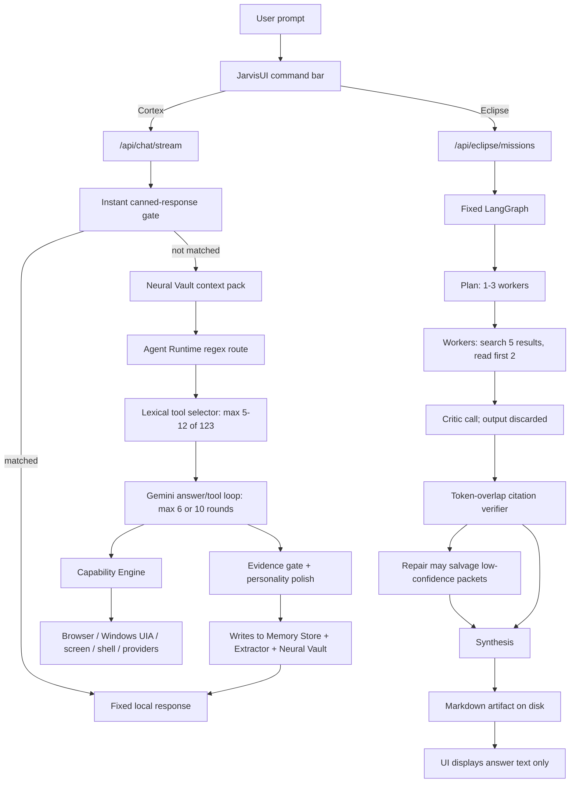
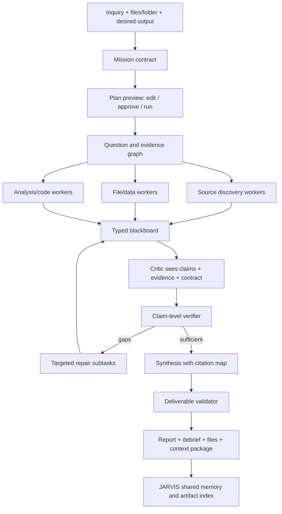
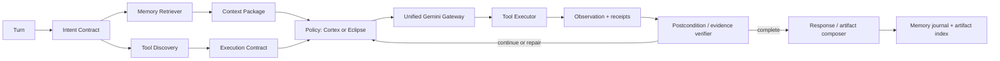

# Existing JARVIS Models — Full Audit and Repair Specification

Status: Cortex Prime removal implemented; Cortex and Eclipse audit complete; remaining repairs are specified but not implemented  
Date: 2026-07-23  
Scope: Cortex, Eclipse, their model routing, conversation path, tools, memory, research, artifacts, desktop/browser automation, model-facing UI, persistence, and evaluations. A new model is deliberately out of scope.

## 1. Executive verdict

JARVIS does not mainly suffer from a weak Gemini model. It suffers from a fragmented harness.

There are multiple partially overlapping systems making independent decisions:

- deterministic instant replies;
- regex intent and freshness classifiers;
- an optional semantic router;
- the Cortex answer/tool loop;
- a separate mission ReAct loop;
- Eclipse's LangGraph mission runtime;
- three overlapping memory surfaces plus a separate vector database;
- several research implementations;
- DOM browser automation, Windows UI Automation, screen-coordinate control, and a separate Computer Use loop;
- multiple response formatters and evidence gates.

These components disagree about model names, capability availability, memory types, evidence, permissions, success, context, and response style. The result is exactly what the owner reports: repeated answer shapes, weak conversation, missed tools, shallow research, forgotten context, and UI claims that exceed the live behavior.

The correct repair is not another persona prompt and not a larger agent swarm. Cortex and Eclipse need one shared execution kernel with two policies:

- **Cortex:** responsive conversational intelligence and bounded task execution.
- **Eclipse:** long-running, evidence-heavy investigation and deliverable production.

They should share model resolution, tool discovery, memory retrieval, evidence, receipts, browser/desktop execution, artifacts, and trace events. Only their orchestration policy should differ.

## 2. Work completed in this pass

### 2.1 Cortex Prime removal

Cortex Prime has been removed from the active user-facing model picker. Its only material advantage has been absorbed into Cortex Max:

| Choice | Resolved execution |
|---|---|
| Cortex Eco | `gemini-3.6-flash`, minimal thinking |
| Cortex Balanced | `gemini-3.6-flash`, medium thinking |
| Cortex Max | `gemini-3.1-pro-preview`, high thinking, 120-second response budget |

Legacy requests containing `model: "cortex-prime"` are migrated to Cortex Max. The same resolver is now applied to `/agent/message`, `/api/chat`, and `/api/chat/stream` so different clients do not silently get different behavior.

The picker now presents only Cortex and Eclipse. Eclipse retains its own Pulse, Deep, and Totality efforts. Internal `pulse` remains a useful bounded-execution tier; it is no longer described as Cortex Prime.

### 2.2 Verification performed

- Cortex model-selection tests: 4/4 passing.
- Eclipse local suites: 102/102 passing.
- Production Vite build: passing.
- Targeted reliability suite after the stream fix: 8/9 passing; the remaining failure is a genuine evidence-gate defect documented below.
- TypeScript still reports four unrelated HELIX v2 errors in files being worked on elsewhere; they were not changed.

The Eclipse number must not be misread. Those 102 checks mostly validate schemas, deterministic stubs, fixtures, and local graph mechanics. They do not establish live research quality.

## 3. Current architecture



The diagram explains why a good provider model cannot rescue the whole product. A wrong decision before the model can hide the needed tool or memory. A successful model response after the tool can still be rewritten by rigid formatters. A successful Eclipse mission can create an artifact that the UI neither exposes nor makes downloadable.

## 4. Cortex audit

### 4.1 What Cortex does well

- It has a real iterative function-calling loop rather than a fake one-shot tool prompt.
- It can feed tool results and screenshots back to Gemini for synthesis.
- It has real provider fallbacks in the central model registry.
- It has useful primitives for browser automation, Windows UI Automation, screen capture, local commands, files, providers, artifacts, Device Mesh, and Co-Op.
- It records receipts and confirmation challenges.
- It has a strong foundation for contextual memory: episodes, facts, procedures, entities, continuity, files, artifacts, and vector search all exist.
- It can stream answer text and progress envelopes.
- It distinguishes Eco, Balanced, and Max honestly after the Prime removal.

These are substantial foundations. The failure is integration and operational truth, not absence of code.

### 4.2 Conversation and reasoning defects

#### C1 — Conversation starts outside the model

`instantConversationResponse()` intercepts greetings, thanks, status phrases, date/time, capabilities, and many exact operational phrases. This makes common interactions fast, but it guarantees repeated wording and prevents tone from adapting to the conversation.

Examples include fixed forms such as:

- “Good [period], sir. How can I assist you?”
- “You are welcome, sir.”
- “Fully operational, sir. What shall we work on?”

The time response is also hardcoded to `America/New_York`, while the profile layer separately resolves the owner's timezone. That can contradict the rest of the system.

**Repair:** retain deterministic data acquisition, not deterministic prose. A local greeting/time resolver should return structured facts; the conversational model should phrase the answer unless sub-100 ms latency is explicitly selected.

#### C2 — Routing is mostly lexical

The main classifier, fresh-information detector, evidence requirement, tool selection, Foundry capability inference, and several special lanes are large regex systems. The optional model router runs only under restricted conditions. Small wording changes therefore change tools and behavior unpredictably.

**Repair:** use a typed semantic intent pass returning task family, freshness, private-data need, action consequence, ambiguity, expected deliverable, required capability classes, and confidence. Regex should remain only for security invariants, exact commands, and cheap obvious fast paths.

#### C3 — Model selection is decided more than once

The agent runtime selects a model, the strength policy may downgrade it, and request handlers may force another model. Before the Prime repair, product labels also overrode effort semantics. Even now, selection logic is spread across the registry, runtime, handler, and specialized modules.

**Repair:** produce one immutable `ExecutionContract` before any provider call:

```text
requestedProduct, requestedEffort, resolvedModel, thinkingLevel,
fallbackCapabilities, latencyBudget, outputBudget, toolBudget,
researchPolicy, memoryPolicy, approvalPolicy
```

No downstream layer may mutate the contract. A fallback may replace the model only if it satisfies the required capabilities.

#### C4 — Normal answers are output-starved

Ordinary Cortex responses are capped at 700 output tokens; deep routes receive 1,800; Max receives 8,000. The regular cap is too low for nuanced answers, multi-tool synthesis, and natural formatting, and it encourages the same compressed structure.

**Repair:** use a dynamic budget based on requested answer form and accumulated evidence. A concise chat may cap near 600-900 tokens, while analysis, comparison, or multi-tool work should receive 2,000-4,000 without requiring Max. Max is for reasoning quality, not permission to write a complete answer.

#### C5 — The system prompt contains conflicting truth claims

It says several capabilities are always-available built-in lanes, then says never claim access to an unlisted tool. It injects a long personality contract, fixed honorific behavior, capability marketing, provider state, tool truth, memory, continuity, and operational rules into every model call. This dilutes the immediate task.

**Repair:** split the prompt into stable cached policy, compact user profile, turn contract, selected tool contracts, retrieved context, and evidence. Include only capabilities selected or discoverable for that turn. Do not market capabilities to the model.

#### C6 — Response polishing creates a house template, not conversational intelligence

Operational responses are forced into a small family of “Done, sir,” “That did not complete, sir,” and “I have ... ready, sir” templates. Tool-recovery synthesis similarly becomes “The verified result is...” bullet output.

**Repair:** make response shape a typed decision—direct answer, dialogue, explanation, comparison, operational receipt, research brief, or artifact handoff. The renderer should enforce factual constraints but allow the model to choose natural wording and structure within the selected form.

### 4.3 Tool discovery and execution defects

Cortex exposes 123 capabilities: 77 observe, 22 prepare, 17 execute, and 7 commit. Breadth is impressive, but the model sees only 5-12 selected tools. Selection is token overlap plus a very long list of regex-injected “always useful” tools.

This creates four problems:

1. A relevant tool can be omitted before Gemini can choose it.
2. Similar tools compete: several research, browser, desktop, memory, and artifact tools overlap.
3. Generic terms such as “open,” “file,” “screen,” or “research” can fill the tool budget with the wrong family.
4. MCP registers every tool with `z.object({}).catchall(z.unknown())`, so the MCP surface does not actually enforce each capability's typed argument schema.

**Repair:** implement two-stage tool discovery:

- Stage A exposes 10-15 capability namespaces such as `web`, `browser`, `desktop`, `files`, `memory`, `artifacts`, `communications`, `markets`, and `devices`.
- Stage B retrieves exact tools inside chosen namespaces using semantic descriptions plus constraints.
- The provider receives strict JSON schemas.
- Tool aliases are consolidated behind canonical operations.
- The planner can request another namespace during a turn instead of being trapped by the initial list.

### 4.4 Evidence and success defects

`hasVerifiedEvidence()` treats almost any successful tool return as verified evidence. The capability engine marks a receipt `verified` whenever a handler returns without throwing. That proves code execution, not task success.

The remaining failing reliability test demonstrates a worse current behavior: a fresh-information answer with no source is deliberately allowed through because the evidence gate returns the model response unchanged for `fresh-information`. A fabricated “latest” answer therefore survives.

**Repair:** separate five states:

- tool invocation succeeded;
- environment changed;
- requested postcondition holds;
- evidence supports the final claim;
- full user objective completed.

Every action tool needs a postcondition verifier. Every live factual claim needs claim-linked source evidence. “No exception” must never equal “verified.”

## 5. Cortex memory audit

### 5.1 Actual stored state

Read-only inspection of the current runtime found:

| Store | Observed state |
|---|---|
| Neural Vault `memories` | 822 total, 740 active |
| Short-term `ms_memories` in the same SQLite file | 205 active |
| Memory objects | 643 active |
| Conversation episodes | 493 active |
| Procedural/preference/correction records used by one context path | 23 |
| Vector records | 88 total, 87 matching an active memory |
| Semantic vector coverage | **11.8%** of active memories |
| User-context preferences | 2 |
| User-context facts | 0 |
| User-context goals | 0 |
| User-context session states | 0 |

The system therefore stores a lot, but does not reliably transform it into usable personal intelligence.

### 5.2 Why recall feels broken

#### M1 — Multiple stores are written independently

A successful chat can write to:

- `memoryStore.ingestTurn()`;
- the five-turn LLM extractor;
- `neuralVault.ingestTurn()`;
- procedural correction memory;
- the global conversation JSON;
- optional vector memory.

The server opens Memory Store once, creates an extractor, then opens it again with a Neural Vault bridge and creates another extractor. The first connection and extractor are replaced without an explicit close. This is not a clean single memory pipeline.

#### M2 — Type taxonomy is inconsistent

Active records use `episode` and `episodic`, `procedure` and `procedural`, plus `preference`, `personal_preference`, and semantic preference rows. `getProcedural()` reads only `procedure`, `correction`, and `preference`, silently excluding `procedural` and `personal_preference` records.

#### M3 — Extraction is delayed and volatile

The LLM extractor runs every five turns. Fewer than five turns remain only in an in-memory buffer and disappear on restart. The current database shows only five rows sourced from `extractor:session`, despite hundreds of conversation episodes.

#### M4 — Semantic coverage is tiny

Only 11.8% of active memory rows have matching vectors. Startup backfill considers only 60 memories. Semantic search also runs only when another regex detects personal language such as “my,” “remember,” or “earlier.” A question can need personal context without containing those trigger words.

#### M5 — Conversation history is global and shallow

The current main UI does not submit its own history to Cortex, so the backend falls back to a global `conversation.json`. The model then receives only the last eight normalized turns. That can mix rooms and topics while losing older local context.

#### M6 — Auto-extraction is still regex-first

Neural Vault promotes durable content mainly when a user message contains phrases such as “I prefer,” “always,” “never,” or “from now on.” Goals, commitments, project state, relationships, decisions, and implicit corrections are frequently missed.

#### M7 — Test and synthetic material is present

The active memory table includes stress-test and test-sourced rows. Memory should have environment and provenance partitions so evaluation material can never influence production answers.

### 5.3 Required unified memory pipeline

```mermaid
flowchart LR
    T["Turn / tool event / file / artifact"] --> J["Append-only event journal"]
    J --> E["Async typed extractor"]
    E --> D["Deduplicate + contradiction resolver"]
    D --> K["Canonical memory objects"]
    K --> V["Embedding + lexical + entity + temporal indexes"]
    V --> R["Intent-aware retrieval"]
    R --> P["Bounded context package with provenance"]
    P --> A["Cortex or Eclipse"]
    A --> U["Usage feedback and correction"]
    U --> D
```



Canonical memory classes should be:

- identity and stable profile;
- preference and interaction rule;
- project and goal;
- decision and commitment;
- entity and relationship;
- episode;
- procedure/skill;
- artifact/file;
- capability observation;
- correction/supersession;
- temporary working state.

Each record needs source references, valid-from/valid-to, confidence, importance, privacy, project/room/session scope, contradiction state, last-used time, and embedding status. Extraction should run after each meaningful turn asynchronously, with a durable queue and immediate handling of explicit “remember/correct/forget” instructions.

Retrieval must occur on every turn through a cheap relevance gate, not a personal-pronoun regex. The UI must show which memory sources influenced a response and allow correction, suppression, deletion, and priority changes.

This direction matches current products: ChatGPT exposes memory sources and continuously refreshes a synthesized memory summary, while Claude's memory tool uses just-in-time reads instead of loading everything into context ([OpenAI Memory FAQ](https://help.openai.com/en/articles/8590148-memory-in-chatgpt-faq), [OpenAI Dreaming memory update](https://openai.com/index/chatgpt-memory-dreaming/), [Claude memory tool](https://platform.claude.com/docs/en/agents-and-tools/tool-use/memory-tool)).

## 6. Research audit

### 6.1 Cortex research is several incomplete systems

`research-v2` has fast, balanced, and deep labels, query expansion, optional Tavily/Brave/Exa providers, Google grounding, page reading, and source scoring. However:

- query expansion is regex-based;
- deep mode advertises up to seven searches but the Gemini path normally runs only the original query plus two generated queries;
- HTML extraction is regex stripping, with weak PDF, table, JavaScript, and structured-data support;
- source quality is largely hostname heuristics;
- confidence is derived from source counts/readability, not whether claims are true;
- there is no claim decomposition, contradiction search, gap analysis, or entailment verification;
- synthesis can fall back to a hardcoded model outside the registry;
- research is not persisted as a reusable dossier or evidence graph.

The older Cortex deep orchestrator is more misleading: it performs one grounded search, reads up to five URLs, then returns the original grounded answer without feeding the read page content back into synthesis. The “deep read” does not influence the output.

### 6.2 What real deep research requires

The current Gemini Deep Research agent is an asynchronous plan → search → read → iterate → report system. Google documents typical moderate tasks at roughly 80 searches, 250k input tokens, and 60k output tokens, and exposes collaborative plan review, visualizations, documents, File Search, and MCP data sources ([Gemini Deep Research](https://ai.google.dev/gemini-api/docs/deep-research)). ChatGPT's product similarly provides a reviewable plan, progress, interruption/refinement, a fullscreen report, citations, activity history, and Markdown/Word/PDF downloads ([ChatGPT Deep Research](https://help.openai.com/en/articles/10500283-leep-research-faq)).

JARVIS Deep Research should therefore use this loop:

1. Define the exact question, audience, time boundary, jurisdiction, source constraints, and output.
2. Produce a reviewable research plan and question tree.
3. Search each branch with source diversity targets.
4. Read primary sources, PDFs, tables, images, and supplied files.
5. Extract atomic claims with exact locators.
6. Detect contradictions, missing evidence, and outdated sources.
7. Run follow-up searches targeted at gaps.
8. Use code execution for calculations, tables, charts, and dataset checks.
9. Verify citations claim-by-claim.
10. Synthesize a navigable report with confidence and limitations.
11. Persist the dossier, evidence graph, report, and reusable context package.
12. Allow follow-up questions and transformations without rerunning the entire mission.

Quick current facts should still use native Google Search grounding. Gemini 3 can combine Google Search and custom functions in one interaction, so Cortex does not need to choose between current information and local tools ([Gemini tool combination](https://ai.google.dev/gemini-api/docs/tool-combination), [Google Search grounding](https://ai.google.dev/gemini-api/docs/google-search)).

## 7. Eclipse audit

### 7.1 What is genuinely good

- LangGraph checkpoints exist.
- The graph has typed state and persisted events.
- Workers fan out with a bounded width.
- Capability leases narrow authority.
- There is an evidence/claim schema and promotion concept.
- Model calls pass through a central adapter and cost ledger.
- Artifacts are content-hashed.
- SSE events are sequenced and reconnectable at the event-log layer.
- Local tests cover contracts, graphs, leases, tools, evidence, and artifacts.

This is a better foundation than a single long prompt pretending to be a research agent.

### 7.2 What Eclipse actually does today

1. The UI submits only prompt and effort. It does not send files, folders, conversation history, output requirements, source constraints, or a project context package.
2. Intake runs a regex genome. It does not call the model despite model-routing metadata claiming an intake role.
3. Contract creates one generic acceptance test. It does not build a real mission contract.
4. Context returns `{}`. Memory Resonance is not connected to the owner's actual memory.
5. Plan asks Pro for one to three sub-questions.
6. Foundry creates deterministic keyword personas, not learned or qualified specialists.
7. Every worker is sent through `gatherEvidence()`, which searches once, takes up to five results, and reads only the first two.
8. The worker model receives the subquestion and a small evidence list, then its entire result is truncated into one claim of at most 900 characters.
9. The critic model is called with “challenge the batch,” but it is not given the packets. Its output is ignored. Verdicts are created mechanically from `evidence.length`.
10. Citation verification checks exact substring or token overlap against a 4,000-character excerpt.
11. `memory.promote` returns `{ promoted: true }` without writing memory.
12. If verification fails, repair can relabel any packet with evidence as partial at confidence 0.4 without new research.
13. Synthesis receives only truncated claim text, not source excerpts, citation locators, critiques, contradictions, or the user's files.
14. Artifact generation writes Markdown only.
15. The main JARVIS UI displays only the synthesized answer. It discards artifact, sources, validated count, packet count, usage, and cost from its response state.

### 7.3 Live runtime evidence

The current Eclipse database contains four live graph runs:

- 2 complete;
- 2 failed;
- 2 supported claims;
- 0 curated semantic memories;
- 0 persisted artifact manifests.

One live failure says: `lease lacks scope "web.search" for tool "web.search"`. The cause is structural: Foundry can generate a code/data/extract worker whose lease lacks web search, but `gatherEvidence()` unconditionally calls web search for every worker.

The other failure is a multi-error fan-out crash. The integration does not expose cold resume, so failed work cannot be resumed from the product even though a checkpointer exists.

### 7.4 Eclipse label-to-reality gaps

| Label/claim | Current reality |
|---|---|
| Durable mission | Graph is checkpointed, but the API's mission registry is an in-memory `Map`; after restart mission lookup is lost |
| Multi-agent | Multiple worker calls exist, but personas are keyword presets and critic output is discarded |
| Deep research | At most 1-3 workers, each reading two pages; no iterative gap search |
| Evidence Prosecutor | Token overlap, not semantic entailment; critic does not influence it meaningfully |
| Memory Resonance | Context node is empty; toolbox corpus defaults empty |
| Memory promotion | Stub success response; no actual memory write |
| Repair | Does not research the gap; relabels weak evidence as partial |
| Artifact Director | Writes Markdown only; manifest is not persisted in `artifact_manifests` |
| Resumable | `resumeMission()` exists in code but has no public API/control path |
| Cost capped | Model calls are metered, but tool/lease token budgets are not deducted and estimated rates can drift |
| Interactions backbone | Disabled unless an environment flag is set; fallback is `generateContent`; background Interactions is not polled |

### 7.5 Required Eclipse workflow



Pulse should run one adaptive researcher with a small source budget. Deep should build a real question graph and iterate until coverage criteria or budget. Totality should add broader branch coverage, independent verification, code/data analysis, and richer artifacts. Worker count alone must not define effort.

Eclipse must use actual LangGraph interrupts for plan approval, consequential actions, and mid-mission clarification. LangGraph's documented interrupt mechanism persists state and resumes with user input; merely throwing a custom pause error does not provide the same product loop ([LangGraph interrupts](https://langchain-ai.github.io/langgraph/how-tos/human_in_the_loop/breakpoints/)).

## 8. Desktop, browser, and automation audit

### 8.1 Existing real capabilities

JARVIS already has:

- persistent Playwright browser sessions;
- DOM snapshots and stable refs;
- navigation, typing, clicking, extraction, uploads, downloads, tabs, screenshots, and verification;
- prompt-injection checks and login handoff;
- Windows foreground-window inspection through UI Automation;
- visible text/control lookup and coordinate actions;
- screen capture and Gemini vision-based element location;
- keyboard, mouse, hotkeys, clipboard, shell, app launch/close, file operations, and notifications;
- Device Mesh and Co-Op control surfaces.

This is enough to build a serious desktop agent. It is not yet a reliable unified agent.

### 8.2 Current failures

- `computer-use.js`, `react-loop.js`, `screen_analyze`, research synthesis, and deployable-agent defaults contain hardcoded model names outside the registry.
- Computer Use and screen analysis can therefore fail even when Cortex chat is healthy.
- Browser automation controls a separate JARVIS Chrome profile, not necessarily the browser/window the user is looking at.
- `desktop_control` directs typing/hotkeys toward Chrome or Edge in several paths, so it is not general desktop control.
- UI Automation matching is heuristic and brittle.
- A before/after screenshot is captured but not semantically compared; success is inferred from lack of an exception.
- The visual loop trusts the model's “done” declaration without a separate postcondition check.
- Computer Use's internal Playwright loop calls browser primitives directly, so per-step actions do not all pass through the same top-level capability policy and receipt model.
- There is no durable task state for a 50-300-step desktop workflow.
- There is no environment model tracking active app, selected document, open modal, downloads, clipboard, and pending irreversible action.

### 8.3 Required desktop execution stack

Use the cheapest reliable modality at each step:

1. **Native/API adapter first** — provider API, filesystem, shell, app automation API.
2. **Accessibility/UIA second** — semantic controls, roles, labels, bounds.
3. **DOM browser third** — Playwright refs and structured page state.
4. **Visual Computer Use fourth** — screenshot understanding and coordinates for otherwise inaccessible UI.
5. **User handoff** — login, CAPTCHA, ambiguous or consequential decision.

Every desktop task should be a durable state machine:

```text
understand objective → inspect environment → propose bounded plan → act one step
→ observe delta → verify postcondition → update task state → continue/recover
→ verify final objective → produce receipt/artifacts
```

The observation packet should combine screenshot, accessibility tree, DOM snapshot, active process/window, recent action, clipboard/download changes, and task constraints. The action policy should choose semantic targets before coordinates. A separate verifier should confirm the postcondition after every important step.

Google and Anthropic both document Computer Use as a continuous screenshot/action/result loop with client-side execution, action safety decisions, and repeated observation. Anthropic specifically warns that models assume success unless instructed to inspect after each step ([Gemini Computer Use](https://ai.google.dev/gemini-api/docs/computer-use), [Claude Computer Use](https://platform.claude.com/docs/en/agents-and-tools/tool-use/computer-use-tool)).

“Any desktop task” cannot honestly mean guaranteed completion. OSWorld 2.0 reports that the best tested frontier agent completes only 20.6% of 108 long-horizon professional workflows under its binary metric, even with up to 500 steps. The dominant failures are lost constraints, hidden state, skipped verification, and guessing instead of asking ([OSWorld 2.0](https://arxiv.org/abs/2606.29537)). JARVIS can aim for broad coverage, but must measure completion instead of claiming universality.

## 9. Target shared execution kernel

This is a repair of the existing products, not a new model.



### 9.1 One Gemini gateway

All provider calls must go through one module that owns:

- registry resolution and health probes;
- capability-compatible fallback ladders;
- thinking configuration;
- Interactions versus `generateContent` behavior;
- streaming and background polling;
- previous interaction continuity;
- prompt caching;
- token/cost accounting;
- retry, backoff, circuit breaker, and cooldown;
- structured output repair;
- tool-call normalization;
- consistent telemetry.

No module may hardcode a Gemini model string. Computer Use should use the registry's current supported model and fallbacks. Hosted Deep Research must call the agent with `agent`, `agent_config`, `background: true`, `store: true`, and poll or stream until terminal state; it must not treat the initial background response as the report.

### 9.2 One event and receipt model

Every turn or mission should share:

- `traceId`, `sessionId`, `projectId`, `roomId`, and `missionId`;
- requested and resolved execution contract;
- model attempts and fallbacks;
- memory sources retrieved and actually used;
- tool request, authorization, execution, observation, and verification;
- claim-evidence links;
- artifacts and download routes;
- partial/degraded/failed/complete terminal state.

### 9.3 One artifact service

Cortex and Eclipse should both create registered artifacts through the existing Work Composer. Required initial outputs:

- Markdown;
- PDF;
- DOCX;
- PPTX;
- CSV/XLSX when data is tabular;
- HTML/site package;
- code/project bundle;
- images/charts.

Every manifest must be persisted, searchable, downloadable, linked to its sources, and visible to JARVIS memory. Transformation should reuse the saved evidence/content graph instead of rerunning research.

## 10. Product behavior after repair

### 10.1 Cortex

Cortex should feel like ChatGPT/Claude-quality conversation with tools:

- answer naturally without a fixed header template;
- infer the desired depth and structure;
- use memory only when relevant and show its provenance;
- search quickly when current information matters;
- discover tools dynamically;
- execute bounded tasks and verify them;
- ask a concise clarification only when it changes the result or authority;
- offer an artifact when the work naturally produces one;
- continue from prior files, missions, rooms, and task state.

Effort changes reasoning depth and budget, not the personality or basic completeness of the answer.

### 10.2 Eclipse

Eclipse should be selected for a durable investigation or deliverable, not simply a slower chat:

- accepts files, folders, URLs, datasets, source restrictions, and desired outputs;
- generates a plan the user can edit;
- shows a real branch/source/evidence timeline;
- allows pause, refinement, cancellation, and cold resume;
- stores a debrief plus evidence graph;
- lets the user inspect claims, sources, contradictions, calculations, and gaps;
- produces downloadable output formats;
- exposes the completed dossier immediately to Cortex/JARVIS for follow-up.

## 11. UI repair requirements

### Cortex response surface

- Stream answer text first; keep internal mechanics collapsible.
- Show resolved model/effort only in details, not as noisy prose.
- Show source chips adjacent to supported claims.
- Show “used memory” with inspect/correct controls.
- Show tool progress using human actions: “Reading the page,” not raw tool names.
- Distinguish waiting for approval, running, verifying, partial, and failed.
- Preserve and display artifacts with working download buttons.
- Allow the user to continue from an artifact or mission as context.

### Eclipse mission surface

- Intake form for objective, files/folder, source scope, time boundary, audience, and output.
- Editable plan before execution.
- Left: question/branch graph.
- Center: evolving report/debrief.
- Right: evidence, files, agents, cost, and controls.
- Fullscreen report view with table of contents.
- Claim-level source inspection.
- Pause, refine, add source/file, retry branch, cancel, and resume.
- Export/download menu.
- “Send to JARVIS context” and “Create from this” actions.

The current Eclipse branch in `JarvisUI.tsx` must stop reducing the whole result to `setResponse(res.answer)` and `setMeta({model:"eclipse"})`. It needs to retain the mission ID, artifact, evidence, sources, validated/packet counts, usage, cost, terminal state, and resumability.

## 12. Repair program in waves

### Wave 0 — Baseline and truth

- Freeze a representative prompt/task corpus.
- Record current Cortex/Eclipse answers, calls, latency, cost, memory hits, and completion.
- Add live health checks for every registry role.
- Remove inaccurate capability claims from UI and prompts.
- Fix UTF-8 mojibake across source, logs, SSE, and artifacts.

### Wave 1 — Model gateway consolidation

- Move every Gemini call to the shared registry/gateway.
- Eliminate hardcoded models.
- Add capability-aware failover and circuit breakers.
- Implement correct Interactions polling/streaming.
- Expose resolved execution telemetry.

### Wave 2 — Conversation contract

- Replace canned prose with structured fast-path facts plus natural rendering.
- Implement semantic intent and response-form classification.
- Remove conflicting prompt sections.
- Add dynamic answer budgets.
- Add session/room-scoped history.

### Wave 3 — Tool discovery and typed execution

- Namespace the 123 capabilities.
- Add semantic two-stage discovery.
- Enforce strict schemas at every entry point.
- Consolidate overlapping aliases.
- Add postcondition definitions to tools.

### Wave 4 — Evidence and verification

- Block unsupported fresh claims.
- Link claims to sources and tool observations.
- Add semantic entailment and contradiction checks.
- Separate invocation, action, postcondition, and objective success.
- Repair the receipt vocabulary.

### Wave 5 — Unified memory

- Create canonical types and migrations.
- Stop duplicate writes and duplicate connections.
- Add durable per-turn extraction queue.
- Backfill embeddings to full eligible coverage.
- Partition production/test memory.
- Add contradiction/supersession and temporal validity.
- Add memory-source UI and controls.

### Wave 6 — Cortex research

- Merge the duplicate research paths.
- Add real multi-query iterative research.
- Support PDFs, tables, images, and datasets.
- Add claim/evidence dossier persistence.
- Use code execution for analysis and charts.

### Wave 7 — Desktop/browser kernel

- Unify API, UIA, DOM, and visual execution behind one state machine.
- Add active-window/environment state.
- Verify every important action.
- Persist long-running desktop tasks.
- Route every action through the capability gateway and receipts.
- Add OSWorld-style end-to-end evaluations.

### Wave 8 — Eclipse correctness

- Build a real contract and context node.
- Fix Foundry lease/tool compatibility.
- Give critics the packets and use their outputs.
- Replace token-overlap verification.
- Make repair gather missing evidence.
- Connect actual shared memory.
- Persist mission lookup and expose cold resume.

### Wave 9 — Artifacts and Eclipse UI

- Persist artifact manifests.
- Add authenticated download routes.
- Connect Work Composer multi-format output.
- Build plan/progress/evidence/report surfaces.
- Add follow-up and transformation from saved dossiers.

### Wave 10 — Rollout and hardening

- Shadow new routing against old.
- Canary by task family.
- Track regression, cost, and latency dashboards.
- Add provider-outage, restart, prompt-injection, and partial-failure drills.
- Remove obsolete paths only after traffic proves replacement parity.

## 13. Acceptance gates

### Conversation

- No repeated fixed opening across a 50-prompt dialogue set unless requested.
- Correct short/long response form in at least 90% of owner-rated cases.
- Follow-up referent accuracy measured by session and room.
- No cross-room history leakage.

### Memory

- 95%+ embedding coverage for eligible active memories.
- Explicit preferences/corrections queryable within one completed turn.
- No production retrieval of test/stress records.
- Contradictory facts resolve by temporal validity and source priority.
- Memory-source explanations are visible and correct.

### Tools and desktop

- Tool-selection recall above 95% on the frozen tool corpus.
- Strict-schema rejection tests for every tool.
- No success receipt without a postcondition.
- Browser/desktop benchmark reports full, partial, and failed completion separately.
- Crash/restart resumes long tasks without duplicate side effects.

### Research

- Every material factual claim maps to a source locator or is explicitly labeled analysis.
- Source reading affects synthesis.
- Contradiction and freshness checks are recorded.
- Deep missions exceed a minimum evidence-coverage target, not merely a worker count.
- Files, PDFs, tables, and calculations are part of the same evidence graph.

### Eclipse

- Plan can be edited before execution.
- Critic output changes promotion or launches repair work.
- Memory promotion produces a real searchable record.
- Mission is retrievable and resumable after server restart.
- Requested artifact format is generated, registered, downloadable, and available to Cortex.
- Live mission success is measured; fixture-only green tests do not satisfy release.

## 14. Priority defects

### P0 — Correctness and broken promises

1. Unsupported current-information claims pass the evidence gate.
2. Eclipse workers can crash because evidence gathering ignores their lease.
3. Eclipse critic output is discarded.
4. Eclipse memory promotion does not write memory.
5. Eclipse mission lookup and resume are not product-durable.
6. Artifact manifests are not persisted or surfaced.
7. Hardcoded model IDs bypass the registry in important automation/research paths.

### P1 — Intelligence quality

8. Memory semantic coverage is 11.8%.
9. Memory taxonomy and stores conflict.
10. Global eight-turn history is not real room/session continuity.
11. Lexical routing and tool discovery are brittle.
12. Cortex research reads sources without a proper evidence loop.
13. Ordinary response budgets are too small.
14. Rigid personality and recovery templates cause repeated answer structure.

### P2 — Product completeness

15. Desktop modalities are not unified or durably stateful.
16. Eclipse has no plan review/refinement UI.
17. Eclipse answer UI discards most mission metadata.
18. Multi-format artifacts are not connected.
19. Memory provenance and correction controls are fragmented.
20. Live end-to-end evaluations are too weak relative to fixture tests.

## 15. Final recommendation

Do not build the new model yet. First turn Cortex and Eclipse into two policies over one trustworthy operating substrate.

Begin with the P0 defects and shared Gemini gateway, then repair conversation/context, then unify memory and evidence, then desktop execution, and finally Eclipse's mission/artifact UX. This order prevents expensive UI and agent work from sitting on top of the same broken routing, memory, and verification wires.

The largest immediate quality gain will not come from adding more agents. It will come from ensuring that the right model receives the right context and tools, that research actually reads and uses evidence, that actions are verified, that memory retrieval is complete and scoped, and that the final answer is rendered according to the user's request instead of a fixed JARVIS template.
