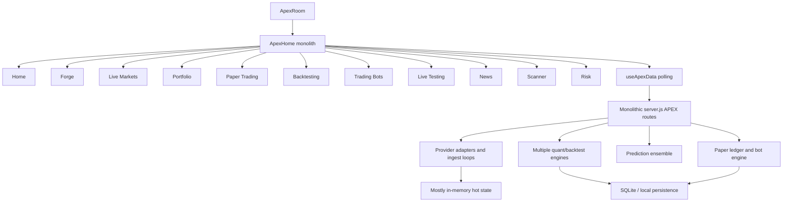
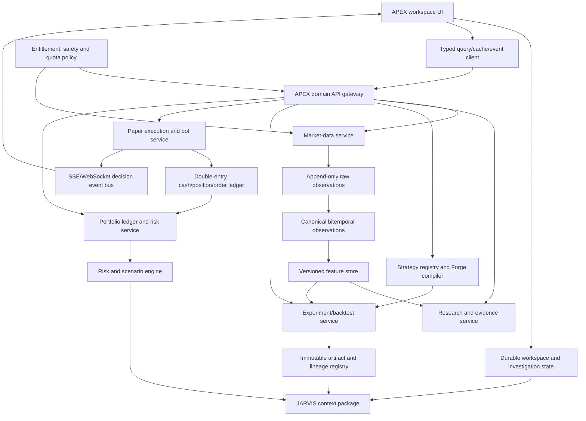
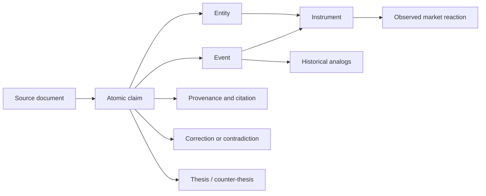
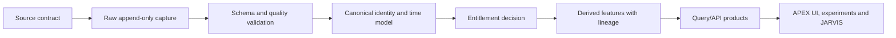

# APEX Extreme Master Audit and Rebuild Blueprint

**Audit date:** 1 August 2026  
**Scope:** APEX room only  
**Repository root:** `C:\Users\devan\OneDrive\Documents\Kalshi\jarvis-ui`  
**Mode:** read-only product, code, quantitative, data, workflow and UI audit  
**Change policy:** this document is the only artifact created; no APEX source code, configuration, database or runtime state was changed.

## 0. What this document is

This is not a mood board, loose wishlist, or claim that every sophisticated label in APEX is already real. It is an evidence-led master specification for turning the current APEX room into a trustworthy research, simulation, execution and risk workspace.

It combines:

- a file-by-file inspection of the APEX frontend, backend, providers, prediction, quant, paper-trading and persistence paths;
- a defect and misleading-behavior audit with exact code locations;
- a full workflow and information-architecture critique;
- a quantitative-methodology and backtest-validity critique;
- a current source and licensing review using primary documentation;
- a target architecture that preserves the visual direction of **Home** and **Forge**;
- more than 200 concrete product and engineering upgrades;
- ordered implementation waves, acceptance gates, observability targets and a test matrix.

### Audit boundary

The review covered 114 APEX-related files and approximately 21,000 lines across:

- `src/rooms/ApexRoom.tsx`
- `src/rooms/apex/**`
- `server/apex/**`
- `server/providers/apex/**`
- `server/apex-db.js`
- `server/apex-ingest.js`
- APEX routes in `server.js`

No live broker certification, licensed market-data entitlement test or capital-at-risk execution test was performed. A workspace-wide TypeScript no-write check produced no diagnostics before its 124-second timeout, so that check is **inconclusive**, not a pass. Dedicated APEX tests are effectively absent.

---

# Part I — Executive verdict

## 1. Blunt assessment

APEX is not technically 1% complete. It has meaningful frontend breadth, a real native quant layer, a paper ledger, strategy tooling, multiple provider adapters and a strong visual starting point in Home and Forge. As a coherent trader product, however, it behaves closer to a collection of partially connected prototypes than one reliable operating room.

The central failure is not merely “too little data.” It is **truth, state and workflow integrity**:

1. Values can look live when every provider call failed.
2. Simulated, derived, delayed and real observations are not consistently distinguished.
3. Tabs do not share a durable investigation, instrument, strategy or portfolio context.
4. Several buttons announce success through a toast while doing nothing durable.
5. Backtest controls can be visible but ignored by the engine.
6. Paper trading can create economically impossible buying power.
7. Bots do not own isolated positions and can act from a supposedly observational “check.”
8. Prediction output uses advanced terminology over heuristic or mathematically incorrect calibration.
9. Portfolio is not a portfolio; Scanner is not a security scanner; Risk is mostly a single-symbol report.
10. There is no dedicated APEX regression suite protecting financial invariants.

### Overall maturity score

| Dimension | Current score | Why |
|---|---:|---|
| Visual identity | 71/100 | Home and Forge are distinctive and directionally strong; other tabs are compressed, inconsistent and less legible. |
| Feature breadth | 63/100 | Eleven tabs and many backend components exist, but breadth frequently outruns depth and connection. |
| Workflow coherence | 24/100 | No durable research object or lifecycle connects discovery, strategy, tests, paper execution, risk and review. |
| Data trust | 22/100 | Missing provenance, stale-state semantics, entitlements, point-in-time storage and correct streaming state machines. |
| Quantitative validity | 28/100 | Useful building blocks exist, but there are multiple incompatible engines, ignored controls and invalid/heuristic methods. |
| Execution realism | 18/100 | Paper fills, shorting, order ownership, transaction atomicity and bot controls are materially incomplete. |
| Product honesty | 26/100 | Demo, synthetic, heuristic and dead behavior can be presented too close to operational behavior. |
| Reliability/testing | 12/100 | No focused tests for the financially dangerous paths; swallowed errors and mutable reads are common. |
| Extensibility | 45/100 | Modular folders exist, but local tab state, monolithic routes and missing domain contracts limit safe growth. |
| Trader usefulness | 31/100 | A trader can explore, but cannot yet trust an end-to-end decision and reproduce its evidence. |

**Composite maturity: 34/100.**  
**Production trading readiness: no.**  
**Research prototype value: meaningful.**

## 2. What is genuinely done well

- Home establishes a convincing room identity and high-density market-command aesthetic.
- Forge is the strongest real product concept: node-based strategy construction, branching and an improver direction are worth protecting.
- The codebase already separates several provider, quant, prediction and paper domains rather than keeping everything in React.
- There are real attempts at correlation, regime, anomaly, allocation, event clustering, options and calibration logic.
- The paper ledger and bot event concepts provide a base for an audit trail.
- The room has the right broad lifecycle ingredients: discover, research, test, simulate, monitor and manage risk.
- The UI already contains multiple useful analytical surfaces instead of being a chat wrapper.
- APEX is an independent trading and research room. It must not consume Kalshi, Polymarket or any other prediction-market data, provider, instrument model or room-specific dependency.

## 3. The target product

APEX should become a **point-in-time, provenance-first trading research and simulation operating system**. Every visible number, generated signal, test result, proposed order and JARVIS explanation must answer:

1. What exactly is this value?
2. Which provider, venue and entitlement produced it?
3. At what event time and receive time was it knowable?
4. Is it real, delayed, indicative, derived, estimated or simulated?
5. How stale, complete and reliable is it?
6. Which investigation, strategy version, dataset snapshot and model version used it?
7. What changed downstream because of it?
8. Can the complete decision be replayed?

### Intended lifecycle

```mermaid
flowchart LR
    A["Discover instrument or event"] --> B["Create investigation"]
    B --> C["Collect sourced evidence"]
    C --> D["Form thesis and counter-thesis"]
    D --> E["Build versioned strategy in Forge"]
    E --> F["Run point-in-time backtest"]
    F --> G["Robustness and red-team gates"]
    G --> H["Paper deployment"]
    H --> I["Forward test and bot telemetry"]
    I --> J["Portfolio and risk impact"]
    J --> K["Journal, attribution and review"]
    K --> D
```



---

# Part II — Current architecture and structural gaps

## 4. Current architecture



### Structural findings

- `src/rooms/apex/ApexHome.tsx` eagerly imports all eleven heavy tabs; there is no real tab-level lazy loading.
- `activeTab` is local to ApexHome; conditional mounting destroys unsaved child state when the user switches tabs.
- Each tab builds a local island of symbol, time range, portfolio, strategy, errors and loading state.
- There is no durable `ApexWorkspace`, investigation ID, shared asset selection or route/deep-link contract.
- `useApexData` polls sequentially every six seconds and converts failures to fallbacks, while news uses a separate 45-second loop.
- The frontend can set `updated = Date.now()` after failed/fallback calls, allowing a false “LIVE” impression.
- Backend source schedules range from seconds to 30 minutes, so a six-second UI refresh does not imply six-second source freshness.
- Most provider pollers catch and swallow errors; the governor interprets absence of a thrown error as health.
- Hot ring buffers and sequence state are mostly volatile and can disappear on restart.
- APEX routes are embedded in a large `server.js`, and many failures return HTTP 200 with `{ok:false}`.
- There are several calculation engines with inconsistent cost, annualization, drawdown, Sortino and trade semantics.

## 5. Target architecture



### Required bounded contexts

| Context | Owns | Must not own |
|---|---|---|
| Instruments | canonical identities, symbology, calendars, corporate actions | quotes or strategy logic |
| Market Data | source adapters, raw/canonical observations, sequencing, quality | UI-specific labels |
| Evidence | news claims, filings, macro releases, citations, event graph | portfolio balances |
| Strategies | node graph, parameter schema, compiled rule package, versions | mutable backtest results |
| Experiments | data snapshots, simulations, robustness tests, reports | live bot state |
| Orders | intents, approvals, orders, fills, reservations, idempotency | analytical predictions |
| Portfolios | accounts, cash, positions, lots, transactions, attribution | market-provider polling |
| Bots | deployments, decisions, heartbeats, policies, incidents | global unowned positions |
| Risk | exposures, limits, scenarios, model validation | order mutation without approval |
| Workspaces | investigation state, selected artifacts, user layout | financial source of truth |

---

# Part III — Claims versus reality

## 6. Product-honesty matrix

| Surface/claim | What the code currently does | Classification | Required correction |
|---|---|---|---|
| Global `LIVE` | May refresh its timestamp after all source calls failed or fell back | Financially misleading | Derive state per observation and provider; never infer live from render time |
| Live Markets crypto book | Reuses one BTC microstructure stream for selected crypto symbols | Broken/wrong asset | Route by canonical venue-symbol and reject mismatched payloads |
| Scanner | Displays a factor catalog and pseudo-code, not ranked securities | Claim mismatch | Build universe execution, ranked hits and explanations |
| Portfolio | Shows market structure/correlation/regime panels, not holdings/NAV | Claim mismatch | Split Market Structure and create a real Portfolio ledger view |
| Walk-forward | Sequential stability test without refitting/rolling optimization | Method mismatch | Implement purged rolling/anchored train-validate-test cycles |
| Platt calibration | Does not update intercept and nudges slope one way | Method mismatch | Implement validated logistic calibration or rename it |
| Adaptive intervals | Coverage adjustment moves volatility in the wrong direction | Mathematically broken | Correct update, bound it, backtest calibration and expose sample size |
| Option recommendation | Uses synthetic strike/premium grid, not a real chain | Financially misleading | Label theoretical candidate or integrate entitled chain data |
| Bot “Run check” | Can evaluate and place a real paper order | Unsafe label | Make inspect-only dry evaluation; separate explicit execution |
| Forge deploy | Some flows produce demo toast instead of durable deployment | Half-built | Create immutable promotion artifact and deployment gate |
| News credibility | Hand-built heuristics shown as confidence without source evidence | Overstated | Explain inputs, link sources and calibrate/evaluate |
| Paper buying power | Unlimited naked short sells can increase cash and buying power | Economically invalid | Margin/borrow/reservation model and invariant tests |
| Compare/Alert/Quick action | Several actions show toast only | Dead control | Durable action or disabled “planned” state; no fake success |
| Source health `OK` | Poller may swallow provider failure, leaving governor healthy | Broken telemetry | Standard result contract and observed freshness/error health |
| News Attach to Algo | Stores a local choice; engine does not consume it | Dead workflow | Versioned event-filter node passed into strategy compiler |
| Backtest direction mode | UI exposes long/short/both; adapter ignores it | Broken control | Compile mode into executable rules and verify differing trades |
| Live Testing live stream | Replaces a polled snapshot every five seconds | Claim mismatch | Sequenced SSE/WS stream with resume/replay |
| Treasury rates | Adapter retrieves average rates paid on debt | Wrong dataset | Use par yields/FRED DGS/auction data with observation dates |
| TradingView automated feed | Unofficial automation conflicts with provider policies | Legal/entitlement risk | Remove from production and replace with licensed sources |

---

# Part IV — Defect and logic-gap ledger

## 7. Severity definitions

- **P0 — financially dangerous or materially false:** can create impossible financial state, use the wrong asset/data, execute unexpectedly or materially misrepresent validity.
- **P1 — broken primary workflow:** a named core action cannot complete, loses state or produces unreproducible/invalid results.
- **P2 — major analytical/reliability weakness:** feature runs but uses incomplete, fragile or misleading methods.
- **P3 — usability, accessibility or maintainability debt:** does not immediately corrupt financial output but prevents professional operation.

## 8. P0 findings

### P0-01 — Unlimited short-selling creates false buying power

- **Path:** `server/apex/apex-paper.js`
- **Evidence:** `preflightBuyingPower` returns immediately when position delta is non-positive (approximately lines 230–235), while a sell credits cash and buying power is raw cash.
- **Impact:** repeated naked shorts can manufacture cash and finance unrelated longs; account NAV and risk become meaningless.
- **Correction:** reserve initial/maintenance margin, model borrow availability/fees, cap gross/net leverage, prevent unbounded naked shorting and represent short sale proceeds as restricted collateral.
- **Acceptance:** repeated short attempts cannot increase available buying power beyond policy; cash, restricted cash, margin and NAV reconcile after every fill.

### P0-02 — Resting limits bypass buying-power preflight

- **Path:** `server/apex/apex-paper.js`
- **Evidence:** the synchronization fill path applies resting fills directly (approximately lines 168–177); the nearby comment anticipates an exception but `applyFill` does not enforce preflight.
- **Impact:** an order acceptable when placed can fill later after capital was consumed, driving impossible balances.
- **Correction:** reserve buying power at order acceptance and revalidate/release atomically on partial fill, cancel or expiry.
- **Acceptance:** total reservations plus filled exposure can never exceed account policy under concurrent orders.

### P0-03 — Marketable limits fill at the user's worse limit price

- **Path:** `server/apex/apex-paper.js`
- **Evidence:** immediate marketable limit logic uses the submitted limit as fill price (approximately lines 217–224), not the better current quote.
- **Impact:** a buy limit at 200 while the market is 100 fills at 200, fabricating huge negative slippage.
- **Correction:** apply price improvement: buy at `min(limit, executable ask adjusted for depth)` and sell at `max(limit, executable bid adjusted for depth)`.
- **Acceptance:** a marketable limit never fills worse than its limit and uses a reproducible quote/depth snapshot.

### P0-04 — Read endpoint mutates and executes account state

- **Path:** `server/apex/apex-paper.js`
- **Evidence:** GET account calls `sync(true)` (approximately lines 275–277), which can fetch prices and fill resting orders.
- **Impact:** opening/refreshing a page changes financial state; retries and crawlers can cause execution.
- **Correction:** separate deterministic read models from a background matcher or explicit simulation-clock advance command.
- **Acceptance:** all GETs are side-effect free and idempotent.

### P0-05 — Bots do not own isolated positions

- **Path:** `server/apex/apex-bots.js`
- **Evidence:** decisions inspect the shared ticker position (approximately lines 207–214), and a sell closes the aggregate `held` quantity.
- **Impact:** one bot can close manual or another bot's holdings; several bots can each display the same position and double-count unrealized P&L.
- **Correction:** use bot deployment subaccounts or explicit lot/allocation ownership with reconciliation.
- **Acceptance:** every fill and lot has one owner; a bot cannot trade another owner's quantity without an explicit portfolio-level mandate.

### P0-06 — “Run check” may place an order

- **Path:** `server/apex/apex-bots.js`; `src/rooms/apex/bots/**`
- **Evidence:** `evaluateOnce` calls the ordinary evaluation path (approximately lines 337–345), which can submit a paper order even when the bot is paused.
- **Impact:** an observational button causes a financial mutation.
- **Correction:** create a pure decision preview returning features, rule branches and proposed intent; require a separate execute command.
- **Acceptance:** preview/check can be called any number of times with zero ledger changes.

### P0-07 — Wrong crypto asset displayed in Live Markets

- **Path:** `src/rooms/apex/livemarkets/LiveMarketsView.tsx`; `server/apex-ingest.js`
- **Evidence:** `useMicro()` consumes the BTC-only micro endpoint, but the selected crypto symbol labels the resulting book/trades as itself.
- **Impact:** ETH, SOL or XRP can visibly display BTC order flow and depth.
- **Correction:** key microstructure by `(venue, canonicalInstrumentId)`; validate the payload identity at client and server boundaries.
- **Acceptance:** deliberate symbol-mismatch fixtures are rejected and visibly degraded, never relabelled.

### P0-08 — Prediction target can resolve with pre-target price

- **Path:** APEX prediction route in `server.js` (approximately lines 6753–6759)
- **Evidence:** `priceAt` can return the last available price when no bar exists at or after the target timestamp.
- **Impact:** a future target may be “resolved” using information before the requested horizon, corrupting calibration scores.
- **Correction:** keep target pending until a qualified post-target observation exists; record market calendar, max delay and resolution source.
- **Acceptance:** a target cannot resolve with `price_time < target_time`.

### P0-09 — Interval calibration feedback has the wrong sign

- **Path:** `server/apex/predict/calibration.js`
- **Evidence:** volatility multiplier update expands intervals when empirical coverage is already above target and shrinks them when coverage is below target.
- **Impact:** calibration error self-amplifies.
- **Correction:** reverse and validate the update, bound changes, use rolling weighted conformal/calibration diagnostics and abstain when sample size is insufficient.
- **Acceptance:** synthetic undercoverage widens future intervals; overcoverage narrows them; convergence tests pass.

### P0-10 — Backtest direction control is ignored

- **Path:** `src/rooms/apex/backtest/**`; `src/rooms/apex/forge/forge-engine.ts`
- **Evidence:** the UI exposes long/short/both, but the adapter passes only cash/cost configuration and the engine implements long-only trade logic.
- **Impact:** the report claims to test a selected direction without doing so.
- **Correction:** compile direction into executable position rules and include it in run manifest/hash.
- **Acceptance:** a falling deterministic series yields materially different trades for long, short and both modes.

### P0-11 — Final forced closure is omitted from headline equity/metrics

- **Path:** `src/rooms/apex/forge/forge-engine.ts`
- **Evidence:** the post-loop close (approximately line 130) does not correctly update the terminal equity point and headline metrics with exit slippage/commission.
- **Impact:** final NAV, return, drawdown and trade economics disagree.
- **Correction:** process terminal liquidation through the same fill/ledger path and append the resulting equity state.
- **Acceptance:** final cash equals final equity with no open position, and the sum of realized trade P&L reconciles to NAV change after all costs.

### P0-12 — Automated TradingView collection is unsuitable for production

- **Path:** APEX provider/scanner integrations using TradingView endpoints.
- **Evidence:** current TradingView policies prohibit automated collection and restrict non-display uses including algorithmic decisions, risk and trading.
- **Impact:** legal/entitlement exposure and an unstable dependency can contaminate strategies.
- **Correction:** remove automated TradingView ingestion; replace breadth/sector/mover data with entitled APIs or licensed feeds.
- **Acceptance:** no production strategy, risk value or displayed live metric depends on TradingView automation. See [TradingView policies](https://www.tradingview.com/policies/).

## 9. P1 findings

### Paper execution and ledger

1. **Non-atomic fills:** multi-statement cash, position, order and trade updates are not wrapped in one database transaction. A crash can produce partial financial state.
2. **Resting limits use last price:** orders are matched against last trade rather than executable bid/ask, book depth or bar high/low under declared simulation rules.
3. **No market-session gate:** stale daily quotes can fill orders outside exchange sessions.
4. **No quote-age gate:** a quote without a valid `as_of` and maximum age can execute.
5. **No partial fills:** volume, depth and participation are ignored.
6. **No order reservations:** open orders do not reserve cash, exposure or borrow.
7. **No time in force:** DAY, GTC, IOC, FOK and expiry are absent.
8. **No advanced orders:** stop, stop-limit, trailing stop, OCO and brackets are absent.
9. **No corporate actions:** splits, dividends, symbol changes and delistings do not adjust lots/orders.
10. **Commission mismatch:** close-trade statistics can omit costs already charged to cash.
11. **Ticker input length:** six-character constraint rejects legitimate symbols and encoded instruments.
12. **Error swallowing:** reset/cancel UI paths can hide failed mutations.

### Bot engine

13. **Incomplete-bar evaluation:** minute timer can repeatedly evaluate the current daily bar, causing unstable duplicate signals.
14. **No market calendar:** evaluations ignore holidays, half-days and venue sessions.
15. **No idempotent decision/order key:** retry or restart can duplicate actions.
16. **No data-quality gate:** stale/degraded source can still trigger orders.
17. **No per-bot allocation/risk budget:** a bot lacks capital, position, loss and drawdown limits.
18. **No global kill policy:** no reliable portfolio-level halt blocks all new orders.
19. **Deletion can orphan exposure:** deleting a bot does not force an explicit transfer/close decision.
20. **Timer lifecycle leak:** engine timer begins on construction and lacks a clear shutdown contract.
21. **Unbounded events:** event persistence has no retention/partition policy.
22. **Incorrect `last_signal`:** stores timestamp-like content rather than a structured signal state.
23. **Potential dead Donchian rule:** if current close is included in the channel extrema, `close > high`/`close < low` cannot trigger; require a targeted test and prior-window exclusion.

### Backtesting and Forge

24. **Entry sizing excludes commission:** share floor can push cash slightly negative after costs.
25. **Same-bar stop/target ordering is arbitrary:** stop-first choice is not a declared conservative/optimistic/random intrabar model.
26. **Gap-through stops fill optimistically:** exact stop price ignores opening gaps.
27. **Trailing-stop look-ahead:** current-bar high updates the peak before current-bar low is checked, assuming favorable intrabar ordering.
28. **`maxDDbars` is not longest drawdown duration:** it measures a local depth-update interval.
29. **Profit factor magic `99`:** infinite/no-loss cases are encoded as a finite magic number.
30. **ATR stop may silently do nothing:** feature dependency is not guaranteed by the compiled strategy.
31. **Static annualization:** ignores actual timestamp spacing, half-days and 24/7 assets.
32. **Exact timestamp portfolio join:** silently loses assets/bars with non-identical timestamps.
33. **HRP is partial:** basic single-link clustering without covariance shrinkage, robust distance or cluster validation.
34. **Walk-forward is not walk-forward optimization:** no parameter refit/selection per fold.
35. **OOS warmup contamination:** appended warmup can leak into reported OOS metrics unless explicitly excluded.
36. **Monte Carlo resamples raw dollar P&L IID:** destroys serial dependence and scales risk with account not return process.
37. **Permanent benchmark cache:** no TTL, dataset version, adjustment policy or as-of.
38. **Benchmark tail alignment:** arrays are aligned by length, not timestamp/calendar.
39. **Adjusted OHLC semantics unvalidated:** price ratio adjustment can hide corporate-action/data-quality problems.
40. **No immutable experiment manifest:** cannot reproduce data, code, costs, seed and strategy version.
41. **News filter is unused:** Attach to Algo does not affect entries.
42. **Dead controls:** New Strategy, Import, Share and some Save/Export flows do not do what labels imply.
43. **Forge deploy demo:** paper deployment can end in a toast rather than a durable deployment artifact.
44. **Improver queue demo:** persistent experiment/optimization claims are not backed by a durable queue.
45. **Complex entry editor incomplete:** some node types cannot be edited.

### Data, provider and state

46. **Swallowed provider failures:** health remains `OK` when pollers catch errors internally.
47. **Last-good value looks current:** there is no mandatory expiry/stale state attached to each value.
48. **Registry overstates integrations:** registered FINRA, CCXT, Stooq, World Bank and TradingView TA entries are not fully implemented/governed.
49. **Governor is not a quota governor:** it does not enforce provider-specific token/daily/weighted/concurrency limits.
50. **Binance order book lacks robust snapshot-delta resync:** sequence gaps can corrupt the book.
51. **Coinbase hot data uses REST polling:** unnecessary latency/request cost and no sequence continuity.
52. **Treasury source is wrong:** average debt interest is not a tradable yield curve.
53. **Trading Economics guest plan assumption is wrong:** it is a restricted sample, not a free production calendar backbone.
54. **No canonical instrument master:** symbol collisions, venue identity and derivative attributes are not centrally enforced.
55. **No point-in-time model:** revised macro, filing acceptance, universe membership and corporate actions can leak future information.
56. **No raw append-only archive:** parser changes and provider disputes cannot be replayed.
57. **No entitlement state:** “enabled” cannot distinguish personal, internal, display, redistribution and non-display rights.
58. **Hot-state restart loss:** book/ring-buffer/sequence state is not durably recovered.
59. **No schema drift gate:** changed provider payloads can silently poison downstream features.
60. **Polling fan-out:** each watch item plus selected instrument generates independent repeated requests.

### UI and workflow

61. **Tab state destruction:** switching tabs unmounts local state.
62. **No workspace/deep link:** a complete investigation cannot be reopened or shared.
63. **Dead `apex:open-paper` event:** Live Markets and Oracle dispatch it, but no listener exists.
64. **Portfolio is not portfolio:** it lacks positions, cash, NAV, lots, transactions and attribution.
65. **Scanner contract mismatch:** UI expects fields the native backend does not return.
66. **Scanner is factor catalog:** no universe, ranked securities, result explanation or saved scan.
67. **Scanner help is OS-wrong:** references `./scripts/vibe-up.sh` despite native engine and Windows environment.
68. **Synthetic scanner fallback succeeds:** generated GBM-like data can appear as a valid run.
69. **Pseudo-code is not executable:** pinned `APEX.alphas...` content is parsed by regex instead of compiled.
70. **Live Markets symbol-change bleed:** prior symbol data remains while next symbol loads.
71. **Random synthetic flow labelled derived:** a random fallback is not a derived observation.
72. **Alerts and compare are toast-only:** no durable monitor or comparison artifact.
73. **Watchlist is ephemeral:** additions are not persisted/shared.
74. **JARVIS disappears in Live Markets:** workflow context is not consistently available.
75. **News lacks source URLs:** user cannot inspect evidence.
76. **News credibility is opaque:** heuristic High/Medium/Low has no decomposition.
77. **Risk can render invalid extrema:** empty rolling arrays can produce `Infinity`/invalid values.
78. **Risk scope is single-symbol:** no actual portfolio risk or contribution.
79. **Live Testing is polling:** not a sequenced live decision stream.
80. **No CHECK filter:** event type exists but cannot be selected.
81. **Wrong deployment time:** bot creation time is presented as deployment.
82. **No action lineage:** signal, decision, order, fill and position lack one visible correlation ID.
83. **Home random/fabricated values:** `LivePV`, clock, bot and risk panels contain random/hard-coded/demo values.
84. **Quick actions toast-only:** core Home actions can imply progress without artifacts.
85. **Text encoding corruption:** mojibake is present in comments/strings and may leak into UI/artifacts.

## 10. P2/P3 systemic weaknesses

- No cancellation/AbortController for tab fetches.
- No request deduplication or shared query cache.
- No page-visibility throttling.
- No atomic snapshot ID across a dashboard refresh.
- No explicit partial-success state.
- No virtualization policy for large tables/event streams.
- Many operational labels render at 7.5–9px.
- Clickable `div` and `span` elements reduce keyboard and assistive access.
- Canvas charts lack equivalent data tables/descriptions.
- Resize logic often follows window size rather than container size.
- Local CSS strings cause inconsistent typography, spacing and state colors.
- Dense 4K composition does not degrade cleanly to 1440p/1080p/1024px.
- No command/action palette scoped to selected instrument/artifact.
- No undo contract for reversible mutations.
- No formal confirmation levels tied to consequence.
- No consistent stale, simulated, indicative or delayed badge language.
- No user-facing data-license/coverage disclosure.
- No experiment, order or evidence diff viewer.
- No global time-zone, base currency or market-session context.
- No dedicated APEX unit, property, integration, replay or visual-regression tests.

---

# Part V — Quantitative and prediction audit

## 11. Multiple engines create contradictory truth

APEX currently contains at least three materially different calculation paths:

1. Forge/browser engine in `src/rooms/apex/forge/forge-engine.ts`.
2. Backtest adapter/analysis in `src/rooms/apex/backtest/bt-engine.ts`.
3. Native server quant engine in `server/apex/quant/backtest.js` and `metrics.js`.

They disagree on trade representation, Sortino definition, annualization, benchmark alignment, costs and drawdown. APEX needs one canonical domain model and one versioned metric library, even if several execution engines implement it.

### Canonical experiment contract

Every run must store:

- experiment ID and parent ID;
- strategy graph hash and compiled package hash;
- parameter schema and concrete values;
- canonical universe snapshot including delisted members;
- raw/canonical dataset IDs and point-in-time cutoff;
- bar frequency, timezone, calendar and adjustment policy;
- signal time, decision time and fill time convention;
- commission, spread, slippage, impact, borrow and funding models;
- capital, leverage, sizing and risk constraints;
- deterministic seed;
- engine and metric-library versions;
- software/environment commit;
- warnings, data gaps and exceptions;
- complete order/fill/lot/equity streams;
- robustness trials and multiple-testing ledger;
- report artifact hashes.

## 12. Required backtest methodology

### Event semantics

- A signal calculated with close data cannot fill at that same close unless an explicitly modelled auction/latency mechanism allows it.
- Every signal records `observed_at`, `available_at`, `decided_at`, `submitted_at` and `filled_at`.
- Corporate actions and delistings are point-in-time events, not hindsight adjustments.
- Missing data triggers declared skip, carry, interpolation or rejection policy; never silent fill-forward.
- An instrument universe uses historical membership, not today's survivors.

### Execution realism

- bid/ask spread or quote-based fills;
- depth/volume participation and nonlinear impact;
- partial fills and queue assumptions;
- latency distribution;
- venue fees/rebates;
- borrow availability, recall and borrow rate;
- margin and liquidation;
- futures multipliers, rolls and funding;
- option exercise/assignment, expiry and early exercise;
- FX conversion and currency cash ledgers;
- session/holiday/half-day rules.

### Validation hierarchy

1. Unit test indicators and accounting.
2. Property-test ledger invariants.
3. Deterministic toy-path expected trades.
4. In-sample research with declared hypothesis.
5. Purged/embargoed cross-validation where labels overlap.
6. Anchored or rolling walk-forward refit.
7. Parameter stability and neighboring-region analysis.
8. Block/stationary bootstrap Monte Carlo.
9. Historical and hypothetical stress.
10. Deflated Sharpe and probability-of-backtest-overfitting assessment.
11. Shadow/paper forward test.
12. Canary allocation only after safety gates.

Use [Deflated Sharpe Ratio](https://papers.ssrn.com/sol3/Delivery.cfm/SSRN_ID2460551_code87814.pdf?abstractid=2460551) and [The Probability of Backtest Overfitting](https://www.davidhbailey.com/dhbpapers/backtest-prob.pdf) as formal protections against trial mining.

## 13. Oracle/prediction critique

### Confirmed issues

- Wall-clock targets and trading-time horizon math disagree across weekends/holidays.
- `asOf` can be null.
- Resolution may use a pre-target observation.
- Adaptive interval feedback has the wrong sign.
- `drift_mult` is calculated but unused.
- “Platt” calibration neither trains intercept nor uses prediction-error direction correctly.
- Technical Brier trust uses a broad historical mean; cross-view Brier is fixed near 0.24; LLM Brier is fixed near 0.23, structurally favoring LLM.
- Technical, cross-sectional and LLM views are dependent because the LLM consumes the same numeric brief; a product-of-experts treatment overstates independent evidence.
- Confidence is an ad hoc weighted score, not a calibrated posterior probability.
- Ensemble-disagreement interval widening is heuristic.
- Verdict thresholds and guardrails are asymmetric between bullish and bearish calls.
- An optional LLM forecast pass adds latency/cost while often restating numerical inputs.
- Options use a hard-coded risk-free rate and zero dividend yield.
- The recommended option is synthetic, not selected from a live chain.
- Model and data lineage are summarized as a free-form `oracle-1.0`, not a complete immutable manifest.

### Advanced labels that exceed implementation

| Label | Current weakness | Honest target |
|---|---|---|
| Hidden Markov Model | fixed heuristic parameters, not trained state model | trained, validated, state-persistence model with uncertainty and out-of-sample evaluation |
| Engle–Granger | no residual stationarity/ADF test | explicit cointegration regression, residual unit-root test, stability and structural-break checks |
| Gaussian copula co-crash | crude approximation, not a bivariate/multivariate CDF | fitted dependence model with tail diagnostics and calibrated event definition |
| Kyle lambda | signed volume inferred from price sign, circular | quote/trade classification or real aggressor side with robust regression |
| GARCH | fixed parameters | estimated/regularized model with diagnostics and fallback |
| CUSUM | full-sample mean/std, not robust online detector | sequential detector using only past state and controlled false alarm rate |
| Lead-lag | best lag selected without inference correction | timestamp-aligned lag analysis with significance, stability and multiple-testing control |

### Oracle target design

Oracle should output a **forecast dossier**, not one dramatic verdict:

- target definition and eligible resolution window;
- point forecast, calibrated quantiles and full distribution;
- probability of thresholds meaningful to the user;
- base rate and simple benchmark;
- data coverage/freshness/entitlement;
- regime posterior and uncertainty;
- evidence for and against;
- view dependence/correlation diagnostics;
- calibration sample count and confidence interval;
- expected value after spread, slippage and costs;
- abstain status and reason;
- model/feature/data versions;
- historical analogs without hindsight leakage;
- real option-chain candidates only when chain data is entitled; otherwise clearly “theoretical payoff illustration.”

Use adaptive conformal methods as a reference for distribution-shift-aware interval coverage, while retaining explicit caveats and online diagnostics: [Adaptive Conformal Inference Under Distribution Shift](https://arxiv.org/abs/2106.00170) and [Conformal Risk Control](https://arxiv.org/abs/2202.07282).

## 14. News and evidence-model defects

- Six GDELT queries execute sequentially with a long sleep, producing 30+ second refresh paths.
- Token Jaccard clustering is too weak for multilingual paraphrases, updates and syndication.
- Static domain weights are not evidence of factual correctness.
- Ambiguous title direction defaults too positively.
- Entity alias match adds a positive contribution regardless of event semantics, creating bullish bias.
- Independent domains are counted as corroboration even when they republish one wire story.
- Cluster title is simply the first article, not a synthesized claim.
- Source URLs are not retained through to the UI.
- No correction, retraction, event time, publication time and ingest-time model.
- Prediction and News use separate pipelines, fragmenting evidence semantics.
- No measured retrieval precision, cluster quality, entity-link accuracy, sentiment calibration or event-study efficacy.

### Required evidence graph



Each claim requires source URL, publisher, author if known, publication time, ingest time, quoted span offsets, extraction model/version, confidence, independence cluster and correction status.

---

# Part VI — Product, UI and workflow rebuild

## 15. Non-negotiable product rules

1. **Protect Home and Forge visual direction.** Their palette, geometry and overall identity are reference points; improve truth, workflow, state, accessibility and handoffs without replacing their visual concept.
2. **No fake success.** A toast is never the sole implementation of a named action.
3. **No unlabeled simulation.** Random, synthetic, derived, indicative, delayed and fallback values have separate visual and machine-readable states.
4. **No tab islands.** Every surface participates in one versioned workspace/investigation.
5. **No unexplained number.** Hover/focus/inspect reveals source, as-of, delay, method, sample and lineage.
6. **No mutable read.** GET and preview operations cannot place or fill orders.
7. **No unowned financial state.** Cash, positions, lots, orders, fills and P&L have explicit portfolio/deployment ownership.
8. **No invisible configuration.** Every visible control changes an input or is disabled with a precise planned-state explanation.
9. **No irreversible ambiguity.** Consequential actions show target, quantity, account, effect, approval and resulting receipt.
10. **No research without reproducibility.** A strategy recommendation must link to data and experiment manifests.

## 16. Shared workspace contract

Every tab should consume a durable `ApexWorkspace` rather than recreate local intent:

```ts
type ApexWorkspace = {
  workspaceId: string;
  title: string;
  investigationId?: string;
  selectedInstrumentIds: string[];
  compareBasketId?: string;
  activePortfolioId?: string;
  strategyVersionId?: string;
  experimentRunIds: string[];
  paperDeploymentIds: string[];
  botDeploymentIds: string[];
  orderDraftId?: string;
  evidenceIds: string[];
  alertIds: string[];
  dataSnapshotId?: string;
  baseCurrency: string;
  timezone: string;
  sessionPolicy: string;
  layoutVersion: number;
  jarvisThreadId?: string;
  createdAt: string;
  updatedAt: string;
};
```

### Shared workspace behavior

- Auto-save local changes with optimistic concurrency and visible save state.
- Preserve tab state on navigation and browser reload.
- Give each tab a deep link to selected instrument/artifact/subview.
- Allow named snapshots and branches of an investigation.
- Provide activity history and actor/action timestamp.
- Let users pin any observation, chart selection, news claim, run, order or JARVIS answer as evidence.
- Support a comparison basket independent of the selected primary instrument.
- Maintain one base currency, timezone and session policy.
- Carry the exact strategy version from Forge to Backtest to Paper to Bots.
- Create a compact JARVIS context package from selected workspace artifacts, not a flattened dump.

## 17. Navigation and information architecture

Keep the eleven capabilities but group them by lifecycle:

| Group | Surfaces | Purpose |
|---|---|---|
| Overview | Home | status, priorities, active investigations and risk exceptions |
| Discover | Live Markets, Scanner, News | find instruments, events and anomalies |
| Research | Forge, Backtesting | express, test and challenge a thesis |
| Execute | Paper Trading, Trading Bots, Live Testing | simulate, deploy and observe decisions |
| Manage | Portfolio, Risk | account truth, attribution, exposure and limits |

The UI can retain the current top-level APEX identity while using grouped navigation, recent artifacts, command palette and deep links. Tab switching must not unmount/destroy a working session.

## 18. Home — protected visual direction, stronger truth and workflow

Do not replace the Home visual system. Replace fabricated or disconnected content with trustworthy, actionable summaries.

### Home upgrades H-001 to H-025

1. **H-001 — Real account summary:** NAV, cash, restricted cash, buying power, gross/net exposure and daily P&L from the portfolio ledger.
2. **H-002 — Source state ribbon:** provider status summarized from actual freshness/error telemetry, not last render.
3. **H-003 — Session-aware clock:** exchange/session clocks with holidays and countdowns; remove fabricated counter.
4. **H-004 — Active investigations:** recently changed thesis, evidence and experiment objects.
5. **H-005 — Risk exceptions:** limit breaches, stale-data halts, failed reconciliations and abnormal exposure.
6. **H-006 — Strategy promotion queue:** candidates awaiting review, paper deployment or rejection.
7. **H-007 — Bot fleet truth:** running/paused/degraded bots based on heartbeats and policy, not hard-coded counts.
8. **H-008 — Data coverage heatmap:** asset/source coverage, delay, stale percentage and entitlements.
9. **H-009 — Event calendar:** macro, earnings, filings, expiries, dividends, auctions and bot schedules.
10. **H-010 — Portfolio attribution capsule:** top contributors/detractors and factor changes.
11. **H-011 — Cross-market dislocation list:** only computed from time-aligned, sourced observations.
12. **H-012 — Action inbox:** approvals, data-login needs, conflicts and failed jobs.
13. **H-013 — Evidence inbox:** new claims affecting watched theses with source diversity.
14. **H-014 — Experiment health:** active backfills, tests, robustness runs and failures.
15. **H-015 — One-click continue:** reopen the exact saved workspace and selected artifact.
16. **H-016 — Honest state legend:** real/delayed/indicative/derived/simulated/stale states.
17. **H-017 — Quick action receipts:** every action opens/creates a durable artifact instead of toast-only success.
18. **H-018 — Personalized priorities:** user-configurable cards and saved layout without losing defaults.
19. **H-019 — JARVIS briefing:** concise briefing generated from structured exceptions and evidence, with citations.
20. **H-020 — Counter-thesis prompt:** highlight investigations with one-sided evidence.
21. **H-021 — Liquidity warnings:** upcoming market closures, low-depth instruments and stale quotes.
22. **H-022 — Data incident banner:** schema drift, provider degradation or entitlement expiry.
23. **H-023 — Audit access:** jump from any summary number to calculation/source trail.
24. **H-024 — Workspace search:** instruments, claims, strategies, experiments, orders and reports.
25. **H-025 — Responsive hierarchy:** preserve aesthetic at 4K while making critical information readable at 1080p/1024px.

### Home acceptance

- Random portfolio, bot and risk values are absent.
- Every card has a source, state and action.
- “LIVE” is never global; each relevant observation exposes freshness.
- A quick action creates or opens the promised artifact.
- Home remains visually recognizable as the current APEX Home.

## 19. Forge — protected visual direction, complete strategy lifecycle

Forge is the most valuable APEX concept. Retain its node/branch visual language and make the graph a real typed, versioned executable specification.

### Forge upgrades F-001 to F-035

1. **F-001 — Typed node contracts:** inputs, outputs, frequency, units, missing-data policy and lookback requirements.
2. **F-002 — Compile-time look-ahead guard:** reject features not available by decision time.
3. **F-003 — Data dependency graph:** show exact provider/canonical series behind every signal.
4. **F-004 — Calendar/frequency coercion nodes:** explicit resampling and session alignment.
5. **F-005 — Universe node:** point-in-time membership, liquidity and survivorship policy.
6. **F-006 — Long/short/both semantics:** executable and shared with Backtesting.
7. **F-007 — Position-sizing nodes:** fixed, vol-target, risk parity, Kelly-capped and conviction-weighted.
8. **F-008 — Portfolio constraints:** gross/net, sector, factor, turnover and concentration.
9. **F-009 — Execution model nodes:** market/limit, participation, latency, slippage and venue.
10. **F-010 — Cost model nodes:** commission, spread, impact, borrow, funding and taxes where applicable.
11. **F-011 — Risk policy nodes:** stops, drawdown halt, stale-data halt and exposure limits.
12. **F-012 — Event/evidence filter node:** News attachment becomes an executable condition.
13. **F-013 — Macro vintage node:** explicitly choose first-release or revised series.
14. **F-014 — Options structure node:** defined payoff/chain filter with entitled data.
15. **F-015 — Alternative-data entitlement check:** fail compilation when use is not allowed.
16. **F-016 — Full complex-entry editor:** remove “coming soon” for graph node types.
17. **F-017 — Node unit tests:** input fixtures and expected output in the UI.
18. **F-018 — Graph linting:** unreachable branches, contradictory rules, missing dependencies and dead exits.
19. **F-019 — Complexity budget:** warn about fragile parameter count and degrees of freedom.
20. **F-020 — Hypothesis card:** economic rationale, expected regime, failure conditions and counter-thesis.
21. **F-021 — Immutable strategy versions:** semantic versions, hashes, author, parent and change note.
22. **F-022 — Visual graph diff:** node/edge/parameter changes between versions.
23. **F-023 — Dataset impact preview:** show required history, symbols, calls and entitlements before running.
24. **F-024 — Cost/latency preview:** estimate compute time and external-call footprint.
25. **F-025 — Real experiment queue:** durable jobs, priorities, progress, cancellation and retry.
26. **F-026 — Improver trial ledger:** every branch/mutation, rationale, result and rejection remains auditable.
27. **F-027 — Multi-objective optimization:** return, drawdown, turnover, capacity, stability and simplicity.
28. **F-028 — Nested validation:** parameter selection occurs only inside training folds.
29. **F-029 — Trial-mining guard:** deflated Sharpe, PBO and family-level correction.
30. **F-030 — Human approval gates:** no automatic promotion merely because a scalar score improved.
31. **F-031 — Reproducible package export:** graph, compiled rules, schema, data manifest and tests.
32. **F-032 — Exact Backtest handoff:** one immutable strategy version and dataset request.
33. **F-033 — Exact Paper handoff:** only a passed run can create a deployment proposal.
34. **F-034 — JARVIS graph explanation:** explain selected nodes/paths using actual graph state.
35. **F-035 — Provider management:** real configuration/health/entitlement controls, not demo.

### Forge acceptance

- The same version hash reaches Backtest, Paper and Bots.
- Graph compilation fails on missing data, unit mismatch or future leakage.
- Every Improver candidate is reproducible and tied to a trial family.
- Promotion requires declared robustness and safety checks.
- Forge keeps its current visual identity.

## 20. Live Markets — instrument command center

### Target layout

- Instrument header: canonical identity, venue, session, quote state and key actions.
- Main chart/workbench: price, volume, events, drawings and comparisons.
- Detachable inspectors: book/tape, derivatives, fundamentals, news, cross-asset and provenance.
- Persistent order-draft drawer linked to Paper, never executed by opening.

### Live Markets upgrades L-001 to L-035

1. **L-001 — Canonical instrument search** across equities, ETFs, crypto, FX, futures and options.
2. **L-002 — Venue-specific identity** and no silent symbol fallback.
3. **L-003 — Per-value provenance badges** with provider, venue, delay and as-of.
4. **L-004 — Real source-state machine** connecting/syncing/live/stale/resyncing/degraded.
5. **L-005 — Sequenced order-book reconstruction** with visible gap/resync incidents.
6. **L-006 — Cross-venue book** as an explicitly derived product with fees/FX/latency.
7. **L-007 — Real tape** with aggressor classification and source.
8. **L-008 — Simulation lane** isolated and unmistakably marked for unsupported assets.
9. **L-009 — Persistent watchlists** with folders, tags and workspace sharing.
10. **L-010 — Saved chart layouts** by instrument/workspace.
11. **L-011 — Persistent drawings** as evidence artifacts.
12. **L-012 — Corporate-action annotations** with adjustment audit.
13. **L-013 — Economic/event overlays** using point-in-time event times.
14. **L-014 — Multi-symbol synchronized comparison** with currency and session normalization.
15. **L-015 — Relative-strength and spread builder.**
16. **L-016 — Liquidity profile** spread, depth, participation, impact and adverse-selection estimates.
17. **L-017 — Volatility surface** only from real entitled chain; theoretical mode separate.
18. **L-018 — Options chain** expiry, strike, bid/ask, OI, volume, Greeks and data state.
19. **L-019 — Futures curve** term structure, roll, basis, OI and contract metadata.
20. **L-020 — Crypto derivatives** funding, basis, liquidations, OI and venue comparison.
21. **L-021 — Cross-asset expectation linkage** compares option-implied, credit-implied, rates-implied and model forecast distributions without prediction-market inputs.
22. **L-022 — Fundamentals timeline** filings, estimates and revisions.
23. **L-023 — Ownership/flow timeline** Form 4, 13D/G, 13F and FINRA caveats.
24. **L-024 — News claim timeline** with primary sources and market reactions.
25. **L-025 — Data-quality inspector** missing bars, outliers, source disagreements and corrections.
26. **L-026 — Real alerts** price, spread, volume, event, data quality and model state.
27. **L-027 — Durable compare artifact** rather than toast.
28. **L-028 — Open in Forge** creates a typed instrument/universe context.
29. **L-029 — Open in Backtest** carries selected timeframe/data policy.
30. **L-030 — Open in Paper** carries symbol and draft ticket through a real route/action.
31. **L-031 — Ask JARVIS** always includes selected viewport, instrument, sources and pinned evidence.
32. **L-032 — Symbol transition skeleton** clears mismatched prior data immediately.
33. **L-033 — Request coalescing** one subscription per source/instrument shared by panels.
34. **L-034 — Container-responsive panels** with readable minimum typography.
35. **L-035 — Replay mode** replays a historical point-in-time market/event session.

### Live Markets acceptance

- ETH can never display BTC book/trades.
- Open Paper carries the exact instrument and does not execute.
- Stale data remains visible with age and is blocked from safety-critical actions.
- Compare, Alert, Watchlist and Drawings survive reload.
- Every synthetic path is visually and structurally isolated.

## 21. Portfolio — build the actual account truth

Move the existing correlation/RRG/regime material into a **Market Structure** subview. Portfolio itself must reconcile financial state.

### Portfolio upgrades P-001 to P-035

1. **P-001 — Multi-portfolio selector** with base currency and mandate.
2. **P-002 — Account/NAV summary** reconciled from ledger.
3. **P-003 — Cash ledger** available, settled, restricted and currency balances.
4. **P-004 — Position table** quantity, lots, average cost, mark, value, P&L and owner.
5. **P-005 — Open orders and reservations.**
6. **P-006 — Transaction journal** orders, fills, fees, dividends, borrow, funding and transfers.
7. **P-007 — Tax-lot view** FIFO/LIFO/specific-lot simulation where appropriate.
8. **P-008 — Realized/unrealized reconciliation.**
9. **P-009 — Daily and cumulative performance** time-weighted and money-weighted.
10. **P-010 — Benchmark-relative attribution** timestamp/currency aligned.
11. **P-011 — Contribution by instrument, sector, factor, strategy and bot.**
12. **P-012 — Allocation views** asset, sector, geography, currency, venue and liquidity.
13. **P-013 — Exposure views** gross/net, beta, delta, duration, FX and vol.
14. **P-014 — Risk contribution** marginal/component expected shortfall.
15. **P-015 — Concentration and liquidity limits.**
16. **P-016 — Corporate-action processing and audit.**
17. **P-017 — External import** CSV/broker adapters with reconciliation, not silent overwrite.
18. **P-018 — Manual adjustment** with reason, actor and approval.
19. **P-019 — Bot/manual ownership decomposition.**
20. **P-020 — Strategy-version attribution.**
21. **P-021 — What-if basket** without placing orders.
22. **P-022 — Rebalance proposal** objectives, constraints, turnover and costs.
23. **P-023 — Hedge proposal** instrument, expected protection, basis and cost.
24. **P-024 — Income/expense calendar** dividends, coupons, funding and borrow.
25. **P-025 — Exposure change timeline.**
26. **P-026 — Drawdown episodes** depth, duration, recovery and contributors.
27. **P-027 — Performance confidence** sample sufficiency and uncertainty.
28. **P-028 — Data reconciliation status** quote age and source per mark.
29. **P-029 — Close/trim/add actions** create reviewed order drafts.
30. **P-030 — Portfolio report** cited HTML/PDF/CSV bundle.
31. **P-031 — Snapshot comparison** between dates/workspaces.
32. **P-032 — Policy breach inbox.**
33. **P-033 — JARVIS portfolio briefing** using reconciled positions and attribution.
34. **P-034 — Market Structure subview** retains current RRG/correlation/regime capabilities.
35. **P-035 — Empty/new portfolio onboarding** with explicit demo isolation.

### Portfolio acceptance

- Cash + marked positions + receivables/payables reconciles to NAV.
- Position contributions sum to portfolio P&L and risk within tolerance.
- The same bot-owned position is not counted more than once.
- What-if operations cannot mutate the order ledger.

## 22. Paper Trading — professional simulation broker

### Paper upgrades PT-001 to PT-035

1. **PT-001 — Double-entry ledger** for cash, restricted cash, positions, fees and realized P&L.
2. **PT-002 — Transactional fill application.**
3. **PT-003 — Idempotent order-intent and fill IDs.**
4. **PT-004 — Explicit portfolio/account ownership.**
5. **PT-005 — Buying-power reservations.**
6. **PT-006 — Margin policies** by asset/account type.
7. **PT-007 — Short borrow/availability/fee simulation.**
8. **PT-008 — Quote-age and market-session gates.**
9. **PT-009 — Marketable limit price improvement.**
10. **PT-010 — Bid/ask/depth-based fills.**
11. **PT-011 — Partial fills and participation caps.**
12. **PT-012 — Slippage and nonlinear impact models.**
13. **PT-013 — DAY/GTC/IOC/FOK time in force.**
14. **PT-014 — Market, limit, stop and stop-limit.**
15. **PT-015 — Trailing, bracket and OCO orders.**
16. **PT-016 — Multi-leg option order intents.**
17. **PT-017 — Currency/multiplier/contract metadata.**
18. **PT-018 — Futures expiry/roll/funding.**
19. **PT-019 — Option assignment/exercise/expiry.**
20. **PT-020 — Dividends, splits, delistings and symbol changes.**
21. **PT-021 — Deterministic simulation clock.**
22. **PT-022 — Historical replay mode.**
23. **PT-023 — Order preview** estimated cost, margin, exposure and risk impact.
24. **PT-024 — Consequence-aware approval.**
25. **PT-025 — Amend/cancel with race-state handling.**
26. **PT-026 — Order/fill receipt** source quote and simulator version.
27. **PT-027 — Position-lot inspector.**
28. **PT-028 — Account reconciliation dashboard.**
29. **PT-029 — Daily statements.**
30. **PT-030 — Reset workflow** export/archive plus typed confirmation.
31. **PT-031 — Failure recovery** retry/rollback/reconcile states.
32. **PT-032 — Strategy/bot ownership labels.**
33. **PT-033 — Real-time linkage to Portfolio/Risk.**
34. **PT-034 — Explain fill** through JARVIS using actual receipt.
35. **PT-035 — Simulation-quality score** based on quote/depth/session/model completeness.

### Paper acceptance invariants

- `NAV = cash + restricted_cash + sum(position_mark_value) + receivables - payables` within rounding tolerance.
- No order fills without an eligible observation and declared session.
- No negative available buying power unless the account policy explicitly permits it.
- Reapplying the same command/event does not duplicate a fill.
- GET/preview/check routes never mutate state.
- All state transitions are transactionally complete or absent.

## 23. Backtesting — reproducible research laboratory

### Backtest upgrades B-001 to B-040

1. **B-001 — Immutable experiment registry.**
2. **B-002 — Point-in-time dataset snapshot.**
3. **B-003 — Historical universe membership and delistings.**
4. **B-004 — Corporate-action audit.**
5. **B-005 — Availability timestamps and publication delays.**
6. **B-006 — Explicit signal/decision/fill timing.**
7. **B-007 — Long/short/both engine semantics.**
8. **B-008 — Multi-asset portfolio backtest.**
9. **B-009 — Quote/depth/order execution simulator.**
10. **B-010 — Spread, commission, impact, borrow and funding costs.**
11. **B-011 — Capacity/participation analysis.**
12. **B-012 — Currency and calendar alignment.**
13. **B-013 — Benchmark timestamp alignment.**
14. **B-014 — Correct terminal liquidation/reconciliation.**
15. **B-015 — Trade and lot audit.**
16. **B-016 — Equity/drawdown invariant checks.**
17. **B-017 — Anchored walk-forward refit.**
18. **B-018 — Rolling walk-forward refit.**
19. **B-019 — Purging and embargo.**
20. **B-020 — Nested parameter selection.**
21. **B-021 — Block/stationary bootstrap.**
22. **B-022 — Path-based Monte Carlo distributions.**
23. **B-023 — Historical scenario replay.**
24. **B-024 — Hypothetical factor shock scenarios.**
25. **B-025 — Regime-conditioned results.**
26. **B-026 — Parameter stability surfaces.**
27. **B-027 — Neighbor strategy comparison.**
28. **B-028 — Deflated Sharpe and PBO.**
29. **B-029 — Multiple-testing trial family.**
30. **B-030 — Probabilistic metrics/confidence intervals.**
31. **B-031 — Attribution by rule and feature.**
32. **B-032 — Trade autopsy with source data.**
33. **B-033 — Data-gap/missingness report.**
34. **B-034 — Run diff** config, code, data, costs and metrics.
35. **B-035 — Candidate ranking** multi-objective and Pareto view.
36. **B-036 — Approval checklist.**
37. **B-037 — One-click Forge mutation.**
38. **B-038 — Exact Paper promotion.**
39. **B-039 — Cited HTML/PDF/JSON/CSV report bundle.**
40. **B-040 — Reproducible seed/environment manifest.**

### Backtest UI hierarchy

- **Results:** Overview, Performance, Trades, Equity.
- **Diagnostics:** Analysis, Risk, Autopsy, Regime, News.
- **Robustness:** Walk-Forward, Monte Carlo, Stress, Parameter Stability.
- **Improve:** Recommendations, Candidate Comparison.
- **Deliver:** Reports, Export, Promotion.

### Backtest acceptance

- Every visible configuration is present in the immutable run manifest and changes engine input.
- Re-running the same version/snapshot/seed produces identical event and metric hashes.
- Costs and terminal liquidation reconcile exactly.
- OOS results exclude warmup and selection data.
- Promotion retains exact tested version and assumptions.

## 24. Trading Bots — controlled deployment fleet

### Bot upgrades BT-001 to BT-032

1. **BT-001 — Deployment object** separate from strategy and bot definition.
2. **BT-002 — Strategy version lock.**
3. **BT-003 — Dedicated allocation/subaccount or explicit mandate.**
4. **BT-004 — Pre-deploy backtest gate.**
5. **BT-005 — Forward-test readiness gate.**
6. **BT-006 — Capital limit.**
7. **BT-007 — Position/gross/net limits.**
8. **BT-008 — Daily loss and max drawdown limits.**
9. **BT-009 — Order-rate and turnover limits.**
10. **BT-010 — Market-session schedule.**
11. **BT-011 — Bar-close/watermark evaluation discipline.**
12. **BT-012 — Duplicate-signal idempotency.**
13. **BT-013 — Data freshness/quality circuit breaker.**
14. **BT-014 — Provider disconnect circuit breaker.**
15. **BT-015 — Portfolio global kill switch.**
16. **BT-016 — Bot-level kill switch.**
17. **BT-017 — Pure dry-run/check mode.**
18. **BT-018 — Shadow mode.**
19. **BT-019 — Canary deployment.**
20. **BT-020 — Version rollback.**
21. **BT-021 — Heartbeat and next evaluation.**
22. **BT-022 — Decision correlation ID.**
23. **BT-023 — Input and feature snapshot.**
24. **BT-024 — Rule branch and threshold distance.**
25. **BT-025 — Order/fill/position reconciliation.**
26. **BT-026 — Drift vs backtest and shadow benchmark.**
27. **BT-027 — Fleet exposure/correlation.**
28. **BT-028 — Incident history and recovery actions.**
29. **BT-029 — Deployment audit/approvals.**
30. **BT-030 — Deletion exposure resolution.**
31. **BT-031 — Search, grouping and policy templates.**
32. **BT-032 — JARVIS decision/incident explanation.**

### Bot acceptance

- A bot cannot deploy without strategy version, allocation, loss limit and data policy.
- Stale data blocks new orders before decision submission.
- Preview/check causes no ledger mutation.
- Delete requires close, transfer or preserve-under-owner choice.
- Every action links input → feature → rule → intent → order → fill → lot.

## 25. Live Testing — real decision telemetry

### Live Testing upgrades LT-001 to LT-028

1. **LT-001 — Sequenced SSE/WebSocket event stream.**
2. **LT-002 — Resume cursor and gap recovery.**
3. **LT-003 — Check/signal/intent/order/fill/error/state filters.**
4. **LT-004 — Pause/freeze/replay.**
5. **LT-005 — Correlation ID search.**
6. **LT-006 — Input observation snapshot.**
7. **LT-007 — Feature/indicator values.**
8. **LT-008 — Rule branch visualization.**
9. **LT-009 — Threshold-distance view.**
10. **LT-010 — Data age and provider state.**
11. **LT-011 — Decision/order/fill latency waterfall.**
12. **LT-012 — Next scheduled evaluation.**
13. **LT-013 — Heartbeat loss alert.**
14. **LT-014 — Fill and lot links.**
15. **LT-015 — Position reconciliation.**
16. **LT-016 — Slippage/impact analysis.**
17. **LT-017 — Forward-vs-backtest divergence.**
18. **LT-018 — Rolling return/Sharpe/drawdown with sample warnings.**
19. **LT-019 — Signal distribution drift.**
20. **LT-020 — Feature distribution drift.**
21. **LT-021 — Calibration drift.**
22. **LT-022 — Readiness score with decomposed reasons.**
23. **LT-023 — Incident annotation.**
24. **LT-024 — Side-by-side deployments.**
25. **LT-025 — Event export/replay package.**
26. **LT-026 — Correct creation/deployment/run times.**
27. **LT-027 — Bounded retention/archival.**
28. **LT-028 — JARVIS explain-selected-decision action.**

## 26. News — evidence terminal, not headline river

### News upgrades N-001 to N-032

1. **N-001 — Clickable source documents and canonical URLs.**
2. **N-002 — Publication, event and ingestion timestamps.**
3. **N-003 — Primary/secondary/wire/syndication labels.**
4. **N-004 — Semantic multilingual clustering.**
5. **N-005 — Claim-level extraction.**
6. **N-006 — Claim citations/spans.**
7. **N-007 — Source independence graph.**
8. **N-008 — Correction/retraction linkage.**
9. **N-009 — Entity/instrument resolution with confidence.**
10. **N-010 — Event taxonomy.**
11. **N-011 — Sentiment/direction uncertainty.**
12. **N-012 — Bull and bear interpretations.**
13. **N-013 — Contradictory evidence lane.**
14. **N-014 — Official-source priority.**
15. **N-015 — Cluster evolution timeline.**
16. **N-016 — Market reaction windows.**
17. **N-017 — Historical analogs with PIT guard.**
18. **N-018 — Calendar/earnings/filing linkage.**
19. **N-019 — Saved query and filter.**
20. **N-020 — Watchlist/investigation feed.**
21. **N-021 — Developing-story alerts.**
22. **N-022 — Pin claim/evidence to workspace.**
23. **N-023 — Executable Forge event-filter node.**
24. **N-024 — Event-study launch.**
25. **N-025 — Cited research brief export.**
26. **N-026 — JARVIS evidence package.**
27. **N-027 — User credibility correction with audit.**
28. **N-028 — Retrieval/cluster/entity evaluation dashboard.**
29. **N-029 — Rate-limited asynchronous provider jobs.**
30. **N-030 — Duplicate/syndication suppression.**
31. **N-031 — No positive default for ambiguity.**
32. **N-032 — Unified evidence pipeline shared with Oracle.**

## 27. Scanner — executable universe and ranking workflow

### Scanner upgrades S-001 to S-035

1. **S-001 — Canonical asset-universe selector.**
2. **S-002 — Point-in-time universe snapshots.**
3. **S-003 — Exchange/asset/country filters.**
4. **S-004 — Price, market-cap and liquidity filters.**
5. **S-005 — Fundamental, technical, event and alternative factor library.**
6. **S-006 — Factor search and documentation.**
7. **S-007 — Drag-and-drop formula builder.**
8. **S-008 — AND/OR/NOT and nested groups.**
9. **S-009 — Rank/z-score/percentile transforms.**
10. **S-010 — Winsorization and missing-data policy.**
11. **S-011 — Sector/industry/size/beta neutralization.**
12. **S-012 — Rebalance and holding-period controls.**
13. **S-013 — Preview coverage/sample size.**
14. **S-014 — Real ranked security results.**
15. **S-015 — Streaming/queued progress for large universes.**
16. **S-016 — Factor contribution per hit.**
17. **S-017 — Threshold distance.**
18. **S-018 — Historical hit rate.**
19. **S-019 — Forward-return distribution.**
20. **S-020 — Turnover and signal decay.**
21. **S-021 — Sector/size/style bias.**
22. **S-022 — Crowding/liquidity proxy.**
23. **S-023 — Regime stability.**
24. **S-024 — Current portfolio overlap.**
25. **S-025 — Save/version scan.**
26. **S-026 — Schedule scan.**
27. **S-027 — Enter/exit alerts.**
28. **S-028 — Add results to watchlist/basket.**
29. **S-029 — Send exact factor recipe to Forge.**
30. **S-030 — Backtest ranked strategy.**
31. **S-031 — Scan version diff.**
32. **S-032 — Reproducible manifest export.**
33. **S-033 — Real code execution/typed DSL, not regex pseudo-code.**
34. **S-034 — Never return synthetic fallback as successful production scan.**
35. **S-035 — Native-engine health/error guidance appropriate to Windows.**

## 28. Risk — instrument-to-portfolio risk system

### Risk upgrades R-001 to R-035

1. **R-001 — Scope selector:** instrument, position, portfolio, strategy, bot or proposal.
2. **R-002 — Horizon/confidence/model controls.**
3. **R-003 — Historical VaR and expected shortfall.**
4. **R-004 — Parametric/factor VaR and ES.**
5. **R-005 — Filtered/historical simulation.**
6. **R-006 — Reproducible Monte Carlo with seed.**
7. **R-007 — Volatility model selector and diagnostics.**
8. **R-008 — Target-price/barrier probabilities.**
9. **R-009 — Factor exposure.**
10. **R-010 — Marginal/component VaR and ES.**
11. **R-011 — Risk contribution reconciliation.**
12. **R-012 — Tail dependence.**
13. **R-013 — Up/down beta asymmetry.**
14. **R-014 — Correlation stress.**
15. **R-015 — Historical scenario library.**
16. **R-016 — User-built hypothetical scenarios.**
17. **R-017 — Rate/FX/equity/vol/spread/commodity shocks.**
18. **R-018 — Liquidity/impact risk.**
19. **R-019 — Gap/overnight/event risk.**
20. **R-020 — Drawdown depth/duration/recovery.**
21. **R-021 — Concentration and crowding.**
22. **R-022 — Risk-budget utilization.**
23. **R-023 — Limit policy and breach alerts.**
24. **R-024 — Suggested hedge with cost/basis risk.**
25. **R-025 — What-if order/basket.**
26. **R-026 — Option Greeks/scenario P&L from real chain/positions.**
27. **R-027 — Margin/liquidation headroom.**
28. **R-028 — Model assumption inspector.**
29. **R-029 — Sample sufficiency/uncertainty.**
30. **R-030 — Model backtesting and exceptions.**
31. **R-031 — Versioned risk snapshot.**
32. **R-032 — Report/export.**
33. **R-033 — JARVIS explain/mitigation action.**
34. **R-034 — Valid empty states; never Infinity/NaN.**
35. **R-035 — [Basel expected-shortfall principles](https://www.bis.org/bcbs/publ/d457.htm) as a design reference, not a claim of regulatory compliance.**

## 29. Cross-room APEX ↔ JARVIS behavior

JARVIS should receive a compact structured context package whenever the user enters APEX or changes the selected workspace. It should not receive every raw tick or a flattened database dump.

### Context package layers

1. **Immediate view:** tab, instrument, viewport/time range, selected card/row and current draft action.
2. **Workspace summary:** thesis, counter-thesis, evidence, strategy version, active runs and unresolved questions.
3. **Portfolio/risk summary:** positions relevant to the selection, limits and current exceptions.
4. **Recent causal trail:** user action → artifact → result → next available actions.
5. **Retrieval handles:** IDs and search terms that let JARVIS request deeper data on demand.
6. **Provenance:** source state and citations for all claims included in the summary.

### Required questions JARVIS must answer

- “What did I just test, and which strategy/data version was it?”
- “Why did this bot buy, and which exact observation triggered it?”
- “What changed between these two runs?”
- “Which claims support and contradict my thesis?”
- “If I add this order, what happens to portfolio risk?”
- “Which displayed numbers are stale, delayed, indicative or simulated?”
- “Create a cited paper/debrief/presentation from this investigation.”
- “Reopen the report and files from yesterday's APEX session.”

### Context acceptance

- JARVIS cites artifact IDs and sources rather than inventing room state.
- Switching workspaces changes context deterministically.
- Raw high-frequency data is fetched only when needed.
- JARVIS cannot execute an order simply because an artifact is selected.

## 30. Shared UI system corrections outside Home and Forge

1. Use shared APEX design tokens/primitives instead of independent CSS strings.
2. Keep Home/Forge palette, typography character and panel geometry as reference.
3. Never render operational text below 11px; body text should generally be 12–14px.
4. Use tabular numerals and decimal alignment for financial tables.
5. Use color plus text/icon/pattern, not color alone.
6. Give every panel loading, partial, stale, error, empty and permission states.
7. Use semantic buttons/links/inputs with visible focus.
8. Provide keyboard navigation and a command palette.
9. Add accessible table/summary equivalents for canvas-only charts.
10. Use `ResizeObserver`/container queries for spatial/resizable panels.
11. Preserve scroll/reading position on refresh.
12. Virtualize large tables and event streams.
13. Separate decorative animation from actual heartbeat.
14. Standardize confirm/undo/destructive actions by consequence.
15. Explain abbreviations, calculation, data source and caveats in inspectors.
16. Allow comfortable/compact density without microscopic type.
17. Preserve state across tabs and reloads.
18. Verify 4K, 1440p, 1080p and 1024px layouts.
19. Use drawers/maximize/detach for detail rather than squeezing six permanent panels.
20. Keep selected context visible while exploring evidence.
21. Make error messages identify provider/action and recovery.
22. Group repeated failures/incidents rather than flooding lists.
23. Show skeletons only for expected values; show stale last-good data when safer.
24. Provide exact timestamps in tooltip/inspector even if relative time is shown.
25. Ensure copy/export preserves precision and provenance.

# Part VII — Data fabric, sources and entitlements

## 31. Why more APIs alone would make APEX worse

The current system should not bolt dozens of feeds directly into more component pollers. Without canonical identity, provenance, bitemporal storage, source state, quota enforcement and entitlement policy, more feeds produce more contradictions and hidden failure.

The correct sequence is:



## 32. Canonical data contracts

### Instrument identity

Required fields include:

- `instrument_id` immutable internal ID;
- asset class and subtype;
- venue/exchange and native symbol;
- FIGI, CUSIP/ISIN where licensed, SEC CIK, LEI or token address where applicable;
- quote/base/settlement currency;
- multiplier, tick size and lot size;
- effective/expiry dates;
- futures contract month and roll relationship;
- option underlying, expiry, strike, right, style and settlement;
- timezone and trading calendar;
- identifier history and corporate-action links.

### Observation envelope

```json
{
  "observation_id": "uuid",
  "instrument_id": "uuid",
  "observation_type": "trade|quote|bar|book_snapshot|book_delta|macro|filing|claim",
  "source_id": "provider:endpoint:venue",
  "provider_event_time": "ISO-8601",
  "received_time": "ISO-8601",
  "available_time": "ISO-8601",
  "valid_from": "ISO-8601",
  "valid_to": null,
  "revision": 0,
  "sequence": null,
  "payload_hash": "sha256",
  "parser_version": "semver+hash",
  "entitlement_id": "uuid",
  "quality_state": "valid|suspect|quarantined|stale",
  "lineage": []
}
```

### Source adapter result

Every adapter must return or throw one typed result; it must never silently swallow failure:

```ts
type SourceResult<T> =
  | { ok: true; data: T; meta: SourceMeta; warnings: DataWarning[] }
  | { ok: false; error: SourceError; lastGood?: T; lastGoodMeta?: SourceMeta };
```

`SourceMeta` must include provider, endpoint, entitlement, event/receive times, latency, delay class, sequence/snapshot, parser version and quota receipt.

## 33. Streaming lifecycle

Every WebSocket/book adapter follows:

`DISCONNECTED → CONNECTING → AUTHENTICATING → SYNCING → LIVE → STALE → RESYNCING → DEGRADED`

Required behavior:

1. Obtain a qualified snapshot.
2. Buffer deltas during snapshot acquisition.
3. Apply only contiguous sequence ranges.
4. Reject duplicates/out-of-order mutations according to provider rules.
5. Detect gap and checksum failure.
6. Stop publishing a tradable book on gap.
7. Resubscribe/re-snapshot using jittered backoff.
8. Persist checkpoint and last valid snapshot for restart diagnostics.
9. Publish age, gap count, reconnect count and degradation state.
10. Never merge venues without preserving identity and adjustment method.

## 34. Real quota governor

The governor requires:

- token buckets and leaky-bucket smoothing;
- daily/monthly hard windows;
- endpoint weights;
- per-key, per-IP and per-account dimensions;
- maximum concurrency;
- request batching and coalescing;
- response cache with ETag/If-Modified-Since;
- `Retry-After` compliance;
- exponential backoff with full jitter;
- provider circuit breakers;
- remaining-quota estimates and uncertainty;
- priority classes: execution safety > visible workspace > user research > enrichment > backfill;
- admission control before expensive fan-out;
- graceful degradation to last-good with explicit stale state;
- auditable call/cost/latency receipts.

## 35. Verified source matrix — equities and options

| Source | Current free/freemium capability | Important limit/rights | APEX role |
|---|---|---|---|
| [Alpaca Market Data](https://docs.alpaca.markets/us/docs/about-market-data-api) | Basic includes real-time IEX equities and indicative options | IEX-only equity coverage, 30 WebSocket symbols, 15-minute historical restriction, 200 REST/min | Primary free US quote stream, always labelled `IEX-only` |
| [Alpaca Market Data FAQ](https://docs.alpaca.markets/us/docs/market-data-faq) | Paid consolidated SIP and OPRA path | Exchange agreements and subscription apply | Upgrade path for consolidated/option accuracy |
| [Tiingo EOD](https://www.tiingo.com/products/end-of-day-stock-price-data) | Long adjusted/raw history | Starter limits include 50 calls/hour, 1,000/day and unique-symbol limits; internal-use terms | Primary research/EOD candidate |
| [Tiingo IEX](https://www.tiingo.com/products/iex-api) | IEX/reference pricing and streaming | IEX is not consolidated US volume; agreements can apply | Secondary reference/failover |
| [Tiingo News](https://www.tiingo.com/products/news-api) | News on free tier | Limited historical access and internal-use rights | Personal APEX news source |
| [Finnhub pricing](https://finnhub.io/pricing) | 60 calls/min, 50 WS symbols and selected news/data | Personal/non-professional; richer history/fundamentals limited | Tertiary quotes/news/insider fallback |
| [Tradier rate limits](https://docs.tradier.com/docs/rate-limiting) | Account-linked market/options data | Account/token required; 120 market requests/min | Strong personal options-chain source |
| [OCC volume/open interest](https://www.theocc.com/market-data/market-data-reports/volume-and-open-interest/volume-query) | Official daily aggregate volume/OI | Batch/delayed, not live quote chain | Official daily derivatives context |
| [Cboe market statistics](https://www.cboe.com/markets/us/options/market-statistics) | Aggregate options statistics/reference | Delayed pages and extraction restrictions | Aggregate breadth, not scraped quotes |
| [Alpha Vantage support](https://www.alphavantage.co/support/) | Selected EOD/fundamentals/technical endpoints | Approximately 25 free calls/day; many useful live/intraday/options endpoints premium | Sparse cold enrichment only |
| [Nasdaq Data Link](https://docs.data.nasdaq.com/) | Public and licensed datasets | Dataset-specific entitlements and anonymous limits | Optional catalog; never assume feed rights |

**Reality:** a truthful free system cannot reproduce consolidated SIP US equities, complete OPRA options or real-time CME futures. APEX must either disclose limited coverage or pay for the entitlement.

## 36. Verified source matrix — crypto and on-chain

| Source | Capability | Important implementation rule | APEX role |
|---|---|---|---|
| [Binance Spot streams](https://developers.binance.com/docs/binance-spot-api-docs/web-socket-streams) | trades, depth, tickers, candles | 24-hour connections; heartbeat/control limits; snapshot + sequenced deltas; regional availability | Primary venue where legally available |
| [Coinbase Exchange WebSocket](https://docs.cdp.coinbase.com/exchange/websocket-feed/overview) | public real-time market feed | gaps/out-of-order possible; sequence reconciliation mandatory | Primary failover/cross-venue validator |
| [Coinbase rate limits](https://docs.cdp.coinbase.com/exchange/websocket-feed/rate-limits) | published REST/WS limits | REST/IP and account subscription limits require governing | Explicit provider budget |
| [Kraken API](https://docs.kraken.com/) | spot/futures REST and WebSocket | venue symbology and sequencing | Third venue/quorum |
| [Kraken futures analytics](https://docs.kraken.com/api/docs/futures-api/charts/market-analytics) | OI, funding, basis, liquidations, CVD and ratios | availability varies by market | Derivatives analytics |
| [CoinGecko](https://docs.coingecko.com/reference/api-usage) | metadata, market cap, discovery and warm snapshots | demo quotas; WS is paid-tier capability | metadata/reference, not microstructure |
| [Coin Metrics Community](https://docs.coinmetrics.io/api) | keyless community network/market metrics | reduced coverage, HTTP limits and non-commercial/attribution constraints | hourly/daily on-chain fundamentals |
| [Etherscan limits](https://docs.etherscan.io/resources/rate-limits) | account/transaction/contract/chain index | free rate/day limits and result constraints | on-demand investigation |
| [Dune rate limits](https://docs.dune.com/api-reference/overview/rate-limits) | SQL-based on-chain research | credit/throughput limits, no hot-feed SLA | cached cold research |
| [DefiLlama API](https://defillama.com/docs/api) | TVL/yields/protocol reference | no strong free SLA; [terms](https://defillama.com/terms) restrict some commercial/republishing uses | personal warm analytics only |
| [mempool.space API](https://mempool.space/docs/api) | Bitcoin mempool/fees | public instance has no production SLA | opportunistic or self-hosted |

Preserve venue-specific books. A cross-venue view is a derived layer incorporating currency, fee, latency, instrument and liquidity differences.

## 37. Explicit product boundary — no prediction markets

APEX must not integrate Kalshi, Polymarket or any other prediction-market venue. This exclusion applies to:

- market-data feeds and WebSockets;
- event, contract, outcome or resolution models;
- cross-venue probability comparisons;
- scanners, alerts and research features;
- Oracle inputs and ensemble features;
- Forge nodes and backtest universes;
- portfolio instruments and paper execution;
- JARVIS context packages generated from APEX;
- shared provider reuse from other rooms.

APEX may calculate expectations from its own supported financial data—such as option-implied distributions, yield curves, credit spreads, fundamentals and APEX forecast models—but those calculations must remain independent of prediction-market products and infrastructure.

## 38. Verified source matrix — macro, rates and commodities

| Source | Capability | APEX role |
|---|---|---|
| [FRED API](https://fred.stlouisfed.org/docs/api/fred/overview.html) | broad US/global macro catalog | canonical catalog and reference |
| [FRED terms](https://fred.stlouisfed.org/docs/api/terms_of_use.html) | rights/attribution requirements | store rights per series and required attribution |
| ALFRED via FRED | vintages/revisions | mandatory for honest macro backtests |
| [BLS API FAQ](https://www.bls.gov/developers/api_faqs.htm) | CPI, labor, wages and productivity | history/validation; not assumed release-second feed |
| [BEA API](https://apps.bea.gov/api/signup/) | GDP, income, trade and regional | direct primary macro source |
| [Federal Reserve feeds](https://www.federalreserve.gov/feeds/feeds.htm) | policy releases, speeches, H.10/H.15 | official event alerts and rates |
| [ECB Data Portal API](https://data.ecb.europa.eu/help/api/overview) | SDMX rates, FX, monetary and credit | European primary source with revisions |
| [EIA Open Data](https://www.eia.gov/opendata/documentation.php) | energy prices, inventories and production | energy fundamentals/event layer |
| [CFTC Commitments of Traders](https://www.cftc.gov/MarketReports/CommitmentsofTraders/index.htm) | futures positioning | weekly positioning with release-time semantics |
| Treasury FiscalData | auctions, debt and fiscal metrics | fiscal/auction context; not a market yield substitute |
| Tiingo FX | pairs and reference stream | personal FX reference under license limits |
| World Bank/IMF/BIS/OECD/Eurostat | structural international macro | cold monthly/quarterly/annual context |

Trading Economics `guest:guest` is not a free production economic-calendar backbone: see [access documentation](https://docs.tradingeconomics.com/get_started/) and [pricing](https://tradingeconomics.com/api/pricing.aspx).

## 39. Fundamentals, ownership and market structure

- [SEC developer resources](https://www.sec.gov/about/developer-resources): submissions, Company Facts/XBRL, filing archives, RSS and bulk files. Use a descriptive User-Agent, acceptance timestamps and amendment lineage.
- [FINRA developer catalog](https://developer.finra.org/catalog): Reg SHO, ATS/OTC transparency and TRACE datasets with dataset-specific access.
- [FINRA daily short-sale volume](https://www.finra.org/finra-data/daily-short-sale-volume-transaction-data): end-of-day short **volume**, not short interest and not “dark pool flow.”
- SEC Form 4 parsing must read ownership XML fields, transaction codes, quantities, prices, direct/indirect ownership and post-transaction holdings.
- Company Facts must retain concept, unit, fiscal period, filing, frame, accession and acceptance time instead of flattening “latest.”
- 13D/G, 13F, 8-K, Form 4 and Form 144 should be first-class event types.

## 40. News, attention and physical-world risk

| Source | Capability | Appropriate use |
|---|---|---|
| [GDELT DOC 2.0](https://blog.gdeltproject.org/gdelt-doc-2-0-api-debuts/) | multilingual global discovery | corroboration/event discovery, not verified financial truth |
| [GDELT rate-limit warning](https://blog.gdeltproject.org/ukraine-api-rate-limiting-web-ngrams-3-0/) | documents high-volume limitations | batch/download/cache instead of slow sequential fan-out |
| [Marketaux pricing](https://www.marketaux.com/pricing) | limited free financial news calls | on-demand enrichment |
| [NewsAPI pricing](https://newsapi.org/pricing) | developer plan | delayed/development-only; exclude from production |
| Issuer IR and regulator feeds | primary disclosures | highest-priority verified event layer |
| [NWS API](https://www.weather.gov/documentation/services-web-api) | US alerts/forecast/observations | logistics, agriculture, energy and insurance context |
| [NASA FIRMS](https://firms.modaps.eosdis.nasa.gov/content/academy/data_api/firms_api_use.html) | wildfire/thermal hotspots | physical event-risk layer |
| [USGS Earthquake API](https://earthquake.usgs.gov/fdsnws/event/1/index) | earthquake events | physical event-risk layer |
| [Google Trends API Alpha](https://developers.google.com/search/apis/trends) | official consistent trends data | experimental attention feature; access not guaranteed |
| [GitHub REST limits](https://docs.github.com/en/rest/using-the-rest-api/rate-limits-for-the-rest-api) | repository/developer activity | crypto/security attention with authenticated limits |

Reddit, Wikipedia, social and physical sources are noisy context, not causal trading evidence. Their license, delay, coverage and manipulation risk must be visible.

## 41. Academic/reference data

- [Kenneth French Data Library](https://mba.tuck.dartmouth.edu/pages/faculty/ken.french/data_library.html)
- [AQR datasets](https://www.aqr.com/Insights/Datasets)
- [Damodaran datasets](https://pages.stern.nyu.edu/~adamodar/)
- [Robert Shiller data](http://www.econ.yale.edu/~shiller/data.htm)

These support factor validation and historical research, not live execution. Any GitHub/Kaggle/academic dataset requires an exact version, original source, license and known-availability date.

## 42. Recommended provider hierarchy

### Hot path

- **Equities:** Alpaca IEX → Tiingo reference → Finnhub → clearly stale last-good EOD.
- **Crypto:** Binance → Coinbase → Kraken, each venue preserved.
- **Options:** Tradier account-linked or Alpaca indicative; paid OPRA when accuracy is required.
- **FX:** Tiingo stream with ECB/Fed reference validation.

### Warm path

- Tiingo EOD, SEC, FINRA, CoinGecko, Coin Metrics, OCC, CFTC, EIA, Treasury auctions/fiscal.
- Tiingo/Finnhub news plus issuer/regulator/government primary feeds.

### Cold path

- FRED/ALFRED, BLS, BEA, ECB, World Bank/IMF/BIS/OECD.
- Dune, academic factors, long-range filings and raw bulk archives.
- Alpha Vantage only for sparse on-demand enrichment.

## 43. Entitlement engine

Each source/dataset/field must separately record:

- personal/non-professional use;
- internal commercial analytics;
- non-display/model input;
- external display;
- redistribution/export;
- derived-data rights;
- retention limits;
- attribution text;
- geography/account restrictions;
- expiration and audit evidence.

A query is admitted only if the intended consumer and action are permitted. Export/report generation must honor redistribution restrictions independently of on-screen access.

## 44. Data-quality gates

- `bid <= ask` and nonnegative prices/sizes.
- OHLC invariants and monotonic timestamps.
- no duplicate trade/sequence application.
- book checksum and contiguous sequence.
- timezone/calendar validation.
- price discontinuity checked against corporate actions.
- cross-source deviation and quarantine.
- missingness/coverage thresholds.
- schema/parser contract validation.
- provider event time cannot exceed receive time beyond clock tolerance.
- derived feature refuses stale/ineligible inputs.
- consensus counts independent origin, not syndicated domains.
- last-good retains original age and does not become current on reread.

---

# Part VIII — Advanced architecture and research references

## 45. External systems worth borrowing from

- [QuantConnect LEAN Algorithm Framework](https://www.quantconnect.com/docs/v2/writing-algorithms/algorithm-framework/overview): explicit universe, alpha, portfolio construction, risk and execution modules. APEX should borrow the separation, not copy its UX.
- [NautilusTrader](https://nautilustrader.io/docs/latest/) and its [architecture concepts](https://nautilustrader.io/docs/latest/concepts/overview/): deterministic event-driven components and a unified research/sandbox/live model.
- [Microsoft Qlib](https://github.com/microsoft/qlib) and [Qlib paper](https://arxiv.org/abs/2009.11189): experiment/ML research workflow and dataset/feature management.
- [OpenBB ODP](https://openbb.co/products/odp/): provider abstraction and data-platform approach.
- [ABIDES](https://github.com/abides-sim/abides) and [paper](https://arxiv.org/abs/1904.12066): agent-based market simulation for controlled microstructure experiments.
- [DeepLOB](https://arxiv.org/abs/1808.03668): order-book representation benchmark; useful only after correct sequenced books and rigorous validation.
- [Hierarchical Risk Parity](https://papers.ssrn.com/sol3/papers.cfm?abstract_id=2708678): allocation reference, with robust covariance and implementation validation required.

## 46. Twelve “next-level” capabilities after foundations

1. **Market digital twin:** event-driven replay combining books, trades, news, macro releases and bot actions at their original availability times.
2. **Causal decision graph:** every thesis and trade links evidence, counterevidence, feature, model, policy and downstream result.
3. **Data reliability pricing:** every signal carries an uncertainty penalty derived from staleness, source disagreement and missingness.
4. **Strategy DNA:** graph embeddings identify near-duplicate strategies and hidden trial-family size to reduce false discovery.
5. **Adversarial research lab:** automatically constructs data leakage, slippage, delay, regime and counter-thesis attacks before promotion.
6. **Regime-conditioned deployment router:** selects or reduces strategies only under validated state uncertainty and policy.
7. **Cross-asset expectation fabric:** compares option-implied distributions, credit spreads, rates curves and APEX forecast distributions after normalizing horizons and definitions.
8. **Claim-to-price reaction atlas:** learns historical reaction distributions for precisely typed events without claiming causality.
9. **Liquidity-aware capital allocator:** allocation includes expected market impact, crowding, exit time and source quality.
10. **Counterfactual portfolio simulator:** asks “what if this evidence/order/regime had differed?” and compares causal paths.
11. **Self-auditing quant notebook:** every chart/table carries executable lineage and can be regenerated from immutable snapshots.
12. **JARVIS research compiler:** converts a workspace into cited paper, debrief, website, dataset package, presentation or reproducible code artifact.

These are post-foundation features; they must not be used to distract from fixing the P0/P1 accounting, data and workflow gaps.

---

# Part IX — Exact implementation specification

## 47. Scope decisions that implementation must not reinterpret

These decisions are fixed unless the owner explicitly changes them:

1. APEX is a local-first trading research and paper-simulation room, not a live-broker execution product in this program.
2. Home and Forge keep their present visual direction. Their truth, state, workflow and accessibility can change; their identity must not be replaced.
3. APEX has no Kalshi, Polymarket or other prediction-market data, objects, providers or dependencies.
4. Supported target asset classes are equities, ETFs, crypto, FX, futures and options. A capability remains disabled until its instrument, data and simulation contracts exist.
5. Every production-visible value must be real, delayed, indicative, derived, estimated, simulated or stale. The state is data, not decoration.
6. Unsupported capability is shown as unavailable with a reason. Synthetic fallback may be used only inside an explicitly isolated simulation/test surface.
7. No real-money order path is added during this rebuild. Alpaca and Tradier credentials are initially data/paper inputs only.
8. The existing APEX SQLite database is migrated in place through versioned, backed-up migrations; it is not deleted blindly.
9. Existing useful user artifacts are preserved or converted. Demo/random rows are quarantined or deleted only after classification.
10. One canonical accounting, metric, instrument, observation and artifact contract owns truth across all tabs.

### Current credential truth

The audit verified the presence—not the live health—of six configured APEX keys in `.env`; values were not exposed:

| Configured source | Existing environment field | Current implemented use |
|---|---|---|
| Finnhub | `APEX_FINNHUB_KEY` | equity quotes, company/general news, insider transactions |
| Tiingo | `APEX_TIINGO_KEY` | on-demand daily equity history |
| FRED | `APEX_FRED_KEY` | selected macro series |
| Marketaux | `APEX_MARKETAUX_KEY` | ticker-linked news/sentiment enrichment |
| Alpha Vantage | `APEX_ALPHAVANTAGE_KEY` | on-demand company overview/fundamentals |
| CoinGecko | `APEX_COINGECKO_KEY` | crypto market cap, dominance and movers |

Only two additional user-managed signups are required by the target plan:

| New source | Required secret | Unique purpose |
|---|---|---|
| Alpaca Basic | `APCA_API_KEY_ID`, `APCA_API_SECRET_KEY` | real-time IEX equity stream, indicative options and paper-account data |
| Tradier | `APEX_TRADIER_TOKEN` | account-linked real options chain and contract data |

All other selected sources must use keyless/public access or existing keys. EIA begins with keyless bulk files; BEA coverage begins through existing FRED series; optional Dune, Etherscan, FIRMS, GitHub and BLS registered keys are not required for the first complete build.

## 48. Target module ownership and directory map

Do not continue adding APEX business logic directly to `server.js` or large React views. The target module map is:

```text
server/apex/
  domain/
    instruments.js          canonical identity and symbol resolution
    observations.js         observation and provenance types
    artifacts.js            immutable artifact identity/lineage
    orders.js               order state and validation
    ledger.js               journal entries, lots and reconciliation
    strategies.js           graph/package/version contracts
    experiments.js          run manifests and metric contracts
    deployments.js          bot deployment and mandate contracts
    risk.js                 risk snapshot and limit contracts
  data/
    adapters/               one provider per module
    normalizers/            raw provider payload -> canonical observation
    quality/                invariants, quarantine and disagreement
    streaming/              snapshot/delta state machines
    quota/                  provider admission and quota receipts
    entitlement/            purpose/rights decisions
  services/
    workspace-service.js
    market-data-service.js
    evidence-service.js
    scanner-service.js
    strategy-service.js
    experiment-service.js
    paper-service.js
    portfolio-service.js
    bot-service.js
    risk-service.js
    alert-service.js
    artifact-service.js
  storage/
    migrations/
    repositories/
    backup-service.js
  jobs/
    queue.js
    workers/
  realtime/
    event-bus.js
    sse.js
    websocket.js
  http/
    router.js
    validation.js
    error-envelope.js
    authz.js
```

```text
src/rooms/apex/
  app/
    ApexWorkspaceProvider.tsx
    apex-router.ts
    apex-query-client.ts
    apex-event-client.ts
  shared/
    components/
    charts/
    tables/
    provenance/
    state/
    types/
  features/
    home/
    forge/
    live-markets/
    portfolio/
    paper/
    backtesting/
    bots/
    live-testing/
    news/
    scanner/
    risk/
```

Rules:

- React components never call providers directly.
- HTTP routes validate and delegate; they do not contain quant, ledger or provider logic.
- Services coordinate domain/repository operations but do not invent UI state.
- Repositories are the only modules that issue SQL.
- Provider raw payloads do not escape adapter/normalizer boundaries.
- All cross-domain communication uses IDs and versioned events, not imported mutable objects.
- Shared UI primitives cannot own financial calculations.

## 49. Database schema and migration contract

### Schema versioning

- Add `apex_schema_migrations(version, checksum, applied_at, app_version, backup_id)`.
- Each migration has an `up`, a verified data check and a rollback/restore procedure.
- Before the first destructive migration, copy `apex.sqlite`, WAL and SHM into a timestamped backup directory and verify the copied database with `PRAGMA integrity_check`.
- Never alter a populated financial table without a row-count, nullability, foreign-key and reconciliation check.
- Migration failure leaves the old database active and APEX read-only with a visible incident.

### Core tables

```text
apex_instruments
apex_instrument_aliases
apex_venues
apex_calendars
apex_sessions
apex_corporate_actions

apex_raw_payloads
apex_observations
apex_book_snapshots
apex_book_deltas
apex_macro_vintages
apex_data_quality_events
apex_source_health
apex_quota_receipts
apex_entitlements

apex_workspaces
apex_workspace_revisions
apex_investigations
apex_evidence_items
apex_claims
apex_claim_relations
apex_artifacts
apex_artifact_edges

apex_strategy_versions
apex_strategy_nodes
apex_strategy_edges
apex_experiment_runs
apex_experiment_trials
apex_run_events
apex_run_metrics

apex_portfolios
apex_accounts
apex_cash_balances
apex_orders
apex_order_events
apex_fills
apex_lots
apex_ledger_entries
apex_positions_read_model

apex_bot_deployments
apex_bot_decisions
apex_bot_heartbeats
apex_incidents
apex_risk_snapshots
apex_limit_policies
apex_limit_breaches

apex_scan_versions
apex_scan_runs
apex_scan_results
apex_alerts
apex_alert_events
apex_jobs
apex_job_events
```

### Required relational invariants

- Every provider observation references a valid instrument, source and entitlement decision.
- Every derived observation references one or more parent observation/artifact IDs.
- Every order references an account, portfolio, owner and order intent.
- Every fill references one order and one eligible market-data snapshot.
- Every ledger entry belongs to a balanced journal group whose debits equal credits.
- Every lot references its opening fill; reductions reference closing fills.
- Every bot decision references deployment, strategy version and feature snapshot.
- Every backtest result references immutable strategy, dataset and engine versions.
- Every scan result references its scan run and canonical instrument.
- An artifact cannot be hard-deleted while another artifact references it; archive/tombstone instead.

### Retention defaults

- Orders, fills, ledger, strategies, experiments and audit events: retain indefinitely unless the owner exports and explicitly purges.
- Raw high-frequency payloads: configurable rolling retention with compressed archive summaries; never remove payloads referenced by a retained fill/run.
- Provider health and quota receipts: 90 days hot, one year aggregated.
- Bot telemetry: 30 days hot, retained incident/decision/fill links indefinitely.
- UI ephemeral cache: safe to delete; it is never a source of financial truth.

## 50. HTTP and realtime API contract

### Response envelope

Success:

```json
{
  "ok": true,
  "data": {},
  "meta": {
    "requestId": "uuid",
    "snapshotId": "uuid-or-null",
    "serverTime": "ISO-8601",
    "warnings": []
  }
}
```

Failure:

```json
{
  "ok": false,
  "error": {
    "code": "APEX_STALE_DATA",
    "message": "Human-readable summary",
    "retryable": true,
    "details": {},
    "recoveryActions": []
  },
  "meta": { "requestId": "uuid", "serverTime": "ISO-8601" }
}
```

Use correct HTTP status codes. Never return HTTP 200 for validation, authorization, dependency or mutation failure.

### Route families

```text
GET/POST/PATCH  /api/apex/workspaces
GET/POST        /api/apex/instruments/search
GET             /api/apex/market/snapshot
GET             /api/apex/market/history
GET             /api/apex/market/provenance
GET/POST        /api/apex/watchlists
GET/POST        /api/apex/alerts
GET/POST        /api/apex/evidence
GET/POST        /api/apex/scans
POST            /api/apex/scans/:id/runs
GET             /api/apex/scan-runs/:id
GET/POST        /api/apex/strategies
POST            /api/apex/experiments
GET             /api/apex/experiments/:id
POST            /api/apex/order-intents/preview
POST            /api/apex/order-intents
POST            /api/apex/orders/:id/cancel
GET             /api/apex/portfolios/:id
POST            /api/apex/portfolios/:id/what-if
GET/POST        /api/apex/deployments
POST            /api/apex/deployments/:id/check
POST            /api/apex/deployments/:id/pause
POST            /api/apex/risk/snapshots
GET             /api/apex/sources
GET             /api/apex/jobs/:id
```

### Mutation rules

- Every POST/PATCH mutation requires schema validation, authenticated actor, consequence classification and idempotency key.
- Preview/what-if/check endpoints are pure and execute under read-only repository capabilities.
- State-changing responses include created/updated artifact IDs and audit-event IDs.
- Optimistic writes require `expectedRevision`; conflict returns 409 with current revision and diff handle.
- Delete endpoints archive by default. Financial records cannot be deleted through ordinary UI routes.
- Long-running requests return `202 Accepted` with a job ID; clients observe progress rather than holding an HTTP request open.

### Realtime event envelope

```json
{
  "eventId": "monotonic-or-uuid",
  "topic": "market.book|job.progress|bot.decision|order.fill|source.state",
  "aggregateId": "uuid",
  "aggregateVersion": 12,
  "occurredAt": "ISO-8601",
  "receivedAt": "ISO-8601",
  "correlationId": "uuid",
  "causationId": "uuid-or-null",
  "payload": {}
}
```

Clients store the last cursor, reject older aggregate versions, detect gaps and resnapshot before resuming.

## 51. State machines and forbidden transitions

### Order

`DRAFT → VALIDATED → ACCEPTED → WORKING → PARTIALLY_FILLED → FILLED`

Terminal alternatives: `REJECTED`, `CANCELLED`, `EXPIRED`.

- DRAFT and preview have no ledger effect.
- ACCEPTED creates reservations atomically.
- PARTIALLY_FILLED reduces reservation proportionally.
- FILLED/CANCELLED/EXPIRED releases remaining reservation.
- FILLED cannot transition to CANCELLED.
- A repeated event with the same idempotency key is ignored and returns the original receipt.

### Experiment

`DRAFT → QUEUED → RESOLVING_DATA → RUNNING → VALIDATING → COMPLETE`

Alternatives: `CANCEL_REQUESTED → CANCELLED`, or `FAILED` with retry lineage. A completed run is immutable; rerun creates a child run.

### Scan run

`DRAFT → VALIDATING → RESOLVING_UNIVERSE → RESOLVING_DATA → COMPUTING → RANKING → COMPLETE`

If coverage is below the declared threshold, transition to `NEEDS_DECISION`, not `COMPLETE`. Synthetic fallback is forbidden outside a test fixture.

### Bot deployment

`PROPOSED → VALIDATING → SHADOW → CANARY → ACTIVE → PAUSED → RETIRED`

`DEGRADED` and `HALTED` are safety states. Only an explicit validated command can leave HALTED. Deleting a strategy does not delete a deployment.

### Alert

`DRAFT → ACTIVE → TRIGGERED → COOLDOWN → ACTIVE`; alternatives `PAUSED`, `EXPIRED`, `ARCHIVED`.

Triggers record exact input observations and rule version. Notification failure does not erase a trigger.

### Source

`DISCONNECTED → CONNECTING → AUTHENTICATING → SYNCING → LIVE → STALE → RESYNCING → DEGRADED`.

No tradable consumer may read a source in SYNCING, STALE, RESYNCING or DEGRADED unless its policy explicitly allows an aged value for non-execution research.

## 52. Durable job execution contract

The current in-memory runs and timers are insufficient. `apex_jobs` is the source of truth.

Required job fields:

- job ID, kind, owner, workspace and parent artifact;
- state and state version;
- input manifest hash;
- priority and provider quota class;
- attempt count and maximum attempts;
- lease owner and lease expiry;
- progress numerator/denominator and current stage;
- cancellation request time;
- started/completed/failed times;
- structured error and retry-after;
- result artifact IDs;
- deterministic seed where applicable.

Workers claim jobs with a transactional lease. An expired lease can be reclaimed. Every stage is idempotent or records a checkpoint. Cancellation is cooperative, checked between bounded units, and never leaves a partial financial mutation. Restart resumes queued/running jobs from durable checkpoints.

Job types include data backfill, scan, experiment, robustness trial, report export, evidence ingestion, portfolio recomputation and historical replay.

## 53. Scanner implementation contract

Scanner is a full rebuild, not a styled factor catalogue.

### Typed scan definition

```ts
type ScanDefinition = {
  scanVersionId: string;
  universe: {
    assetClasses: Array<"equity" | "etf" | "crypto" | "fx" | "future">;
    exchanges?: string[];
    includeIds?: string[];
    excludeIds?: string[];
    membershipAsOf: string;
  };
  eligibility: PredicateGroup;
  factors: FactorDefinition[];
  score: CompositeScore;
  neutralization: Array<"sector" | "industry" | "size" | "beta">;
  select: { side: "top" | "bottom" | "both"; count?: number; percentile?: number };
  missingData: { policy: "reject" | "exclude" | "impute"; minimumCoverage: number };
  evaluation: { asOf: string; timezone: string; calendar: string };
};
```

The persisted format is versioned JSON validated against a runtime schema. Natural language only proposes this object; the user reviews the compiled definition before a run.

### Factor contract

Each factor declares:

- factor ID/version and economic description;
- required observation types and lookback;
- cross-sectional or time-series semantics;
- units and output domain;
- point-in-time availability rule;
- missingness and winsorization policy;
- neutralization compatibility;
- implementation hash;
- unit fixtures and benchmark/reference where applicable.

Alpha101 names are used only for faithful cross-sectional definitions. Simplified single-asset formulas receive honest unique names.

### Execution algorithm

1. Resolve and persist universe membership at `asOf`.
2. Apply cheap eligibility filters before expensive data retrieval.
3. Build one dependency DAG for all factors.
4. Coalesce identical data requests and feature computations.
5. Reject future/unavailable observations using `available_time`.
6. Calculate raw factor values with finite-value checks.
7. Apply declared winsorization and transformations.
8. Neutralize using only the eligible cross section.
9. Calculate composite score and rank with a deterministic tie-break: score, liquidity, canonical instrument ID.
10. Persist results, factor contributions, exclusions, missingness and source snapshot.
11. Stream stage/progress events.
12. Create an immutable result artifact and comparison with the prior run.

### Coverage decision

If coverage is below `minimumCoverage`, the run stops in `NEEDS_DECISION`. The only permitted user choices are:

- exclude missing instruments and create a child definition/run;
- remove/replace the missing factor and create a child version;
- wait/retry the data dependency;
- cancel.

The engine never invents bars or silently imputes unless the definition explicitly permits a documented imputation method.

### Result contract

Each result row includes canonical instrument, rank, composite score, factor values/contributions, predicate outcomes, threshold distances, coverage/quality, source snapshot, portfolio overlap and warnings. Excluded instruments are retained with exclusion reasons.

### Scanner services and UI ownership

- `scanner-service.js`: validate, enqueue, compare and schedule.
- `scan-compiler.js`: typed definition to dependency DAG.
- `factor-registry.js`: factor metadata/version/implementation lookup.
- `scan-worker.js`: point-in-time execution.
- `scan-repository.js`: versions/runs/results.
- `features/scanner/ScannerBuilder.tsx`: universe, eligibility and factor composition.
- `ScannerResults.tsx`: virtualized ranked results.
- `ScannerInspector.tsx`: why-matched, evidence and risks.
- `ScannerDiagnostics.tsx`: coverage, efficacy, bias, stability and decay.

### Scanner acceptance fixtures

- Ten-instrument deterministic universe with known ranks.
- Equal-score tie fixture verifying stable ordering.
- Missing-factor coverage fixture reaching NEEDS_DECISION.
- Delisted member fixture proving historical membership.
- Future filing fixture proving availability-time rejection.
- Sector-neutral fixture whose within-sector ranks are known.
- Restart fixture proving queued/running scans recover.
- Large-universe fixture proving bounded memory and progress.
- Synthetic-fallback fixture proving production run rejection.
- Forge/Backtest handoff fixture proving identical definition hash.

## 54. Canonical quantitative definitions

One versioned metric library owns calculations. UI code formats results but cannot recalculate them differently.

Minimum definitions:

- Return: time-weighted portfolio return from ledger/equity observations; money-weighted return is separately named XIRR/IRR.
- Annualization: derived from elapsed calendar/trading time appropriate to the declared asset calendar, never a hard-coded universal factor.
- Volatility: sample standard deviation of periodic returns with declared frequency and annualization.
- Sharpe: excess return over an explicitly sourced/declared risk-free series; disclose sample and frequency.
- Sortino: excess return over target divided by declared downside deviation definition; one implementation everywhere.
- Drawdown: peak-to-trough on post-cost equity; duration is time below prior high, not local update interval.
- Profit factor: gross profits / absolute gross losses; no-loss result is `null/infinite` with an explanatory state, never magic 99.
- Beta/correlation: timestamp-joined overlapping returns with minimum sample and missingness report.
- VaR/ES: method, horizon, confidence, window, currency and sample are mandatory metadata.
- P&L: gross, fees, borrow/funding, FX and net components reconcile to ledger change.

Golden tests run identical event streams through all engines. If a browser preview remains, it is labelled approximate and cannot produce promotable results; the server engine produces canonical artifacts.

## 55. UI state, actions and artifact handoffs

Every panel implements these states: `idle`, `loading`, `partial`, `ready`, `stale`, `degraded`, `error`, `empty`, `permission_denied`. A stale panel retains the last-good value, original timestamp and reason; it never resets age on reread.

Every named action declares:

- input artifact and expected revision;
- consequence class: read, preview, reversible mutation, consequential mutation;
- permission/approval requirement;
- synchronous result or job ID;
- created/updated artifact IDs;
- undo/archive behavior;
- error and recovery states;
- audit event.

### Handoff payload

Cross-tab actions pass IDs, not copied values:

```json
{
  "workspaceId": "uuid",
  "sourceArtifactId": "uuid",
  "targetSurface": "paper",
  "instrumentIds": ["uuid"],
  "strategyVersionId": null,
  "dataSnapshotId": "uuid",
  "orderDraftId": "uuid",
  "expectedWorkspaceRevision": 17
}
```

The target resolves authoritative data and shows any changes since the source snapshot. Opening a surface never implies execution.

## 56. Migration, coexistence and cutover

### Stage A — inventory and freeze

- Export routes, tables, source registry, demo rows and artifact counts.
- Mark existing UI controls as real, partial, demo or dead in a machine-readable manifest.
- Add a read-only maintenance banner for migration failures.

### Stage B — shadow foundation

- Create new tables and domain services without redirecting current UI.
- Dual-read selected endpoints and compare canonical output with legacy output.
- Never dual-write financial state without a reconciliation design.

### Stage C — artifact migration

- Classify workspaces, strategies, paper orders, positions, bots and reports.
- Convert valid records through explicit migration functions.
- Quarantine ambiguous/demo records with reason and original payload.
- Produce pre/post counts and reconciliation report.

### Stage D — surface-by-surface cutover

- Switch behind flags in dependency order: source truth → workspace → paper/portfolio → strategy/backtest → bots → discovery → Home/JARVIS.
- Each flag has legacy fallback only while both paths are read-compatible.
- Remove fallback after the exit gate; do not leave two authorities permanently.

### Stage E — legacy removal

- Remove dead events, random generators, unsupported provider calls and old routes only after reference search and journey tests.
- Archive migration evidence and update the code map.

### Rollback

- UI flag rollback is allowed only when data writes remain compatible.
- Financial-schema rollback restores the verified pre-migration backup; never reverse ledger events by ad hoc SQL.
- A failed cutover makes APEX read-only until integrity and reconciliation pass.

## 57. Requirement traceability and completion rule

Every feature ID in Sections 18–28 must receive a traceability row before implementation:

| Field | Required content |
|---|---|
| Requirement | feature ID and exact user-visible behavior |
| Owner | frontend module, service, repository and domain contract |
| Dependencies | prior wave, table, provider, entitlement and artifact |
| API/event | route, request/response schema and realtime topic |
| States | loading/partial/stale/error/empty and domain transitions |
| Tests | unit, property, integration, journey and visual IDs |
| Migration | legacy source and conversion/removal rule |
| Observability | logs, metrics, trace and incident condition |
| Acceptance | binary assertions and evidence artifact |
| Rollback | flag or restore procedure |

A feature is **not complete** because its panel exists. It is complete only when:

1. its authoritative data/logic path exists;
2. all declared states work;
3. it survives reload/restart where required;
4. its action creates the promised artifact;
5. failure is visible and recoverable;
6. automated tests and acceptance evidence pass;
7. legacy duplicate/dead behavior is removed;
8. source, time, version and lineage are inspectable.

---

# Part X — Ordered build program

## 58. Build rules

- Fix truth and invariants before adding visual density.
- One domain contract precedes all consuming screens.
- Every wave has automated acceptance; passing TypeScript alone is insufficient.
- Home/Forge visual regression baselines prevent unintended redesign.
- No legacy behavior remains silently active beside replacement behavior.
- Migrations are reversible, checksummed and backed up.
- Feature flags allow read-only shadow comparison before cutover.
- Capital-at-risk integration remains out of scope until paper invariants and policy gates are proven.

## 59. Thirty implementation waves

### Wave 0 — Baseline and truth inventory

- Freeze current route/schema/provider/UI behavior in generated inventories.
- Add APEX-specific test harness, deterministic time and seeded fixtures.
- Record current screenshots for Home/Forge visual protection.
- Create claim-vs-implementation registry.

**Gate:** baseline can run offline and expose known failures without touching real providers.

### Wave 1 — Domain IDs and schemas

- Canonical instrument, workspace, portfolio, strategy, experiment, deployment and evidence IDs.
- Runtime schema validation at boundaries.
- Remove six-character ticker assumptions.

**Gate:** symbol collisions and equity/ETF/crypto/FX/futures/options identities round-trip correctly.

### Wave 2 — Observation/provenance envelope

- Source/event/receive/available/valid times.
- Delay, stale, quality and entitlement states.
- Raw payload hash and parser version.

**Gate:** no APEX market value can be returned without source metadata.

### Wave 3 — Provider-result and health contract

- Replace swallowed errors with typed source results.
- Passive freshness/error/schema telemetry.
- Last-good retains original age.

**Gate:** simulated failing provider cannot report `OK` or refresh `LIVE` timestamp.

### Wave 4 — Real quota governor

- Token/daily windows, weights, concurrency, priority, Retry-After, jitter, circuit breakers and coalescing.

**Gate:** provider-specific deterministic quota simulations never exceed declared limits.

### Wave 5 — Append-only raw and bitemporal canonical store

- Raw archive, correction/revision relationships, point-in-time queries and parser replay.

**Gate:** query “what was knowable at T?” differs correctly from latest revised value.

### Wave 6 — Streaming state machines

- Binance/Coinbase/Kraken sequenced adapters.
- Snapshot/delta resync and restart checkpoints.

**Gate:** injected gap stops publication, resyncs, and never serves corrupted book as live.

### Wave 7 — Remove/replace unsafe sources

- Remove automated TradingView production dependence.
- Demote Yahoo to development emergency fallback.
- Correct Treasury and Trading Economics assumptions.

**Gate:** provider audit contains no prohibited/unsupported hidden production dependency.

### Wave 8 — Durable APEX workspace

- Shared state, deep links, named workspaces, autosave, history and selection context.

**Gate:** tab switch/reload restores exact selection and unsaved-but-autosaved workspace state.

### Wave 9 — Typed query and event client

- Cancellation, dedupe, cache, atomic snapshots, partial/stale/error state and visibility throttling.

**Gate:** one instrument subscription serves multiple panels without fan-out duplication.

### Wave 10 — Shared UI primitives

- Readable type, financial tables, provenance badges, states, focus, container queries and accessibility.
- Preserve Home/Forge visual baselines.

**Gate:** 1024px–4K visual/accessibility suite passes; Home/Forge identity remains intact.

### Wave 11 — Paper ledger core

- Transactional double-entry state, ownership, reservations and idempotency.
- Fix unlimited shorts, price improvement and mutable reads.

**Gate:** accounting property tests and concurrent-order invariants pass.

### Wave 12 — Paper execution realism

- sessions, stale quote gates, partial fills, TIF, advanced orders, corporate actions, margin/borrow and deterministic clock.

**Gate:** deterministic scenario suite reconciles every order/fill/lot/NAV transition.

### Wave 13 — Portfolio truth

- Real cash/position/lot/transaction/NAV/attribution views.
- Move existing correlation/RRG into Market Structure.

**Gate:** Portfolio reconciles to Paper after every fixture event.

### Wave 14 — Canonical strategy package

- Typed Forge nodes, compiler, lint, versions, data/cost policies and graph diff.

**Gate:** exact package hash passes from Forge to all downstream services.

### Wave 15 — Canonical backtest accounting

- One event/ledger/metric contract, timing conventions and terminal liquidation.

**Gate:** browser/native engines either match golden results or disclose intentional, versioned differences.

### Wave 16 — Backtest realism and PIT datasets

- costs, depth, latency, borrow, corporate actions, historical universes, currencies and calendars.

**Gate:** synthetic leak/survivorship/gap tests fail invalid runs.

### Wave 17 — Robustness laboratory

- purged/nested validation, true walk-forward refits, block bootstrap, PBO, deflated Sharpe, stresses and trial ledger.

**Gate:** deliberately overfit strategies are downgraded/rejected.

### Wave 18 — Forge Improver productionization

- durable queue, multi-objective/Pareto selection, mutation lineage, complexity penalties and approvals.

**Gate:** every generated candidate has parent, rationale, seed, manifest and rejection/promotion state.

### Wave 19 — Bot ownership and safety

- subaccounts/mandates, bar-close discipline, idempotency, risk budgets, circuit breakers and kill switches.

**Gate:** one bot cannot close another owner’s lots; check/preview is pure.

### Wave 20 — Live Testing event stream

- sequenced decision telemetry, heartbeats, replay, correlation lineage and drift.

**Gate:** fill traces backward to source observation and forward to position without polling replacement.

### Wave 21 — Live Markets correction

- symbol-safe data, real subscriptions, durable watchlists/alerts/compare/drawings and working handoffs.

**Gate:** wrong-symbol fixture is rejected; Open Paper carries exact draft.

### Wave 22 — Scanner execution engine

- typed DSL, universes, ranked results, explanations, schedules and Forge/Backtest handoffs.

**Gate:** saved scan reproduces identical hits from its point-in-time snapshot.

### Wave 23 — Evidence/news graph

- source URLs, claims, clustering, independence, corrections, event times and reaction studies.

**Gate:** every headline opens evidence; syndicated copies count as one origin.

### Wave 24 — Oracle recalibration

- correct target resolution, logistic/isotonic calibration, conformal intervals, dependency-aware ensemble, abstention and model registry.

**Gate:** rolling calibration/coverage diagnostics beat simple baselines or Oracle abstains.

### Wave 25 — Real derivatives analytics

- entitled chain, rates/dividends, expiry calendar, liquidity filters, Greeks and structures.

**Gate:** no “recommended contract” exists without a sourced instrument/quote and suitability caveat.

### Wave 26 — Portfolio risk

- factor exposure, component ES, liquidity, options, scenarios, limits, what-if and reconciliation.

**Gate:** risk contributions sum to portfolio totals; invalid samples never show NaN/Infinity.

### Wave 27 — Home truth integration

- replace random/hard-coded values and toast-only actions with ledger/workspace/provider facts.

**Gate:** every Home card drills into its exact source/artifact/action.

### Wave 28 — JARVIS context and artifact compiler

- structured room packages, retrieval handles, cited explanation and report/file generation.

**Gate:** JARVIS answers workflow questions using exact IDs and citations, with no room-state hallucination.

### Wave 29 — Production hardening and release

- load, chaos, restart, migration, retention, security, entitlement, backup/restore, accessibility and trader journey tests.
- shadow deployment, phased cutover and rollback.

**Gate:** all P0/P1 closed; SLOs sustained; no unlabeled simulation/dead success controls; release review signed.

---

# Part XI — Verification, observability and release gates

## 60. Automated test matrix

| Layer | Required tests |
|---|---|
| Schema | provider payload fixtures, schema drift, invalid field/type, version migration |
| Instruments | symbol collisions, options/futures identity, corporate-action history, venue mapping |
| Streaming | snapshot/delta, gap, duplicate, out-of-order, reconnect, 24h rotation, restart recovery |
| Time | DST, holidays, half-days, weekends, wall-clock/trading-time horizons, release availability |
| Ledger | double entry, reservations, partial fills, shorts, fees, FX, corporate actions, concurrency, idempotency |
| Backtest | deterministic toy paths, timing leakage, costs, long/short/both, terminal closure, metrics reconciliation |
| Robustness | fold isolation, warmup exclusion, seed reproducibility, block bootstrap, trial-family accounting |
| Bots | ownership, preview purity, stale gate, kill switch, duplicate decision, deletion with exposure |
| Prediction | target resolution, calibration direction, coverage, abstention, baseline comparison, drift |
| Evidence | clustering, syndication, entity resolution, citation retention, correction/retraction |
| UI | action wiring, state preservation, deep links, stale/error/partial states, keyboard, screen reader |
| Integration | cross-tab handoffs and exact version/artifact propagation |
| Visual | Home/Forge protection and responsive regression at 1024/1080/1440/4K |
| Security | authn/authz, CSRF, mutation idempotency, validation, secret/PII logging, entitlement denial |
| Recovery | process crash mid-fill, DB restart, provider outage, cache loss, replay and migration rollback |

## 61. Mandatory end-to-end journeys

1. Live Markets → Paper carries selected canonical instrument and opens an unexecuted ticket.
2. Oracle option candidate → Paper carries a real sourced structure or refuses theoretical-only data.
3. Scanner result → Forge creates a factor block with universe and provenance.
4. Forge → Backtest retains exact strategy version/hash.
5. Backtest mode long/short/both produces the correct allowed trade directions.
6. News filter added in Forge actually changes compiled entries and run behavior.
7. Passed run → Paper proposal retains strategy, data and cost versions.
8. Paper fill → Portfolio positions, lots, cash and NAV reconcile.
9. Paper fill → Live Testing links decision, order, fill and position.
10. Bot global kill switch prevents new orders, including queued retries.
11. Portfolio what-if → Risk changes without ledger mutation.
12. JARVIS explains a value using source and artifact IDs.
13. Tab switch and reload preserve named workspace.
14. Provider failure shows error/stale last-good, not empty/no-results or false live.
15. Simulated data always shows `SIMULATED` at value and panel level.
16. Keyboard-only user can complete discovery → backtest → paper draft.
17. Every canvas chart has a meaningful data/table alternative.
18. Layout remains usable at 1024px through 4K.
19. No named action can “succeed” solely through a toast.
20. Restart during active paper orders restores a consistent state.

## 62. Property/invariant suite

- Cash/position/order ledger balances after every event prefix.
- Applying an event twice is equivalent to applying it once.
- Cancelled/expired quantity plus filled plus remaining equals original quantity.
- A buy fill never exceeds its limit; a sell fill never falls below its limit.
- Available buying power never increases merely by opening unbounded short exposure.
- A bot cannot mutate a lot outside its mandate.
- GET/preview operations leave database hashes unchanged.
- A backtest never consumes `available_time > decision_time`.
- Final NAV reconciles to cash and open positions after terminal policy.
- Metric inputs/results are finite or explicitly unavailable.
- Same immutable manifest/seed yields same result hash.
- A source sequence gap cannot produce `LIVE` state.
- A stale observation cannot become current because it was reread.
- Prediction target resolution always uses eligible time at/after target.
- Undercoverage cannot cause narrower calibrated intervals.
- Risk contributions reconcile within declared numerical tolerance.

## 63. Observability and SLOs

### Data SLOs

- percent observations inside freshness target by source/instrument;
- event-to-receive and receive-to-display latency percentiles;
- sequence gaps/resync duration;
- missing/duplicate/quarantined rate;
- source disagreement rate;
- quota consumption and rejected/admitted requests;
- schema drift incidents;
- last-good age distribution.

### Workflow SLOs

- workspace save/recovery success;
- action-to-artifact success;
- cross-tab handoff integrity;
- experiment queue wait/run time;
- paper order acceptance/fill/reconciliation latency;
- bot heartbeat and decision-to-order latency;
- JARVIS context package age/completeness.

### Reliability targets before release

- 100% of financial mutations have correlation ID, actor, idempotency key and receipt.
- 100% of displayed market values expose provenance/state through inspector.
- 0 known P0/P1 issues open.
- 0 unlabeled synthetic/random market values in production surfaces.
- 0 side-effecting GET or preview/check endpoints.
- 100% cross-tab journey suite pass.
- 100% accounting invariant suite pass.
- 100% Home/Forge protected visual regression approval.
- No provider is used outside its recorded entitlement.

## 64. Security and operational controls

- Authentication and authorization on every APEX mutation.
- CSRF protection where cookie-authenticated browser calls exist.
- Strict input schemas, canonical IDs and server-side consequence policy.
- Idempotency keys on orders, bot actions, resets, deployments and promotions.
- Secret isolation; no provider tokens in client logs/artifacts.
- PII/account-data minimization and retention policy.
- Append-only audit events with tamper evidence.
- Separation of preview, propose, approve and execute.
- Rate limits and abuse controls independent of provider quotas.
- Database transactions and backup/restore verification.
- Feature-flagged migrations with rollback.
- Entitlement denial is fail-closed.
- Real brokerage integration remains isolated until paper release gates are proven.

## 65. Definition of done

APEX is ready to be called a serious trading room only when:

1. A user can begin with an instrument/event, create an investigation, collect cited evidence, form a thesis and counter-thesis, build a versioned strategy, run a point-in-time reproducible backtest, pass robustness gates, promote the exact version to paper, observe every decision/fill and understand portfolio/risk impact.
2. The entire lifecycle survives tab changes, browser reload and process restart.
3. Every number declares source, time, state and method.
4. Every action creates a durable artifact or clearly explains why it could not.
5. Accounting, execution, prediction and risk invariants are automated and passing.
6. Simulated/theoretical content cannot be mistaken for market truth.
7. Provider rights and quotas are enforced, not described in comments.
8. JARVIS can retrieve and explain exact APEX artifacts with citations.
9. Home and Forge retain their strong visual identity while becoming truthful and connected.
10. No known financially dangerous or primary-workflow defect remains.

---

# Appendix A — Exact high-value code map

| Area | Primary paths |
|---|---|
| Room shell/navigation | `src/rooms/ApexRoom.tsx`, `src/rooms/apex/ApexHome.tsx` |
| Shared polling/data | APEX hooks and API clients under `src/rooms/apex/**`; routes in `server.js` |
| Forge | `src/rooms/apex/ForgeView.tsx`, `src/rooms/apex/forge/forge-engine.ts`, related forge components/plans |
| Live Markets | `src/rooms/apex/livemarkets/LiveMarketsView.tsx`, `server/apex-ingest.js` |
| Portfolio | `src/rooms/apex/portfolio/PortfolioView.tsx`, native quant endpoints |
| Paper | `src/rooms/apex/paper/**`, `server/apex/apex-paper.js`, `server/apex-db.js` |
| Backtest | `src/rooms/apex/backtest/**`, `src/rooms/apex/forge/forge-engine.ts`, `server/apex/quant/backtest.js`, `server/apex/quant/metrics.js` |
| Bots | `src/rooms/apex/bots/**`, `server/apex/apex-bots.js` |
| Live Testing | `src/rooms/apex/live-testing/**`, bot event endpoints |
| News | `src/rooms/apex/news/**`, `server/providers/apex/news-engine.js` |
| Scanner | `src/rooms/apex/scanner/ScannerView.tsx`, `server/apex/quant/vibe-native.js` |
| Risk | `src/rooms/apex/risk/**`, native quant risk endpoints |
| Oracle | `src/rooms/apex/OraclePanel.tsx`, `server/apex/predict/index.js`, `forecast.js`, `calibration.js`, `ensemble.js`, `options.js`, `phd.js`, `signals.js`, `quantx.js`, `regime.js`, `store.js` |
| Providers | `server/providers/apex/**`, `server/apex-ingest.js` |
| Routes | APEX block in `server.js`, approximately lines 6687–6877 at audit time |

# Appendix B — Immediate first-ten corrections

1. Disable/fix unlimited short buying-power behavior.
2. Make all GET/preview/check operations side-effect free.
3. Isolate bot ownership and make Run Check pure.
4. Reject wrong-symbol microstructure and remove random “derived” flow.
5. Fix ignored backtest mode and terminal liquidation accounting.
6. Correct prediction resolution and interval-calibration direction.
7. Replace false global live/source-health semantics.
8. Remove TradingView automated production dependency and correct Treasury data.
9. Establish workspace/provenance contracts before adding more tabs/providers.
10. Create dedicated APEX financial-invariant and cross-tab tests.

# Appendix C — Final audit caveats

- Line numbers are audit-time anchors and may move; exact paths and named functions are the durable references.
- Provider plans, prices, limits and policies can change. Re-check official documentation during implementation and record the date/entitlement evidence.
- Quantitative methods cited here are design references, not guarantees of profitability or regulatory compliance.
- “Advanced” means reproducible, falsifiable, observable and safe—not merely more panels or more model calls.
- The highest priority is eliminating misleading financial behavior; feature count is secondary.

**End of master audit.**
